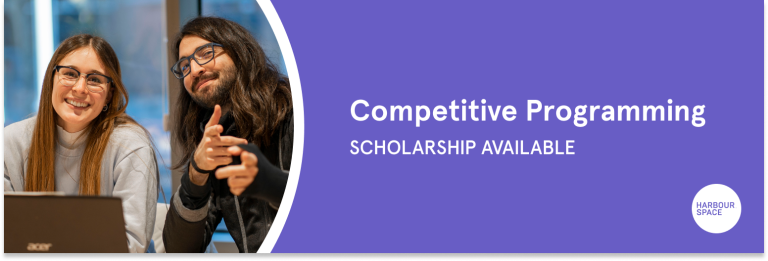
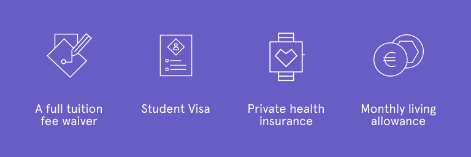
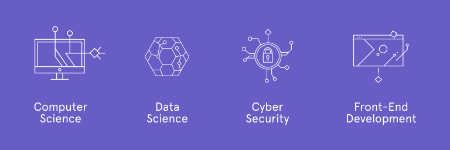

# Announcement

Hello Codeforces!

On [Monday, April 12, 2021 at 20:35UTC+6](https://codeforces.com/https://www.timeanddate.com/worldclock/fixedtime.html?day=12&month=4&year=2021&hour=17&min=35&sec=0&p1=166) [Educational Codeforces Round 107 (Rated for Div. 2)](https://codeforces.com/contest/1511 "Educational Codeforces Round 107 (Rated for Div. 2)") will start.

Series of Educational Rounds continue being held as [Harbour.Space University](https://codeforces.com/https://harbour.space/) initiative! You can read the details about the cooperation between [Harbour.Space University](https://codeforces.com/https://harbour.space/) and Codeforces in the [blog post](//codeforces.com/blog/entry/51208).

This round will be **rated for the participants with rating lower than 2100**. It will be held on extended ICPC rules. The penalty for each incorrect submission until the submission with a full solution is 10 minutes. After the end of the contest you will have 12 hours to hack any solution you want. You will have access to copy any solution and test it locally.

You will be given **6 or 7 problems** and **2 hours** to solve them.

The problems were invented and prepared by Roman [Roms](https://codeforces.com/profile/Roms "Master Roms") Glazov, Adilbek [adedalic](https://codeforces.com/profile/adedalic "International Master adedalic") Dalabaev, Vladimir [vovuh](https://codeforces.com/profile/vovuh "Master vovuh") Petrov, Ivan [BledDest](https://codeforces.com/profile/BledDest "International Grandmaster BledDest") Androsov, Maksim [Neon](https://codeforces.com/profile/Neon "Candidate Master Neon") Mescheryakov and me. Also huge thanks to Mike [MikeMirzayanov](https://codeforces.com/profile/MikeMirzayanov "Headquarters, MikeMirzayanov") Mirzayanov for great systems Polygon and Codeforces.

Good luck to all the participants!

Our friends at Harbour.Space also have a message for you:

*Calling on all Codeforces,* 

*Harbour.Space University is offering a unique opportunity to study in Barcelona for those who are **interested in joining our young and dynamic competitive programming team**. We accept medalists and top performers of IOI, IMO, ICPC, and participants with Codeforces rank above 2000.* 

*Harbour.Space has a single, key requirement: be passionate and motivated to learn and/or work in the field of competitive programming in the long term. Even if you have already exhausted all your ICPC attempts, you are still welcome.* 

*Join us to help build a comprehensive system of preparation for IOI and ICPC for the next generations! We believe that if you have the talent and determination to succeed, you can. **We want to help you make it happen**.*

*In addition to courses taught by some of the world's foremost experts in their fields, Harbour.Space offers these benefits upon acceptance for this scholarship:*

 * *A full tuition fee waiver (Bachelor and Master degrees)*
* *Student visa*
* *Private health insurance*
* *Monthly living allowance**

*In return, we demand dedication to learning and improving yourselves:* 

— *Study three hours per day*   
 — *Train continuously for ICPC, if you are still eligible for participation*   
 — *Intern four hours per day* 

*Ready to formally submit your application? Please [register on our website](https://harbour.space/register?utm_source=codeforces&utm_medium=referral&utm_campaign=programming_team&utm_content=register), attach your latest CV, and pay a non-refundable €125 application fee. The fee guarantees we can process every single application in a fair and timely manner, and maintain the highest possible standards of assessment.*

  [Register→](https://harbour.space/register?utm_source=codeforces&utm_medium=referral&utm_campaign=programming_team&utm_content=register) *Our admission process is a holistic review of each candidate's abilities, achievements, and potential to create something exceptional.*

*You may choose to study in the following areas of specialization:*

 1. *Computer Science*
2. *Data Science*
3. *Cyber Security*
4. *Front-End Development*

*All our degrees are taught in English. If you want to learn more about our programs please [visit our website](https://harbour.space/?utm_source=codeforces&utm_medium=referral&utm_campaign=programming_team&utm_content=website) or [contact our admissions office](https://harbour.space/admissions?utm_source=codeforces&utm_medium=referral&utm_campaign=programming_team&utm_content=admissions).*

**The exact living allowance level throughout the entire duration of studies depends on the performance during the interview and on the overall performance. As a guidance, it is in the range of 500-1500 EUR.* 

*Harbour.Space University Team*

Congratulations to the winners: 

| Rank | Competitor | Problems Solved | Penalty |
| --- | --- | --- | --- |
| 1 | [risujiroh](https://codeforces.com/profile/risujiroh "International Grandmaster risujiroh") | 7 | 233 |
| 2 | [Maksim1744](https://codeforces.com/profile/Maksim1744 "International Grandmaster Maksim1744") | 7 | 243 |
| 3 | [noimi](https://codeforces.com/profile/noimi "International Grandmaster noimi") | 7 | 253 |
| 4 | [fastmath](https://codeforces.com/profile/fastmath "Grandmaster fastmath") | 7 | 278 |
| 5 | [mango_lassi](https://codeforces.com/profile/mango_lassi "International Grandmaster mango_lassi") | 7 | 288 |

145 successful hacks and 1221 unsuccessful hacks were made in total!

And finally people who were the first to solve each problem: 

| Problem | Competitor | Penalty |
| --- | --- | --- |
| A | [Maksim1744](https://codeforces.com/profile/Maksim1744 "International Grandmaster Maksim1744") | 0:01 |
| B | [SSRS_](https://codeforces.com/profile/SSRS_ "International Grandmaster SSRS_") | 0:03 |
| C | [BrunoFMUFC](https://codeforces.com/profile/BrunoFMUFC "Specialist BrunoFMUFC") | 0:06 |
| D | [SSRS_](https://codeforces.com/profile/SSRS_ "International Grandmaster SSRS_") | 0:10 |
| E | [AmShZ](https://codeforces.com/profile/AmShZ "Grandmaster AmShZ") | 0:08 |
| F | [SSRS_](https://codeforces.com/profile/SSRS_ "International Grandmaster SSRS_") | 0:51 |
| G | [Potassium](https://codeforces.com/profile/Potassium "International Master Potassium") | 0:45 |

**UPD:** [Editorial is out](Tutorial.md)

