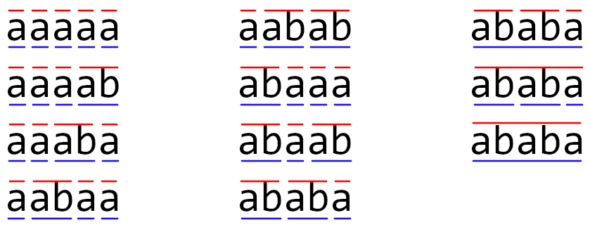

<h1 style='text-align: center;'> F. Chainword</h1>

<h5 style='text-align: center;'>time limit per test: 3 seconds</h5>
<h5 style='text-align: center;'>memory limit per test: 256 megabytes</h5>

A chainword is a special type of crossword. As most of the crosswords do, it has cells that you put the letters in and some sort of hints to what these letters should be.

The letter cells in a chainword are put in a single row. We will consider chainwords of length $m$ in this task.

A hint to a chainword is a sequence of segments such that the segments don't intersect with each other and cover all $m$ letter cells. Each segment contains a description of the word in the corresponding cells.

The twist is that there are actually two hints: one sequence is the row above the letter cells and the other sequence is the row below the letter cells. When the sequences are different, they provide a way to resolve the ambiguity in the answers.

You are provided with a dictionary of $n$ words, each word consists of lowercase Latin letters. All words are pairwise distinct.

An instance of a chainword is the following triple: 

* a string of $m$ lowercase Latin letters;
* the first hint: a sequence of segments such that the letters that correspond to each segment spell a word from the dictionary;
* the second hint: another sequence of segments such that the letters that correspond to each segment spell a word from the dictionary.

## Note

 that the sequences of segments don't necessarily have to be distinct.

Two instances of chainwords are considered different if they have different strings, different first hints or different second hints.

Count the number of different instances of chainwords. Since the number might be pretty large, output it modulo $998\,244\,353$.

##### Input

The first line contains two integers $n$ and $m$ ($1 \le n \le 8$, $1 \le m \le 10^9$) — the number of words in the dictionary and the number of letter cells.

Each of the next $n$ lines contains a word — a non-empty string of no more than $5$ lowercase Latin letters. All words are pairwise distinct. 

##### Output

Print a single integer — the number of different instances of chainwords of length $m$ for the given dictionary modulo $998\,244\,353$.

## Examples

##### Input


```text
3 5
ababa
ab
a
```
##### Output


```text
11
```
##### Input


```text
2 4
ab
cd
```
##### Output


```text
4
```
##### Input


```text
5 100
a
aa
aaa
aaaa
aaaaa
```
##### Output


```text
142528942
```
## Note

Here are all the instances of the valid chainwords for the first example: 

  The red lines above the letters denote the segments of the first hint, the blue lines below the letters denote the segments of the second hint.

In the second example the possible strings are: "abab", "abcd", "cdab" and "cdcd". All the hints are segments that cover the first two letters and the last two letters.


#### Tags 

#2700 #NOT OK #brute_force #data_structures #dp #matrices #string_suffix_structures #strings 

## Blogs
- [All Contest Problems](../Educational_Codeforces_Round_107_(Rated_for_Div._2).md)
- [Announcement](../blogs/Announcement.md)
- [Tutorial](../blogs/Tutorial.md)
