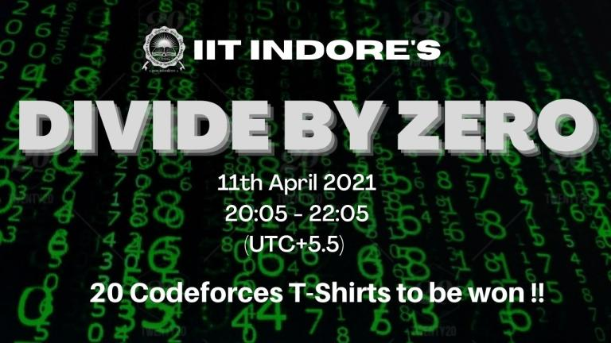

# Announcement_(en)

[The Programming Club, IIT Indore](https://codeforces.com/https://www.linkedin.com/company/progclub-iiti) is proud to present our flagship event, **Divide By Zero**! The contest will take place on [Sunday, April 11, 2021 at 20:35UTC+6](https://codeforces.com/https://www.timeanddate.com/worldclock/fixedtime.html?day=11&month=4&year=2021&hour=17&min=35&sec=0&p1=166). This round will be rated for all participants with a rating lower than 2100.

Thanks to the following people for making the round possible:

 * [KAN](https://codeforces.com/profile/KAN "Legendary Grandmaster KAN") for coordinating throughout the round.
* [kalpitk](https://codeforces.com/profile/kalpitk "Master kalpitk"), [ajit](https://codeforces.com/profile/ajit "Master ajit") and [7dan](https://codeforces.com/profile/7dan "Expert 7dan") for setting the problems.
* [dvshah](https://codeforces.com/profile/dvshah "Master dvshah"), [bhanushali](https://codeforces.com/profile/bhanushali "Specialist bhanushali"), [sundesh](https://codeforces.com/profile/sundesh "Expert sundesh"), [AniketSangwan](https://codeforces.com/profile/AniketSangwan "Expert AniketSangwan"), [krishanu21saini](https://codeforces.com/profile/krishanu21saini "Expert krishanu21saini"), [somyamehta_24](https://codeforces.com/profile/somyamehta_24 "Expert somyamehta_24") and [hk2102](https://codeforces.com/profile/hk2102 "Expert hk2102") for their contribution to the problemset.
* [Um_nik](https://codeforces.com/profile/Um_nik "Legendary Grandmaster Um_nik"), [dorijanlendvaj](https://codeforces.com/profile/dorijanlendvaj "International Grandmaster dorijanlendvaj"), [16204](https://codeforces.com/profile/16204 "Master 16204"), [Osama_Alkhodairy](https://codeforces.com/profile/Osama_Alkhodairy "Master Osama_Alkhodairy"), [ScarletS](https://codeforces.com/profile/ScarletS "Master ScarletS"), [taran_1407](https://codeforces.com/profile/taran_1407 "Candidate Master taran_1407"), [kassutta](https://codeforces.com/profile/kassutta "Expert kassutta") and [Jellyman102](https://codeforces.com/profile/Jellyman102 "Expert Jellyman102") for testing the problems.
* [MikeMirzayanov](https://codeforces.com/profile/MikeMirzayanov "Headquarters, MikeMirzayanov") for the amazing Codeforces and Polygon platforms.

There are 6 problems, and 2 hours to solve them. The points distribution will be updated later.

**Update**: The scoring distribution is **500 -- 1250 -- 1500 -- 2000 -- 2750 -- 3000**.

**Update**: [Editorial](Tutorial_(en).md) is up.

**PRIZES**: Twenty Codeforces T-shirt will be given to:

 * Top 10 Indian Participants
* Random 10 from top 100 (rank 11-100) Indian participants

Hope you guys enjoy the contest! See you on the leaderboard!

**Update**: Here is the list of winners who won T-shirts. We will contact you guys soon. Congrats!

Top 10 Indian Participants

 * [kshitij_sodani](https://codeforces.com/profile/kshitij_sodani "Grandmaster kshitij_sodani")
* [amnesiac_dusk](https://codeforces.com/profile/amnesiac_dusk "Grandmaster amnesiac_dusk")
* [jtnydv25](https://codeforces.com/profile/jtnydv25 "Grandmaster jtnydv25")
* [pikel_rik](https://codeforces.com/profile/pikel_rik "Master pikel_rik")
* [JrNTR](https://codeforces.com/profile/JrNTR "Newbie JrNTR")
* [buri_buri_zaemon_](https://codeforces.com/profile/buri_buri_zaemon_ "International Master buri_buri_zaemon_")
* [kesh4281](https://codeforces.com/profile/kesh4281 "Master kesh4281")
* [scansex](https://codeforces.com/profile/scansex "Expert scansex")
* [_deactivated_](https://codeforces.com/profile/_deactivated_ "Master _deactivated_")
* [Rahul](https://codeforces.com/profile/Rahul "Master Rahul")

Random 10 from top 100 (rank 11-100) Indian participants

 * [not_an_alt](https://codeforces.com/profile/not_an_alt "Candidate Master not_an_alt")
* [Test2311](https://codeforces.com/profile/Test2311 "Master Test2311")
* [rivalq](https://codeforces.com/profile/rivalq "Master rivalq")
* [teja349](https://codeforces.com/profile/teja349 "Grandmaster teja349")
* [akulsareen](https://codeforces.com/profile/akulsareen "Master akulsareen")
* [maester](https://codeforces.com/profile/maester "Master maester")
* [ManavJ07](https://codeforces.com/profile/ManavJ07 "Candidate Master ManavJ07")
* [iLLusio](https://codeforces.com/profile/iLLusio "Master iLLusio")
* [devansh05](https://codeforces.com/profile/devansh05 "Candidate Master devansh05")
* [vok8](https://codeforces.com/profile/vok8 "Candidate Master vok8")

We have uploaded the link to the code for generating random numbers and ranklist [here](https://codeforces.com/https://drive.google.com/drive/folders/1GZEgocDuC7GAdalRFzo2VM2us6pQYHD8?usp=sharing).

