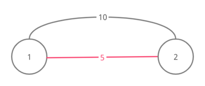
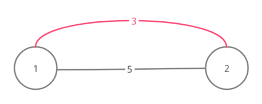
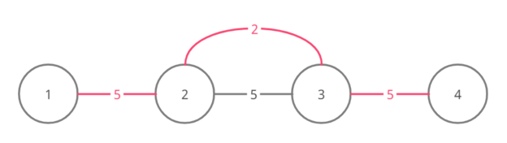
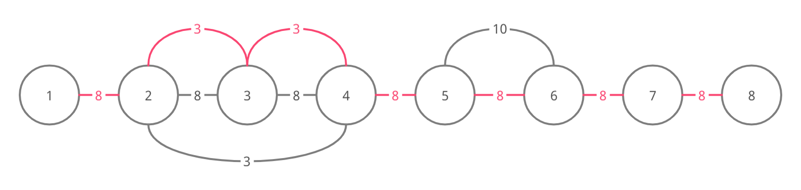

<h1 style='text-align: center;'> D. GCD and MST</h1>

<h5 style='text-align: center;'>time limit per test: 2 seconds</h5>
<h5 style='text-align: center;'>memory limit per test: 256 megabytes</h5>

You are given an array $a$ of $n$ ($n \geq 2$) positive integers and an integer $p$. Consider an undirected weighted graph of $n$ vertices numbered from $1$ to $n$ for which the edges between the vertices $i$ and $j$ ($i<j$) are added in the following manner:

* If $gcd(a_i, a_{i+1}, a_{i+2}, \dots, a_{j}) = min(a_i, a_{i+1}, a_{i+2}, \dots, a_j)$, then there is an edge of weight $min(a_i, a_{i+1}, a_{i+2}, \dots, a_j)$ between $i$ and $j$.
* If $i+1=j$, then there is an edge of weight $p$ between $i$ and $j$.

Here $gcd(x, y, \ldots)$ denotes the [greatest common divisor (GCD)](https://en.wikipedia.org/wiki/Greatest_common_divisor) of integers $x$, $y$, ....

## Note

 that there could be multiple edges between $i$ and $j$ if both of the above conditions are true, and if both the conditions fail for $i$ and $j$, then there is no edge between these vertices.

The goal is to find the weight of the [minimum spanning tree](https://en.wikipedia.org/wiki/Minimum_spanning_tree) of this graph.

### Input

The first line contains a single integer $t$ ($1 \leq t \leq 10^4$) — the number of test cases.

The first line of each test case contains two integers $n$ ($2 \leq n \leq 2 \cdot 10^5$) and $p$ ($1 \leq p \leq 10^9$) — the number of nodes and the parameter $p$.

The second line contains $n$ integers $a_1, a_2, a_3, \dots, a_n$ ($1 \leq a_i \leq 10^9$).

It is guaranteed that the sum of $n$ over all test cases does not exceed $2 \cdot 10^5$. 

### Output

### Output

 $t$ lines. For each test case print the weight of the corresponding graph.

## Example

### Input


```text
4
2 5
10 10
2 5
3 3
4 5
5 2 4 9
8 8
5 3 3 6 10 100 9 15
```
### Output


```text
5
3
12
46
```
## Note

Here are the graphs for the four test cases of the example (the edges of a possible MST of the graphs are marked pink):

For test case 1

  For test case 2

  For test case 3

  For test case 4

  

#### Tags 

#2000 #NOT OK #constructive_algorithms #dsu #graphs #greedy #number_theory #sortings 

## Blogs
- [All Contest Problems](../Divide_by_Zero_2021_and_Codeforces_Round_714_(Div._2).md)
- [Announcement (en)](../blogs/Announcement_(en).md)
- [Tutorial (en)](../blogs/Tutorial_(en).md)
