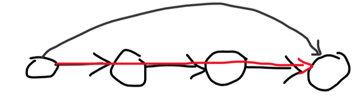

# Tutorial_(en)

### [1514A - Perfectly Imperfect Array](../problems/A._Perfectly_Imperfect_Array.md "Codeforces Round 716 (Div. 2)")

If any element is not a perfect square, the answer is yes. Otherwise, the answer is no, because a2∗b2∗...=(a∗b∗...)2a2∗b2∗...=(a∗b∗...)2.

Code link: [https://pastebin.com/s83sFt3G](https://codeforces.com/https://pastebin.com/s83sFt3G)

### [1514B - AND 0, Sum Big](../problems/B._AND_0,_Sum_Big.md "Codeforces Round 716 (Div. 2)")

Let's start with an array where every single bit in every single element is 11. It clearly doesn't have bitwise-and equal to 00, so for each bit, we need to turn it off (make it 00) in at least one of the elements. However, we can't turn it off in more than one element, since the sum would then decrease for no reason. So for every bit, we should choose exactly one element and turn it off there. Since there are kk bits and nn elements, the answer is just nknk.

Code link: [https://pastebin.com/0D8yL5WW](https://codeforces.com/https://pastebin.com/0D8yL5WW)

### [1514C - Product 1 Modulo N](../problems/C._Product_1_Modulo_N.md "Codeforces Round 716 (Div. 2)")

So first observe that the subsequence can't contain any element that **isn't** coprime with nn. Why? Because then its product won't be coprime with nn, so when you take it modulo nn, it can't be 11. In mathier words, gcd(prod mod n,n)=gcd(prod,n)≠1gcd(prod mod n,n)=gcd(prod,n)≠1. Now, let's take all elements less than nn and coprime with it, and let's look at their product modulo nn; call it pp. If pp is 11, you can take all these elements. Otherwise, you should take them all except for pp. It belongs to them because pp is coprime with nn, since gcd(p mod n,n)=gcd(p,n)=1gcd(p mod n,n)=gcd(p,n)=1 since all the elements in pp are coprime with nn.

Code link: [https://pastebin.com/JnjZ3SQm](https://codeforces.com/https://pastebin.com/JnjZ3SQm)

**Bonus task:** solve it for n≤1012n≤1012.

### [1514D - Cut and Stick](../problems/D._Cut_and_Stick.md "Codeforces Round 716 (Div. 2)")

Suppose the query-interval has length mm. Let's call an element super-frequent if it occurs more than ⌈m2⌉⌈m2⌉ times in it, with frequency ff. If there's no super-frequent element, then we can just put all the elements in 11 subsequence. Otherwise, we need the partitioning. Let's call the rest of the elements (other than the super-frequent one) good elements. One way to partition is to put all the m−fm−f good elements with m−f+1m−f+1 super-frequent elements; then, put every remaining occurrence of the super-frequent element in a subsequence on its own. The number of subsequences we need here is then 1+f−(m−f+1)=2∗f−m1+f−(m−f+1)=2∗f−m. There's no way to improve this, because: for every subsequence we add, the number of occurrences of the super-frequent element minus the number of good elements is at most 11, so by making it exactly 11 in each subsequence, we get an optimal construction. Now, the problem boils down to calculating ff. Note that calculating the most frequent element in general is a well-known slow problem. It's usually solved with MO's algorithm in O(n√nlog(n))O(nn−−√log(n)), maybe with a tricky optimization to O(n√n)O(nn−−√). However, notice that we only need the most frequent element if it occurs more than ⌈m2⌉⌈m2⌉ times. How can we use this fact?

#### Randomized solution

We can pick ~4040 random elements from our range to be candidates for the super-frequent element, then count their occurrences and maximize. If there's a super-frequent element, the probability it's not picked is at most 2−402−40, which is incredibly small.

To count the number of occurrences of an element in a range, we can carry for each element a vector containing all the positions it occurs in increasing order. Then, `upper_bound(r)-lower_bound(l)` gives us the number of occurrences in O(log(n))O(log(n)).

Code link: [https://pastebin.com/APHEtfge](https://codeforces.com/https://pastebin.com/APHEtfge)

#### Deterministic solution

Observe that if a range has a super-frequent element, and we split it into 22 ranges, then this element must be super-frequent in one of them. Now suppose we create a segment tree where every node [l;r][l;r] returns an element in the range, and suppose every node merges the 22 elements returned by its children as follows: count their occurrences in [l;r][l;r] and pick whichever occurs more. In general, that doesn't return the most frequent element. However, if there's a super-frequent element, it must return it! That's because if there's a super-frequent element in [l;r][l;r], it must be super-frequent in one of its children, so by induction the segment tree works. The time complexity is O(nlog2(n))O(nlog2(n)).

Code link: [https://pastebin.com/qeGxT0W2](https://codeforces.com/https://pastebin.com/qeGxT0W2)

There are also tons of O(n√n)O(nn−−√) solutions that should pass if the operations are simple enough.

**Bonus task:** solve it in O(nlog(n))O(nlog(n)).

### [1514E - Baby Ehab's Hyper Apartment](../problems/E._Baby_Ehab's_Hyper_Apartment.md "Codeforces Round 716 (Div. 2)")

Throughout the editorial, I'll call the first type of queries OneEdge and the second type ManyEdges.

The basic idea behind this problem is to find a few edges such that every path that could be traversed in your graph could be traversed using only these edges. With that motivation in mind, let's get started.

The first observation is: the graph has a hamiltonian path. To prove this, suppose you split the graph into 22 halves, each containing some of the nodes. Then, we'll proceed by induction. Suppose each half has a hamiltonian path. I'll describe a way to merge them into one path. First, let's look at the first node in each path and ask about the edge between them. Suppose it's directed from the first to the second one. Then, I'll start my new merged path with the first node, remove it, and repeat. This works because no matter which node follows it, it sends an edge out to it. This is best described by the following picture:

We start with the 22 hamiltonian paths we got by induction, then we query that red edge. We find that it's from the grey node to the white node. We then put our grey node as the start of the path and continue doing that with the rest of the nodes, and we don't care which node will follow it, because the edge is out from the black node either way!

If everything falls into place in your mind, you should recognize that this algorithm is merge sort. We just run merge sort on the nodes of the graph, using the comparator OneEdge. That gives you a hamiltonian path in nlog(n)nlog(n) queries.

Now that we have a hamiltonian path, every edge that goes forward in it is useless, since you can just walk down the path itself:

So let's focus on the edges going backwards. Suppose we iterate through the hamiltonian path from its end to its beginning, looking at the edges going back from the nodes we met. An edge going backwards from the current node is important only if it goes back further than any of the edges we've met so far. That's because we can take a (much less direct) route instead of this edge if it doesn't go so far back:

Now with a few more edges we can form all the paths! How do we get these edges? We can use 22 pointers. Let's iterate through the hamiltonian path from its end to its beginning, carrying a pointer pp that tells us how far back the edges we met so far can go. To update pp, let's ask ManyEdges from the node we're currently at, to the first pp nodes in the hamiltonian path. While the answer is 11, we'll keep decreasing pp. This algorithm calls ManyEdges 2n2n times, since every time we call it, it either returns 00 and the node we're at decreases, or it returns 11 and pp decreases.

Code link: [https://pastebin.com/RU1yA697](https://codeforces.com/https://pastebin.com/RU1yA697)

**Bonus task:** can you get the hamiltonian path using insertion sort instead?

