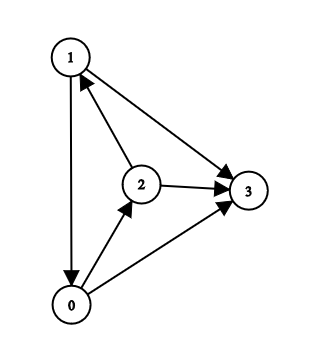

<h1 style='text-align: center;'> E. Baby Ehab's Hyper Apartment</h1>

<h5 style='text-align: center;'>time limit per test: 1 second</h5>
<h5 style='text-align: center;'>memory limit per test: 256 megabytes</h5>

This is an interactive problem.

Baby Ehab loves crawling around his apartment. It has $n$ rooms numbered from $0$ to $n-1$. For every pair of rooms, $a$ and $b$, there's either a direct passage from room $a$ to room $b$, or from room $b$ to room $a$, but never both.

Baby Ehab wants to go play with Baby Badawy. He wants to know if he could get to him. However, he doesn't know anything about his apartment except the number of rooms. He can ask the baby sitter two types of questions: 

* is the passage between room $a$ and room $b$ directed from $a$ to $b$ or the other way around?
* does room $x$ have a passage towards any of the rooms $s_1$, $s_2$, ..., $s_k$?

He can ask at most $9n$ queries of the first type and at most $2n$ queries of the second type.

After asking some questions, he wants to know for every pair of rooms $a$ and $b$ whether there's a path from $a$ to $b$ or not. A path from $a$ to $b$ is a sequence of passages that starts from room $a$ and ends at room $b$.

### Input

The first line contains an integer $t$ ($1 \le t \le 30$) — the number of test cases you need to solve.

Then each test case starts with an integer $n$ ($4 \le n \le 100$) — the number of rooms.

The sum of $n$ across the test cases doesn't exceed $500$.

### Output

To print the answer for a test case, print a line containing "3", followed by $n$ lines, each containing a binary string of length $n$. The $j$-th character of the $i$-th string should be $1$ if there's a path from room $i$ to room $j$, and $0$ if there isn't. The $i$-th character of the $i$-th string should be $1$ for each valid $i$.

After printing the answer, we will respond with a single integer. If it's $1$, you printed a correct answer and should keep solving the test cases (or exit if it is the last one). If it's $-1$, you printed a wrong answer and should terminate to get Wrong answer verdict. Otherwise, you can get an arbitrary verdict because your solution will continue to read from a closed stream.

## Interaction

To ask a question of the first type, use the format: 

* $1$ $a$ $b$ ($0 \le a,b \le n-1$, $a \neq b$).
* we will answer with $1$ if the passage is from $a$ to $b$, and $0$ if it is from $b$ to $a$.
* you can ask at most $9n$ questions of this type in each test case.

To ask a question of the second type, use the format: 

* $2$ $x$ $k$ $s_1$ $s_2$ ... $s_k$ ($0 \le x,s_i \le n-1$, $0 \le k < n$, $x \neq s_i$, elements of $s$ are pairwise distinct).
* we will answer with $1$ if there's a passage from $x$ to any of the rooms in $s$, and $0$ otherwise.
* you can ask at most $2n$ questions of this type in each test case.

If we answer with $-1$ instead of a valid answer, that means you exceeded the number of queries or made an invalid query. Exit immediately after receiving $-1$ and you will see Wrong answer verdict. Otherwise, you can get an arbitrary verdict because your solution will continue to read from a closed stream.

After printing a query, do not forget to output end of line and flush the output. Otherwise, you will get Idleness limit exceeded. To do this, use:

* fflush(stdout) or cout.flush() in C++;
* System.out.flush() in Java;
* flush(output) in Pascal;
* stdout.flush() in Python;
* see the documentation for other languages.

Hacks:

The first line should contain an integer $t$ — the number of test cases.

The first line of each test case should contain an integer $n$ ($4 \le n \le 100$) — the number of rooms.

Each of the next $n$ lines should contain a binary string of length $n$. The $j$-th character of the $i$-th string should be $1$ if there's a passage from room $i$ to room $j$, $0$ otherwise. The $i$-th character of the $i$-th string should be $0$.

## Example

### Input


```text
1
4

0

0

1

1

1
```
### Output

```text

2 3 3 0 1 2

1 0 1

1 0 2

2 2 1 1

3
1111
1111
1111
0001
```
## Note

In the given example:



The first query asks whether there's a passage from room $3$ to any of the other rooms.

The second query asks about the direction of the passage between rooms $0$ and $1$.

After a couple other queries, we concluded that you can go from any room to any other room except if you start at room $3$, and you can't get out of this room, so we printed the matrix:


```text
  
1111  
1111  
1111  
0001  

```
The interactor answered with $1$, telling us the answer is correct.


#### Tags 

#2700 #NOT OK #binary_search #graphs #interactive #sortings #two_pointers 

## Blogs
- [All Contest Problems](../Codeforces_Round_716_(Div._2).md)
- [Announcement (en)](../blogs/Announcement_(en).md)
- [Tutorial (en)](../blogs/Tutorial_(en).md)
