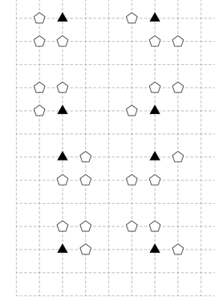

<h1 style='text-align: center;'> G. Starry Night Camping</h1>

<h5 style='text-align: center;'>time limit per test: 2 seconds</h5>
<h5 style='text-align: center;'>memory limit per test: 256 megabytes</h5>

At the foot of Liyushan Mountain, $n$ tents will be carefully arranged to provide accommodation for those who are willing to experience the joy of approaching nature, the tranquility of the night, and the bright starry sky.

The $i$-th tent is located at the point of $(x_i, y_i)$ and has a weight of $w_i$. A tent is important if and only if both $x_i$ and $y_i$ are even. You need to remove some tents such that for each remaining important tent $(x, y)$, there do not exist $3$ other tents $(x'_1, y'_1)$, $(x'_2, y'_2)$ and $(x'_3, y'_3)$ such that both conditions are true: 

1. $|x'_j-x|, |y'_j - y|\leq 1$ for all $j \in \{1, 2, 3\}$, and
2. these four tents form a parallelogram (or a rectangle) and one of its sides is parallel to the $x$-axis.

Please maximize the sum of the weights of the tents that are not removed. Print the maximum value.

#### Input

The first line contains a single integer $n$ ($1\leq n\leq 1\,000$), representing the number of tents.

Each of the next $n$ lines contains three integers $x_i$, $y_i$ and $w_i$ ($-10^9\leq x_i,y_i \leq 10^9$, $1\leq w_i\leq 10^9$), representing the coordinate of the $i$-th tent and its weight. No two tents are located at the same point.

#### Output

A single integer — the maximum sum of the weights of the remaining tents.

## Examples

#### Input


```text
5
0 0 4
0 1 5
1 0 3
1 1 1
-1 1 2
```
#### Output


```text
12
```
#### Input


```text
32
2 2 1
2 3 1
3 2 1
3 3 1
2 6 1
2 5 1
3 6 1
3 5 1
2 8 1
2 9 1
1 8 1
1 9 1
2 12 1
2 11 1
1 12 1
1 11 1
6 2 1
7 2 1
6 3 1
5 3 1
6 6 1
7 6 1
5 5 1
6 5 1
6 8 1
5 8 1
6 9 1
7 9 1
6 12 1
5 12 1
6 11 1
7 11 1
```
#### Output


```text
24
```
## Note

Here is an illustration of the second example. Black triangles indicate the important tents. This example also indicates all $8$ forbidden patterns.

  

#### Tags 

#3300 #NOT OK #constructive_algorithms #flows #graphs 

## Blogs
- [All Contest Problems](../Contest_2050_and_Codeforces_Round_718_(Div._1_+_Div._2).md)
- [Announcement (en)](../blogs/Announcement_(en).md)
- [Tutorial (en)](../blogs/Tutorial_(en).md)
