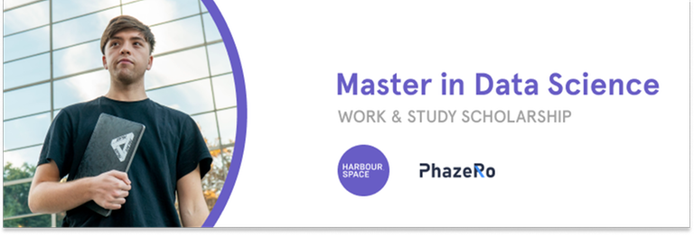
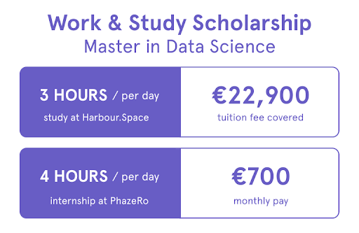

# Announcement

Hello Codeforces!

On [Thursday, April 29, 2021 at 20:35UTC+6](https://codeforces.com/https://www.timeanddate.com/worldclock/fixedtime.html?day=29&month=4&year=2021&hour=17&min=35&sec=0&p1=166) [Educational Codeforces Round 108 (Rated for Div. 2)](https://codeforces.com/contest/1519 "Educational Codeforces Round 108 (Rated for Div. 2)") will start.

Series of Educational Rounds continue being held as [Harbour.Space University](https://codeforces.com/https://harbour.space/) initiative! You can read the details about the cooperation between [Harbour.Space University](https://codeforces.com/https://harbour.space/) and Codeforces in the [blog post](//codeforces.com/blog/entry/51208).

This round will be **rated for the participants with rating lower than 2100**. It will be held on extended ICPC rules. The penalty for each incorrect submission until the submission with a full solution is 10 minutes. After the end of the contest you will have 12 hours to hack any solution you want. You will have access to copy any solution and test it locally.

You will be given **6 or 7 problems** and **2 hours** to solve them.

The problems were invented and prepared by Roman [Roms](https://codeforces.com/profile/Roms "Master Roms") Glazov, Adilbek [adedalic](https://codeforces.com/profile/adedalic "International Master adedalic") Dalabaev, Vladimir [vovuh](https://codeforces.com/profile/vovuh "Master vovuh") Petrov, Ivan [BledDest](https://codeforces.com/profile/BledDest "International Grandmaster BledDest") Androsov, Maksim [Neon](https://codeforces.com/profile/Neon "Candidate Master Neon") Mescheryakov and me. Also huge thanks to Mike [MikeMirzayanov](https://codeforces.com/profile/MikeMirzayanov "Headquarters, MikeMirzayanov") Mirzayanov for great systems Polygon and Codeforces.

Good luck to all the participants!

Our friends at Harbour.Space also have a message for you:

*Hey, Codeforces!* 

*Once again, it is time for another exciting **scholarship opportunity** from Harbour.Space!* 

*This time we have partnered with PhazeRo to open the door for an exciting career in technology for the most talented people in our network.* 

*In partnership with PhazeRo, we are offering a **full scholarship** to study for a Master’s in Data Science at Harbour.Space while working as a [Junior Data Scientist at PhazeRo](https://harbour.space/scholarships/data-science-apprenticeship-phazero?utm_source=codeforces&utm_medium=referral&utm_campaign=phazero-data-science)!*

***Scholarship Requirements:***

 * *Bachelor's Degree*
* *Professional fluency in English*
* *Proficiency with data mining, mathematics, and statistical analysis.*
* *Experience with Tableau, SQL, and programming languages (i.e., Python, R, Java)*

***Scholarship Highlights:***

 1. *Study in Europe’s most exciting tech cities*
2. *Full tuition fee covered (€22,900)*
3. *Competitive compensation for the internship at PhazeRo (€700 / month)*
4. *Opportunity to join PhazeRo full-time after graduation*

***Some of the advantages of working at PhazeRo:***

 * *Possibility of a job upon graduation*
* *Immerse into an International Company*
* *Diversity Program*
* *Professional Development*
* *Be part of a company that is building the region's largest engineering team*

*We have previously partnered with other companies like OneRagtime, Hansgrohe, Coherra, and Remy Robotics to empower young talents around the world and help them boost their tech career.*

*We are always happy to see Codeforces members join the Harbour.Space family. [Apply now](https://harbour.space/scholarships/data-science-apprenticeship-phazero?utm_source=codeforces&utm_medium=referral&utm_campaign=phazero-data-science) to get a chance to learn from the best in the field and kickstart your career!*

*Keep in touch and follow us on [LinkedIn](https://codeforces.com/https://www.linkedin.com/school/harbour-space/) for more scholarship opportunities. And follow us on [Instagram](https://codeforces.com/https://www.instagram.com/harbour.space/) to evidence student life, events, and success stories from our apprenticeship program students.*

*Good luck on your round, and see you next time!* 

*Harbour.Space University*

Congratulations to the winners: 

| Rank | Competitor | Problems Solved | Penalty |
| --- | --- | --- | --- |
| 1 | [neal](https://codeforces.com/profile/neal "Legendary Grandmaster neal") | 6 | 186 |
| 2 | [vepifanov](https://codeforces.com/profile/vepifanov "International Grandmaster vepifanov") | 6 | 188 |
| 3 | [Um_nik](https://codeforces.com/profile/Um_nik "Legendary Grandmaster Um_nik") | 6 | 251 |
| 4 | [Farhod](https://codeforces.com/profile/Farhod "International Grandmaster Farhod") | 5 | 65 |
| 5 | [noimi](https://codeforces.com/profile/noimi "International Grandmaster noimi") | 5 | 76 |

Congratulations to the best hackers: 

| Rank | Competitor | Hack Count |
| --- | --- | --- |
| 1 | [__ZMF__](https://codeforces.com/profile/__ZMF__ "Master __ZMF__") | **50****:-50** |
| 2 | [mufeng.wei](https://codeforces.com/profile/mufeng.wei "Expert mufeng.wei") | **24****:-4** |
| 3 | [SSerxhs](https://codeforces.com/profile/SSerxhs "Grandmaster SSerxhs") | **22****:-9** |
| 4 | [mahesh_dubey](https://codeforces.com/profile/mahesh_dubey "Newbie mahesh_dubey") | **13****:-1** |
| 5 | [haminh0307](https://codeforces.com/profile/haminh0307 "Expert haminh0307") | **11****:-5** |

 463 successful hacks and 1684 unsuccessful hacks were made in total!And finally people who were the first to solve each problem: 

| Problem | Competitor | Penalty |
| --- | --- | --- |
| A | [Geothermal](https://codeforces.com/profile/Geothermal "International Grandmaster Geothermal") | 0:01 |
| B | [turmax](https://codeforces.com/profile/turmax "Grandmaster turmax") | 0:02 |
| C | [eecs](https://codeforces.com/profile/eecs "Grandmaster eecs") | 0:04 |
| D | [abc864197532](https://codeforces.com/profile/abc864197532 "Master abc864197532") | 0:04 |
| E | [noimi](https://codeforces.com/profile/noimi "International Grandmaster noimi") | 0:28 |
| F | [rainboy](https://codeforces.com/profile/rainboy "Candidate Master rainboy") | 1:16 |

**UPD:** [Editorial is out](Tutorial.md)

