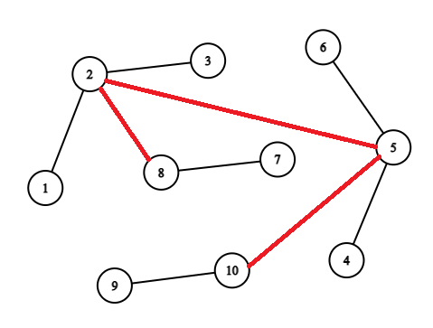
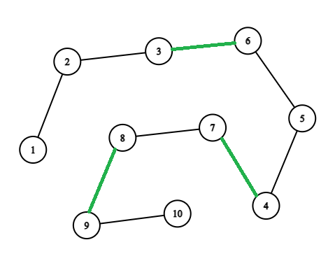
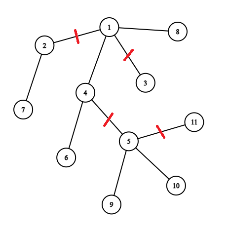
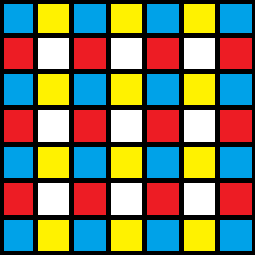

# Tutorial_(en)

Thanks for participating!

[1521A - Nastia and Nearly Good Numbers](../problems/A._Nastia_and_Nearly_Good_Numbers.md "Codeforces Round 720 (Div. 2)")

 **Tutorial**
### [1521A - Nastia and Nearly Good Numbers](../problems/A._Nastia_and_Nearly_Good_Numbers.md "Codeforces Round 720 (Div. 2)")

There are $2$ cases:

if $B = 1$, then the answer doesn't exist. Here we cannot get the nearly good numbers at all.

Otherwise, we can construct the answer as $A + A \cdot B = A \cdot (B + 1)$.

 **Solution**
```cpp
#include <bits/stdc++.h>

using namespace std;

int main() {
    ios_base::sync_with_stdio(false);
    cin.tie(nullptr); cout.tie(nullptr);

    int q;
    cin >> q;

    while (q--) {
        int a, b; cin >> a >> b;
        if (b == 1) {
            cout << "NO" << endl;
        } else {
            cout << "YES" << endl;
            cout << a << ' ' << a * (long long)b << ' ' << a * (long long)(b + 1) << endl;
        }
    }
}
```
[1521B - Nastia and a Good Array](../problems/B._Nastia_and_a_Good_Array.md "Codeforces Round 720 (Div. 2)")

 **Tutorial**
### [1521B - Nastia and a Good Array](../problems/B._Nastia_and_a_Good_Array.md "Codeforces Round 720 (Div. 2)")

There are many ways to solve the problem. Here is one of them: 

We will use the fact that $gcd(i, i + 1) = 1$ for any integer $i \ge 1$.

Let's find the minimum element $x$ of the array $a$ that is located in the position $pos$. Then for all integer $i$ ($1 \le i \le n$) perform the following operation: $(pos,\ i,\ x,\ x + abs(pos - i))$. That's how we replace $a_i$ to $x + abs(pos - i)$. The main condition: $\min{(a_i, a_j)} = \min{(x, y)}$ is satisfied because $a_{pos}$ always equals to $x$ and this value always less than any other element in the array $a$.

Consider the structure of the array $a$ after performing the operations describing above. 

Let's define $l = x + pos - i$ and $r = x + i - pos$. These are the leftmost and the rightmost elements in the array $a$, respectively.

The array $a$ looks like $[l,\ l - 1\ \ldots\ x + 1,\ x,\ x + 1\ \ldots\ r - 1,\ r]$. Thus, we obtain an absolute difference, equal to one, between all pairs of adjacent elements.

 **Solution**
```cpp
#include "bits/stdc++.h"

using namespace std;

int main() {
    ios_base::sync_with_stdio(false);
    cin.tie(nullptr); cout.tie(nullptr);

    int q;
    cin >> q;

    while (q--) {
        int n; cin >> n;
        int x = 1e9 + 7, pos = -1;
        for (int i = 0; i < n; ++i) {
            int a; cin >> a;
            if (a < x) x = a, pos = i;
        }
        cout << n - 1 << endl;
        for (int i = 0; i < n; ++i) {
            if (i == pos) continue;
            cout << pos + 1 << ' ' << i + 1 << ' ' << x << ' ' << x + abs(i - pos) << "n";
        }
    }
}
```
[1521C - Nastia and a Hidden Permutation](../problems/C._Nastia_and_a_Hidden_Permutation.md "Codeforces Round 720 (Div. 2)")

 **Tutorial**
### [1521C - Nastia and a Hidden Permutation](../problems/C._Nastia_and_a_Hidden_Permutation.md "Codeforces Round 720 (Div. 2)")

Solution $1$:

Let's fix $2$ indices $i$ and $j$ $(1 \le i, j \le n,$ $i \neq j)$. Then restore $p_{i}$ and $p_{j}$.

Let's assume we know the maximum element among $p_i$ and $p_j$: $mx = \max(p_i, p_j)$.

Now we can figure out where exactly the maximum is by asking the following query: 

$val = \max{(\min{(mx - 1, p_i)}, \min{(mx, p_j)})}$.

There are $2$ cases:

1. $val = mx - 1$: it means $p_j \lt mx$, otherwise $val = \min{(mx, p_j)} = mx$.
2. $val = mx$: it means $p_j = mx$, because $\min{(mx - 1, p_i)} \lt mx$.

If we know where the maximum is located we easily can find the remaining element:

* if $p_i = mx$, then $p_j = \min{(\max{(1, p_j)}, \max{(2, p_i)})}$.
* if $p_j = mx$, then $p_i = \min{(\max{(1, p_i)}, \max{(2, p_j)})}$.

We can solve the problem if we know the $mx$. Let's find it:

$mx = \max{(\min{(n - 1, p_i)}, \min{(n, p_j)})}$

Take a look on the case when $mx = n - 1$. Here we cannot be sure that $mx = max(p_i, p_j)$. It's possible only if $p_i = n$. Thus if $mx = n - 1$ we spend an extra query to be sure that $p_i \neq n$. We will ask:

$val = \max{(\min{(n - 1, p_j)}, \min{(n, p_i)})}$

So, if $val = n$, then the value $p_i$ equlas to $n$, otherwise the value $mx = n - 1$ equals to the real maximum among $p_i$ and $p_j$.

As a result, we can restore any $2$ elements of the permutation. 

Let's split our permutation into $\lfloor \frac {n} {2} \rfloor$ pairs and restore them independently of each other.

The total queries we perform is $\lfloor \frac {3 \cdot n} { 2} \rfloor + 2$. We spend $3$ operations to restore each of the pair of elements. And no more than $2$ extra queries to be sure that $mx$ is correct. 

Solution $2$:

Let's find the maximum of the permutation and then restore the element $p_i$ $(1 \le i \le n)$ of the permutation by query: 

$p_i = \min{(\max{(1, p_i)}, \max{(2, mx})}$.

To find the maximum element let's split the permutation into $\lfloor \frac {n} {2} \rfloor$ pairs and perform the following operation to each of them: 

$mx = \max{(\min{(n - 1, p_i)}, \min{(n, p_j)})}$.

* if $mx = n$, then $j$ is the position with a maximum element.
* if $mx = n - 1$, then need to make sure that $p_i \neq n$. Let's make the same extra query as we do in the Solution 1.

Note that if you don't find the maximum element among the $\lfloor \frac {n} {2} \rfloor$, then it's in the remaining element when $n$ is odd.

The total queries we perform is n + $\lfloor \frac {n} { 2} \rfloor + 1$. We ask $\lfloor \frac {n} { 2} \rfloor + 2$ queries to find the maximum of the permutation and $n - 1$ quiries to restore the remaining elements.

 **Solution 1**
```cpp
#include "bits/stdc++.h"

using namespace std;

int ask(int t, int i, int j, int x) {
    cout << "? " << t << ' ' << i + 1 << ' ' << j + 1 << ' ' << x << endl;
    int val; cin >> val;
    if (val == -1) exit(0);
    return val;
}

int main() {
    ios_base::sync_with_stdio(false);
    cin.tie(nullptr); cout.tie(nullptr);

    int q;
    cin >> q;

    while (q--) {
        int n; cin >> n;
        vector<int> p(n, -1);
        for (int i = 1; i < n; i += 2) {
            int pos1 = i - 1, pos2 = i;
            int val = ask(1, pos1, pos2, n - 1);
            if (val == n - 1) {
                val = ask(1, pos2, pos1, n - 1);
                if (val == n) {
                    p[pos1] = val;
                    p[pos2] = ask(2, pos2, pos1, 1);
                    continue;
                }
            }
            int get = ask(1, pos1, pos2, val - 1);
            if (get == val) {
                p[pos2] = val;
                p[pos1] = ask(2, pos1, pos2, 1);
            }
            if (get == val - 1) {
                p[pos1] = val;
                p[pos2] = ask(2, pos2, pos1, 1);
            }
        }
        if (p.back() == -1) {
            vector<bool> us(n + 1);
            for (int i = 0; i < n - 1; ++i) {
                us[p[i]] = true;
            }
            for (int i = 1; i <= n; ++i) {
                if (!us[i]) {
                    assert(p[p.size() - 1] == -1);
                    p[p.size() - 1] = i;
                }
            }
        }
        cout << "! ";
        for (int i = 0; i < n; ++i) {
            cout << p[i] << ' ';
        } cout << endl;
    }
}
```
[1521D - Nastia Plays with a Tree](../problems/D._Nastia_Plays_with_a_Tree.md "Codeforces Round 720 (Div. 2)")

 **Tutorial**
### [1521D - Nastia Plays with a Tree](../problems/D._Nastia_Plays_with_a_Tree.md "Codeforces Round 720 (Div. 2)")

Let's define the variable $x$ as a minimum number of operations that we need to get bamboo from a tree.

Let's remove $x$ edges first and then add $x$ new ones to the graph.

Consider the structure of the graph after removing $x$ edges. This is a forest with a $x + 1$ connected components.

Easy to notice each of the $x + 1$ connected components in the getting forest of trees must be a bamboo to get the bamboo after adding new $x$ edges.

  The red edges are removed.Thus, we can get the bamboo from the forest of bamboo after removing $x$ edges by $x$ times adding the conjunction between leaves that are in the different components of connectivity of the forest.

  The green edges are added.So, the task is to find the minimum number of the removing edges needs to get the forest of bamboos. Here works the following greedy: 

Let's define any vertice of the tree as a root.

We will solve the problem for each of the subtrees $v$ $(1 \le v \le n)$.

First, solve the problem for all child vertices of $v$. Then define the value $c_v$ as the number of the children and the value $p_v$ as the ancestor for vertex $v$. 

There are $3$ cases: 

1. If $c_v <= 1$, then we don't remove anything.
2. If $c_v = 2$, then we remove the edge $(p_v, v)$ if $p_v$ exists.
3. If $c_v > 2$, then we remove the edge $(p_v, v)$ if $p_v$ exists and any $c - 2$ existing edges from $v$ to one of the children vertex.

Take a look at the picture:

  The root of the tree is vertex $1$. **Solution**
```cpp
#include <bits/stdc++.h>

using namespace std;

const int N = 1e5 + 7;

struct edge {
    int v, u;
};

vector<pair<edge, edge>> operations;

int dp[N], answer = 0;

bool isDeleted[N];

vector<pair<int, int>> g[N];

void dfs(int v, int p = -1) {
    int sz = (int)g[v].size() - (p != -1);
    for (auto to : g[v]) {
        if (to.first == p) continue;
        dfs(to.first, v);
        if (dp[to.first]) {
            --sz; ++answer;
            isDeleted[to.second] = true;
        }
    }
    if (sz >= 2) {
        dp[v] = true;
        for (auto to : g[v]) {
            if (to.first == p) continue;
            if (sz <= 2) break;
            if (!dp[to.first]) {
                --sz; ++answer;
                isDeleted[to.second] = true;
            }
        }
    }
}

vector<pair<int, int>> bamboos;

bool used[N];

vector<int> leaves;

void dfs2(int v, int root) {
    used[v] = true;
    int numberOfChildren = 0;
    for (auto to : g[v]) {
        if (used[to.first] || isDeleted[to.second]) continue;
        ++numberOfChildren; dfs2(to.first, root);
    }
    if (v == root && numberOfChildren == 1) {
        leaves.push_back(v);
    } else if (!numberOfChildren) {
        leaves.push_back(v);
    }
}

void clear(int n) {
    answer = 0;
    for (int i = 0; i < n; ++i) {
        dp[i] = 0;
        g[i].clear();
        used[i] = isDeleted[i] = false;
    }
    bamboos.clear();
    operations.clear();
}

signed main() {
    ios_base::sync_with_stdio(false);
    cin.tie(nullptr); cout.tie(nullptr);

    int q;
    cin >> q;

    while (q--) {
        int n; cin >> n;

        for (int i = 0; i < n - 1; ++i) {
            int a, b; cin >> a >> b;
            --a; --b;
            g[a].push_back({b, i});
            g[b].push_back({a, i});
        }

        dfs(0);
        for (int i = 0; i < n; ++i) {
            if (!used[i]) {
                dfs2(i, i);
                assert((int)leaves.size() <= 2);
                if ((int)leaves.size() == 2) {
                    bamboos.push_back({leaves[0], leaves[1]});
                }
                if ((int)leaves.size() == 1) {
                    bamboos.push_back({leaves.back(), leaves.back()});
                }
                leaves.clear();
            }
        }

        vector<edge> deletedEdges, addedEdges;
        for (int v = 0; v < n; ++v) {
            for (auto to : g[v]) {
                if (isDeleted[to.second]) {
                    if (v < to.first) {
                        deletedEdges.push_back({v, to.first});
                    }
                }
            }
        }
        for (int i = 1; i < (int)bamboos.size(); ++i) {
            addedEdges.push_back({bamboos[i - 1].second, bamboos[i].first});
        }

        assert(answer == (int)deletedEdges.size());
        assert((int)deletedEdges.size() == (int)addedEdges.size());

        for (int i = 0; i < answer; ++i) {
            operations.push_back({deletedEdges[i], addedEdges[i]});
        }

        assert(answer == (int)operations.size());

        cout << answer << endl;
        for (pair<edge, edge> to : operations) {
            cout << to.first.v + 1 << ' ' << to.first.u + 1 << ' ';
            cout << to.second.v + 1 << ' ' << to.second.u + 1 << endl;
        }

        clear(n);
    }
}
```
[1521E - Nastia and a Beautiful Matrix](../problems/E._Nastia_and_a_Beautiful_Matrix.md "Codeforces Round 720 (Div. 2)")

 **Tutorial**
### [1521E - Nastia and a Beautiful Matrix](../problems/E._Nastia_and_a_Beautiful_Matrix.md "Codeforces Round 720 (Div. 2)")

Let's fix $n$ and will check whether we build a beautiful matrix or not.

Let's define the variable $mx$ as a maximum element among all elements from the array $a$. In other words, the amount of the most frequently occurring number we have. Also, define the variable $sum$ as an amount of numbers we have.

We can single out the $2$ criteria. These are $sum \le n ^ 2 - \lfloor \frac {n} {2} \rfloor ^ 2$ and $mx \le n \cdot \lceil \frac {n} {2} \rceil$. It can be proved by spitting the matrix into disjoint matrices $2 \times 2$. 

Let's construct the structure of the matrix and provide the algorithm of arrangement, that if the previous $2$ conditions are satisfied, then we always can create the beautiful matrix of $n$ size. Take a look at the picture:

  There are $4$ types of cells. White cells are empty, blue ones can consist of any number.

Let's fill yellow and red cells in a way that they don't have any common number. We will do it greedily:

Let's fill red cells at first. Let's take numbers $x$, which is the most frequently occurring, and just try to fill red cells using only it.

If all numbers $x$ are fully fit there, then we just take a new $x$ and continue filling cells. If there are elements of color $x$ that cannot be placed there then we put all such remaining elements in blue cells. 

It is always possible to do because the number of blue cells and yellow cells together is $n \cdot \lceil \frac {n} {2} \rceil$, that is the upper bound of the value $mx$. In this way, we filled red cells and some blue cells. 

The other elements, which haven't been placed yet, can be placed randomly because they won't match(by diagonal) due to the way of filling red cells. 

 **Solution**
```cpp
#include "bits/stdc++.h"

using namespace std;

int main() {
    ios_base::sync_with_stdio(false);
    cin.tie(nullptr); cout.tie(nullptr);

    int q;
    cin >> q;

    while (q--) {
        int m, k; cin >> m >> k;

        pair<int, int> a[k];
        for (int i = 0; i < k; ++i) {
            cin >> a[i].first, a[i].second = i + 1;
        } sort(a, a + k, greater<pair<int, int>>());

        int mx = a[0].first;
        for (int n = 1; n <= m; ++n) {
            // mx <= n * ceil(n / 2)
            if (mx > n * (long long)((n + 1) / 2)) continue;
            // m <= n ^ 2 - floor(n / 2) ^ 2
            if (m > n * (long long)n - (n / 2) * (long long)(n / 2)) continue;

            // answer = n
            vector<pair<int, int>> x, y, z;
            for (int i = 0; i < n; ++i) {
                for (int j = 0; j < n; ++j) {
                    if ((i + j) % 2 == 1) {
                        if (i % 2 == 0) x.push_back({i, j});
                        else y.push_back({i, j});
                    } else {
                        if (i % 2 == 0) z.push_back({i, j});
                    }
                }
            }

            int ans[n][n];
            for (int i = 0; i < n; ++i) {
                for (int j = 0; j < n; ++j) {
                    ans[i][j] = 0;
                }
            }

            for (int i = 0; i < k; ++i) {
                vector<pair<int, int>> &cur = (x.empty() ? y : x);
                while (a[i].first && !cur.empty()) {
                    pair<int, int> pos = cur.back();
                    ans[pos.first][pos.second] = a[i].second;
                    cur.pop_back(); --a[i].first;
                }
                while(a[i].first--) {
                    assert((int)z.size() > 0);
                    pair<int, int> pos = z.back();
                    ans[pos.first][pos.second] = a[i].second;
                    z.pop_back();
                }
            }

            // print answer
            cout << n << endl;
            for (int i = 0; i < n; ++i) {
                for (int j = 0; j < n; ++j) {
                    cout << ans[i][j] << ' ';
                } cout << endl;
            }

            break;
        }
    }
}
```
