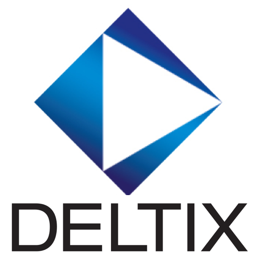
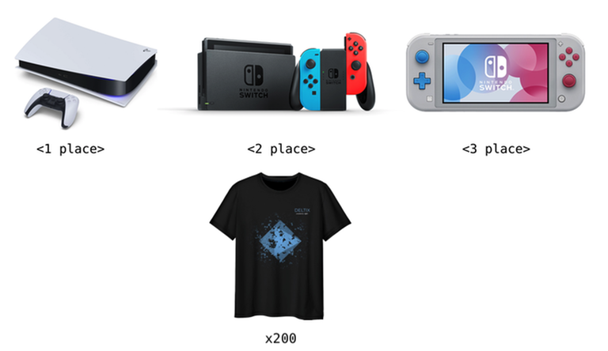

# Announcement

 Hi Codeforces!

We are **[DELTIX](https://codeforces.com/https://deltix.io/)**. Founded in 2005, DELTIX is one of the market leaders in software development for financial research and products for systematic and algorithmic trading. In 2020 DELTIX joined the EPAM family. Our mission is to turn promising ideas into breakthrough products fast. 

We are experts in:

 * aggregation, storage, and processing large volumes of time-series data
* data modeling
* testing and deployment of quantitative models

In our team we value skills like: 

 * knowledge of algorithms
* high-performance coding
* low latency data streams processing

[Learn more about DELTIX](https://codeforces.com/https://deltix.io/) 

Throughout the year, once per quarter, we will be inviting you to join DELTIX rounds at Codeforces. Today, we are excited to welcome you to the first installment of our rounds (joined Div1 и Div2) — [Deltix Round, Spring 2021 (open for everyone, rated, Div. 1 + Div. 2)](https://codeforces.com/contest/1523), that will start on [Sunday, May 30, 2021 at 20:35UTC+6](https://codeforces.com/https://www.timeanddate.com/worldclock/fixedtime.html?day=30&month=5&year=2021&hour=17&min=35&sec=0&p1=166). 

It is an open and rated round for both divisions.

We have prepared the following trophies for you: 

 * **1st place** = the most desired console of 2021 — PlayStation 5!
* **2nd place** = Nintendo Switch
* **3rd place** = Nintendo Switch Lite
* **1-100**: branded t-shirts

Another **100 t-shirts** will be distributed randomly between 100 participants outside of top-100 and who have solved at least one problem and participated in rated Codeforces rounds before. 

Problems have been prepared by our employees: [Vladik](https://codeforces.com/profile/Vladik "Candidate Master Vladik"), [netman](https://codeforces.com/profile/netman "Candidate Master netman"), [AleXman111](https://codeforces.com/profile/AleXman111 "Candidate Master AleXman111") and [sdryapko](https://codeforces.com/profile/sdryapko "Candidate Master sdryapko").

We would like to say a word of appreciation:

 * to [KAN](https://codeforces.com/profile/KAN "Legendary Grandmaster KAN") and [budalnik](https://codeforces.com/profile/budalnik "International Grandmaster budalnik") for coordinating the round
* [74TrAkToR](https://codeforces.com/profile/74TrAkToR "Grandmaster 74TrAkToR") for the idea for one of the tasks, as well as its preparation
* to all testers: [244mhq](https://codeforces.com/profile/244mhq "Legendary Grandmaster 244mhq"), [Tlatoani](https://codeforces.com/profile/Tlatoani "International Grandmaster Tlatoani"), [gepardo](https://codeforces.com/profile/gepardo "International Grandmaster gepardo"), [andrew](https://codeforces.com/profile/andrew "Grandmaster andrew"), [generic_placeholder_name](https://codeforces.com/profile/generic_placeholder_name "Master generic_placeholder_name"), [ajit](https://codeforces.com/profile/ajit "Master ajit"), [ptd](https://codeforces.com/profile/ptd "International Master ptd"), [PurpleCrayon](https://codeforces.com/profile/PurpleCrayon "Master PurpleCrayon"), [4llower](https://codeforces.com/profile/4llower "Candidate Master 4llower"), [namanbansal013](https://codeforces.com/profile/namanbansal013 "Expert namanbansal013"), [coderz189](https://codeforces.com/profile/coderz189 "Expert coderz189"), [wxhtzdy](https://codeforces.com/profile/wxhtzdy "Expert wxhtzdy"), [vineet16](https://codeforces.com/profile/vineet16 "Expert vineet16"), [kalki411](https://codeforces.com/profile/kalki411 "Expert kalki411") and [viktoria.0907](https://codeforces.com/profile/viktoria.0907 "Specialist viktoria.0907")
* and of course, to [MikeMirzayanov](https://codeforces.com/profile/MikeMirzayanov "Headquarters, MikeMirzayanov") for Codeforces and Polygon

**We will offer participants 8 problems and 135 minutes to solve them.** We wish everybody good luck and high ratings!

Fill out a short contact form if you are interested in internship and/or employment opportunities or would like to speak with recruiters or members of our team.

  [Contact Form →](https://codeforces.com/userForm/416572951fcf6e58) **UPD:** The scoring distribution is **500 — 1000 — 1500 — 2250 — 2250 — 3000 — 3250 — 3250**.

Thank you all for participating! ([editorial](Tutorial_(en).md))

Congratulations to the winners:  
1. [tourist](https://codeforces.com/profile/tourist "Legendary Grandmaster tourist")  
2. [Radewoosh](https://codeforces.com/profile/Radewoosh "Legendary Grandmaster Radewoosh")  
3. [Um_nik](https://codeforces.com/profile/Um_nik "Legendary Grandmaster Um_nik")  
4. [maroonrk](https://codeforces.com/profile/maroonrk "Legendary Grandmaster maroonrk")  
5. [ecnerwala](https://codeforces.com/profile/ecnerwala "Legendary Grandmaster ecnerwala")  
6. [jiangly](https://codeforces.com/profile/jiangly "Legendary Grandmaster jiangly")  
7. [SSRS_](https://codeforces.com/profile/SSRS_ "International Grandmaster SSRS_")  
8. [Petr](https://codeforces.com/profile/Petr "Legendary Grandmaster Petr")  
9. [scott_wu](https://codeforces.com/profile/scott_wu "Legendary Grandmaster scott_wu")  
10. [Maksim1744](https://codeforces.com/profile/Maksim1744 "Legendary Grandmaster Maksim1744") 

We would like to express our special congratulations to the top three leaders! We will try to send you your well-deserved prizes as soon as possible :) Unfortunately, we can not list the people who received 100 random T-shirts due to the fact that the search for cheaters is not completed.

