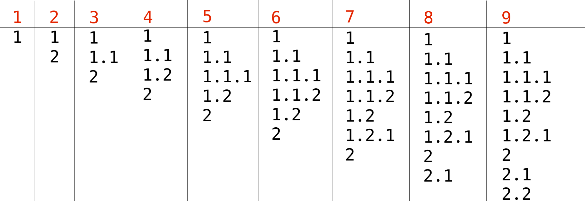

<h1 style='text-align: center;'> C. Compression and Expansion</h1>

<h5 style='text-align: center;'>time limit per test: 2 seconds</h5>
<h5 style='text-align: center;'>memory limit per test: 256 megabytes</h5>

  William is a huge fan of planning ahead. That is why he starts his morning routine by creating a nested list of upcoming errands.

A valid nested list is any list which can be created from a list with one item "1" by applying some operations. Each operation inserts a new item into the list, on a new line, just after one of existing items $a_1 \,.\, a_2 \,.\, a_3 \,.\, \,\cdots\, \,.\,a_k$ and can be one of two types: 

1. Add an item $a_1 \,.\, a_2 \,.\, a_3 \,.\, \cdots \,.\, a_k \,.\, 1$ (starting a list of a deeper level), or
2. Add an item $a_1 \,.\, a_2 \,.\, a_3 \,.\, \cdots \,.\, (a_k + 1)$ (continuing the current level).

 Operation can only be applied if the list does not contain two identical items afterwards. And also, if we consider every item as a sequence of numbers, then the sequence of items should always remain increasing in lexicographical order. 
## Example

s of valid and invalid lists that are shown in the picture can found in the "
## Note

s" section.When William decided to save a Word document with the list of his errands he accidentally hit a completely different keyboard shortcut from the "Ctrl-S" he wanted to hit. It's not known exactly what shortcut he pressed but after triggering it all items in the list were replaced by a single number: the last number originally written in the item number.

William wants you to help him restore a fitting original nested list.

### Input

Each test contains multiple test cases. The first line contains the number of test cases $t$ ($1 \le t \le 10$). Description of the test cases follows.

The first line of each test case contains a single integer $n$ ($1 \le n \le 10^3$), which is the number of lines in the list.

Each of the next $n$ lines contains a single integer $a_i$ ($1 \le a_i \le n$), which is what remains of William's nested list.

It is guaranteed that in each test case at least one fitting list exists.

It is guaranteed that the sum of values $n$ across all test cases does not exceed $10^3$.

### Output

For each test case output $n$ lines which represent a valid nested list, which could become the data provided to you by William.

If there are multiple answers, print any.

## Example

### Input


```text
2
4
1
1
2
3
9
1
1
1
2
2
1
2
1
2
```
### Output


```text
1
1.1
1.2
1.3
1
1.1
1.1.1
1.1.2
1.2
1.2.1
2
2.1
2.2
```
## Note

In the second example test case one example of a fitting list is:

1

1.1 

1.1.1

1.1.2

1.2

1.2.1

2

2.1

2.2

This list can be produced by using the sequence of operations shown below:  

1. Original list with a single item $1$.
2. Insert item $2$ by using the insertion operation of the second type after item $1$.
3. Insert item $1.1$ by using the insertion operation of the first type after item $1$.
4. Insert item $1.2$ by using the insertion operation of the second type after item $1.1$.
5. Insert item $1.1.1$ by using the insertion operation of the first type after item $1.1$.
6. Insert item $1.1.2$ by using the insertion operation of the second type after item $1.1.1$.
7. Insert item $1.2.1$ by using the insertion operation of the first type after item $1.2$.
8. Insert item $2.1$ by using the insertion operation of the first type after item $2$.
9. Insert item $2.2$ by using the insertion operation of the second type after item $2.1$.


#### Tags 

#1600 #NOT OK #brute_force #data_structures #greedy #implementation #trees 

## Blogs
- [All Contest Problems](../Deltix_Round,_Spring_2021_(open_for_everyone,_rated,_Div._1_+_Div._2).md)
- [Announcement](../blogs/Announcement.md)
- [Tutorial (en)](../blogs/Tutorial_(en).md)
