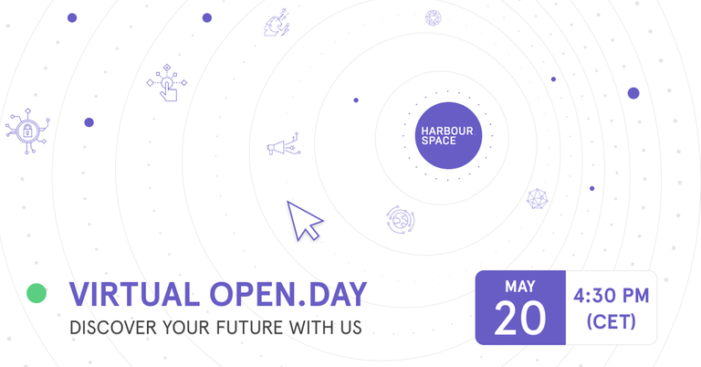

# Announcement

Hello Codeforces!

On [Sunday, May 16, 2021 at 14:00UTC+6](https://codeforces.com/https://www.timeanddate.com/worldclock/fixedtime.html?day=16&month=5&year=2021&hour=11&min=0&sec=0&p1=166) [Educational Codeforces Round 109 (Rated for Div. 2)](https://codeforces.com/contest/1525 "Educational Codeforces Round 109 (Rated for Div. 2)") will start. **Please, note the unusual start time.**

Series of Educational Rounds continue being held as [Harbour.Space University](https://codeforces.com/https://harbour.space/) initiative! You can read the details about the cooperation between [Harbour.Space University](https://codeforces.com/https://harbour.space/) and Codeforces in the [blog post](//codeforces.com/blog/entry/51208).

This round will be **rated for the participants with rating lower than 2100**. It will be held on extended ICPC rules. The penalty for each incorrect submission until the submission with a full solution is 10 minutes. After the end of the contest you will have 12 hours to hack any solution you want. You will have access to copy any solution and test it locally.

You will be given **6 or 7 problems** and **2 hours** to solve them.

The problems were invented and prepared by Roman [Roms](https://codeforces.com/profile/Roms "Master Roms") Glazov, Adilbek [adedalic](https://codeforces.com/profile/adedalic "International Master adedalic") Dalabaev, Vladimir [vovuh](https://codeforces.com/profile/vovuh "Master vovuh") Petrov, Ivan [BledDest](https://codeforces.com/profile/BledDest "International Grandmaster BledDest") Androsov, Maksim [Neon](https://codeforces.com/profile/Neon "Candidate Master Neon") Mescheryakov and me. Also huge thanks to Mike [MikeMirzayanov](https://codeforces.com/profile/MikeMirzayanov "Headquarters, MikeMirzayanov") Mirzayanov for great systems Polygon and Codeforces.

Good luck to all the participants!

Our friends at Harbour.Space also have a message for you:

*Dear Codeforces!* 

*We are reaching out to make sure you have everything you need to begin your journey at Harbour.Space University. That’s why we are hosting our very first **Virtual Open.Day on May 20th at 4:30 p.m. (CET)**.* 

*This Open.Day is an opportunity for our university to open its doors (virtually) for you to get an idea of what to expect in terms of the academic experience, student life, living in Barcelona and asking any questions you might have.*

*Remember, we have a [full scholarship available](https://harbour.space/computer-science/articles/competitive-programming-scholarships?utm_source=codeforces&utm_medium=partner&utm_campaign=bcn_b2c_openday&utm_content=competitiveprogramming) **for competitive programming**! This scholarship is for Bachelor’s and Master’s students wanting to join any of our tech-related programmes and our dynamic programming team. Joining the Open.Day is the perfect opportunity for you to ask questions and make sure Harbour.Space is the right place for you.* 

*[Register for our Virtual Open.Day](https://codeforces.com/https://ab3iojancie.typeform.com/to/bs5ir3pd) and see first-hand what life is like as a Spacer and the success stories of our scholarship recipients.* 

*Here is a sneak peek:* [https://www.youtube.com/watch?v=y6f999g7qFA](https://codeforces.com/https://www.youtube.com/watch?v=y6f999g7qFA)

  [Register Today→](https://codeforces.com/https://ab3iojancie.typeform.com/to/bs5ir3pd) *Good luck on your round, and see you next time!* 

*Harbour.Space University*

**UPD:** [Editorial is out](Tutorial.md)

