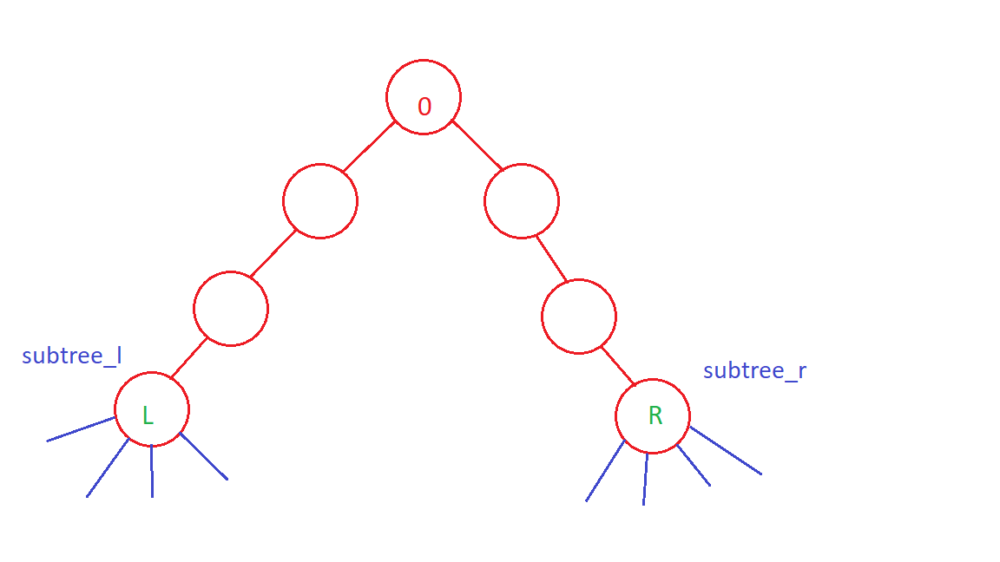
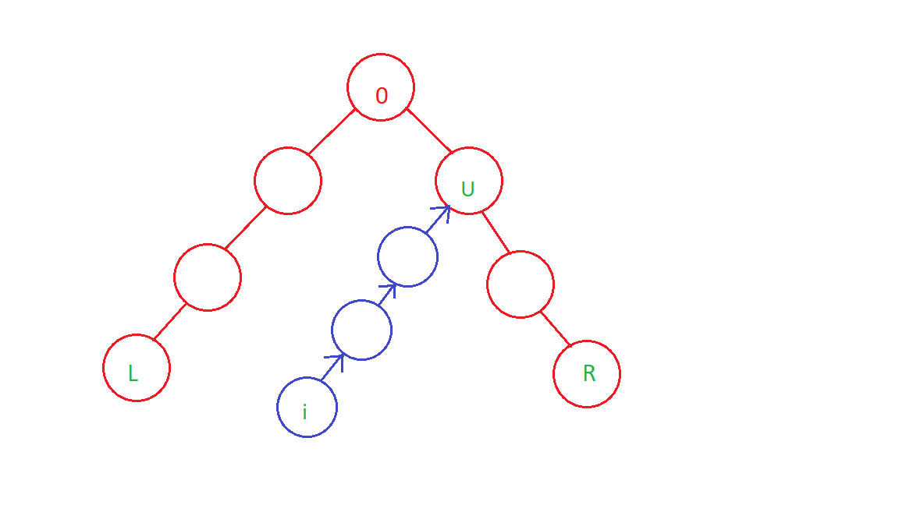

# Tutorial_(en)

[1527A - And Then There Were K](../problems/A._And_Then_There_Were_K.md "Codeforces Round 721 (Div. 2)")

Author: [loud_mouth](https://codeforces.com/profile/loud_mouth "Expert loud_mouth")  
 Idea: [Bignubie](https://codeforces.com/profile/Bignubie "Candidate Master Bignubie")

 **Editorial**
### [1527A - And Then There Were K](../problems/A._And_Then_There_Were_K.md "Codeforces Round 721 (Div. 2)")

Let $T = $ $n$ & ($n-1$) & ($n-2$) & ($n-3$) & ... ($k$)

If there is at least one integer from $K$ to $N$ whose bit at the $i_{th}$ index is $0$, then the value of the $i_{th}$ bit in $T$ will also be $0$. We can easily observe that the $msb$ (Highest set bit in $n$) in $N$ will become $0$ for the first time when $K = 2^{msb}- 1$. All the other bits will become zero when $K = 2^{msb}$. 

Thus the answer is, $K = 2^{msb} - 1$.

 **Solution (Loud_mouth)** 
```cpp
#include<bits/stdc++.h>
using namespace std;
#define ll long long

int main()
{
	int t;
	cin>>t;
	while(t--)
	{
		int n;
		cin>>n;
		int last=0;
		for(int i=0; i<30; ++i)
		{
			if(((n>>i)&1) == 1)
			{
				last=i;
			}
		}
		cout<<(1<<last)-1<<"n";
	}
	return 0;	
}
```
 **Solution (the_nightmare)** 
```cpp
#include<bits/stdc++.h>
#include <ext/pb_ds/assoc_container.hpp>
#include <ext/pb_ds/tree_policy.hpp>
#define ll          long long
#define pb          push_back
#define ppb         pop_back
#define endl        'n'
#define mii         map<ll,ll>
#define msi         map<string,ll>
#define mis         map<ll, string>
#define rep(i,a,b)    for(ll i=a;i<b;i++)
#define repr(i,a,b) for(ll i=b-1;i>=a;i--)
#define trav(a, x)  for(auto& a : x)
#define pii         pair<ll,ll>
#define vi          vector<ll>
#define vii         vector<pair<ll, ll>>
#define vs          vector<string>
#define all(a)      (a).begin(),(a).end()
#define F           first
#define S           second
#define sz(x)       (ll)x.size()
#define hell        1000000007
#define lbnd        lower_bound
#define ubnd        upper_bound
#define DEBUG       cerr<<"/n>>>I'm Here<<</n"<<endl;
#define display(x) trav(a,x) cout<<a<<" ";cout<<endl;
#define what_is(x)  cerr << #x << " is " << x << endl;
#define ordered_set tree<ll, null_type,less<ll>, rb_tree_tag,tree_order_statistics_node_update>
#define FAST ios_base::sync_with_stdio(false);cin.tie(0);cout.tie(0);
using namespace __gnu_pbds;
using namespace std;
#define PI 3.141592653589793
#define N  200005
void solve()
{
    ll n;
    cin >> n;
    ll cnt=0;
    while(n!=0){
        cnt++;
        n=n/2;
    }
    cout << (1<<(cnt-1))-1 << endl;
}
int main()
{
    #ifndef ONLINE_JUDGE
    freopen ("input.txt","r",stdin);
    #endif
    ll int TEST=1;
    cin >> TEST;
    //init();
    while(TEST--)
    {
        solve();
    }
}

```
[1527B1 - Palindrome Game (easy version)](../problems/B1._Palindrome_Game_(easy_version).md "Codeforces Round 721 (Div. 2)")

Author: [DenOMINATOR](https://codeforces.com/profile/DenOMINATOR "Master DenOMINATOR")  
 Idea: [shikhar7s](https://codeforces.com/profile/shikhar7s "Master shikhar7s")

 **Editorial**
### [1527B1 - Palindrome Game (easy version)](../problems/B1._Palindrome_Game_(easy_version).md "Codeforces Round 721 (Div. 2)")

If the count of zeros in the string $s$ is even then Bob always win

Proof 

* Bob can restrict Alice from performing operation $2$ by making string $s$ palindrome (if Alice changes $s[i]$ to '1' then Bob will change $s[n-i+1]$ to '1'). However, when the last '0' is remaining, Bob will reverse the string, eventually forcing Alice to perform the operation $1$. This way Alice will spend $2$ dollars more than Bob resulting in Bob's win.

 If the count of zeros in the string $s$ is odd then Alice always win except for the case of one '0'Proof 

* Alice will change $s[n/2]$ from '0' to '1' and play with the same strategy as Bob did in the above case. This way Bob will spend $1$ dollar more than Alice resulting in Alice's win.
 **Solution (DenOMINATOR)** 
```cpp
#include<bits/stdc++.h>
using namespace std;


void solve(){
	int n;
	cin >> n;
	string s;
	cin >> s;
	bool is_palindrome=1;
	int cnt_0 = 0;
	for(int i=0;i<n;i++){
		cnt_0 += s[i]=='0';
	}
	if(cnt_0 == 1){
		cout << "BOBn";
		return;
	}
	if(cnt_0%2){
		cout << "ALICEn";
		return;
	}
	cout << "BOBn";
	return;
}

signed main()
{
	int t;
	cin >> t;
	while(t--){
		solve();
	}
    return 0;
}
```
 **Solution (shikhar7s)** 
```cpp
#include<bits/stdc++.h>
using namespace std;
#define int long long int
#define mp(a,b) make_pair(a,b)
#define vi vector<int>
#define mii map<int,int>
#define mpi map<pair<int,int>,int>
#define vp vector<pair<int,int> >
#define pb(a) push_back(a)
#define fr(i,n) for(i=0;i<n;i++)
#define rep(i,a,n) for(i=a;i<n;i++)
#define F first
#define S second
#define endl "n"
#define fast std::ios_base::sync_with_stdio(false);cin.tie(0);cout.tie(0);
#define mod 1000000007
#define dom 998244353
#define sl(a) (int)a.length()
#define sz(a) (int)a.size()
#define all(a) a.begin(),a.end()
#define pii pair<int,int> 
#define mini 2000000000000000000
#define time_taken 1.0 * clock() / CLOCKS_PER_SEC
//const long double pi = acos(-1);
//mt19937_64 mt(chrono::steady_clock::now().time_since_epoch().count());
//primes for hashing 937, 1013
template<typename T, typename U> static inline void amin(T &x, U y) 
{ 
    if (y < x) 
        x = y; 
}
template<typename T, typename U> static inline void amax(T &x, U y) 
{ 
    if (x < y) 
        x = y; 
}
void shikhar7s(int cas)
{
    int n,i;
    cin>>n;
    string s;
    cin>>s;
    int f=1,z=0;
    fr(i,n)
    {
        if(s[i]=='0')
            z++;
    }
    int x=0;
    fr(i,n/2)
    {
        if(s[i]!=s[n-1-i])
        {
            f=0;
            x++;
        }
    }
    if(f)
    {
        if(z==1||z%2==0)
            cout<<"BOB"<<endl;
        else
            cout<<"ALICE"<<endl;
    }
    else
    {
        if(x==1&&z==2)
            cout<<"DRAW"<<endl;
        else
            cout<<"ALICE"<<endl;
    }
}
signed main()
{
    fast;
    //freopen("input.txt", "rt", stdin);
    //freopen("output.txt", "wt", stdout);
    int t=1;
    cin>>t;
    int cas=1;
    while(cas<=t)
    {
    //cout<<"Case #"<<cas<<": ";
    shikhar7s(cas);
    cas++;
    }
    return 0;
}
```
[1527B2 - Palindrome Game (hard version)](../problems/B2._Palindrome_Game_(hard_version).md "Codeforces Round 721 (Div. 2)")

Author: [DenOMINATOR](https://codeforces.com/profile/DenOMINATOR "Master DenOMINATOR")  
 Idea:[DenOMINATOR](https://codeforces.com/profile/DenOMINATOR "Master DenOMINATOR")

 **Editorial**
### [1527B2 - Palindrome Game (hard version)](../problems/B2._Palindrome_Game_(hard_version).md "Codeforces Round 721 (Div. 2)")

Solution 1:

The case when $s$ is a palindrome is discussed in B1. Otherwise, Alice will win or the game will end with a draw.

Proof 

* If it is optimal for Alice to perform operation $1$ in the first move, she will perform it else she will perform operation $2$ forcing Bob to perform operation $1$ (which is not optimal otherwise Alice would have performed it in the first move).

Optimal Strategy for Alice 

* Alice will keep reversing the string till string $s$ is one move short to become a palindrome with an even number of zeros. This time Alice will perform operation $1$ instead of reversing and will make string $s$ a palindrome. Now, string $s$ is a palindrome containing an even number of zeros, with Bob's turn. Here, Alice can take $2$ dollars advantage using the strategy mentioned in B1. This way Bob will spend at least $1$ dollars more than Alice resulting in Alice's win.
* In some cases like '1100', '1001110' Alice will just keep on reversing the string and Bob has to change all '0' to 1'.

 There's only $1$ case when there's a draw if the length of string $s$ is odd and contains $2$ zeros ($1$ zero is in mid of string $s$).Solution 2:

As constraints on $n$ were small, the problem can also be solved using dynamic programming.

Following parameters of string $s$ is enough define current state of game: 

* $cnt00$ = count of symmetric $00$ pair ($s[i]=$'0' as well as $s[n-i+1]=$'0')
* $cnt01$ = count of symmetric $01$ or $10$ pair ($s[i]$ is not equal to $s[n-i+1]$)
* $mid$ = $True$ if mid character exists (length of string is odd) and it is '0' else $False$
* $rev$ = $True$ if previous move was operation $2$ else $False$If any player encounters the game state $\{cnt00,cnt01,mid,rev\}$, we define $dp_{cnt00,cnt01,mid,rev}$ to be the minimum cost difference he/she can achieve from here.

Transition is pretty simple 


	+ if $rev$ is $False$ and $cnt01>0$: $dp_{cnt00,cnt01,mid,rev} = \min(dp_{cnt00,cnt01,mid,rev},-dp_{cnt00,cnt01,mid,True} )$
	+ if $cnt00>0$: $dp_{cnt00,cnt01,mid,rev} = \min(dp_{cnt00,cnt01,mid,rev},1-dp_{cnt00-1,cnt01+1,mid,False})$
	+ if $cnt01>0$: $dp_{cnt00,cnt01,mid,rev} = \min(dp_{cnt00,cnt01,mid,rev},1-dp_{cnt00,cnt01-1,mid,False})$
	+ if $mid$ is $True$: $dp_{cnt00,cnt01,mid,rev} = \min(dp_{cnt00,cnt01,mid,rev},1-dp_{cnt00,cnt01,False,False})$ Finally,
	+ If $dp_{cnt00,cnt01,mid,rev}<0$, Alice wins
	+ If $dp_{cnt00,cnt01,mid,rev}>0$, Bob wins
	+ If $dp_{cnt00,cnt01,mid,rev}=0$, Draw We can precompute this dp and answer all test cases in $O(n)$. Overall time complexity - $O(n^{2})$
 **Solution(Greedy) (DenOMINATOR)** 
```cpp
#include<bits/stdc++.h>
using namespace std;


void solve(){
	int n;
	cin >> n;
	string s;
	cin >> s;
	bool is_palindrome=1;
	int cnt_0 = 0, cnt_1 = 0;
	for(int i=0;i<n;i++){
		cnt_0 += s[i]=='0';
	}
	for(int i=0;i<n/2;i++){
		if(s[i]!=s[n-1-i]) is_palindrome = 0;
		if( (s[i]=='1' || s[n-1-i]=='1') && s[i]!=s[n-1-i]){
			cnt_1++;
		}
	}
	if(is_palindrome){
		if(cnt_0 == 1){
			cout << "BOBn";
			return;
		}
		if(cnt_0%2){
			cout << "ALICEn";
			return;
		}
		cout << "BOBn";
		return;
	}
	if(cnt_0==2 && cnt_1==1){
		cout << "DRAWn";
		return;
	}
	cout << "ALICEn";
	return;
}

signed main()
{
	int t;
	cin >> t;
	while(t--){
		solve();
	}
    return 0;
}
```
 **Solution(DP) (DenOMINATOR)** 
```cpp
#include <bits/stdc++.h>
using namespace std;

typedef long long ll;
double pi = acos(-1);
#define _time_      1.0 * clock() / CLOCKS_PER_SEC
#define fi          first
#define se          second
#define mp          make_pair
#define pb          push_back
#define all(a)      a.begin(),a.end()
mt19937 rng(chrono::high_resolution_clock::now().time_since_epoch().count());

int dp[505][505][2][2];

void precompute(){
    for(int i=0;i<=500;i++){
        for(int j=0;j<=500;j++){
            for(int k=0;k<2;k++){
                for(int l=1;l>=0;l--){
                    dp[i][j][k][l] = 1e9;
                }
            }
        }
    }
    dp[0][0][0][0]=0;
    dp[0][0][0][1]=0;
    for(int i=0;i<=500;i++){
        for(int j=0;j<=500;j++){
            for(int k=0;k<2;k++){
                for(int l=1;l>=0;l--){
                    if(l==0 && j>0) dp[i][j][k][l] = min(dp[i][j][k][l],-dp[i][j][k][1]);
                    if(i>0) dp[i][j][k][l] = min(dp[i][j][k][l],1-dp[i-1][j+1][k][0]);
                    if(j>0) dp[i][j][k][l] = min(dp[i][j][k][l],1-dp[i][j-1][k][0]);
                    if(k==1) dp[i][j][k][l] = min(dp[i][j][k][l],1-dp[i][j][0][0]);
                }
            }
        }
    }
}

void solve(){
    int n;
    cin >> n;
    string s;
    cin >> s;
    int cnt00=0,cnt01=0,mid=0;
    for(int i=0;i<n/2;i++){
        if(s[i]=='0' && s[i]==s[n-i-1]) cnt00++;
        if(s[i]!=s[n-i-1]) cnt01++;
    }
    if(n%2 && s[n/2]=='0') mid=1;
    if(dp[cnt00][cnt01][mid][0]<0){
        cout << "ALICE";
    }else if(dp[cnt00][cnt01][mid][0]>0){
        cout << "BOB";
    }else{
        cout << "DRAW";
    }
}

int main(){
    ios_base::sync_with_stdio(0);cin.tie(0);cout.tie(0);
    //freopen("input.txt", "r", stdin);
    //freopen("output.txt", "w", stdout);
    #ifdef SIEVE
        sieve();
    #endif
    #ifdef NCR
        init();
    #endif
    precompute();
    int t;
    cin >> t;
    while(t--){
        solve();
        cout << "n";
    }
    return 0;
}
```
[1527C - Sequence Pair Weight](../problems/C._Sequence_Pair_Weight.md "Codeforces Round 721 (Div. 2)")

Author: [sharabhagrawal25](https://codeforces.com/profile/sharabhagrawal25 "Master sharabhagrawal25")  
 Idea: [rivalq](https://codeforces.com/profile/rivalq "Master rivalq")

 **Editorial**
### [1527C - Sequence Pair Weight](../problems/C._Sequence_Pair_Weight.md "Codeforces Round 721 (Div. 2)")

First of all, it can be proved that the maximum possible answer occurs when $n = 10^5$ and all the elements are identical which comes out to be of the order $4 \cdot 10^{18}$, which fits in the long long integer range, thus preventing overflow. 

The brute force approach is just to find the weight of each subarray and sum them up but it will definitely not fit into TL.

Let $dp_i$ represents the sum of the weights of all subsegments which ends at index $i$.

So $answer = \sum_{i = 1}^{n} dp_i $

Now, $dp_i$ includes: 

* Sum of the weights of all subsegments ending at index $i-1$ which is equal to $dp_{i-1}$.
* The contribution of $i_{th}$ index for all the subsegments ending at index $i$. This is just the sum of prefix sums of indexes of the element having the same value as that of $a_i$ which has occurred before index $i$. This is because the number of subsegments ending at index $i$ in which any index $j$ ($j < i$ and $a_j = a_i$) has been counted as unordered pair ${j,i}$ is equal to $j$. This can be done by maintaining a map that stores the prefix sum of indexes for a given value till $i$.

 $dp_i = dp_{i-1} + \sum j $ where $j < i$ and $a_j = a_i$ **Solution (sharabhagrawal25)** 
```cpp
#include <bits/stdc++.h>
using namespace std;

int main(){
        int t;
        cin >> t;
        while(t--){
            int n;
            cin >> n;
            
            int a[n];
            for (int i = 0 ; i < n; i++){
                cin >> a[i];
            }

            vector <long long> dp(n, 0);
    
            map  <long long,long long> value;
    
            long long final_ans = 0;
    
            for (long long i = 0 ; i < n ; i++){
                if (i > 0) dp[i] = dp[i - 1];
    
                if (value.count(a[i])){
                    dp[i] += value[a[i]];
                }
    
                value[a[i]] += (i + 1);
                final_ans += dp[i];
            } 
    
            cout << final_ans << endl;
        }
}
```
 **Solution (mallick630)** 
```cpp
t = int(input())
for j in range(t):
    n = int(input())
    a = list(map(int,input().split()))
    
    value = {}
    fa, ca = 0, 0
    
    for i in range(n):
      if a[i] in value:
        ca += value[a[i]]
      else:
        value[a[i]]=0
      value[a[i]] += i+1
      fa += ca
    
    print(fa)
```
[1527D - MEX Tree](../problems/D._MEX_Tree.md "Codeforces Round 721 (Div. 2)")

Author: [mallick630](https://codeforces.com/profile/mallick630 "Candidate Master mallick630")  
 Idea: [CoderAnshu](https://codeforces.com/profile/CoderAnshu "International Master CoderAnshu")

 **Editorial**
### [1527D - MEX Tree](../problems/D._MEX_Tree.md "Codeforces Round 721 (Div. 2)")

This problem can be solved with two pointer approach. We will use the following simple formula to evaluate the number of paths with MEX = i,

$ans_i$ = (Number of paths with $MEX \ge i$) - (Number of paths with $MEX > i$).

First we root the tree at node $0$ and calculate the subtree sizes using a basic subtree DP. Now we can easily calculate answer for $0$ by just summing up the $size \cdot (size-1)/2$ of its children. Since total number of paths are $\left(\begin{array}{c}n\\\ 2\end{array}\right)$, the number of paths with $MEX > 0$ are $\left(\begin{array}{c}n\\\ 2\end{array}\right) - ans_0$ and we will maintain these paths which are having $MEX > i$ for every $i$ in a variable lets say $P$. Now the main idea is that for the $MEX$ of a path to be equal to $i$ it must contain all nodes from $0...i-1$ and not $i$. It can be seen that if we have current $MEX = i$ in some path then this path can only be extended from both ends as for $MEX > i$ this whole path must be included. So we start with our $2$ pointers initially $l = 0,r = 0$ i.e. both at the root. We will also be maintaining a visited array which will be denoting all those vertices which are lying in our path from $l$ to $r$. Now we loop from $1$ to $n$ and successively calculate their answers. Suppose we need to add some vertex $i$ to the path, then if the current vertex is already in the path i.e. already visited then we can just continue as the variable $P$ will remain same. In the other case, a possible approach is to just recursively move to the parent marking them as visited until we find a previously visited node. Let that node be $U$. Note that we will always break at the root as it is marked visited in the initial step. 

Now the following two cases arise,

* The node $U$ is one of the endpoints $l$ or $r$. In this case we can simply calculate the number of paths having $MEX = i$. See the diagram below, we are having $P$ from previous calculations the number of paths having $MEX \ge i$ and the number of paths with $MEX > i$ (actually those paths which include all nodes from $0$ to $i-1$) can simply be seen as $subtree_i \cdot subtree_l$ or $subtree_i \cdot subtree_r$ depending on which two endpoints are there now. It should be noted that we also need to update the subtree sizes as we move up to parent recursively, by subtracting the $subtree_v$ from $subtree_{parent(v)}$. After updating the $l$ and $r$ pointers, the answer for $MEX = i$ is simply $P - subtree_l \cdot subtree_r$ and finally we update the variable $P = subtree_l \cdot subtree_r$ denoting for $i + 1$, the number of paths with $MEX \ge i+1$. 
* The next case is when $U$ is not among the endpoints $l$ and $r$, then in this case $ans_i = P$ and all other remaining i.e $MEX \ge i+1$ are zero, since we can never find a path which can contain all vertices from $0$ to $i$. 
 **Solution (shikhar7s)** 
```cpp
#include<bits/stdc++.h>
using namespace std;
#define int long long int
#define mp(a,b) make_pair(a,b)
#define vi vector<int>
#define mii map<int,int>
#define mpi map<pair<int,int>,int>
#define vp vector<pair<int,int> >
#define pb(a) push_back(a)
#define fr(i,n) for(i=0;i<n;i++)
#define rep(i,a,n) for(i=a;i<n;i++)
#define F first
#define S second
#define endl "n"
#define Endl "n"
#define fast std::ios_base::sync_with_stdio(false);cin.tie(0);cout.tie(0);
#define mod 1000000007
#define dom 998244353
#define sl(a) (int)a.length()
#define sz(a) (int)a.size()
#define all(a) a.begin(),a.end()
#define pii pair<int,int> 
#define mini 2000000000000000000
#define time_taken 1.0 * clock() / CLOCKS_PER_SEC
//mt19937 rng(chrono::steady_clock::now().time_since_epoch().count());
//const long double pi = acos(-1);
//mt19937_64 mt(chrono::steady_clock::now().time_since_epoch().count());
//primes for hashing 937, 1013
template<typename T, typename U> static inline void amin(T &x, U y) 
{ 
    if (y < x) 
        x = y; 
}
template<typename T, typename U> static inline void amax(T &x, U y) 
{ 
    if (x < y) 
        x = y; 
}
vector<int> adj[200005];
int vis[200005],c[200005],t;
pii p[200005];
void dfs(int x)
{
    vis[x]=1;
    c[x]=1;
    int i;
    p[x]=mp(t,t);
    t++;
    fr(i,sz(adj[x]))
    {
        if(!vis[adj[x][i]])
        {
            dfs(adj[x][i]);
            c[x]+=c[adj[x][i]];
            p[x].S=p[adj[x][i]].S;
        }
    }
}
void shikhar7s(int cas)
{
    int n,i;
    cin>>n;
    t=0;
    fr(i,n)
    {
        vis[i]=0;
        adj[i].clear();
    }   
    int x,y;
    fr(i,n-1)
    {
        cin>>x>>y;
        adj[x].pb(y);
        adj[y].pb(x);
    }
    dfs(0);
    int ans=0;
    fr(i,sz(adj[0]))
    {
        int x=c[adj[0][i]];
        x=(x*(x-1))/2;
        ans+=x;
    }
    cout<<ans<<" ";
    int s=0,ss=0,got=1;
    y=-1;
    fr(i,sz(adj[0]))
    {
        int x=c[adj[0][i]];
        if(p[adj[0][i]].F<=p[1].F&&p[adj[0][i]].S>=p[1].S)
        {
            y=adj[0][i];
            x-=c[1];
        }
        if(adj[0][i]!=y)
            got+=x;
        s+=x;
        x*=x;
        ss+=x;
    }
    ans=(s*s-ss)/2;
    ans+=s;
    cout<<ans<<" ";
    i=2;
    int l=0,r=1,j,b=0;
    while(i<n)
    {
        if((p[i].F<=p[l].F&&p[i].S>=p[l].S)||(p[i].F<=p[r].F&&p[i].S>=p[r].S))
        {
            cout<<0<<" ";
            i++;
            continue;
        }
        if(!l)
        {
            int f=2;
            ss=c[r];
            if(p[r].F<=p[i].F&&p[r].S>=p[i].S)
            {
                f=1;
                ss-=c[i];
            }
            if(!(p[y].F<=p[i].F&&p[y].S>=p[i].S))
            {
                ans=1;
                fr(j,sz(adj[0]))
                {
                    int x=adj[0][j];
                    if(x==y)
                        continue;
                    int su=c[x];
                    if(p[x].F<=p[i].F&&p[x].S>=p[i].S)
                    {
                        f=0;
                        su-=c[i];
                    }
                    ans+=su;
                }
            }
            else
                ans=got;
            ans*=ss;
            cout<<ans<<" ";
            if(!f)
                l=i;
            else if(f==1)
                r=i;
            else
            {
                i++;
                b=1;
                break;
            }
        }
        else
        {
            int f=2;
            s=c[l];
            ss=c[r];
            if(p[l].F<=p[i].F&&p[l].S>=p[i].S)
            {
                f=0;
                s-=c[i];
            }
            if(p[r].F<=p[i].F&&p[r].S>=p[i].S)
            {
                f=1;
                ss-=c[i];
            }
            ans=s*ss;
            cout<<ans<<" ";
            if(!f)
                l=i;
            else if(f==1)
                r=i;
            else
            {
                i++;
                b=1;
                break;
            }
        }
        i++;
    }
    if(!b)
        cout<<1<<" ";
    else
    {
        while(i<=n)
        {
            cout<<0<<" ";
            i++;
        }
    }
    cout<<endl;
}
signed main()
{
    fast;
    //freopen("output.txt", "rt", stdin);
    //freopen("output.txt", "wt", stdout);
    int t=1;
    cin>>t;
    int cas=1;
    while(cas<=t)
    {
    //cout<<"Case #"<<cas<<": ";
    shikhar7s(cas);
    cas++;
    }
    return 0;
}
```
 **Solution (the_nightmare)** 
```cpp
#include<bits/stdc++.h>
#include <ext/pb_ds/assoc_container.hpp>
#include <ext/pb_ds/tree_policy.hpp>
#define ll          long long
#define pb          push_back
#define ppb         pop_back
#define endl        'n'
#define mii         map<ll,ll>
#define msi         map<string,ll>
#define mis         map<ll, string>
#define rep(i,a,b)    for(ll i=a;i<b;i++)
#define repr(i,a,b) for(ll i=b-1;i>=a;i--)
#define trav(a, x)  for(auto& a : x)
#define pii         pair<ll,ll>
#define vi          vector<ll>
#define vii         vector<pair<ll, ll>>
#define vs          vector<string>
#define all(a)      (a).begin(),(a).end()
#define F           first
#define S           second
#define sz(x)       (ll)x.size()
#define hell        1000000007
#define lbnd        lower_bound
#define ubnd        upper_bound
#define DEBUG       cerr<<"/n>>>I'm Here<<</n"<<endl;
#define display(x) trav(a,x) cout<<a<<" ";cout<<endl;
#define what_is(x)  cerr << #x << " is " << x << endl;
#define ordered_set tree<ll, null_type,less<ll>, rb_tree_tag,tree_order_statistics_node_update>
#define FAST ios_base::sync_with_stdio(false);cin.tie(0);cout.tie(0);
using namespace __gnu_pbds;
using namespace std;
#define PI 3.141592653589793
#define N  200005
ll add(ll x,ll y){return (x+y)%hell;}
ll mul(ll x,ll y){return (x*y)%hell;}
vector <ll> adj[N];
ll subtree[N];
ll min1[N];
ll ans[N];
ll vis[N];
ll le;
int v;int u;
ll n;
int prevv;int prevu;
void init(){
    rep(i,0,n){
        adj[i].clear();
        subtree[i]=0;
        min1[i]=n;
        ans[i]=0;
        vis[i]=0;
    }
    le=n*(n-1)/2;
    v=0;u=0;
    prevv=-1;
    prevu=-1;
}
void dfs(int v,int prev=-1){
    subtree[v]=1;
    min1[v]=v;
    for (auto it: adj[v]){
        if (it==prev) continue;
        dfs(it,v);
        subtree[v]+=subtree[it];
        min1[v]=min(min1[v],min1[it]);
    }
}
void find(int val){
    //cout << v << " " << u << " " << prevv << " " << prevu << " " << val << endl;
    if (v==val or u==val){
        ll a,b;
        if (subtree[prevv]>subtree[v] or prevv==-1) a=subtree[v];
        else a=n-subtree[prevv];
        if (subtree[prevu]>subtree[u] or prevu==-1) b=subtree[u];
        else b=n-subtree[prevu];
        ans[val]=le-a*b;
        //cout << a << " " << b << endl;
        le=a*b;
        return;
    }
    for (auto it: adj[v]){
        if (it==prevv) continue;
        if (min1[it]==val){
            if (v==u) prevu=it;
            prevv=v;
            v=it;
            vis[it]=1;
            
            find(val);
            return;
        }  
    }
    for (auto it: adj[u]){
        if (it==prevu) continue;
        if (min1[it]==val){
            prevu=u;
            u=it;
            vis[it]=1;
            find(val);
            return;
        }  
    }
    ans[val]=le;
    le=0;
}
void solve()
{
    cin >> n;
    init();
    rep(i,0,n-1){
        int x,y;
        cin >> x >> y;
        adj[x].pb(y);
        adj[y].pb(x);
    }
    dfs(0);
    //cout << le << endl;
    for (auto it: adj[0]) {ans[0]+=(subtree[it]*(subtree[it]-1))/2;}
    //cout << endl;
    //cout << ans[0] << endl;
    le-=ans[0];
    rep(i,1,n){
        if (vis[i]==1 or le==0) ans[i]=0;
        else find(i);
    }
    ans[n]=le;
    rep(i,0,n+1) cout << ans[i] << " ";
    cout << endl;
    return;
}
int main()
{
    #ifndef ONLINE_JUDGE
    freopen ("input.txt","r",stdin);
    #endif
    ll int TEST=1;
    cin >> TEST;
    while(TEST--)
    {
        solve();
    }
}
```
[1527E - Partition Game](../problems/E._Partition_Game.md "Codeforces Round 721 (Div. 2)")

Author: [rivalq](https://codeforces.com/profile/rivalq "Master rivalq")  
 Idea: [rivalq](https://codeforces.com/profile/rivalq "Master rivalq")

 **Editorial**
### [1527E - Partition Game](../problems/E._Partition_Game.md "Codeforces Round 721 (Div. 2)")

Let's use dynamic programming to solve this problem. 

Consider $dp[i][j]$ be the answer for prefix $j$ with $i$ subsegments. Transitions are fairly straightforward. Let $c[i][j]$ be the cost of subarray starting at $i^{th}$ index and ending at $j^{th}$ index.

$dp[i][j] = \min\limits_{k \lt j}(dp[i-1][k] + c[k+1][j])$

If we calculate it naively, it would result in $O(n^2k)$ solution which would not be enough for given constraints.

We need some data structure to maintain $dp[i-1][k] + c[k+1][j]$ for every $k \lt j$. Consider the example $a = [2,2,3,2,3]$. We can write cost as $(2-1) + (4-2) + (5-3) = 5$. 

Except for the first occurrence, we just need a sum of $b[k] = k - last[a[k]]$ in the range, where $last[a[k]]$ is the index of the last occurrence of $a[k]$ just before index $k$. 

We can maintain this in some segment tree. Let's say our segment tree is built for prefix $j$, we can transition to prefix $j+1$ by adding $b[j+1]$ in range $[0,last[a[j+1]]-1]$.

This will result in a $O(n \cdot k log(n))$ solution. 

 **Solution (rivalq)** 
```cpp
#include<bits/stdc++.h>
using namespace std;

#define rep(i,a,n)     for(int i=a;i<n;i++)
#define ll             long long
//#define int            long long
#define pb             push_back
#define all(v)         v.begin(),v.end()
#define endl           "n"
#define x              first
#define y              second
#define gcd(a,b)       __gcd(a,b)
#define mem1(a)        memset(a,-1,sizeof(a))
#define mem0(a)        memset(a,0,sizeof(a))
#define sz(a)          (int)a.size()
#define pii            pair<int,int>
#define hell           1000000007
#define elasped_time   1.0 * clock() / CLOCKS_PER_SEC


template<typename T1,typename T2>istream& operator>>(istream& in,pair<T1,T2> &a){in>>a.x>>a.y;return in;}
template<typename T1,typename T2>ostream& operator<<(ostream& out,pair<T1,T2> a){out<<a.x<<" "<<a.y;return out;}
template<typename T,typename T1>T maxs(T &a,T1 b){if(b>a)a=b;return a;}
template<typename T,typename T1>T mins(T &a,T1 b){if(b<a)a=b;return a;}

const int N = 5e4+5;


struct node{
    int a=0;
    node (int val=0){
        a=val;
    }
    void merge(node &n1,node &n2){
        this->a=min(n1.a,n2.a);
    }
};
struct update{
  int val=0;
  update(int t=0){
     val=t;
  }
  void combine(update &par,int tl,int tr){
      val+=par.val;
  }
  void apply(node &node){
      node.a+=val;
      val=0;
  }
};
template<typename node,typename update>
struct segtree{
  node t[4*N];
  bool lazy[4*N];
  update zaker[4*N];
  int tl[4*N];
  int tr[4*N];
  node nul;
  inline void pushdown(int v){
     if(lazy[v]){    
       apply(zaker[v],v);
       lazy[v]=0;
       zaker[v].apply(t[v]);
     }
  }
  inline void apply(update &u,int v){
      if(tl[v]!=tr[v]){
          lazy[2*v]=lazy[2*v+1]=1;
          zaker[2*v].combine(u,tl[2*v],tr[2*v]);
          zaker[2*v+1].combine(u,tl[2*v+1],tr[2*v+1]);
      }
  }
  void build(int v,int start,int end,int arr[]){
      tl[v]=start;
      tr[v]=end;
      lazy[v]=0;
      zaker[v].val = 0;
      if(start==end){
          t[v].a=arr[start];
      }
      else{
          int m=(start+end)/2;
          build(2*v,start,m,arr);
          build(2*v+1,m+1,end,arr);
          t[v].merge(t[2*v],t[2*v+1]);
     }
  }
  void zeno(int v,int l,int r,update val){
      pushdown(v);
      if(tr[v]<l || tl[v]>r)return;
      if(l<=tl[v] && tr[v]<=r){
            t[v].a+=val.val;
            apply(val,v); 
            return;
      }
      zeno(2*v,l,r,val);
      zeno(2*v+1,l,r,val);
      t[v].merge(t[2*v],t[2*v+1]);
  }
  node query(int v,int l,int r){
      if(tr[v]<l || tl[v]>r)return node(hell);
      pushdown(v);
      if(l<=tl[v] && tr[v]<=r){
         return t[v];
      }
      node a=query(2*v,l,r);
      node b=query(2*v+1,l,r);
      node ans;
      ans.merge(a,b);
      return ans;
  }
public:
  node query(int l,int r){
      return query(1,l,r);
  }
  void upd(int l,int r,update val){
      return zeno(1,l,r,val);
  }   
};

segtree<node,update>seg;


int dp[101][N];

int solve(){
 	      int n,k; cin >> n >> k;
              vector<int>a(n+1);
              rep(i,1,n+1){
                        cin >> a[i];
              }
              for(int i = 0; i <= n; i++){
                        for(int j = 0; j <= k; j++){
                                dp[j][i] = hell;
                        }
              }
              dp[0][0] = 0;
              seg.build(1,0,n,dp[0]);

              for(int j = 1; j <= k; j++){
                                vector<int>last(n+1);
                                dp[j][0] = 0;
                                for(int i = 1; i <= n; i++){
                                        if(last[a[i]] == 0){
                                                last[a[i]] = i;
                                        }
                                        else{
                                                seg.upd(0,last[a[i]]-1,i-last[a[i]]);
                                                last[a[i]] = i;
                                        }
                                        dp[j][i] = seg.query(0,i-1).a;

                                }
                                seg.build(1,0,n,dp[j]);
                                
              }
              cout << dp[k][n] << endl;
              //cout << elasped_time << endl;
              return 0;
}
signed main(){
    ios_base::sync_with_stdio(0);cin.tie(0);cout.tie(0);
    //freopen("test.txt", "r", stdin);
    //freopen("output.txt", "w", stdout);
    #ifdef SIEVE
    sieve();
    #endif
    #ifdef NCR
    init();
    #endif
    int t=1;//cin>>t;
    while(t--){
        solve();
    }
    return 0;
}
 
```
 **Solution (the_nightmare)** 
```cpp
#include<bits/stdc++.h>
#include <ext/pb_ds/assoc_container.hpp>
#include <ext/pb_ds/tree_policy.hpp>
#define ll          long long
#define pb          push_back
#define ppb         pop_back
#define endl        'n'
#define mii         map<ll,ll>
#define msi         map<string,ll>
#define mis         map<ll, string>
#define rep(i,a,b)    for(ll i=a;i<b;i++)
#define repr(i,a,b) for(ll i=b-1;i>=a;i--)
#define trav(a, x)  for(auto& a : x)
#define pii         pair<ll,ll>
#define vi          vector<ll>
#define vii         vector<pair<ll, ll>>
#define vs          vector<string>
#define all(a)      (a).begin(),(a).end()
#define F           first
#define S           second
#define sz(x)       (ll)x.size()
#define hell        1000000007
#define lbnd        lower_bound
#define ubnd        upper_bound
#define DEBUG       cerr<<"/n>>>I'm Here<<</n"<<endl;
#define display(x) trav(a,x) cout<<a<<" ";cout<<endl;
#define what_is(x)  cerr << #x << " is " << x << endl;
#define ordered_set tree<ll, null_type,less<ll>, rb_tree_tag,tree_order_statistics_node_update>
#define FAST ios_base::sync_with_stdio(false);cin.tie(0);cout.tie(0);
using namespace __gnu_pbds;
using namespace std;
#define PI 3.141592653589793
#define MAXN  35005
int tree1[4*MAXN];
int lazy[4*MAXN];
int s[MAXN];
void build(int node, int start, int end)
{
    lazy[node]=0;
    if(start == end)
    {
        // Leaf node will have a single element
        tree1[node] = s[start];
        //cout << tree1[node] << " ";
    }
    else
    {
        int mid = (start + end) / 2;
        // Recurse on the left child
        build(2*node, start, mid);
        // Recurse on the right child
        build(2*node+1, mid+1, end);
        // Internal node will have the sum of both of its children
        tree1[node] = min(tree1[2*node],tree1[2*node+1]);
    }
}
void updateRange(int node, int start, int end, int l, int r, int val)
{
    if (l>r) return;
    if(lazy[node] != 0)
    { 
        // This node needs to be updated
        tree1[node] = tree1[node]+lazy[node];    // Update it
        if(start != end)
        {
            lazy[node*2] += lazy[node];                  // Mark child as lazy
            lazy[node*2+1] += lazy[node];                // Mark child as lazy
        }
        lazy[node] = 0;                                  // Reset it
    }
    if(start > end or start > r or end < l)              // Current segment is not within range [l, r]
        return;
    if(start >= l and end <= r)
    {
        // Segment is fully within range
        tree1[node] = tree1[node]+val;
        if(start != end)
        {
            // Not leaf node
            lazy[node*2] += val;
            lazy[node*2+1] += val;
        }
        return;
    }
    int mid = (start + end) / 2;
    updateRange(node*2, start, mid, l, r, val);        // Updating left child
    updateRange(node*2 + 1, mid + 1, end, l, r, val);   // Updating right child
    tree1[node] = min(tree1[node*2],tree1[node*2+1]);        // Updating root with max value 
}

ll queryRange(int node, int start, int end, int l, int r)
{
    if(start > end or start > r or end < l)
        return hell;         // Out of range
    if(lazy[node] != 0)
    {
        // This node needs to be updated
        tree1[node] = tree1[node]+lazy[node];            // Update it
        if(start != end)
        {
            lazy[node*2] += lazy[node];         // Mark child as lazy
            lazy[node*2+1] += lazy[node];    // Mark child as lazy
        }
        lazy[node] = 0;                 // Reset it
    }
    if(start >= l and end <= r)             // Current segment is totally within range [l, r]
        return tree1[node];
    int mid = (start + end) / 2;
    ll p1 = queryRange(node*2, start, mid, l, r);         // Query left child
    ll p2 = queryRange(node*2 + 1, mid + 1, end, l, r); // Query right child
    return min(p1,p2);
}
void solve()
{
    ll n,k;
    cin >> n >> k;
    int a[n];
    rep(i,0,n) cin >> a[i];
    int lastoc[n];
    map <int,int> m1;
    rep(i,0,n){
        if (m1.find(a[i])==m1.end()) lastoc[i]=-1;
        else lastoc[i]=m1[a[i]];
        m1[a[i]]=i;
    }
    int dp[n][k+1];
    dp[0][1]=0;
    rep(i,1,n){
        dp[i][1]=dp[i-1][1];
        if (lastoc[i]!=-1) dp[i][1]+=i-lastoc[i];
    }
    rep(i,2,k+1){
        rep(j,0,n) s[j]=dp[j][i-1];
        build(1,0,n-1);
        rep(j,0,i-1) dp[j][i]=hell;
        dp[i-1][i]=0;
        rep(j,i,n)
        {
            int lastj=lastoc[j];
            if (lastj>0 and (i-2)<(lastj)) {
                updateRange(1,0,n-1,i-2,lastj-1,j-lastj);
            } 
            dp[j][i] = queryRange(1,0,n-1,i-2,j-1);
        }
    }
    cout << dp[n-1][k] << endl;
}
int main()
{
    #ifndef ONLINE_JUDGE
    freopen ("input.txt","r",stdin);
    #endif
    ll int TEST=1;
    //cin >> TEST;
    //init();
    while(TEST--)
    {
        solve();
    }
}

}
```
