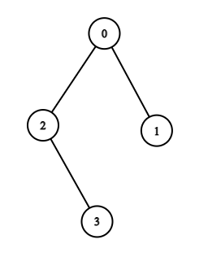
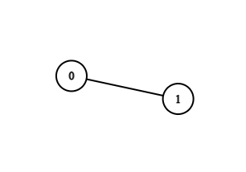

<h1 style='text-align: center;'> D. MEX Tree</h1>

<h5 style='text-align: center;'>time limit per test: 1.5 seconds</h5>
<h5 style='text-align: center;'>memory limit per test: 256 megabytes</h5>

You are given a tree with $n$ nodes, numerated from $0$ to $n-1$. For each $k$ between $0$ and $n$, inclusive, you have to count the number of unordered pairs $(u,v)$, $u \neq v$, such that the MEX of all the node labels in the shortest path from $u$ to $v$ (including end points) is $k$.

The MEX of a sequence of integers is the smallest non-negative integer that does not belong to the sequence.

### Input

The first line contains a single integer $t$ ($1 \le t \le 10^4$) — the number of test cases. 

The first line of each test case contains a single integer $n$ ($2 \le n \le 2 \cdot 10^{5}$).

The next $n-1$ lines of each test case describe the tree that has to be constructed. These lines contain two integers $u$ and $v$ ($0 \le u,v \le n-1$) denoting an edge between $u$ and $v$ ($u \neq v$).

It is guaranteed that the given edges form a tree.

It is also guaranteed that the sum of $n$ for all test cases does not exceed $2 \cdot 10^{5}$.

### Output

For each test case, print $n+1$ integers: the number of paths in the tree, such that the MEX of all the node labels in that path is $k$ for each $k$ from $0$ to $n$.

## Example

### Input


```text
2
4
0 1
0 2
2 3
2
1 0
```
### Output


```text
1 2 1 1 1 
0 0 1 
```
## Note

1. In example case $1$, 
	* For $k = 0$, there is $1$ path that is from $2$ to $3$ as $MEX([2, 3]) = 0$.
	* For $k = 1$, there are $2$ paths that is from $0$ to $2$ as $MEX([0, 2]) = 1$ and $0$ to $3$ as $MEX([0, 2, 3]) = 1$.
	* For $k = 2$, there is $1$ path that is from $0$ to $1$ as $MEX([0, 1]) = 2$.
	* For $k = 3$, there is $1$ path that is from $1$ to $2$ as $MEX([1, 0, 2]) = 3$
	* For $k = 4$, there is $1$ path that is from $1$ to $3$ as $MEX([1, 0, 2, 3]) = 4$.
2. In example case $2$, 
	* For $k = 0$, there are no such paths.
	* For $k = 1$, there are no such paths.
	* For $k = 2$, there is $1$ path that is from $0$ to $1$ as $MEX([0, 1]) = 2$.


#### Tags 

#2400 #NOT OK #combinatorics #dfs_and_similar #implementation #math #trees 

## Blogs
- [All Contest Problems](../Codeforces_Round_721_(Div._2).md)
- [Announcement (en)](../blogs/Announcement_(en).md)
- [Tutorial (en)](../blogs/Tutorial_(en).md)
