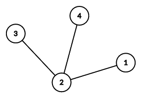
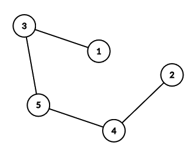

<h1 style='text-align: center;'> D. Lost Tree</h1>

<h5 style='text-align: center;'>time limit per test: 3 seconds</h5>
<h5 style='text-align: center;'>memory limit per test: 256 megabytes</h5>

This is an interactive problem.

Little Dormi was faced with an awkward problem at the carnival: he has to guess the edges of an unweighted tree of $n$ nodes! The nodes of the tree are numbered from $1$ to $n$.

The game master only allows him to ask one type of question:

* Little Dormi picks a node $r$ ($1 \le r \le n$), and the game master will reply with an array $d_1, d_2, \ldots, d_n$, where $d_i$ is the length of the shortest path from node $r$ to $i$, for all $1 \le i \le n$.

Additionally, to make the game unfair challenge Little Dormi the game master will allow at most $\lceil\frac{n}{2}\rceil$ questions, where $\lceil x \rceil$ denotes the smallest integer greater than or equal to $x$.

Faced with the stomach-churning possibility of not being able to guess the tree, Little Dormi needs your help to devise a winning strategy!

## Note

 that the game master creates the tree before the game starts, and does not change it during the game.

#### Input

The first line of input contains the integer $n$ ($2 \le n \le 2\,000$), the number of nodes in the tree.

You will then begin interaction.

#### Output

When your program has found the tree, first output a line consisting of a single "!" followed by $n-1$ lines each with two space separated integers $a$ and $b$, denoting an edge connecting nodes $a$ and $b$ ($1 \le a, b \le n$). Once you are done, terminate your program normally immediately after flushing the output stream.

You may output the edges in any order and an edge $(a,b)$ is considered the same as an edge $(b,a)$. Answering is not considered as a query.

## Interaction

After taking input, you may make at most $\lceil\frac{n}{2}\rceil$ queries. Each query is made in the format "? r", where $r$ is an integer $1 \le r \le n$ that denotes the node you want to pick for that query.

You will then receive $n$ space separated integers $d_1, d_2, \ldots, d_n$, where $d_i$ is the length of the shortest path from node $r$ to $i$, followed by a newline.

After printing a query do not forget to output end of line and flush the output. Otherwise, you will get Idleness limit exceeded. To do this, use:

* fflush(stdout) or cout.flush() in C++;
* System.out.flush() in Java;
* flush(output) in Pascal;
* stdout.flush() in Python;
* see documentation for other languages.

If at any point you make an invalid query or try to make more than $\lceil \frac{n}{2} \rceil$ queries, the interaction will terminate immediately and you will receive a Wrong Answer verdict.

Hacks

To hack a solution, use the following format.

The first line contains the integer $n$ ($2 \le n \le 2\,000$).

The next $n−1$ lines contain two integers $u$ and $v$ ($1 \le u,v \le n$) denoting an edge between $u$ and $v$ ($u \neq v$). These $n-1$ edges must form a tree.

## Examples

#### Input


```text
4

0 1 2 2

1 0 1 1
```
#### Output

```text

? 1

? 2

!
4 2
1 2
2 3

```
#### Input


```text
5

2 2 1 1 0
```
#### Output


```text
? 5

!
4 5
3 5
2 4
1 3
```
## Note

Here is the tree from the first example.

  Notice that the edges can be output in any order.

Additionally, here are the answers for querying every single node in example $1$:

* $1$: $[0,1,2,2]$
* $2$: $[1,0,1,1]$
* $3$: $[2,1,0,2]$
* $4$: $[2,1,2,0]$

Below is the tree from the second example interaction.

  Lastly, here are the answers for querying every single node in example $2$:

* $1$: $[0,4,1,3,2]$
* $2$: $[4,0,3,1,2]$
* $3$: $[1,3,0,2,1]$
* $4$: $[3,1,2,0,1]$
* $5$: $[2,2,1,1,0]$


#### Tags 

#1800 #NOT OK #constructive_algorithms #interactive #trees 

## Blogs
- [All Contest Problems](../Codeforces_LATOKEN_Round_1_(Div._1_+_Div._2).md)
- [Announcement (en)](../blogs/Announcement_(en).md)
- [Tutorial (en)](../blogs/Tutorial_(en).md)
