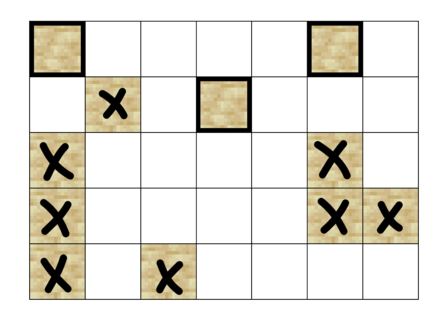
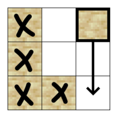
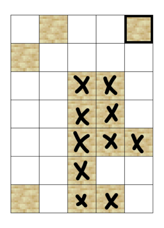

<h1 style='text-align: center;'> F2. Falling Sand (Hard Version)</h1>

<h5 style='text-align: center;'>time limit per test: 2 seconds</h5>
<h5 style='text-align: center;'>memory limit per test: 512 megabytes</h5>

This is the hard version of the problem. The difference between the versions is the constraints on $a_i$. You can make hacks only if all versions of the problem are solved.

Little Dormi has recently received a puzzle from his friend and needs your help to solve it. 

The puzzle consists of an upright board with $n$ rows and $m$ columns of cells, some empty and some filled with blocks of sand, and $m$ non-negative integers $a_1,a_2,\ldots,a_m$ ($0 \leq a_i \leq n$). In this version of the problem, $a_i$ will always be not greater than the number of blocks of sand in column $i$.

When a cell filled with a block of sand is disturbed, the block of sand will fall from its cell to the sand counter at the bottom of the column (each column has a sand counter). While a block of sand is falling, other blocks of sand that are adjacent at any point to the falling block of sand will also be disturbed and start to fall. Specifically, a block of sand disturbed at a cell $(i,j)$ will pass through all cells below and including the cell $(i,j)$ within the column, disturbing all adjacent cells along the way. Here, the cells adjacent to a cell $(i,j)$ are defined as $(i-1,j)$, $(i,j-1)$, $(i+1,j)$, and $(i,j+1)$ (if they are within the grid). 
## Note

 that the newly falling blocks can disturb other blocks.

In one operation you are able to disturb any piece of sand. The puzzle is solved when there are at least $a_i$ blocks of sand counted in the $i$-th sand counter for each column from $1$ to $m$.

You are now tasked with finding the minimum amount of operations in order to solve the puzzle. 
## Note

 that Little Dormi will never give you a puzzle that is impossible to solve.

##### Input

The first line consists of two space-separated positive integers $n$ and $m$ ($1 \leq n \cdot m \leq 400\,000$).

Each of the next $n$ lines contains $m$ characters, describing each row of the board. If a character on a line is '.', the corresponding cell is empty. If it is '#', the cell contains a block of sand.

The final line contains $m$ non-negative integers $a_1,a_2,\ldots,a_m$ ($0 \leq a_i \leq n$) — the minimum amount of blocks of sand that needs to fall below the board in each column. In this version of the problem, $a_i$ will always be not greater than the number of blocks of sand in column $i$.

##### Output

Print one non-negative integer, the minimum amount of operations needed to solve the puzzle.

## Examples

##### Input


```text
5 7
#....#.
.#.#...
#....#.
#....##
#.#....
4 1 1 1 0 3 1
```
##### Output


```text
3
```
##### Input


```text
3 3
#.#
#..
##.
3 1 1
```
##### Output


```text
1
```
##### Input


```text
7 5
.#..#
#....
..##.
..##.
..###
..#..
#.##.
0 0 2 4 2
```
##### Output


```text
1
```
## Note

For example $1$, by disturbing both blocks of sand on the first row from the top at the first and sixth columns from the left, and the block of sand on the second row from the top and the fourth column from the left, it is possible to have all the required amounts of sand fall in each column. It can be proved that this is not possible with fewer than $3$ operations, and as such the answer is $3$. Here is the puzzle from the first example.

   For example $2$, by disturbing the cell on the top row and rightmost column, one can cause all of the blocks of sand in the board to fall into the counters at the bottom. Thus, the answer is $1$. Here is the puzzle from the second example.

   For example $3$, by disturbing the cell on the top row and rightmost column, it is possible to have all the required amounts of sand fall in each column. It can be proved that this is not possible with fewer than $1$ operation, and as such the answer is $1$. Here is the puzzle from the third example.

   

#### Tags 

#3000 #NOT OK #dfs_and_similar #dp #graphs #greedy 

## Blogs
- [All Contest Problems](../Codeforces_LATOKEN_Round_1_(Div._1_+_Div._2).md)
- [Announcement (en)](../blogs/Announcement_(en).md)
- [Tutorial (en)](../blogs/Tutorial_(en).md)
