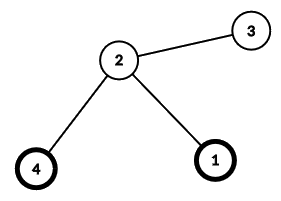
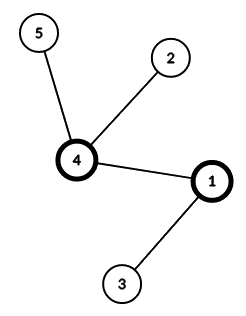

<h1 style='text-align: center;'> H. Lost Nodes</h1>

<h5 style='text-align: center;'>time limit per test: 4 seconds</h5>
<h5 style='text-align: center;'>memory limit per test: 256 megabytes</h5>

This is an interactive problem.

As he qualified for IOI this year, Little Ericyi was given a gift from all his friends: a tree of $n$ nodes!

On the flight to IOI Little Ericyi was very bored, so he decided to play a game with Little Yvonne with his new tree. First, Little Yvonne selects two (not necessarily different) nodes $a$ and $b$ on the tree (without telling Ericyi), and then gives him a hint $f$ (which is some node on the path from $a$ to $b$).

Then, Little Ericyi is able to ask the following question repeatedly:

* If I rooted the tree at node $r$ (Ericyi gets to choose $r$), what would be the [Lowest Common Ancestor](https://en.wikipedia.org/wiki/Lowest_common_ancestor) of $a$ and $b$?

Little Ericyi's goal is to find the nodes $a$ and $b$, and report them to Little Yvonne.

However, Little Yvonne thought this game was too easy, so before he gives the hint $f$ to Little Ericyi, he also wants him to first find the maximum number of queries required to determine $a$ and $b$ over all possibilities of $a$, $b$, and $f$ assuming Little Ericyi plays optimally. Little Ericyi defines an optimal strategy as one that makes the minimum number of queries. Of course, once Little Ericyi replies with the maximum number of queries, Little Yvonne will only let him use that many queries in the game.

The tree, $a$, $b$, and $f$ are all fixed before the start of the game and do not change as queries are made.

## Interaction

First read a line containing the integer $n$ ($1 \le n \le 10^5$), the number of nodes in the tree.

The next $n−1$ lines describe Little Ericyi's tree. These lines contain two integers $u$ and $v$ ($1 \le u,v \le n$) denoting an edge between $u$ and $v$ ($u \neq v$). It is guaranteed that these edges form a tree.

After that you should output $k$, the maximum number of queries needed to determine $a$ and $b$ over all possibilities of $a$, $b$, and $f$ assuming Little Ericyi plays optimally. You should output end of line and flush the output after printing $k$.

After that read a line containing the integer $f$ ($1 \le f \le n$) — the hint: a node on the path from $a$ to $b$, inclusive.

After that, you can start making queries. You will be limited to making at most $k$ queries, where $k$ is the number you printed.

Each query is made in the format "? r", where $r$ is an integer $1 \le r \le n$ denoting the root node you want for the query.

You will then receive an integer $x$ ($1 \le x \le n$), the Lowest Common Ancestor of $a$ and $b$ if the tree was rooted at $r$.

When your program has found the nodes $a$, $b$, report the answer in the following format: "! a b", where $a$ and $b$ are the two hidden nodes and terminate your program normally immediately after flushing the output stream. You may output $a$ and $b$ in any order.

After printing a query do not forget to output end of line and flush the output. Otherwise, you will get Idleness limit exceeded. To do this, use:

* fflush(stdout) or cout.flush() in C++;
* System.out.flush() in Java;
* flush(output) in Pascal;
* stdout.flush() in Python;
* see documentation for other languages.

If at any point you make an invalid output or make more than $k$ queries, the interaction will terminate and you will receive a Wrong Answer verdict. An invalid output is defined as either an invalid query or a value of $k$ less than $0$ or greater than $n$.

Hacks

To hack a solution, use the following format:

The first line contains the integer $n$ ($1 \le n \le 10^5$).

The next $n−1$ lines contain two integers $u$ and $v$ ($1 \le u,v \le n$) denoting an edge between $u$ and $v$ ($u \neq v$). These $n-1$ edges must form a tree.

The next line of input contains the nodes $a$ and $b$ ($1 \le a,b \le n$), separated by a space.

The final line of input contains the integer $f$ ($1 \le f \le n$). Node $f$ should be on the simple path from $a$ to $b$ (inclusive).

## Examples

##Input
```text
4
3 2
2 1
2 4

1

1

2

2
```
##Output
```text
3

? 1

? 2

? 3

! 4 1
```
##Input
```text

5
3 1
1 4
4 5
4 2

1

4

1

4
```
##Output
```text

3

? 4

? 1

? 5

! 1 4
```
## Note

Here is the the tree from the first sample interaction. Nodes $a$ and $b$ are highlighted.

  Notice that $a$ and $b$ can be output in any order.

Additionally, here are the answers to querying every single node $1,2,\ldots,n$ for your convenience:

* $1$: $1$
* $2$: $2$
* $3$: $2$
* $4$: $4$

__________________________________________

Here is the the tree from the second sample interaction. Again, nodes $a$ and $b$ are highlighted.

  Lastly, here are the answers to querying every single node $1,2,\ldots,n$ (in example $2$) for your convenience:

* $1$: $1$
* $2$: $4$
* $3$: $1$
* $4$: $4$
* $5$: $4$


#### Tags 

#3500 #NOT OK #constructive_algorithms #dp #graphs #interactive #sortings #trees 

## Blogs
- [All Contest Problems](../Codeforces_LATOKEN_Round_1_(Div._1_+_Div._2).md)
- [Announcement (en)](../blogs/Announcement_(en).md)
- [Tutorial (en)](../blogs/Tutorial_(en).md)
