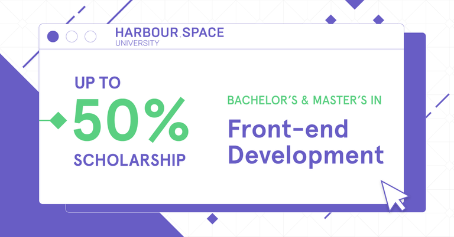

# Announcement

Hello Codeforces!

On [Friday, June 4, 2021 at 20:35UTC+6](https://codeforces.com/https://www.timeanddate.com/worldclock/fixedtime.html?day=4&month=6&year=2021&hour=17&min=35&sec=0&p1=166) [Educational Codeforces Round 110 (Rated for Div. 2)](https://codeforces.com/contest/1535 "Educational Codeforces Round 110 (Rated for Div. 2)") will start.

Series of Educational Rounds continue being held as [Harbour.Space University](https://codeforces.com/https://harbour.space/) initiative! You can read the details about the cooperation between [Harbour.Space University](https://codeforces.com/https://harbour.space/) and Codeforces in the [blog post](//codeforces.com/blog/entry/51208).

This round will be **rated for the participants with rating lower than 2100**. It will be held on extended ICPC rules. The penalty for each incorrect submission until the submission with a full solution is 10 minutes. After the end of the contest you will have 12 hours to hack any solution you want. You will have access to copy any solution and test it locally.

You will be given **6 or 7 problems** and **2 hours** to solve them.

The problems were invented and prepared by Roman [Roms](https://codeforces.com/profile/Roms "Master Roms") Glazov, Adilbek [adedalic](https://codeforces.com/profile/adedalic "International Master adedalic") Dalabaev, Vladimir [vovuh](https://codeforces.com/profile/vovuh "Master vovuh") Petrov, Ivan [BledDest](https://codeforces.com/profile/BledDest "International Grandmaster BledDest") Androsov, Maksim [Neon](https://codeforces.com/profile/Neon "Candidate Master Neon") Mescheryakov and me. Also huge thanks to Mike [MikeMirzayanov](https://codeforces.com/profile/MikeMirzayanov "Headquarters, MikeMirzayanov") Mirzayanov for great systems Polygon and Codeforces.

Good luck to all the participants!

Our friends at Harbour.Space also have a message for you:

*Hey, Codeforces!*

*Once again, it is time for another exciting **scholarship opportunity** from Harbour.Space!*

*If you love technology, enjoy creating, and looking for an exciting career, **Front-end Development** might be for you! This time we are looking for talented individuals to launch our **new programme** with.* 

*We are offering up to a **50% scholarship** for our Bachelor’s and Master’s degrees, opening the doors for an exciting career in technology for the most talented people in our network.* 

**Requirements:** 

 1. *Diploma and transcript of the highest attained education level*
2. *Professional fluency in English*
3. *Your CV*

**What you will learn:**

 * *Coding up to industry standards*
* *Accelerated learning*
* *Master new tech frequency*
* *Javascript frameworks, CSS preprocessors and methodologies, responsiveness, and also visual design*
* *And more*

*Make sure to **apply before June 30, 2021**, to be eligible for the scholarship and reduced application fee.*

**Some of the advantages of studying at Harbour.Space:**

 * *We change the way of learning*
* *We learn by doing*
* *We are your home*

*We are always happy to see Codeforces members join the Harbour.Space family. [Apply now](https://front-end-scholarship.harbour.space/?utm_source=codeforces&utm_medium=partner&utm_campaign=both_b2c_front-end-launch) to learn from the best in the field and kickstart your career!*

*Keep in touch and follow us on [LinkedIn](https://codeforces.com/https://www.linkedin.com/school/harbour-space/) for more scholarship opportunities. And follow us on [Instagram](https://codeforces.com/https://www.instagram.com/harbour.space/) to evidence student life, events, and success stories from students.*

*Good luck on your round, and see you next time!* 

*Harbour.Space University* 

Congratulations to the winners: 

| Rank | Competitor | Problems Solved | Penalty |
| --- | --- | --- | --- |
| 1 | [SSRS_](https://codeforces.com/profile/SSRS_ "Legendary Grandmaster SSRS_") | 6 | 118 |
| 2 | [Maksim1744](https://codeforces.com/profile/Maksim1744 "Legendary Grandmaster Maksim1744") | 6 | 137 |
| 3 | [Geothermal](https://codeforces.com/profile/Geothermal "International Grandmaster Geothermal") | 6 | 147 |
| 4 | [neal](https://codeforces.com/profile/neal "Legendary Grandmaster neal") | 6 | 154 |
| 5 | [Ormlis](https://codeforces.com/profile/Ormlis "International Grandmaster Ormlis") | 6 | 167 |

Congratulations to the best hackers: 

| Rank | Competitor | Hack Count |
| --- | --- | --- |
| 1 | [Kawaii](https://codeforces.com/profile/Kawaii "Specialist Kawaii") | **51****:-7** |
| 2 | [coder_ym_](https://codeforces.com/profile/coder_ym_ "Specialist coder_ym_") | **28****:-3** |
| 3 | [meyi](https://codeforces.com/profile/meyi "Expert meyi") | **27****:-4** |
| 4 | [DespicableMonkey](https://codeforces.com/profile/DespicableMonkey "Newbie DespicableMonkey") | **21** |
| 5 | [DevilAeron](https://codeforces.com/profile/DevilAeron "Specialist DevilAeron") | **20****:-5** |

 342 successful hacks and 911 unsuccessful hacks were made in total!And finally people who were the first to solve each problem: 

| Problem | Competitor | Penalty |
| --- | --- | --- |
| A | [Geothermal](https://codeforces.com/profile/Geothermal "International Grandmaster Geothermal") | 0:00 |
| B | [neal](https://codeforces.com/profile/neal "Legendary Grandmaster neal") | 0:02 |
| C | [Geothermal](https://codeforces.com/profile/Geothermal "International Grandmaster Geothermal") | 0:05 |
| D | [SSRS_](https://codeforces.com/profile/SSRS_ "Legendary Grandmaster SSRS_") | 0:12 |
| E | [_runtimeTerror_](https://codeforces.com/profile/_runtimeTerror_ "Master _runtimeTerror_") | 0:18 |
| F | [xay5421](https://codeforces.com/profile/xay5421 "International Grandmaster xay5421") | 1:01 |

**UPD:** [Editorial is out](Tutorial.md)

