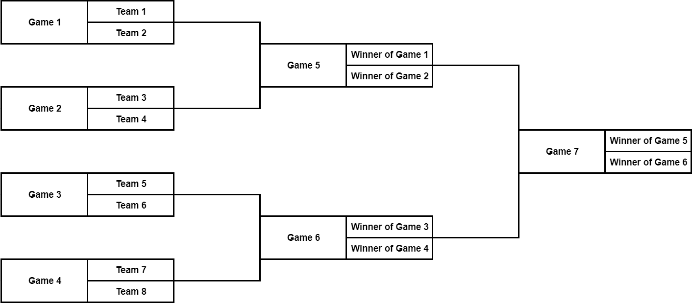

<h1 style='text-align: center;'> D. Playoff Tournament</h1>

<h5 style='text-align: center;'>time limit per test: 2 seconds</h5>
<h5 style='text-align: center;'>memory limit per test: 256 megabytes</h5>

$2^k$ teams participate in a playoff tournament. The tournament consists of $2^k - 1$ games. They are held as follows: first of all, the teams are split into pairs: team $1$ plays against team $2$, team $3$ plays against team $4$ (exactly in this order), and so on (so, $2^{k-1}$ games are played in that phase). When a team loses a game, it is eliminated, and each game results in elimination of one team (there are no ties). After that, only $2^{k-1}$ teams remain. If only one team remains, it is declared the champion; otherwise, $2^{k-2}$ games are played: in the first one of them, the winner of the game "$1$ vs $2$" plays against the winner of the game "$3$ vs $4$", then the winner of the game "$5$ vs $6$" plays against the winner of the game "$7$ vs $8$", and so on. This process repeats until only one team remains.

For example, this picture describes the chronological order of games with $k = 3$:

  Let the string $s$ consisting of $2^k - 1$ characters describe the results of the games in chronological order as follows:

* if $s_i$ is 0, then the team with lower index wins the $i$-th game;
* if $s_i$ is 1, then the team with greater index wins the $i$-th game;
* if $s_i$ is ?, then the result of the $i$-th game is unknown (any team could win this game).

Let $f(s)$ be the number of possible winners of the tournament described by the string $s$. A team $i$ is a possible winner of the tournament if it is possible to replace every ? with either 1 or 0 in such a way that team $i$ is the champion.

You are given the initial state of the string $s$. You have to process $q$ queries of the following form: 

* $p$ $c$ — replace $s_p$ with character $c$, and print $f(s)$ as the result of the query.
### Input

The first line contains one integer $k$ ($1 \le k \le 18$).

The second line contains a string consisting of $2^k - 1$ characters — the initial state of the string $s$. Each character is either ?, 0, or 1.

The third line contains one integer $q$ ($1 \le q \le 2 \cdot 10^5$) — the number of queries.

Then $q$ lines follow, the $i$-th line contains an integer $p$ and a character $c$ ($1 \le p \le 2^k - 1$; $c$ is either ?, 0, or 1), describing the $i$-th query.

### Output

For each query, print one integer — $f(s)$.

## Example

### Input


```text
3
0110?11
6
5 1
6 ?
7 ?
1 ?
5 ?
1 1
```
### Output


```text
1
2
3
3
5
4
```


#### Tags 

#1800 #NOT OK #data_structures #dfs_and_similar #dp #implementation #trees 

## Blogs
- [All Contest Problems](../Educational_Codeforces_Round_110_(Rated_for_Div._2).md)
- [Announcement](../blogs/Announcement.md)
- [Tutorial](../blogs/Tutorial.md)
