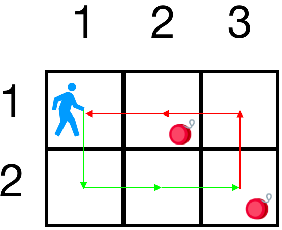

<h1 style='text-align: center;'> B. Bad Boy</h1>

<h5 style='text-align: center;'>time limit per test: 1 second</h5>
<h5 style='text-align: center;'>memory limit per test: 256 megabytes</h5>

Riley is a very bad boy, but at the same time, he is a yo-yo master. So, he decided to use his yo-yo skills to annoy his friend Anton.

Anton's room can be represented as a grid with $n$ rows and $m$ columns. Let $(i, j)$ denote the cell in row $i$ and column $j$. Anton is currently standing at position $(i, j)$ in his room. To annoy Anton, Riley decided to throw exactly two yo-yos in cells of the room (they can be in the same cell).

Because Anton doesn't like yo-yos thrown on the floor, he has to pick up both of them and return back to the initial position. The distance travelled by Anton is the shortest path that goes through the positions of both yo-yos and returns back to $(i, j)$ by travelling only to adjacent by side cells. That is, if he is in cell $(x, y)$ then he can travel to the cells $(x + 1, y)$, $(x - 1, y)$, $(x, y + 1)$ and $(x, y - 1)$ in one step (if a cell with those coordinates exists).

Riley is wondering where he should throw these two yo-yos so that the distance travelled by Anton is maximized. But because he is very busy, he asked you to tell him.

### Input

The first line contains a single integer $t$ ($1 \leq t \leq 10^4$) — the number of test cases. Then $t$ test cases follow.

The only line of each test case contains four integers $n$, $m$, $i$, $j$ ($1 \leq n, m \leq 10^9$, $1\le i\le n$, $1\le j\le m$) — the dimensions of the room, and the cell at which Anton is currently standing.

### Output

For each test case, print four integers $x_1$, $y_1$, $x_2$, $y_2$ ($1 \leq x_1, x_2 \leq n$, $1\le y_1, y_2\le m$) — the coordinates of where the two yo-yos should be thrown. They will be thrown at coordinates $(x_1,y_1)$ and $(x_2,y_2)$.

If there are multiple answers, you may print any.

## Example

### Input


```text
7
2 3 1 1
4 4 1 2
3 5 2 2
5 1 2 1
3 1 3 1
1 1 1 1
1000000000 1000000000 1000000000 50
```
### Output


```text
1 2 2 3
4 1 4 4
3 1 1 5
5 1 1 1
1 1 2 1
1 1 1 1
50 1 1 1000000000
```
## Note

Here is a visualization of the first test case. 

  

#### Tags 

#900 #NOT OK #constructive_algorithms #greedy #math 

## Blogs
- [All Contest Problems](../Codeforces_Round_726_(Div._2).md)
- [Announcement (en)](../blogs/Announcement_(en).md)
- [Tutorial (en)](../blogs/Tutorial_(en).md)
