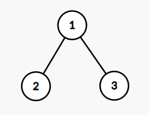
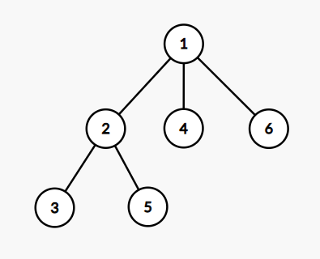
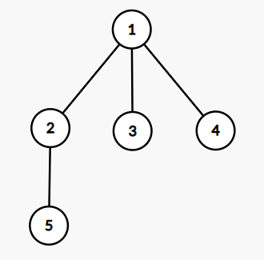

<h1 style='text-align: center;'> B. Tree Array</h1>

<h5 style='text-align: center;'>time limit per test: 2 seconds</h5>
<h5 style='text-align: center;'>memory limit per test: 256 megabytes</h5>

You are given a tree consisting of $n$ nodes. You generate an array from the tree by marking nodes one by one.

Initially, when no nodes are marked, a node is equiprobably chosen and marked from the entire tree. 

After that, until all nodes are marked, a node is equiprobably chosen and marked from the set of unmarked nodes with at least one edge to a marked node. 

It can be shown that the process marks all nodes in the tree. 

The final array $a$ is the list of the nodes' labels in order of the time each node was marked.

Find the expected number of inversions in the array that is generated by the tree and the aforementioned process.

The number of inversions in an array $a$ is the number of pairs of indices $(i, j)$ such that $i < j$ and $a_i > a_j$. For example, the array $[4, 1, 3, 2]$ contains $4$ inversions: $(1, 2)$, $(1, 3)$, $(1, 4)$, $(3, 4)$.

##### Input

The first line contains a single integer $n$ ($2 \le n \le 200$) — the number of nodes in the tree.

The next $n - 1$ lines each contains two integers $x$ and $y$ ($1 \le x, y \le n$; $x \neq y$), denoting an edge between node $x$ and $y$.

It's guaranteed that the given edges form a tree.

##### Output

##### Output

 the expected number of inversions in the generated array modulo $10^9+7$.

Formally, let $M = 10^9+7$. It can be shown that the answer can be expressed as an irreducible fraction $\frac{p}{q}$, where $p$ and $q$ are integers and $q \not \equiv 0 \pmod{M}$. 
##### Output

 the integer equal to $p \cdot q^{-1} \bmod M$. In other words, output such an integer $x$ that $0 \le x < M$ and $x \cdot q \equiv p \pmod{M}$.

## Examples

##### Input


```text
3
1 2
1 3
```
##### Output


```text
166666669
```
##### Input


```text
6
2 1
2 3
6 1
1 4
2 5
```
##### Output


```text
500000009
```
##### Input


```text
5
1 2
1 3
1 4
2 5
```
##### Output


```text
500000007
```
## Note

This is the tree from the first sample:

  For the first sample, the arrays are almost fixed. If node $2$ is chosen initially, then the only possible array is $[2, 1, 3]$ ($1$ inversion). If node $3$ is chosen initially, then the only possible array is $[3, 1, 2]$ ($2$ inversions). If node $1$ is chosen initially, the arrays $[1, 2, 3]$ ($0$ inversions) and $[1, 3, 2]$ ($1$ inversion) are the only possibilities and equiprobable. In total, the expected number of inversions is $\frac{1}{3}\cdot 1 + \frac{1}{3} \cdot 2 + \frac{1}{3} \cdot (\frac{1}{2} \cdot 0 + \frac{1}{2} \cdot 1) = \frac{7}{6}$. 

$166666669 \cdot 6 = 7 \pmod {10^9 + 7}$, so the answer is $166666669$.

This is the tree from the second sample: 

  This is the tree from the third sample: 

  

#### Tags 

#2300 #NOT OK #brute_force #combinatorics #dp #graphs #math #probabilities #trees 

## Blogs
- [All Contest Problems](../Codeforces_Round_728_(Div._1).md)
- [Codeforces Round #728 (en)](../blogs/Codeforces_Round_728_(en).md)
- [Tutorial (en)](../blogs/Tutorial_(en).md)
