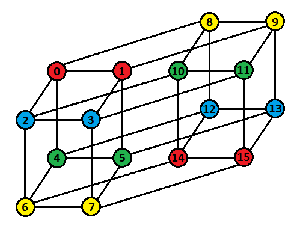

# Tutorial_(en)


#### [A: Exciting Bets](../problems/A._Exciting_Bets.md)

 **Hint 1**GCD(a,b)=GCD(a−b,b) if a>b

 **Hint 2**a−b does not change by applying any operation. However, b can be changed arbitrarily.

 **Tutorial**If a=b, the fans can get an infinite amount of excitement, and we can achieve this by applying the first operation infinite times.

Otherwise, the maximum excitement the fans can get is g=|a−b| and the minimum number of moves required to achieve it is min(amodg,g−amodg).

 **Proof**Without loss of generality, assume a>b otherwise we can swap a and b. We know that GCD(a,b)=GCD(a−b,b). Notice that no matter how many times we apply any operation, the value of a−b does not change. We can arbitrarily change the value of b to a multiple of a−b by applying the operations. In this way, we can achieve a GCD equal to a−b. Now, since GCD(x,y)≤min(x,y) for any positive x and y, GCD(a−b,b) can never exceed a−b. So, we cannot achieve a higher GCD by any means.

To achieve the required GCD, we need to make b a multiple of g=a−b using as few operations as possible. There are two ways to do so − decrease b to the largest multiple of g less than or equal to b or increase b to the smallest multiple of g greater than b. The number of operations required to do so are bmodg and g−bmodg respectively. We will obviously choose the minimum of the two. Also notice that amodg=bmodg since a=b+g. So, it doesn't matter if we use either a or b to determine the minimum number of operations.

 **Time Complexity**O(1) per test case.

 **Solution**
```cpp
#include <bits/stdc++.h>
using namespace std;

int main()
{
    ios_base::sync_with_stdio(false);
    cin.tie(NULL);
    int t;
    cin >> t;
    while(t--)
    {
        long long a,b;
        cin >> a >> b;
        if(a==b)
            cout << 0 << " " << 0 << 'n';
        else
        {
            long long g = abs(a-b);
            long long m = min(a%g,g-a%g);
            cout << g << " " << m << 'n';
        }
    }
}
```
#### [B: Customising the Track](../problems/B._Customising_the_Track.md)

 **Hint**In the optimal arrangement, the number of cars will be distributed as evenly as possible.

 **Tutorial**In the optimal arrangement, the number of traffic cars will be distributed as evenly as possible, *i.e.*, |ai−aj|≤1 for each valid (i,j).

 **Proof (Warning: Too much Math inside)**Let's sort the array in non-decreasing order. Let a1=p, an=q, p≤q−2, x elements of the array be equal to p, y elements of the array be equal to q, n−y∑i=x+1n−y∑j=i+1aj−ai=r and n−y∑i=x+1ai=s.

The inconvenience of the track will be equal to S1=r+x⋅[s−(n−x−y)⋅p]+y⋅[(n−x−y)⋅q−s]+[xy⋅(q−p)]

Suppose we increase a1 by 1 and decrease an by 1. Then, the number of occurrences of p and q will reduce by 1, two new elements p+1 and q−1 will be formed, and r and s will remain unchanged. In such a case, the new inconvenience of the track will be S2=r+(x−1)⋅[s−(n−x−y)⋅p] +(y−1)⋅[(n−x−y)⋅q−s] +[(x−1)⋅(y−1)⋅(q−p)] +[s−(n−x−y)⋅(p+1)] +[(n−x−y)⋅(q−1)−s] +[(y−1)⋅(q−p−1)] +[(x−1)⋅(q−p−1)] +(x−1)+(y−1)+(q−p−2)

Change in inconvenience, Δ=S1−S2=[s−(n−x−y)⋅p]+[(n−x−y)⋅q−s]+[(x+y−1)⋅(q−p)] −[s−(n−x−y)⋅(p+1)] −[(n−x−y)⋅(q−1)−s] −[(y−1)⋅(q−p−1)] −[(x−1)⋅(q−p−1)] −(x−1)−(y−1)−(q−p−2) =2⋅(n−x−y)+(x+y−1)⋅(q−p)−(x+y−2)⋅(q−p−1)−(x−1)−(y−1)−(q−p−2) =2⋅(n−x−y)+(q−p)+(x+y−1)−1−(x−1)−(y−1)−(q−p−2) =2⋅(n−x−y+1)>0 as x+y≤n.

So, it follows that if p≤q−2. it is always beneficial to move a traffic car from the sub-track with the highest number of traffic cars to the sub-track with the lowest number of traffic cars. If p=q−1, applying this operation won't change the inconvenience as this will only swap the last and the first element of the array leaving everything else unchanged. If p=q, all the elements of the array are already equal, meaning that we have 0 inconvenience which is the minimum possible. So, there is no point in applying any operation.

Now that we have constructed the optimal arrangement of traffic cars, let's find out the value of minimum inconvenience of this optimal arrangement. Finding it naively in O(n2) will time out. 

Notice that in the optimal arrangement we will have some (say x) elements equal to some number p+1 and the other (n−x) elements equal to p. Let the sum of all elements in a be sum. Then, x=summodn and p=⌊sumn⌋. For each pair (p,p+1), we will get an absolute difference of 1 and for all other pairs, we will get an absolute difference of 0. Number of such pairs with difference 1 is equal to x⋅(n−x). So, the minimum inconvenience we can achieve is equal to x⋅(n−x). That's all we need to find out!

 **Time Complexity**O(n)

 **Solution**
```cpp
#include <bits/stdc++.h>
using namespace std;

int main()
{
    ios_base::sync_with_stdio(false);
    cin.tie(NULL);
    int t;
    cin >> t;
    while(t--)
    {
        int n;
        cin >> n;
        int a[n];
        long long s=0;
        for(int i=0;i<n;i++)
        {
            cin >> a[i];
            s+=a[i];
        }
        long long k = s%n;
        long long ans = k*(n-k);
        cout << ans << 'n';
    }
}
```
#### [C: Need for Pink Slips](../problems/C._Need_for_Pink_Slips.md)

 **Hint 1**Did you notice that v≥0.1?

 **Hint 2**The probability of drawing a pink slip can never decrease.

 **Hint 3**What would be the complexity of a bruteforce solution?

 **Hint 4**Make sure to account for precision errors while comparing floating point numbers.

 **Tutorial**Bruteforce over all the possible drawing sequences until we are sure to get a pink slip, *i.e.*, until the probability of drawing a pink slip becomes 1.

 **Why this works?**Whenever we draw a reward other than a pink slip,

 * If a≤v, one of the rewards becomes invalid, reducing x by 1 and this can happen at most 2 times during the whole process.
* Else, the probability of drawing a pink slip increases by v2.

Notice that the probability of drawing a pink slip can never decrease.

Now, since v≥0.1, each time we make a draw of the second type, the probability of drawing a pink slip increases by at least 0.05. It will reach 1 after just 20 such draws. So, there will be at most d=22 draws before we are sure to get a pink slip.

Simulating the whole process will take O(2d) time which is sufficient in our case.

What's left is just implementing the bruteforce solution taking care of precision errors while dealing with floating point numbers, especially while comparing a with v as this can completely change things up, keeping an item valid when it should become invalid. It follows that an error approximation of `1e-6` or smaller is sufficient while comparing any two values because all the numbers in the input have at most 4 decimal places. Another alternative is to convert floating point numbers given in the input to integers using a scaling factor of 106.

 **Time Complexity**O(22v)

 **Solution**
```cpp
#include <bits/stdc++.h>
using namespace std;

const long double eps = 1e-9;
const long double scale = 1e+6;

long double expectedRaces(int c,int m,int p,int v)
{
    long double ans = p/scale;
    if(c>0)
    {
        if(c>v)
        {
            if(m>0)
                ans += (c/scale)*(1+expectedRaces(c-v,m+v/2,p+v/2,v));
            else
                ans += (c/scale)*(1+expectedRaces(c-v,0,p+v,v));
        }
        else
        {
            if(m>0)
                ans += (c/scale)*(1+expectedRaces(0,m+c/2,p+c/2,v));
            else
                ans += (c/scale)*(1+expectedRaces(0,0,p+c,v));
        }
    }
    if(m>0)
    {
        if(m>v)
        {
            if(c>0)
                ans += (m/scale)*(1+expectedRaces(c+v/2,m-v,p+v/2,v));
            else
                ans += (m/scale)*(1+expectedRaces(0,m-v,p+v,v));
        }
        else
        {
            if(c>0)
                ans += (m/scale)*(1+expectedRaces(c+m/2,0,p+m/2,v));
            else
                ans += (m/scale)*(1+expectedRaces(0,0,p+m,v));
        }
    }
    return ans;
}

int main()
{
    int t;
    cin >> t;
    while(t--)
    {
        long double cd,md,pd,vd;
        cin >> cd >> md >> pd >> vd;
        int c = round(cd*scale);
        int m = round(md*scale);
        int p = round(pd*scale);
        int v = round(vd*scale);
        long double ans = expectedRaces(c,m,p,v);
        cout << setprecision(12) << fixed << ans << 'n';
    }
}
```
#### [D1: RPD and Rap Sheet (Easy Version)](../problems/D1._RPD_and_Rap_Sheet_(Easy_Version).md)

 **Hint 1**In this version, x⊕z=y or in other words, z=x⊕y where ⊕ is the Bitwise XOR operator.

 **Hint 2**The number of queries allowed is equal to the number of possible initial passwords.

 **Hint 3**The grader provides us no information other than whether our guess was correct or not. So, we need to find a way to ask queries such that the x-th query will give the correct answer if the original password was (x−1).

 **Hint 4**Try to ask queries in such a way that the i-th query reverses the effect of the (i−1)-th query and simultaneously checks if the initial password was (i−1).

 **Hint 5**Try to use the self-inverse property of Bitwise XOR, *i.e.*, a⊕a=0.

 **Tutorial**In this version of the problem, k=2. So, the k-itwise XOR is the same as Bitwise XOR.

In case of incorrect guess, the system changes password to z such that x⊕z=y. Taking XOR with x on both sides, x⊕x⊕z=x⊕y⟹z=x⊕y because we know that x⊕x=0.

Since the original password is less than n and we have n queries, we need to find a way to make queries such that if the original password was (x−1), then the x-th query will be equal to the current password. There are many different approaches. I will describe two of them.

 **Method 1**Let qi denote the i-th query. Then,

 * q1=0.
* qi=(i−1)⊕(i−2) for 2≤i≤n.

Let's see why this works.

Claim — If the original password was x, after i queries, the current password will be x⊕(i−1).

 **Proof**Let's prove this by induction.

Base Condition — After 1-st query, the password becomes x⊕0=x⊕(1−1).

Induction Hypothesis — Let the password after i-th query be x⊕(i−1).

Inductive step — The (i+1)-th query will be i⊕(i−1). If this is not equal to the current password, the password will change to (x⊕(i−1))⊕(i⊕(i−1)) =x⊕(i−1)⊕i⊕(i−1) =x⊕i =x⊕((i+1)−1).

Hence, proved by induction.

Now notice that after x queries, the password will become x⊕(x−1). And our (x+1)-th query will be x⊕(x−1) which is the same as the current password. So, the problem will be solved after (x+1) queries. Since 0≤x<n, the problem will be solved in at most n queries.

 **Method 2 (Idea by KAN)**Again, let qi denote the i-th query. Then,

qi=(i−1)⊕q1⊕q2⊕…⊕qi−2⊕qi−1

Let's see why this works.

Claim — If the original password was x, after i queries, the current password will be x⊕q1⊕q2⊕…⊕qi−1⊕qi.

 **Proof**Let's prove this by induction.

Base Condition — The first query is 0. After 1-st query, the password becomes x⊕0=x⊕q1.

Induction Hypothesis — Let the password after i-th query be x⊕q1⊕q2⊕…⊕qi−1⊕qi.

Inductive step — The (i+1)-th query will be qi+1. So, the password after (i+1)-th query will be (x⊕q1⊕q2⊕…⊕qi−1⊕qi)⊕qi+1 =x⊕q1⊕q2⊕…⊕qi−1⊕qi⊕qi+1.

Hence, proved by induction. 

Now notice that after x queries, the password will become x⊕q1⊕q2⊕…⊕qx−1⊕qx. And our (x+1)-th query will be x⊕q1⊕q2⊕…⊕qx−1⊕qx which is the same as the current password. So, the problem will be solved after (x+1) queries. Since 0≤x<n, the problem will be solved in at most n queries.

But we are not done yet. We can't afford to calculate the value of each query naively in O(n) because this will time out. To handle this, we need to maintain a prefix XOR whose value will be p=q1⊕q2⊕…⊕qi−1⊕qi after i queries. For the (i+1)-th query, find qi+1=p⊕i and update p=p⊕qi+1.

 **Time Complexity**O(n) or O(n⋅log2n) depending upon the implementation.

 **Solutions****Solution 1**
```cpp
#include <bits/stdc++.h>
using namespace std;

int main()
{
    int t=1;
    cin >> t;
    while(t--)
    {
        int n,k;
        cin >> n >> k;
        for(int i=0;i<n;i++)
        {
            if(i==0)
                cout << 0 << endl;
            else
                cout << (i^(i-1)) << endl;
            int v;
            cin >> v;
            if(v==1)
                break;
        }
    }
    return 0;
}
```
 **Solution 2**
```cpp
#include <bits/stdc++.h>
using namespace std;

int main()
{
    int t=1;
    cin >> t;
    while(t--)
    {
        int n,k;
        cin >> n >> k;
        int p=0;
        for(int i=0;i<n;i++)
        {
            int q=p^i;
            cout << q << endl;
            p=p^q;
            int v;
            cin >> v;
            if(v==1)
                break;
        }
    }
    return 0;
}
```
#### [D2: RPD and Rap Sheet (Hard Version)](../problems/D2._RPD_and_Rap_Sheet_(Hard_Version).md)

 **Hint 1**The generalised k-itwise XOR does not satisfy the Self-Inverse property. So, the solution for the Easy Version won't work here.

 **Hint 2**Any property which is satisfied by k-its will also be satisfied by base k numbers since a base k number is nothing but a concatenation of k-its. So, try to prove properties for k-its as they are easier to work with.

 **Hint 3**Let xj denote the j-th k-it of x. Then, xj⊕kzj=yj ∀ valid j. Simplifying this,  
xj⊕kzj=yj ⟹ (xj+zj)modk=yj ⟹ zj=(yj−xj)modk ⟹ zj=(yj⊖kxj) where a⊖kb operation is defined as a⊖kb=(a−b)modk.

 **Hint 4**See Hints 2, 3 and 4 of the Easy Version.

 **Hint 5**Try to generalise the solutions for easy version by exploring properties of ⊕k and ⊖k operators.

 **Tutorial**Note — It is strongly recommended to read the proofs also to completely understand why the solutions work.

The solutions described for the easy version won't work here because the general k-itwise operation does not satisfy self-inverse property, *i.e.*, a⊕ka≠0.

In this whole solution, we will work in base k only and we will convert the numbers to decimal only for I/O purpose. Notice that any property which is satisfied by k-its will also be satisfied by base k numbers since a base k number is nothing but a concatenation of k-its.

When we make an incorrect guess, the system changes the password to z such that x⊕kz=y. Let's denote the j-th k-it of x by xj. Expanding this according to the definition of k-itwise XOR, for all individual k-its (xj+zj)modk=yj ⟹zj=(yj−xj)modk. So, let's define another k-itwise operation a⊖kb =(a−b)modk. Then, z=y⊖kx. Now, let's extend the solutions of the Easy Version for this version.

 **Method 1**Before moving to the solution, let's see some properties of the ⊖k operation over k-its.

Property 1 — (a⊖kb)⊖k(a⊖kc)=c⊖kb

 **Proof**(a⊖kb)⊖k(a⊖kc) =((a−b)modk−(a−c)modk)modk =(a−b−a+c)modk =(c−b)modk =c⊖kb

Property 2 — (b⊖ka)⊖k(c⊖ka)=b⊖kc

 **Proof**(b⊖ka)⊖k(c⊖ka) =((b−a)modk−(c−a)modk)modk =(b−a−c+a)modk =(b−c)modk =b⊖kc

Solution -

Let qi denote the i-th query. Then,

 * q1=0,
* qi=(i−2)⊖k(i−1) if i is even and
* qi=(i−1)⊖k(i−2) if i is odd.

Let's see why this works.

Claim — If the original password was x, after i queries, the password becomes

 * x⊖k(i−1) if i is even and
* (i−1)⊖kx if i is odd.

 **Proof**Let's prove this by induction.

Base Case — q1=0. So, after 1-st query, the password becomes 0⊖kx=(1−1)⊖kx.

**Case 1 — i is even**

Induction hypothesis — Let the current password after i queries be x⊖k(i−1).

Inductive step — (i+1) is odd. So, the (i+1)-th query is i⊖k(i−1). The new password will be (i⊖k(i−1))⊖k(x⊖k(i−1)) =i⊖kx by Property 2.

**Case 2 — i is odd**

Induction hypothesis — Let the current password after i queries be (i−1)⊖kx.

Inductive step — (i+1) is even. So, the (i+1)-th query is (i−1)⊖ki. The new password will be ((i−1)⊖ki)⊖k((i−1)⊖kx) =x⊖ki by Property 1.

Hence, proved by induction.

Now notice that after x queries, the password will become x⊖k(x−1) if x is even or (x−1)⊖kx if x is odd which will be equal to the (x+1)-th query. Hence, the problem will be solved after exactly (x+1) queries. Since 0≤x<n, the problem will be solved after at most n queries.

 **Method 2**Again, let's denote the i-th query by qi.

Then, qi=qi−1⊖k[qi−2⊖k[qi−3⊖k…⊖k[q2⊖k[q1⊖k(i−1)]]…]]

Let's see why this works.

Claim — If the original password was x, after i queries, the password will be qi⊖k[qi−1⊖k[qi−2⊖k…⊖k[q2⊖k[q1⊖kx]]…]]

 **Proof**Let's prove this by induction.

Base Case — After the 1-st query which is 0, the password will be 0⊖kx=q1⊖kx.

Induction hypothesis — Let the password after i queries be qi⊖k[qi−1⊖k[qi−2⊖k…⊖k[q2⊖k[q1⊖kx]]…]]

Inductive Step — The (i+1)-th query is qi+1. After (i+1) queries, the password will becomes qi+1⊖k[qi⊖k[qi−1⊖k[qi−2⊖k…⊖k[q2⊖k[q1⊖kx]]…]]]

Hence, proved by induction.

Now notice that after x queries, the password will become qx⊖k[qx−1⊖k[qx−2⊖k…⊖k[q2⊖k[q1⊖kx]]…]] which will be equal to the (x+1)-th query. Hence, the problem will be solved after exactly (x+1) queries. Since 0≤x<n, the problem will be solved after at most n queries.

But we are not done yet. This solution is O(n2) which will time out. The solution for this isn't as simple as what we did for the Easy version because the ⊖k operation is neither associative nor commutative. So, it's time to explore some more properties of these operations.

Property 3 — a⊖k(b⊖kc)=(a⊖kb)⊕kc

 **Proof**a⊖k(b⊖kc) =(a−(b−c)modk)modk =(a−b+c)modk =((a−b)modk+c)modk =(a⊖kb)⊕kc

Property 4 — a⊖k(b⊕kc)=(a⊖kb)⊖kc

 **Proof**a⊖k(b⊕kc) =(a−(b+c)modk)modk =(a−b−c)modk =((a−b)modk−c)modk =(a⊖kb)⊖kc

Now, let's try to simplify our queries.

 * q1=0
* q2=q1⊖k1
* q3=q2⊖k[q1⊖k2]=[q2⊖kq1]⊕k2 (by Property 3)
* q4=q3⊖k[q2⊖k[q1⊖k3]]=q3⊖k[[q2⊖kq1]⊕k3]=[q3⊖k[q2⊖kq1]]⊖k3 (by Property 4)
* …

See the pattern?

You can generalize the i-th query as -

 * qi=qi−1⊖k[qi−2⊖k[qi−3⊖k…⊖k[q2⊖kq1]…]]⊕k(i−1) if i is odd
* qi=qi−1⊖k[qi−2⊖k[qi−3⊖k…⊖k[q2⊖kq1]…]]⊖k(i−1) if i is even

So, we will maintain a prefix Negative XOR whose value after i queries will be p=qi⊖k[qi−1⊖k[qi−2⊖k…⊖k[q2⊖kq1]…]]

Then, 

 * qi+1=p⊖ki if i is odd
* qi+1=p⊕ki if i is even

Then update p=qi+1⊖kp

 **Notes*** Both the operations ⊖k and ⊕k can be implemented naively by converting the decimal numbers to base k, finding the k-itwise XOR of the base k numbers and finally converting it back to decimal. The time complexity for each of these operations will be O(logkn).
* At any stage, the maximum number that we could be dealing with will be non-negative and will not exceed n×k as the k-itwise operations do not add extra k-its. This fits well within the limits of y which is 2⋅107.
* The total time complexity of the solution will be O(nlogkn).
 **Solutions****Solution 1**
```cpp
#include <bits/stdc++.h>
using namespace std;

int knxor(int x,int y,int k)
{
    int z=0;
    int p=1;
    while(x>0 || y>0)
    {
        int a=x%k;
        x=x/k;
        int b=y%k;
        y=y/k;
        int c=(a-b+k)%k;
        z=z+p*c;
        p=p*k;
    }
    return z;
}

int main()
{
    int t=1;
    cin >> t;
    while(t--)
    {
        int n,k;
        cin >> n >> k;
        for(int i=0;i<n;i++)
        {
            if(i==0)
                cout << 0 << endl;
            else if(i%2==0)
                cout << knxor(i,i-1,k) << endl;
            else
                cout << knxor(i-1,i,k) << endl;
            int v;
            cin >> v;
            if(v==1)
                break;
        }
    }
    return 0;
}
```
 **Solution 2**
```cpp
#include <bits/stdc++.h>
using namespace std;

int knxor(int x,int y,int k)
{
    int z=0;
    int p=1;
    while(x>0 || y>0)
    {
        int a=x%k;
        x=x/k;
        int b=y%k;
        y=y/k;
        int c=(a-b+k)%k;
        z=z+p*c;
        p=p*k;
    }
    return z;
}

int kxor(int x,int y,int k)
{
    int z=0;
    int p=1;
    while(x>0 || y>0)
    {
        int a=x%k;
        x=x/k;
        int b=y%k;
        y=y/k;
        int c=(a+b)%k;
        z=z+p*c;
        p=p*k;
    }
    return z;
}

int main()
{
    int t=1;
    cin >> t;
    while(t--)
    {
        int n,k;
        cin >> n >> k;
        int p=0;
        for(int i=0;i<n;i++)
        {
            if(i==0)
                cout << 0 << endl;
            else if(i%2==0)
            {
                int q = kxor(p,i,k);
                cout << q << endl;
                p=knxor(q,p,k);
            }
            else
            {
                int q = knxor(p,i,k);
                cout << q << endl;
                p=knxor(q,p,k);
            }
            int v;
            cin >> v;
            if(v==1)
                break;
        }
    }
    return 0;
}
```
 **About the Adaptive Grader**This part may be interesting for hackers and those who would like to understand what goes in the background checkers and interactors which determine the correctness of their solutions.

You must have noticed a large number of submissions failing on Test 1 itself. If you check the checker logs of those solutions, you will find that they fail on many different test cases although the test itself has 1 or 2 test cases. This is because the grader is also adaptive apart from the Rap Sheet System being adaptive. The initial password is not fixed and the grader checks if the solution will give correct answer or not for all possible initial passwords in just a single run! Here is how this is implemented.

The grader maintains a set which initially contains all possible initial passwords. Whenever you ask a query, the grader finds out which initial password will give correct answer for this query. This is found using the generalised expression of queries derived in the Method 2 solution. Take some time to convince yourself that this initial password will be unique. It then removes this initial password from the set if it still exists. After that, if the set is empty, the grader returns 1 (meaning that there is no other password for which the solution can give Wrong Answer), otherwise 0 (obviously after checking the constraints on y). In this way, only a solution which gives correct answers for all possible initial passwords for a particular n and k defined in the input will manage to pass.

Sometimes, checkers and adaptive interactors are more difficult to write than the solution itself! This was one such case.

#### [E: The Final Pursuit](../problems/E._The_Final_Pursuit.md)

 **Hint 1**In a simple n-Dimensional Hypercube, two vertices are connected if and only if they differ by exactly 1 bit in their binary representation.

 **Hint 2**The n-Dimensional Hypercubes are highly symmetric and all vertices are equivalent.

 **Hint 3**If we select a particular vertex, then all directions in which the edges connected to it goes are also equivalent.

 **Hint 4**For any two vertices a and b separated at a distance of exactly 2, there are exactly 2 vertices connected to both a and b.

 **Hint 5**Any permuted n-Dimensional Hypercube is isomorphic to the simple n-Dimensional Hypercube. So, its structure is same as the simple n-Dimensional Hypercube.

 **Hint 6**You can find the permutation greedily

 **Tutorial: Part 1 - Finding the Permutation**Before moving to the solution, notice a very important property of simple n-Dimensional Hypercubes — Two vertices a and b are connected if and only if a and b differ by exactly one bit in their binary representations.

The permutation can be found using the following greedy algorithm — First, assign any arbitrary vertex as p0. This is obvious since all vertices are equivalent. Then, in the simple n-Dimensional Hypercube, all powers of 2 must be connected to the vertex 0. Moreover, these vertices are added only when we are adding another dimension to the cube. Since all directions are also equivalent, it does not matter in which direction we add a new dimension. So, we can assign all the n vertices connected to p0 in the permuted n-Dimensional Hypercube as p1, p2, p4, p8, …, p2n−1 in any arbitrary order. Now, we will find pu for the remaining vertices in increasing order of u.

In order to find pu, first find a set S of vertices v such that v<u and v is connected to u in the simple n-Dimensional Hypercube. Then find any vertex w connected to all the vertices pv such that v∈S in the permuted n-Dimensional Hypercube and assign pu=w. I claim that we can never make a wrong choice because we will never have a choice! There will only be one such vertex w for any u. Let's prove it.

 **Proof**Consider two vertices v1 and v2 in the set S. These vertices will differ by exactly 2 bits in their binary representation. Let the bits in which they differ be bx and by. Then, they will have the form v1=…bx…by… and v2=…b′x…b′y… where … represent the same bits. Now, only two vertices u1=…bx…b′y… and u2=…b′x…by… can be connected to both v1 and v2. Since a permuted n-Dimensional Hypercube is isomorphic to a simple n-Dimensional Hypercube, there will only be two vertices connected to both pv1 and pv2 in the permuted n-Dimensional Hypercube also.

If we iterate over u in increasing order, then bx≠by, otherwise one of v1 or v2 will be greater than u which is a contradiction. So, the only vertices connected to both v1 and v2 will have the forms u1=…0…0… and u2=…1…1…. Now since u1<v1 and u1<v2, pu1 has already been calculated and so, one of the vertex connected to both pv1 and pv2 in the permuted n-Dimensional Hypercube has already been used. So, we are left with only one choice for such a vertex w.

 **Alternate method of finding the permutation (by mshiladityam)**Let's call the vertex connected to a given vertex and which is in the opposite constituent smaller hypercube the ***image*** of the given vertex.

Lemma — if there is an edge (a,b) in the n-Dimensional hypercube where vertices a and b lie in different constituent (n−1)-Dimensional Hypercubes (in other words, a and b are images of each other), then for all vertices q adjacent to a, the image of q is adjacent to b.

This lemma can be proved by using the fact that two vertex are connected if and only if they differ by exactly 1 bit.

Select any two vertices a and b. They form a starting point: we treat them as two vertices in opposite constituents (by symmetry, we can prove that any pairs can be treated as such).

Now let us perform *multisource BFS* with a and b as source nodes. Due to the lemma, the nodes which are discovered from a first lie in the component of a, and those which are discovered from b first lie in the component of b (it is easy again to prove it using induction on depth of already discovered vertices). So we have separated these two constituent smaller dimension hypercubes. Lets call a recursive function on any one of them: this recursive function returns a permutation which transforms the permutated hypercube to the simple hypercube. Now, we find for each vertex, in the constituent hypercube whose permutation we just found, its image. Then we can find the permutation for the other constituent by just adding 2n−1 to the corresponding image. Hence we perform the merging process of recursion.

The time complexity of this approach is O(n⋅2n)

 **Hint 7**Instead of colouring the permuted n-Dimensional Hypercube, try to colour the simple n-Dimensional Hypercube and map these colours to the permuted one in the end using the permutation found in Part 1.

 **Hint 8**The number of vertices of each colour will be equal.

 **Hint 9**Try to colour a simple 4-Dimensional Hypercube. This is not a graph problem, rather a constructive problem.

 **Hint 10**The way in which vertices are connected in a simple n-Dimensional Hypercube suggests something related to Bitwise XOR.

 **Tutorial: Part 2 - Colouring the Hypercube**Let's try to colour the simple n-Dimensional Hypercube instead of the permuted one. We can map the colours to the permuted one in the end using the permutation found in Part 1.

I claim that if n is not a power of 2, then no colouring exists. A simple explanation is that the graph is symmetric and also the colours. So, it is natural that the number of vertices of each colour must be equal meaning 2n must be divisible by n or in other words, n must be a power of 2 itself. But if symmetry doesn't satisfy you, I have a formal proof too.

 **Proof**According to the condition, every vertex must be connected to at least one vertex of every colour or equivalently, *exactly* one vertex of every colour since there are n colours and n neighbours of each vertex. So, if we consider the set of neighbours of any vertex, every colour will appear exactly once in that set. If we consider the multi-set of neighbours of all vertices, every colour will appear 2n times in that set. But every vertex has been counted n times in this multi-set because a particular vertex is the neighbour of n other vertices. So, if we consider the set of all vertices, every colour will appear 2nn times in that set. Obviously, this number must be a whole number. So, 2n must be divisible by n or in other words, n must itself be a power of 2 for a colouring to exist. Otherwise, it doesn't exist. To show that a colouring exists if n is a power of 2, we will construct a colouring.

**Construction -** This is the most interesting and difficult part of the whole problem. The following construction works — 

Consider a vertex u. Let its binary representation be bn−1bn−2…b2b1b0. Then the colour of this vertex will be n−1⨁i=0i⋅bi. Let's show why this works.

 * n−1⨁i=0i⋅bi will always lie between 0 and n−1 inclusive because n is a power of 2.
* If we are at a vertex u with a colour c1 and we want to reach a vertex of colour c2, we can reach the vertex v=u⊕(1≪(c1⊕c2)). This is a vertex adjacent to u since it differs from it by exactly 1 bit and this is the (c1⊕c2)-th bit. Notice that the colour of this vertex v will be c1⊕(c1⊕c2)=c2.
* (c1⊕c2) will always lie between 0 and n−1 because n is a power of 2. So, v will always be a valid vertex number.

You can see that many of these facts break when n is not a power of 2. So, this colouring will not work in such cases.

Finally, after colouring the simple hypercube, we need to restore the vertex numbers of the permuted hypercube. This can be simply done by replacing all vertices u with pu using the permutation we found in Part 1.

 **Visualise the Colouring**Well, that's enough of theoretical stuff. For those who like visualising things, here is a 4-D Hypercube and its colouring - 

 **Time Complexity**Finding the permutation takes O(n⋅log2n⋅2n) time if implemented using set or O(n2⋅2n) time if implemented using vector. Constructing the colouring for the simple n-Dimensional Hypercube takes O(n⋅2n) time. Restoring colours for the permuted n-Dimensional Hypercube takes O(2n) time.

So, the overall time complexity is O(n⋅log2n⋅2n) or O(n2⋅2n) depending upon implementation.

 **Solution**
```cpp
#include <bits/stdc++.h>
using namespace std;

void permuteHypercube(int n,int m,vector<int> adj[],set<int> s[],int p[])
{
    for(int i=0;i<m;i++)
        p[i]=-1;
    bool used[m];
    for(int i=0;i<m;i++)
        used[i]=false;
    p[0]=0;
    used[0]=true;
    for(int u=1;u<m;u++)
    {
        vector<int> req;
        for(int i=0;i<n;i++)
        {
            int v=u^(1<<i);
            if(v<u)
                req.push_back(v);
        }
        if(req.size()==1)
        {
            int v=req[0];
            for(int i=0;i<adj[p[v]].size();i++)
            {
                int w=adj[p[v]][i];
                if(used[w])
                    continue;
                p[u]=w;
                used[w]=true;
                break;
            }
        }
        else
        {
            int v=req[0];
            for(int i=0;i<adj[p[v]].size();i++)
            {
                int w=adj[p[v]][i];
                if(used[w])
                    continue;
                if(s[w].find(p[req[1]])!=s[w].end())
                {
                    p[u]=w;
                    used[w]=true;
                    break;
                }
            }
        }
    }
}

int main()
{
    ios_base::sync_with_stdio(false);
    cin.tie(NULL);
    int t;
    cin >> t;
    while(t--)
    {
        int n;
        cin >> n;
        int m = (1<<n);
        int p[m];
        set<int> s[m];
        vector<int> adj[m];
        for(int i=0;i<n*m/2;i++)
        {
            int u,v;
            cin >> u >> v;
            adj[u].push_back(v);
            adj[v].push_back(u);
            s[u].insert(v);
            s[v].insert(u);
        }
        permuteHypercube(n,m,adj,s,p);
        for(int i=0;i<m;i++)
            cout << p[i] << " ";
        cout << 'n';
        if(n!=1 && n!=2 && n!=4 && n!=8 && n!=16)
        {
            cout << -1 << 'n';
            continue;
        }
        int temp[m];
        for(int i=0;i<m;i++)
        {
            int clr=0;
            for(int j=0;j<n;j++)
            {
                if(i&(1<<j))
                    clr=clr^j;
            }
            temp[i]=clr;
        }
        int c[m];
        for(int i=0;i<m;i++)
            c[p[i]]=temp[i];
        for(int i=0;i<m;i++)
            cout << c[i] << " ";
        cout << 'n';
    }
}
```
 **Alternative Solution (by mshiladityam)**
```cpp
#include <iostream>
#include <iomanip>
#include <vector>
#include <cmath>
#include <algorithm>
#include <set>
#include <utility>
#include <queue>
#include <map>
#include <assert.h>
#include <stack>
#include <string>
#include <ctime>
#include <chrono>
#include <random>
using namespace std;
 
const int MAX=65536;
int power[21]={0};
vector<int> adj[MAX+1];
bool xtra[MAX+1];
bool in[MAX+1];
vector<int> f(vector<int> s)
//given a set of vertices [graph], returns the permutation that was applied to the simple hypercube to get this graph
{
	/*
	cout << "setn";
	for (auto it : s)
	{
		cout << it << " ";
	}
	cout << 'n';
	*/
	if ((int)s.size()==2)
	{
		vector<int> p(2);
		p[0]=s[0];
		p[1]=s[1];
		return p;
	}
	for (auto i: s) in[i]=true;
	int v1=s[0];
	int v2=-1;
 
	for (auto i: adj[v1])
	{
		if (in[i])
		{
			v2=i;
			break;
		}
	}
	assert(v2!=-1);
	//cout << "v1= " << v1 << " v2 = " << v2 << 'n';
	vector<int> component;
	//multisource BFS from (v1, v2)
	{
		queue<int> q;
		q.push(v1);
		q.push(v2);
		map<int, bool> vis;
		vis[v1]=true;
		vis[v2]=true;
		map<int, bool> cmp;
		cmp[v1]=true;
		component.push_back(v1);
		while (!q.empty())
		{
			auto u=q.front();
			q.pop();
			for (auto i: adj[u])
			{
				if ((!vis[i])&&in[i])
				{
					vis[i]=true;
					q.push(i);
					cmp[i]=cmp[u];
					if (cmp[i]) component.push_back(i);
				}
			}
		}
	}
	for (auto i: s) in[i]=false;
	for (auto i: component) in[i]=true;
	vector<int> p1=f(component);
	for (auto i: s) in[i]=true;
	for (auto i: component) xtra[i]=true;
	
	vector<int> p((int)s.size());
	
	int z=component.size();
	assert(2*z==(int)s.size());
	
	for (int i=0; i<z; i++) p[i]=p1[i];
	
	for (int i=0; i<z; i++)
	{
		//i+z
		int g=-1;
		for (auto i: adj[p[i]])
		{
			if (in[i]&&(!xtra[i]))
			{
				g=i;
				break;
			}
		}
		assert(g!=-1);
		p[z+i]=g;
	}
	for (auto i: component) xtra[i]=false;
	for (auto i: s) in[i]=false;
	return p;
}
 
vector<int> colorit(int n)
{
	vector<int> ret(n);
	for (int i=0; i<n; i++)
	{
		int res=0;
		for (int z=0; z<20; z++) res^=z*((power[z]&i)!=0);
		ret[i]=res;
	}
	return ret;
}
 
void solve()
{
	int n;
	cin>>n;
	for (int i = 0; i < power[n]; i++) adj[i].clear();
	for (int j = 0; j < n * power[n - 1]; j++)
	{
		int u, v;
		cin >> u >> v;
		adj[u].push_back(v);
		adj[v].push_back(u);
	}
	vector<int> p;
	
	{
		vector<int> s;
		for (int i=0; i<power[n]; i++) s.push_back(i);
		p=f(s);
	}
	
	for (int i=0; i<power[n]; i++) cout<<p[i]<<' ';
	cout<<'n';
	
	if (power[n]%n)
	{
		cout<<-1<<'n';
		return;
	}
	vector<int> col=colorit(power[n]);
	vector<int> out(power[n]);
	for (int i=0; i<power[n]; i++)
	{
		out[p[i]]=col[i];
	}
	for (int i=0; i<power[n]; i++) cout<<out[i]<<' ';
	cout<<'n';
	return;
}
 
signed main()
{
	ios::sync_with_stdio(0);
	cin.tie(NULL); cout.tie(NULL);
	int t;
	cin >> t;
	//t=1;
	
	power[0]=1;
	for (int j=1; j<=20; j++) power[j]=power[j-1]*2;
	
	while (t--)
	{
		solve();
	}
	return 0;
}
```
