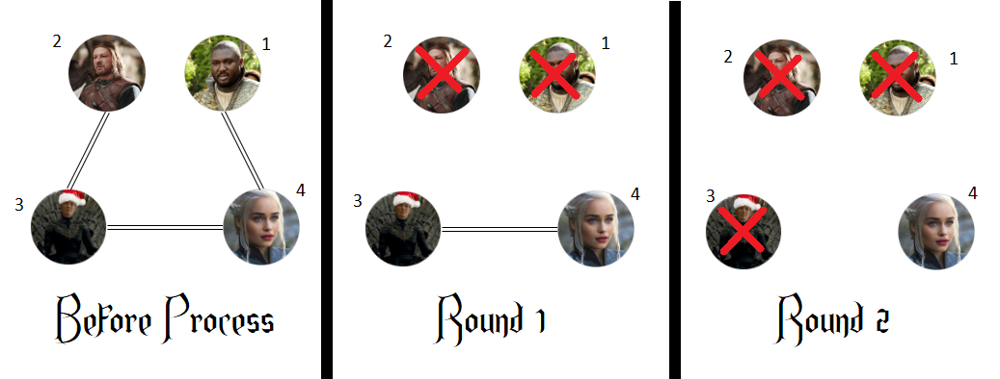

<h1 style='text-align: center;'> A. Web of Lies</h1>

<h5 style='text-align: center;'>time limit per test: 2 seconds</h5>
<h5 style='text-align: center;'>memory limit per test: 256 megabytes</h5>

When you play the game of thrones, you win, or you die. There is no middle ground.Cersei Lannister, A Game of Thrones by George R. R. MartinThere are $n$ nobles, numbered from $1$ to $n$. Noble $i$ has a power of $i$. There are also $m$ "friendships". A friendship between nobles $a$ and $b$ is always mutual.

A noble is defined to be vulnerable if both of the following conditions are satisfied: 

* the noble has at least one friend, and
* all of that noble's friends have a higher power.

You will have to process the following three types of queries. 

1. Add a friendship between nobles $u$ and $v$.
2. Remove a friendship between nobles $u$ and $v$.
3. Calculate the answer to the following process.

The process: all vulnerable nobles are simultaneously killed, and all their friendships end. Then, it is possible that new nobles become vulnerable. The process repeats itself until no nobles are vulnerable. It can be proven that the process will end in finite time. After the process is complete, you need to calculate the number of remaining nobles.

## Note

 that the results of the process are not carried over between queries, that is, every process starts with all nobles being alive!

#### Input

The first line contains the integers $n$ and $m$ ($1 \le n \le 2\cdot 10^5$, $0 \le m \le 2\cdot 10^5$) — the number of nobles and number of original friendships respectively.

The next $m$ lines each contain the integers $u$ and $v$ ($1 \le u,v \le n$, $u \ne v$), describing a friendship. No friendship is listed twice.

The next line contains the integer $q$ ($1 \le q \le 2\cdot {10}^{5}$) — the number of queries. 

The next $q$ lines contain the queries themselves, each query has one of the following three formats. 

* $1$ $u$ $v$ ($1 \le u,v \le n$, $u \ne v$) — add a friendship between $u$ and $v$. It is guaranteed that $u$ and $v$ are not friends at this moment.
* $2$ $u$ $v$ ($1 \le u,v \le n$, $u \ne v$) — remove a friendship between $u$ and $v$. It is guaranteed that $u$ and $v$ are friends at this moment.
* $3$ — print the answer to the process described in the statement.
#### Output

For each type $3$ query print one integer to a new line. It is guaranteed that there will be at least one type $3$ query.

## Examples

#### Input


```text
4 3
2 1
1 3
3 4
4
3
1 2 3
2 3 1
3
```
#### Output


```text
2
1
```
#### Input


```text
4 3
2 3
3 4
4 1
1
3
```
#### Output


```text
1
```
## Note

Consider the first example. In the first type 3 query, we have the diagram below.

In the first round of the process, noble $1$ is weaker than all of his friends ($2$ and $3$), and is thus killed. No other noble is vulnerable in round 1. In round 2, noble $3$ is weaker than his only friend, noble $4$, and is therefore killed. At this point, the process ends, and the answer is $2$.

  In the second type 3 query, the only surviving noble is $4$.

    

The second example consists of only one type $3$ query. In the first round, two nobles are killed, and in the second round, one noble is killed. The final answer is $1$, since only one noble survives.

  

#### Tags 

#1400 #NOT OK #brute_force #graphs #greedy 

## Blogs
- [All Contest Problems](../Codeforces_Round_736_(Div._1).md)
- [Codeforces Round #736 (en)](../blogs/Codeforces_Round_736_(en).md)
- [Tutorial (en)](../blogs/Tutorial_(en).md)
