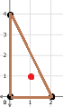
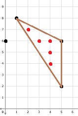

<h1 style='text-align: center;'> D2. Gregor and the Odd Cows (Hard)</h1>

<h5 style='text-align: center;'>time limit per test: 6 seconds</h5>
<h5 style='text-align: center;'>memory limit per test: 256 megabytes</h5>

This is the hard version of the problem. The only difference from the easy version is that in this version the coordinates can be both odd and even.

There are $n$ fence-posts at distinct coordinates on a plane. It is guaranteed that no three fence posts lie on the same line.

There are an infinite number of cows on the plane, one at every point with integer coordinates.

Gregor is a member of the Illuminati, and wants to build a triangular fence, connecting $3$ distinct existing fence posts. A cow strictly inside the fence is said to be enclosed. If there are an odd number of enclosed cows and the area of the fence is an integer, the fence is said to be interesting.

Find the number of interesting fences.

##### Input

The first line contains the integer $n$ ($3 \le n \le 6000$), the number of fence posts which Gregor can choose to form the vertices of a fence.

Each of the next $n$ line contains two integers $x$ and $y$ ($0 \le x,y \le 10^7$, where $(x,y)$ is the coordinate of a fence post. All fence posts lie at distinct coordinates. No three fence posts are on the same line.

##### Output

Print a single integer, the number of interesting fences. Two fences are considered different if they are constructed with a different set of three fence posts.

## Examples

##### Input


```text
3
0 0
2 0
0 4
```
##### Output


```text
1
```
##### Input


```text
4
1 8
0 6
5 2
5 6
```
##### Output


```text
1
```
##### Input


```text
10
170 59
129 54
5 98
129 37
58 193
154 58
24 3
13 138
136 144
174 150
```
##### Output


```text
29
```
## Note

In the first example, there is only $1$ fence. That fence is interesting since its area is $4$ and there is $1$ enclosed cow, marked in red.

  In the second example, there are $4$ possible fences. Only one of them is interesting however. That fence has an area of $8$ and $5$ enclosed cows.

  

#### Tags 

#3300 #NOT OK #brute_force #geometry #math #number_theory 

## Blogs
- [All Contest Problems](../Codeforces_Round_736_(Div._1).md)
- [Codeforces Round #736 (en)](../blogs/Codeforces_Round_736_(en).md)
- [Tutorial (en)](../blogs/Tutorial_(en).md)
