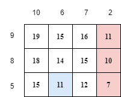

<h1 style='text-align: center;'> E. Gregor and the Two Painters</h1>

<h5 style='text-align: center;'>time limit per test: 4 seconds</h5>
<h5 style='text-align: center;'>memory limit per test: 256 megabytes</h5>

Two painters, Amin and Benj, are repainting Gregor's living room ceiling! The ceiling can be modeled as an $n \times m$ grid.

For each $i$ between $1$ and $n$, inclusive, painter Amin applies $a_i$ layers of paint to the entire $i$-th row. For each $j$ between $1$ and $m$, inclusive, painter Benj applies $b_j$ layers of paint to the entire $j$-th column. Therefore, the cell $(i,j)$ ends up with $a_i+b_j$ layers of paint.

Gregor considers the cell $(i,j)$ to be badly painted if $a_i+b_j \le x$. Define a badly painted region to be a maximal connected component of badly painted cells, i. e. a connected component of badly painted cells such that all adjacent to the component cells are not badly painted. Two cells are considered adjacent if they share a side.

Gregor is appalled by the state of the finished ceiling, and wants to know the number of badly painted regions.

###### Input

The first line contains three integers $n$, $m$ and $x$ ($1 \le n,m \le 2\cdot 10^5$, $1 \le x \le 2\cdot 10^5$) — the dimensions of Gregor's ceiling, and the maximum number of paint layers in a badly painted cell.

The second line contains $n$ integers $a_1, a_2, \ldots, a_n$ ($1 \le a_i \le 2\cdot 10^5$), the number of paint layers Amin applies to each row.

The third line contains $m$ integers $b_1, b_2, \ldots, b_m$ ($1 \le b_j \le 2\cdot 10^5$), the number of paint layers Benj applies to each column.

###### Output

Print a single integer, the number of badly painted regions.

## Examples

###### Input


```text
3 4 11
9 8 5
10 6 7 2
```
###### Output


```text
2
```
###### Input


```text
3 4 12
9 8 5
10 6 7 2
```
###### Output


```text
1
```
###### Input


```text
3 3 2
1 2 1
1 2 1
```
###### Output


```text
4
```
###### Input


```text
5 23 6
1 4 3 5 2
2 3 1 6 1 5 5 6 1 3 2 6 2 3 1 6 1 4 1 6 1 5 5
```
###### Output


```text
6
```
## Note

The diagram below represents the first example. The numbers to the left of each row represent the list $a$, and the numbers above each column represent the list $b$. The numbers inside each cell represent the number of paint layers in that cell.

The colored cells correspond to badly painted cells. The red and blue cells respectively form $2$ badly painted regions.

  

#### Tags 

#3400 #NOT OK #data_structures #divide_and_conquer #graphs #greedy #math 

## Blogs
- [All Contest Problems](../Codeforces_Round_736_(Div._1).md)
- [Codeforces Round #736 (en)](../blogs/Codeforces_Round_736_(en).md)
- [Tutorial (en)](../blogs/Tutorial_(en).md)
