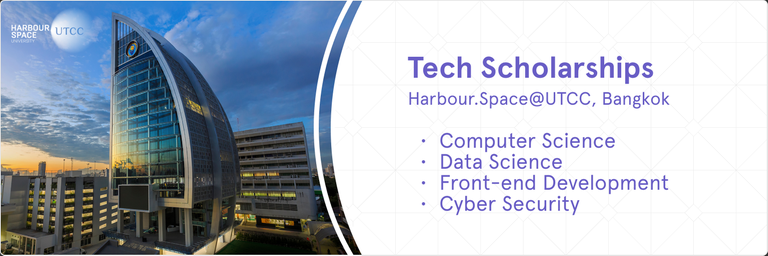

# Announcement

Hello Codeforces!

On [Wednesday, July 14, 2021 at 20:35UTC+6](https://codeforces.com/https://www.timeanddate.com/worldclock/fixedtime.html?day=14&month=7&year=2021&hour=17&min=35&sec=0&p1=166) [Educational Codeforces Round 111 (Rated for Div. 2)](https://codeforces.com/contest/1550 "Educational Codeforces Round 111 (Rated for Div. 2)") will start.

Series of Educational Rounds continue being held as [Harbour.Space University](https://codeforces.com/https://harbour.space/) initiative! You can read the details about the cooperation between [Harbour.Space University](https://codeforces.com/https://harbour.space/) and Codeforces in the [blog post](//codeforces.com/blog/entry/51208).

This round will be **rated for the participants with rating lower than 2100**. It will be held on extended ICPC rules. The penalty for each incorrect submission until the submission with a full solution is 10 minutes. After the end of the contest you will have 12 hours to hack any solution you want. You will have access to copy any solution and test it locally.

You will be given **6 or 7 problems** and **2 hours** to solve them.

The problems were invented and prepared by Adilbek [adedalic](https://codeforces.com/profile/adedalic "International Master adedalic") Dalabaev, Vladimir [vovuh](https://codeforces.com/profile/vovuh "Master vovuh") Petrov, Ivan [BledDest](https://codeforces.com/profile/BledDest "International Grandmaster BledDest") Androsov, Maksim [Neon](https://codeforces.com/profile/Neon "Candidate Master Neon") Mescheryakov and me. Also huge thanks to Mike [MikeMirzayanov](https://codeforces.com/profile/MikeMirzayanov "Headquarters, MikeMirzayanov") Mirzayanov for great systems Polygon and Codeforces.

Good luck to all the participants!

Our friends at Harbour.Space also have a message for you:

*Hey, Codeforces!*

*From Barcelona to Bangkok, we are officially opening our **new campus in August**.* 

*As some of you might know, Harbour.Space University has partnered with the University of the Thai Chamber of Commerce, Bangkok to offer exceptional tech specialists the opportunity to study in one of the most dynamic and vibrant cities in the world.* 

*To celebrate our launch, we have **scholarships available for our tech bachelor’s and master’s programmes** including [Data Science](https://codeforces.com/https://bit.ly/3B6VCGr), [Cyber Security](https://codeforces.com/https://bit.ly/3wCUHtM), [Front-end Development](https://codeforces.com/https://bit.ly/3yMkKA2) and [Computer Science](https://codeforces.com/https://bit.ly/3xCIzdw).* 

***Scholarship Requirements:***

 * *Proficient level of English*
* *CV*
* *Maths and Computer Science Test*
* *Diploma and transcript of the highest attained education level*

*For the Front-end Development Master’s programme, applicants will have to submit a challenge.*

*We are always happy to see Codeforces members join the Harbour.Space family. Get a chance to learn from the best in the field and kickstart your career and **apply now to one of the following programmes**:* 

 * *[Data Science](https://codeforces.com/https://bit.ly/3B6VCGr)*
* *[Cyber Security](https://codeforces.com/https://bit.ly/3wCUHtM)*
* *[Front-end Development](https://codeforces.com/https://bit.ly/3yMkKA2)*
* *[Computer Science](https://codeforces.com/https://bit.ly/3xCIzdw)*

*Keep in touch and follow us on LinkedIn for more scholarship opportunities. And follow us on Instagram to evidence student life, events, and success stories from our apprenticeship program students.*

*Good luck on your round, and see you next time!* 

*Harbour.Space University* 

Congratulations to the winners: 

| Rank | Competitor | Problems Solved | Penalty |
| --- | --- | --- | --- |
| 1 | [jiangly](https://codeforces.com/profile/jiangly "Legendary Grandmaster jiangly") | 6 | 136 |
| 2 | [neal](https://codeforces.com/profile/neal "Legendary Grandmaster neal") | 6 | 177 |
| 3 | [End.](https://codeforces.com/profile/End. "Unrated, End.") | 6 | 186 |
| 4 | [Bench0310](https://codeforces.com/profile/Bench0310 "Grandmaster Bench0310") | 6 | 211 |
| 5 | [Geothermal](https://codeforces.com/profile/Geothermal "International Grandmaster Geothermal") | 6 | 212 |

289 successful hacks and 677 unsuccessful hacks were made in total!

And finally people who were the first to solve each problem: 

| Problem | Competitor | Penalty |
| --- | --- | --- |
| A | [Geothermal](https://codeforces.com/profile/Geothermal "International Grandmaster Geothermal") | 0:00 |
| B | [Geothermal](https://codeforces.com/profile/Geothermal "International Grandmaster Geothermal") | 0:02 |
| C | [TheScrasse](https://codeforces.com/profile/TheScrasse "Grandmaster TheScrasse") | 0:07 |
| D | [jiangly](https://codeforces.com/profile/jiangly "Legendary Grandmaster jiangly") | 0:27 |
| E | [Andreasyan](https://codeforces.com/profile/Andreasyan "Master Andreasyan") | 0:18 |
| F | [TheOneYouWant](https://codeforces.com/profile/TheOneYouWant "Grandmaster TheOneYouWant") | 0:40 |

**UPD:** [Editorial is out](Tutorial.md)

