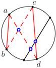
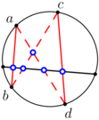

# Tutorial_(en)

We hope you liked the problems! Before we go ahead with the editorial, let us make some general comments about this round.

Problems A, B, C, D, E, F are "div 2" problems, while problems G, H, I are meant to be solved by Grandmasters. Overall, our goal was to provide a problemset that could be enjoyable for a wide range of participants and such that the winner could solve all the problems.

There were three big "jumps" in the difficlty gaps between consecutive problems. Problems A and B are meant to be easy, many contestants have the skills and the techniques to attack them (and, maybe, to solve them). Problems C, D, E, F are gradually harder but the difficulty gap between C and F is not as large as usual (and this is reflected in the score distribution). The same holds for problem G, H, I; the difficulty gap between G and I is relatively small (but there is a big score difference because coding I is much harder). Sadly, we discovered 14 minutes into the round that problem I [has already appeared in a contest](https://codeforces.com/contest/243/problem/E) (most likely also in Polish contest, if you know it please tell us in the comments). See also [this comment](Announcement_(en).md?#comment-820809).

  

 **Pre-contest predictions**Let us now make some predictions (you, future reader, can check whether we were right or wrong). We promise not to change these predictions after the beginning of the contest.

 * After 20 minutes someone has solved 4 problems.
* After 40 minutes someone has solved 6 problems.
* After 70 minutes someone has solved 7 problems.
* After 100 minutes someone has solved 8 problems.
* At least one contestant solves all the problems.
* There is a big difference in number of solves between F and G (let's say a factor 3).
* The best Italian contestant solves 6 problems.
* There are ≥10000 solves for problem A.

The contest is now finished and our predictions are far from being perfect, but, for intellectual honesty, we are not changing them.

  

 **Detailed overview on the problemset and a bit of behind-the-scenes**In problem [1552A - Subsequence Permutation](../problems/A._Subsequence_Permutation.md "Codeforces Global Round 15") you had to sort a sequence by changing the minimum number of elements... you better not touch elements which are already in the correct position! Fun fact: this problem appears again, as an optimization step (not really required to get accepted), in problem G.

Problem [1552B - Running for Gold](../problems/B._Running_for_Gold.md "Codeforces Global Round 15"), about the ongoing Olympic Games, had a real-life statement and an obvious quadratic algorithm which had to be improved to get accepted. It could be solved either by an intuitive observation (only one athlete can win the gold medal!) or with a super-simple randomized approach. This problem was added (and changed) last-minute (that is, 2 days before the contest) to make the problemset more balanced. Bonus version: with the same constraints, find the number of athletes who are "likely to get a medal", i.e. who are superior to all but (at most) 2 other athletes.

In problem [1552C - Maximize the Intersections](../problems/C._Maximize_the_Intersections.md "Codeforces Global Round 15") you had to maximize the number of intersections of chords in a circle. It's natural to add the new chords so that they all intersect each other... it turns out that this is enough to solve the problem! This was a subproblem of a harder problem that we discarded because it did not fit the problemset (and it was not particularly nice).

Problem [1552D - Array Differentiation](../problems/D._Array_Differentiation.md "Codeforces Global Round 15"), in which you had to write an array as differences of the value of another array, was an undercover graph problem. Once the necessary and sufficient condition is identified, coding it is very easy. Until 5 days before the contest, this was problem B. Since it was too hard for a B, it was moved to D and a new problem B was added.

Problem [1552E - Colors and Intervals](../problems/E._Colors_and_Intervals.md "Codeforces Global Round 15") is a combinatorics problem that asks you to select some "almost disjoint" intervals respecting certain properties. It can be tackled by unexpected simple greedy algorithms. Some variations of this problem appeared in the past (we know of at least two similar problems), but since it is a nice problem and nobody found this version anywhere we decided to give it anyway.

At first sight, problem [1552F - Telepanting](../problems/F._Telepanting.md "Codeforces Global Round 15"), about an ant moving and teleporting, seems to require an exponential amount of time to be solved. Once one notices that the states of the portals satisfy a rigid property, it is not hard to come up with a polynomial (actually pseudo-linear) solution. If one drops the assumption yi<xi it becomes impossible for the authors to solve it.

Problem [1552G - A Serious Referee](../problems/G._A_Serious_Referee.md "Codeforces Global Round 15") presents you with a daunting task: you are given a "generalized" sorting network and you must tell whether it really is a sorting network or not. Standard knowledge about sorting networks is useful but not sufficient to solve the problem.

Problem [1552H - Guess the Perimeter](../problems/H._Guess_the_Perimeter.md "Codeforces Global Round 15") is a strange interactive problem in which you must guess the perimeter of a hidden rectangle. The number of available queries in astonishingly small and one has to come up with a way to find the perimeter without really identifying the rectangle. Initially [cip999](https://codeforces.com/profile/cip999 "Master cip999") had proposed it with 7 queries, then [dario2994](https://codeforces.com/profile/dario2994 "International Grandmaster dario2994"), after failing to solve it for a couple of days, came up with the 4 queries solution.

In problem [1552I - Organizing a Music Festival](../problems/I._Organizing_a_Music_Festival.md "Codeforces Global Round 15") you have to count the number of permutations with certain sets of values which are contiguous. The statement is very simple but the solution is a bit of a mess to find and also to code. This is the only problem of the problemset whose implementation is involved. It entered in the problemset when we noticed that the previous problem I could be solved by a dull heuristic (which made [cip999](https://codeforces.com/profile/cip999 "Master cip999") really sad). The first version of the problem had n=20, it was a problem E/F and could be solved by subsets-dp, but [antontrygubO_o](https://codeforces.com/profile/antontrygubO_o "International Grandmaster antontrygubO_o") said (and rightly so) "I am afraid this is too standard". This rejection pushed [dario2994](https://codeforces.com/profile/dario2994 "International Grandmaster dario2994") to solve the problem in polynomial time and send it back to [antontrygubO_o](https://codeforces.com/profile/antontrygubO_o "International Grandmaster antontrygubO_o"), who finally accepted it. The official solution can handle also n=1000,k=1000, but, since it was only a bigger pain to code, we decided to give the "small constraints" version. Sadly, it turns out that the problem was not new for some participants (but there were also some genuine solutions to the problem during the round). 

  

 **Which author did what?*** A: Original statement by [cip999](https://codeforces.com/profile/cip999 "Master cip999"), current statement by [dario2994](https://codeforces.com/profile/dario2994 "International Grandmaster dario2994"). Prepared by [cip999](https://codeforces.com/profile/cip999 "Master cip999").
* B: Original statement and preparation by [dario2994](https://codeforces.com/profile/dario2994 "International Grandmaster dario2994").
* C: Original statement by [cip999](https://codeforces.com/profile/cip999 "Master cip999"), current statement by [dario2994](https://codeforces.com/profile/dario2994 "International Grandmaster dario2994"). Prepared by [cip999](https://codeforces.com/profile/cip999 "Master cip999").
* D: Original statement and preparation by [cip999](https://codeforces.com/profile/cip999 "Master cip999").
* E: Original statement by [cip999](https://codeforces.com/profile/cip999 "Master cip999"), current statement by [dario2994](https://codeforces.com/profile/dario2994 "International Grandmaster dario2994"). Prepared by [cip999](https://codeforces.com/profile/cip999 "Master cip999").
* F: Original statement by [cip999](https://codeforces.com/profile/cip999 "Master cip999"), current statement by [dario2994](https://codeforces.com/profile/dario2994 "International Grandmaster dario2994"). Prepared by [dario2994](https://codeforces.com/profile/dario2994 "International Grandmaster dario2994").
* G: Original statement by [cip999](https://codeforces.com/profile/cip999 "Master cip999"), solution by [dario2994](https://codeforces.com/profile/dario2994 "International Grandmaster dario2994"). Prepared by [dario2994](https://codeforces.com/profile/dario2994 "International Grandmaster dario2994").
* H: Original statement by [cip999](https://codeforces.com/profile/cip999 "Master cip999"), solution by [dario2994](https://codeforces.com/profile/dario2994 "International Grandmaster dario2994"). Prepared by [dario2994](https://codeforces.com/profile/dario2994 "International Grandmaster dario2994").
* I: Original statement and preparation by [dario2994](https://codeforces.com/profile/dario2994 "International Grandmaster dario2994").
  

 **Some thoughts from cip999**This was the first round ever that I (co-)organized, so I'm eager to share some of my experience with the Codeforces community!

During the problemsetting phase of the preparation I've been the main proposer, basically for two reasons:

 * [dario2994](https://codeforces.com/profile/dario2994 "International Grandmaster dario2994") didn't have much time to think about problems;
* I was totally new to problemsetting and felt the need to propose every problem I came up with, no matter how horrible it was. (Regarding the second point, I believe I am going to write a separate blog post, where I will comment on the negative aspects of some of the ugliest problems I proposed, so that, hopefully, future problemsetters won't repeat my mistakes.)

As a result, most of the problems ended up being mine, at least in their original formulation (with most of their optimal solutions being [dario2994](https://codeforces.com/profile/dario2994 "International Grandmaster dario2994")'s).

However, the more problems I proposed (and the more feedback I received from [dario2994](https://codeforces.com/profile/dario2994 "International Grandmaster dario2994"), who, during this stage, acted as a coordinator), the better I became at inventing problems: I began to notice when a problem was too mainstream or technical or didn't require any interesting insight; I gradually developed an eye for statements that seemed nice and "natural"; I aimed at the right amount of beauty and originality. I still got rejections, but fewer of them. In the end, I feel that I am now a way better problemsetter than I was in the beginning, and I have to thank [dario2994](https://codeforces.com/profile/dario2994 "International Grandmaster dario2994") for that!

The problem preparation phase was another thing entirely. Previously, I had prepared a reasonable amount of problems for the Italian Olympiad in Informatics and the Italian training camps, but in a Codeforces round (and, to a greater extent, in a Global Round) everything must be thought of with the utmost care: there is no room for major mistakes.

 * Statements must be **clear**. As I'm writing this, [dario2994](https://codeforces.com/profile/dario2994 "International Grandmaster dario2994") is telling me that the statement of problem A has to be clarified (and it's less than 24 hours before the contest!).
* The generation of tests is by far the most critical part. If you want to avoid heuristics to pass systems tests (or, maybe worse, pass pretests and get FST), tests must be **strong**.
* In order to test the generator, it is essential to write a lot of heuristic/suboptimal/slow solutions and make sure they fail on a reasonable amount of tests.
* On the other hand, writing the validator and (when needed) the checker is way easier and almost relaxing.

Two problems were discarded after or during their preparation because we found unbeatable heuristics: one was the former problem C, the other was former problem I. Both problems were proposed by me, so I was a bit disappointed when that happened (especially for problem I, which neither [dario2994](https://codeforces.com/profile/dario2994 "International Grandmaster dario2994") nor [antontrygubO_o](https://codeforces.com/profile/antontrygubO_o "International Grandmaster antontrygubO_o") could solve). However, we were lucky to find those heuristics and save us from unwanted AC on wrong solutions. Hopefully we have caught them all!

I had a whole lot of fun organizing Global Round 15, and I discovered that I like inventing problems more than solving problems invented by others! For this reason, I think that, sooner or later, I will try to organize another round here on Codeforces (provided that I find the time to do so).

  

Hints and solutions
-------------------

  

 **A****Hint 1.**For sure, one must permute the k characters by sorting them alphabetically.

 **Hint 2.**If a character is not among the k shuffled characters, then it must be already in the correct position.

 **Hint 3.**If a character is not in the correct position, then it must belong to the k shuffled characters.

 **Solution**
### [1552A - Subsequence Permutation](../problems/A._Subsequence_Permutation.md "Codeforces Global Round 15")

Let $\texttt{sort}(s)$ be $s$ sorted alphabetically. The answer to the problem is the number $m$ of mismatches between $s$ and $\texttt{sort}(s)$ (i.e., the positions with different characters in the two strings).

Choosing $k=m$ characters is sufficient. Let us choose the mismatched characters between $s$ and $\texttt{sort}(s)$, and permute them so that they are sorted alphabetically. It is not hard to prove that the resulting string will coincide with $\texttt{sort}(s)$.

Choosing strictly less than $m$ characters is not sufficient. If $k < m$, by the Pigeonhole Principle at least one of the mismatched characters will be left out, and thus it will prevent the final string from being ordered alphabetically.

Complexity: $O(n\log n)$.

 **Implementation**[123770893](https://codeforces.com/contest/1552/submission/123770893 "Submission 123770893 by cip999")

  

 **B****Hints for Solution 1****Hint 1.**The "superiority" relationship induces a complete directed graph with n vertices and (n2) edges.

 **Hint 2.**There can be at most one athlete who is superior to everyone else.

 **Hint 3.**Morally, the problem is equivalent to finding the maximum of an array (performing not too many comparisons).

 **Hints for Solution 2****Hint 1.**Try to optimize the obvious quadratic solution.

 **Hint 2.**Maybe put in some randomization?

 **Solution**
### [1552B - Running for Gold](../problems/B._Running_for_Gold.md "Codeforces Global Round 15")

Solution 1

First of all, observe that athlete $i$ is superior to athlete $j$ if and only if athlete $j$ is not superior to athlete $i$.

The issue is, of course, that we cannot iterate over all pairs of athletes as there are $\binom{n}{2} = O(n^2)$ pairs, which is too much to fit in the time limit.

Notice that there can be at most one athlete who is likely to get the gold medal (if there were $2$, one would not be superior to the other which is a contradiction).

Let us describe the algorithm. We iterate over the athletes from $1$ to $n$, keeping a possible winner $w$.

When we process $i$, we check whether $w$ is superior to $i$. In that case, clearly $i$ is not the one who is likely to get the gold medal and we do nothing. On the other hand, if $i$ is superior to $w$, we deduce that $w$ cannot be the athlete who is likely to get the gold medal. In this case, we assign $w:=i$ and we proceed.

Notice that, when we have finished processing athletes, if there is an athlete superior to everyone else it is for sure $w$. Finally, we check whether $w$ is superior to everyone else or not.

Complexity: $O(n)$.

$$$$

Solution 2

Let us describe a randomized solution which seems very naive but can actually be proven to have a good complexity (still, the proof is much harder than an optimistic guess). There are many other possible randomized approach which can be proven to have a correct complexity with a similar proof.

For each athlete $i$ check whether he is superior to all other athletes, iterating over other athletes in a random order, and stop as soon as you find an athlete who is superior to $i$.

Let us show that the described algorithm has complexity $O(n\log n)$.

Consider an athlete $i$ who is superior to exactly $n-1-k$ other athletes. Let us compute the expected amount of other athletes the algorithm processes when deciding if athlete $i$ is likely to get a medal. 

* If $k = 0$, the algorithm iterates over all other $n - 1 = O(n)$ athletes.
* If $k \ge 1$, the expected number of other athletes the algorithm iterates over is $O\Big(\frac{n}{k}\Big)$. To prove this, one shall observe that if we take $k$ random distinct elements out of $\{1, \, 2, \, \dots, \, n\}$ the expected value of the smallest one is $O\Big(\frac{n}{k}\Big)$.

So, the overall complexity of the algorithm is: $$ O\left(q_0 \cdot n + \sum_{k = 1}^{n - 1} q_k \frac{n}{k}\right) = O\left(n \left(q_0 + \sum_{k = 1}^{n - 1}\frac{q_k}{k}\right)\right), $$ where $q_k$ is the number of athletes who are superior to exactly $n - 1 - k$ other athletes.

If we let $s_k = q_0 + q_1 + \cdots + q_k$, we can also estimate the complexity with $$ O\left(n \left(s_0 + \sum_{k = 1}^{n - 1}\frac{s_k - s_{k-1}}{k}\right)\right) = O\left(n\left(\sum_{k = 1}^{n - 2}\frac{s_k}{k(k + 1)} + \frac{s_{n - 1}}{n - 1}\right)\right). $$

It remains to estimate $s_k$ and the following lemma does exactly this.

Lemma. For each $k \ge 0$, there are at most $2k + 1$ athletes which are superior to at least $n - 1 - k$ athletes.

Proof. Assume that there are $m$ athletes who are superior to at least $n - 1 - k$ other athletes. Consider the complete directed graph on these $m$ athletes so that the edge $i \to j$ is present if and only if athlete $i$ is superior to athlete $j$. Each vertex has out-degree $\ge m - 1 - k$ and therefore the number of edges is at least $m(m - 1 - k)$. On the other hand, the number of edges is clearly $\binom{m}{2}$ and therefore we obtain $$ m(m - 1 - k) \le \frac{m(m - 1)}2 \implies m \le 2k+1 $$ as desired.

The lemma tells us that $s_k \le 2k + 1$ and therefore the complexity is estimated by $$ O\left(n\left(\sum_{k = 1}^{n - 2} \frac{2k + 1}{k(k + 1)} + \frac{2n - 1}{n - 1}\right)\right) = O\left(2n\sum_{k = 1}^{n - 2} \frac{1}{k}\right) = O(n\log n). $$

Complexity: $O(n\log n)$, randomized.

 **Implementation of Solution 1**[123770963](https://codeforces.com/contest/1552/submission/123770963 "Submission 123770963 by cip999")

 **Implementation of Solution 2**[123770996](https://codeforces.com/contest/1552/submission/123770996 "Submission 123770996 by cip999")

  

 **C****Hint 1.**If two chords do not intersect, "swapping them" so that they intersect strictly increases the number of intersections.

 **Hint 2.**If we repeat the above-described strategy, we will end up with a configuration where all added chords intersect.

 **Hint 3.**There is only one configuration so that all added chords intersect.

 **Solution**
### [1552C - Maximize the Intersections](../problems/C._Maximize_the_Intersections.md "Codeforces Global Round 15")

Let us forget about the original labeling of the points. Relabel the $2(n - k)$ "free" points $1, \, 2, \, \dots, \, 2(n - k)$ in clockwise order, starting from an arbitrary point. Also, in the following, we will color black the original $k$ chords, and red the additional $n - k$ chords.

For $1 \le i \le n - k$, connect point $i$ to point $i + n - k$ with a red chord. We shall prove that this configuration — which we will henceforth refer to as the star configuration — is the only one that achieves the maximum number of intersections. The proof will be divided into two parts. 

* First part: we show that, if there are two red chords that do not intersect, it is possible to increase the number of intersections.
* Second part: we show that there is exactly one configuration in which all pairs of red chords intersect, namely the star configuration.

First part. Suppose that, after drawing $n - k$ red chords, there is a pair of red chords that do not intersect. Let these chords connect points $a$—$b$ and $c$—$d$ respectively. Without loss of generality, assume that the chords $a$—$d$ and $b$—$c$ intersect. We show that, by replacing chords $a$—$b$ and $c$—$d$ with $a$—$d$ and $b$—$c$, the overall number of intersections increases.

Consider any other chord (either black or red) that intersected exactly one of $a$—$b$ and $c$—$d$. It is easy to see that, in the new configuration, that chord intersects exactly one of $a$—$d$ and $b$—$c$, as exemplified in the following picture: 

   (There would actually be four cases to consider, but one can see that they are symmetric.)Now consider any other chord (either black or red) that intersected both $a$—$b$ and $c$—$d$. Again, one can see that, in the new configuration, that chord intersects both $a$—$d$ and $b$—$c$: 

   Since all previous intersections are preserved, and there is at least one new intersection (the one between $a$—$d$ and $b$—$c$), the total number of intersections has increased.Second part. Consider a configuration that is not the star configuration. Then, there is at least one chord $a$—$b$ ($a < b$) such that $b \ne a + n - k$. Without loss of generality, suppose $a = 1$.

Now, exactly one of the two sets of points $\{2, \, \dots, \, b - 1\}$ and $\{b + 1, \, \dots, \, 2(n - k)\}$ must contain at least $n - k$ points. By the Pigeonhole Principle, there must be a chord whose endpoints are both contained in this set, and one can see that such a chord does not intersect $a$—$b$.

Thus we have shown that the star configuration is the only one in which all pairs of chords intersect, which implies (from the first part) that it is the only one that maximizes the number of intersections.

Producing the $n - k$ chords of the star configuration is trivial. It remains to count the number of intersections, which can be done naively in $O(n^2)$ (for each pair of chords, check if they intersect).

Bonus: Find an $O(n\log n)$ algorithm to count the number of intersections.

Complexity: $O(n^2)$.

 **Implementation**[123771028](https://codeforces.com/contest/1552/submission/123771028 "Submission 123771028 by cip999")

  

 **D****Hint 1.**Consider the graph induced by the edges (j,k) so that ai=bj−bk.

 **Hint 2.**Such graph contains n vertices and n edges, so it has a cycle.

 **Hint 3.**The sum, with the right signs, of the ai over the vertices of a cycle is 0.

 **Hint 4.**The above condition is necessary and sufficient.

 **Solution**
### [1552D - Array Differentiation](../problems/D._Array_Differentiation.md "Codeforces Global Round 15")

Suppose that a solution $b_1, \, \dots, \, b_n$ exists. For each $1 \le i \le n$, let $j_i, \, k_i$ be the indices such that $a_i = b_{j_i} - b_{k_i}$.

Consider the directed graph on vertices $1, \, \dots, \, n$, with the $n$ edges $j_i \rightarrow k_i$. If we ignore, for a moment, the orientations, we are left with an undirected graph with $n$ vertices and $n$ edges, which must contain a cycle (possibly a loop). Let $m$ be the length of one such cycle, and let $v_1, \, \dots, v_m$ be its vertices.

Now, of course $(b_{v_1} - b_{v_2}) + (b_{v_2} - b_{v_3}) + \cdots + (b_{v_m} - b_{v_1}) = 0$, since all the terms cancel out. Notice that, for each $i$, there exists $1 \le t_i \le n$ such that (indices are taken modulo $m$, so that $v_{m + 1} = v_1$) $$ b_{v_i} - b_{v_{i + 1}} = \begin{cases} a_{t_i} & \text{if there is an edge } v_i \rightarrow v_{i + 1}, \\\ -a_{t_i} & \text{if there is an edge } v_i \leftarrow v_{i + 1}. \end{cases} $$

Thus, there must be a nonempty subset $\{t_1, \, \dots, \, t_m\} \subseteq \{1, \, \dots, \, n\}$ and a choice of signs $s_1, \, \dots, \, s_m$ ($s_i \in \{+1, \, -1\}$) such that $$\tag{$\star$} s_1a_{t_1} + \cdots + s_ma_{t_m} = 0. $$

Let us show that this condition is also sufficient for the existence of a valid sequence $b_1, \, \dots, \, b_n$. Suppose there exist $m$, $t_1, \, \dots, \, t_m$ and $s_1, \, \dots, \, s_m$ so that $(\star)$ holds. We construct $b_1, \, \dots, \, b_n$ as follows. Set $b_{t_1} = 0$. Then, inductively, for each $1 \le i < m$ set $b_{t_{i + 1}} = b_{t_i} - s_ia_{t_i}$. Finally, for $i \not\in \{t_1, \, \dots, \, t_m\}$, set $b_i = a_i$. It is easy to check that this construction works.

The algorithm that iterates over all $3^n - 1$ choices of the subset and the signs (for each $i$ we decide whether $a_i$ is included in the subset and if it is included, whether its sign is positive or negative) and checks if for one of them $(\star)$ holds, is sufficient to solve the problem under the given constraints. 

Alternatively, one may treat the problem as a knapsack instance (the weights are $a_i$, but can be chosen with arbitrary sign, and we shall understand whether we can fill precisely a knapsack with $0$ capacity). With this approach, the complexity is $O(n^2\max|a_i|)$.

Bonus: Solve the problem with complexity $O(n3^{\frac{n}{2}})$.

Complexity: $O(n3^n)$.

 **Implementation**[123771071](https://codeforces.com/contest/1552/submission/123771071 "Submission 123771071 by cip999")

  

 **E****Hints for Solution 1****Hint 1.**It is always convenient to choose ai,bi so that the color i does not appear in ai+1,ai+2,…,bi−1. So, for each color there are k−1 "candidate intervals".

 **Hint 2.**(k−1)⌈nk−1⌉≥n.

 **Hint 3.**Choose the intervals in chunks of ⌈nk−1⌉. The intervals in the first chunk should be strictly to the left of the intervals in the second chunk, which should be strictly to the left of the intervals of the third chunk, and so on.

 **Hint 4.**For the t-th chunk, only consider (among the remaining colors) the candidate intervals whose left endpoint is the t-th occurrence of its color.

 **Hints for Solution 2****Hint 1.**Try to come up with a greedy algorithm.

 **Hint 2.**Order the candidate intervals (defined as above) by second endpoint.

 **Hint 3.**Scan the sorted intervals and always select one if you are allowed to.

 **Solution**
### [1552E - Colors and Intervals](../problems/E._Colors_and_Intervals.md "Codeforces Global Round 15")

Solution 1

We describe the algorithm and later we explain why the construction works.

Let $x_{i, j}$ ($1 \le i \le n$, $1 \le j \le k$) denote the position of the $j$-th occurrence of color $i$ (from the left). 

First, sort the colors according to $x_{i, 2}$. Take the first $\left\lceil \frac{n}{k - 1} \right\rceil$ colors, and to each of them assign the interval $[x_{i, 1}, \, x_{i, 2}]$. Then, sort the remaining colors according to $x_{i, 3}$, take the first $\left\lceil \frac{n}{k - 1} \right\rceil$ and to each of them assign the interval $[x_{i, 2}, \, x_{i, 3}]$.

More generally, in the $t$-th step: sort the remaining colors according to $x_{i, t + 1}$; take the first $\left\lceil \frac{n}{k - 1} \right\rceil$ (possibly less in the last step) of these colors; assign to each color $i$ the interval $[x_{i, t}, \, x_{i, t + 1}]$.

Let us show that this choice of intervals works. It is straightforward to see that the first two properties hold.

It remains to check the third property. We prove that two intervals selected in different steps are disjoint. Since in each step we select at most $\left\lceil \frac{n}{k - 1} \right\rceil$ intervals, this is sufficient to conclude. Consider two colors $i, \, j$ selected in two different steps $s < t$ respectively. Then, we have $x_{i, s + 1} < x_{j, s + 1} \le x_{j, t}$ and thus $[x_{i, s}, \, x_{i, s + 1}] \cap [x_{j, t}, \, x_{j, t + 1}] = \varnothing$, which is exactly what we wanted to prove.

Complexity: $O(nk)$.

$$$$

Solution 2

A greedy approach is also possible.

Let $x_{i, j}$ be defined as in Solution 1. Consider all intervals of the form $[x_{i, j}, \, x_{i, j + 1}]$ and sort them increasingly according to their right endpoint. We now iterate over these intervals, and for each of them, we decide to select it if both these conditions are met (which are equivalent to "selecting the interval does not violate any requirement"): 

* no interval of the same color has been chosen yet;
* among the numbers spanned by the interval, no one is contained in (at least) $\left\lceil \frac{n}{k - 1} \right\rceil$ already selected intervals.

Let us prove that this algorithm works (i.e., it selects exactly one interval for each color). Suppose, by contradiction, that, for some color $i$, no interval of that color gets chosen. This means that, for each $1 \le j \le k - 1$, there exist $\left\lceil \frac{n}{k - 1} \right\rceil$ selected intervals that intersect interval $[x_{i, j}, \, x_{i, j + 1}]$. We can say more: the rightmost endpoints of these intervals must belong to $[x_{i, j}, \, x_{i, j + 1}]$; indeed, if it weren't the case for at least one interval $[a, \, b]$, the interval $[x_{i, j}, \, x_{i, j + 1}]$ would come before $[a, \, b]$ in the ordering, so it would actually have been selected. Since all these intervals must be distinct, they are $(k - 1)\left\lceil \frac{n}{k - 1} \right\rceil \ge n$. Yet this contradicts the fact that they must be at most $n - 1$, one for each color other than $i$.

Complexity: $O(n^2k)$.

 **Implementation of Solution 1**[123771120](https://codeforces.com/contest/1552/submission/123771120 "Submission 123771120 by cip999")

 **Implementation of Solution 2**[123771150](https://codeforces.com/contest/1552/submission/123771150 "Submission 123771150 by cip999")

  

 **F****Hint 1.**If you are at position x, what can you say on the state of portals with xi<x?

 **Hint 2.**All such portals must be active.

 **Hint 3.**Try to solve the problem under the assumption that initially all portals are active.

 **Hint 4.**You must compute the time necessary to go from xi to xi again assuming all portals are active.

 **Solution**
### [1552F - Telepanting](../problems/F._Telepanting.md "Codeforces Global Round 15")

Solution 1

The key insight is realizing that, if at some point the ant is located at position $x$, then all the portals with $x_i < x$ are active. One can prove this by induction on the time $t$. Indeed, when $t = 0$, $x = 0$ and there are no portals with $x_i < x$. Now suppose this is true at time $t$, and let $x$ be the position of the ant at that time. There are three possible scenarios to consider. 

* If there is no portal at position $x$, then the statement is trivially true at time $t + 1$.
* If there is an inactive portal at position $x$, then that portal will become active and the position of the ant at time $t + 1$ will be $x + 1$, so all the portals with $x_i < x + 1$ will be active.
* If there is an active portal at position $x$, the ant will be teleported to some position $y < x$, and thus at time $t + 1$ it will be at position $y + 1 \le x$. Since all the portals with $x_i < x$ were active in the first place, and $y + 1 \le x$, all the portals with $x_i < y + 1$ will be active as well.

Let $q_i$ be the time the ant needs to go from the position $x_i$ to the position $x_i$ again assuming that all the portals $1, \, 2, \, \dots, \, i$ are active.

In order to find a formula for $q_i$, let us describe the movement of the ant when it starts from position $x_i$ and the portals $1, 2, \dots, i$ are active. 

* The ant gets instantly teleported to $y_i$.
* The ant walks from $y_i$ to $x_{j_i}$, where $j_i \le i$ is the smallest index so that $y_i < x_{j_i}$.
* The ant walks for $q_{j_i}$ seconds and it ends up in $x_{j_i}$ with the portal inactive.
* The ant walks from $x_{j_i}$ to $x_{j_i+1}$.
* The ant walks for $q_{j_i+1}$ seconds and it ends up in $x_{j_i+1}$ with the portal inactive.
* $\cdots$
* The ant walks for $q_{i-1}$ seconds and it ends up in $x_{i-1}$ with the portal inactive.
* The ant walks from $x_{i-1}$ to $x_i$.

Adding up the contributions of the steps described above, we obtain the following recurrence for $q_i$: $$ q_i = (x_i - y_i) + q_{j_i} + q_{j_i + 1} + \cdots + q_{i - 1}. $$

Let $A$ be the set of portals that are initially active. The answer to the problem is given by the formula (which can be proven analyzing the movement of the ant as we have done to prove the recurrence relation for $q_i$) $$ x_n + 1 + \sum_{i \in A} q_i. $$

Using a binary search to identify $j_i$ and keeping the prefix sums of $q_1, \, q_2, \, \dots, \, q_n$, one can implement the described solution in $O(n\log n)$.

Complexity: $O(n\log n)$.

$$$$

Solution 2

Let $z_i$ be the index of the teleporter reached immediately after using teleporter $i$ (it can be computed by binary search).

Let $\text{dp}_{i, 0}$ be the number of times $x_i$ is reached. Let $\text{dp}_{i, 1}$ be the number of times the teleporter $i$ is used. Then, the answer is easy to calculate: each time the teleporter $i$ is active you spend $x_{z_i} - y_i$ time, and each time the teleporter $i$ is inactive you spend $x_{i + 1} - x_i$ time. Summing up all the contributions, the answer turns out to be $$ \sum_{i = i}^n \: [\text{dp}_{i, 1}(x_{z_i} - y_i) + (\text{dp}_{i, 0} - \text{dp}_{i, 1})(x_{i + 1} - x_i)], $$ where $x_{n + 1} = x_n + 1$.

Now we find recurrences for $\text{dp}_{i, 0}$ and $\text{dp}_{i, 1}$. The crucial observation is that $\text{dp}_{i, 0}$ has the same parity of $s_i \oplus 1$, where $\oplus$ denotes bitwise XOR. Thus, it is not hard to see that, for $1 \le i \le n$, $$ \begin{align*} \text{dp}_{i + 1, 0} = \sum_{z_j = i + 1} \text{dp}_{j, 1} + \frac{\text{dp}_{i, 0} + (s_i \oplus 1)}{2} \implies \text{dp}_{i, 0} & = 2\left(\text{dp}_{i + 1, 0} - \sum_{z_j = i + 1} \text{dp}_{j, 1}\right) - (s_i \oplus 1), \\\ \text{dp}_{i, 1} & = \frac{\text{dp}_{i, 0} - (s_i \oplus 1)}{2}. \end{align*} $$

It now suffices to iterate over the indices $i$ in decreasing order.

Complexity: $O(n\log n)$.

 **Implementation of Solution 1**[123771214](https://codeforces.com/contest/1552/submission/123771214 "Submission 123771214 by cip999")

 **Implementation of Solution 2**[123775629](https://codeforces.com/contest/1552/submission/123775629 "Submission 123775629 by TheScrasse")

  

 **G****Hint 1.**Testing only arrays with 0 and 1 is sufficient (why?).

 **Hint 2.**A *quantum array* is a 0-1 array so that some entries can be both 0 and 1. Start with a completely undetermined quantum array and apply the algorithm, fixing its values only when necessary.

 **Hint 3.**How many quantum arrays will this algorithm have to deal with?

 **Solution**
### [1552G - A Serious Referee](../problems/G._A_Serious_Referee.md "Codeforces Global Round 15")

Let us say that an array of $n$ integers is good if it is sorted by Andrea's algorithm, and bad otherwise.

First of all, we state and prove the following intuitive fact (which is well-known for sorting networks):

Lemma. (Zero-One Principle) All arrays $a$ with values in $\{0, \, 1\}$ are good if and only if all arrays are good.

Proof. The "if" part is trivial.

To prove the converse, consider an array $a$ made up of arbitrary integers (for simplicity, we assume that they are distinct). Fix some $1 \le s \le n$ and construct the array $b$ such that $b_i = 0$ if $a_i$ is among the $s$ smallest elements of $a$, and $b_i = 1$ otherwise. Since we know that $b$ is good, it follows that Andrea's algorithm applied on $a$ will produce an array in which the $s$ smallest elements occupy the first $s$ positions.

Since this is true for every $s \in \{1, \, 2, \, \dots, \, n\}$, we deduce that $a$ is good.

If $n = 1$, then the answer is always ACCEPTED. From now on, we assume $n \ge 2$.

Let $S_i = \{j_{i,1}, \, \dots, \, j_{i,q_i}\}$ be the set of indices considered in the $i$-th step. Let $T_i = S_1 \cup S_2 \cup \cdots \cup S_i$.

Given a function $f: T_i \to \{0, \, 1\}$, we say that it is $i$-achievable if there is an initial array $a_1, \, a_2, \, \dots, \, a_n \in \{0, \, 1\}$ so that, after $i$ steps, $a_j = f(j)$ holds for each $j \in T_i$. Applying the Zero-One Principle, one can show that the answer to the problem is ACCEPTED if and only if $T_k = \{1, \, 2, \, \dots, \, n\}$ and all the $k$-achievable functions are nondecreasing (there are $n + 1$ nondecreasing functions, which are those like $(0,0,\dots,0,1,\dots,1,1)$).

The idea, then, is to compute, for each $i = 1, \, 2, \, \dots, \, k$, the set of $i$-achievable functions. Let $f: T_i \to \{0, \, 1\}$ be an $i$-achievable function. Notice that, for each $g: S_{i+1} \setminus T_i \to \{0, \, 1\}$, we can find an initial configuration such that after $i$ steps it coincides with $f$ on $T_i$ and with $g$ on $S_{i + 1} \setminus T_i$. In particular, we can choose arbitrarily how many times the function $g$ takes the value $1$.

The crucial observation is that if we know $f$ and we know how many times the function $g$ takes the value $1$, then we know unambiguously what happens on $T_{i + 1}$ after $i + 1$ steps: on $T_{i + 1} \setminus S_{i + 1}$ the values are exactly the values of $f$, on $S_{i + 1}$ the values are nondecreasing and thus only the number of ones is necessary to determine them.

Thus, given an $i$-achievable function, we can construct the $(i + 1)$-achievable functions it can evolve into and there are exactly $|S_{i + 1} \setminus T_i| + 1$ of them.

Let $d_i = |S_i \setminus T_{i - 1}|$. The complexity of the described algorithm is $O(n \cdot (d_1 + 1)(d_2 + 1) \cdots (d_k + 1))$. Since $(d_1 + 1) + (d_2 + 1) + \cdots + (d_k + 1) \le n + k$, we have (by the AM-GM inequality): $$ (d_1 + 1)(d_2 + 1) \cdots (d_k + 1) \le \left(\frac{n + k}{k}\right)^k. $$ Thus the complexity turns out to be $O\left(n\left(\frac{n + k}{k}\right)^k\right)$. Depending on the implementation, this might or might not fit into the time-limit.

Here are three observations which reduce hugely the execution time (the first one is already sufficient to fit into the time-limit comfortably): 

1. It is possible to encode the $i$-achievable functions as bitmasks and all the steps of the solutions can be performed as bitwise operations.
2. Let us show that if $T_{k - 1} \ne \{1, \, 2, \, \dots, \, n\}$ and $S_k \ne \{1, \, 2, \, \dots, \, n\}$, then the answer is REJECTED. Let $x \not\in T_{k - 1}$ and $y \not\in S_k$. If $x = y$, then $x \not\in T_k$ and we already know that the answer is REJECTED. Otherwise, let $a$ be a permutation of $1, \, 2, \, \dots, \, n$ with $a_x = y$. After $k - 1$ steps it still holds $a_x = y$ and after $k$ steps $y \in \{a_j: j \in S_k\}$ which implies that $a_y \ne y$ and therefore the array is not sorted by the algorithm. With this observation (together with the above described usage of bitmasks), the complexity of the algorithm becomes $O\left(\left(\frac{n + k - 1}{k - 1}\right)^{k - 1}\right)$.
3. To save a lot of memory (and, since memory allocation is expensive, also execution time), one can implement the algorithm in a recursive fashion.

Complexity: $O\left(n\left(\frac{n + k}{k}\right)^k\right)$.

 **Implementation**[123771322](https://codeforces.com/contest/1552/submission/123771322 "Submission 123771322 by cip999")

  

 **H****Hint 1.**The perimeter is twice the base plus twice the height. Figure out them both!

 **Hint 2.**Ask a query with all points. The result is a simple expression in terms of base and height.

 **Hint 3.**Ask only queries of the form (di,j):1≤i≤⌊200d⌋,1≤j≤200. Let the result be f(d).

 **Hint 4.**For which values of d is f(d) nicely related to f(1)?

 **Hint 5.**Binary search on the 2-adic evaluation of the number of points on the base of the rectangle.

 **Solution**
### [1552H - Guess the Perimeter](../problems/H._Guess_the_Perimeter.md "Codeforces Global Round 15")

Let $b$ and $h$ be the lengths of base and height of the rectangle. We will solve a harder problem, that is, finding the explicit values of $b$ and $h$.

For a positive integer $d$, define $S(d)$ as the set of admissible points $(x, \, y)$ with $d \mid x$, and define $f(d)$ as the answer to the query with subset $S(d)$. Then $f(1) = (b + 1)(h + 1)$.

Lemma 1. We have $d\cdot f(d) = f(1)$ if and only if $d \mid b + 1$.

Proof. Consider the set $\{d, \, 2d, \, 3d, \, \dots\}$ of all positive multiples of $d$, and let $n$ be the number of such multiples that are the $x$-coordinate of at least one point of the rectangle. Then $f(d) = n(h + 1)$. We notice that $n = \frac{b + 1}{d} \iff d \mid b + 1$ (indeed, the "if" statement is trivial, since $n$ must be integer; the converse is true because we can split the base in $\frac{b + 1}{d}$ segments, and each segment contains exactly one point whose $x$-coordinate is a multiple of $d$). On the other hand, $df(d) = f(1) \iff dn(h + 1) = (b + 1)(h + 1) \iff n = \frac{b + 1}{d}$. This completes the proof.

Lemma 2. Let $p = 2^k$ be the highest power of $2$ which divides $b + 1$. Then $\left\lvert 2f(2p) - \frac{f(1)}{p} \right\rvert = h + 1$.

Proof. Let $n = \frac{f(p)}{h + 1}$ be as in the previous Lemma, and let $n' = \frac{f(2p)}{h + 1}$. Then it is easy to see that $n' = \frac{n \pm 1}{2}$, which means that $2f(2p) = 2n'(h + 1) = (n \pm 1)(h + 1)$. But, since $p \mid b + 1$, $n(h + 1) = \frac{b + 1}{p}(h + 1) = \frac{f(1)}{p}$. Finally, $$ \left\lvert 2f(2p) - \frac{f(1)}{p} \right\rvert = \left\lvert n(h + 1) \pm (h + 1) - \frac{f(1)}{p} \right\rvert = \left\lvert \frac{f(1)}{p} \pm (h + 1) - \frac{f(1)}{p} \right\rvert = h + 1. $$

Now it suffices to ask for $f(1)$ (one query), and then binary-search the value of $p$ from the set $\{1, \, 2, \, 2^2, \, \dots, \, 2^7\}$, which takes $3$ queries. Note that, when we find $p$, we have already computed $f(2p)$ (except when $p = 2^7$, but in this case $f(2p) = 0$), so no further query is required.

 **Implementation**[123771375](https://codeforces.com/contest/1552/submission/123771375 "Submission 123771375 by cip999")

  

 **I****Hint 1.**The valid orderings have a rigid structure.

 **Hint 2.**Let Si be the singers liked by friend i. Consider the graph on the friends where there is an edge between i and j if and only if Si∩Sj≠∅,Si,Sj.

 **Hint 3.**Distinct connected components are independent.

 **Hint 4.**Up to obvious identifications, each connected component has exactly 0 or 1 or 2 valid orderings.

 **Solution**
### [1552I - Organizing a Music Festival](../problems/I._Organizing_a_Music_Festival.md "Codeforces Global Round 15")

Let $S_i := \{s_{i,1}, \, s_{i,2}, \, \dots, \, s_{i, q_i}\}$. Consider the graph on the subsets $S_1, \, S_2, \, \dots, \, S_k$ such that $S_i$ is adjacent to $S_j$ if and only if $S_i \cap S_j \ne \varnothing, \, S_i, \, S_j$. Without loss of generality we can assume that the sets $S_1, \, S_2, \, \dots, \, S_m$ are distinct.

Consider a connected component $\mathcal C$ in such a graph (that is, $\mathcal C$ is a family of subsets). Let $P(\mathcal C) := \bigcup_{S\in\mathcal C} S$ be the union of all sets in $\mathcal C$. For each $x \in P(\mathcal C)$, let $\mathcal C_x := \{S \in \mathcal C: x \in S\}$. Notice that $\mathcal C_x = \mathcal C_y$ if and only if the elements $x, \, y$ belongs to exactly the same set in $\mathcal C$.

Consider the equivalence relationship on $P(\mathcal C)$ induced by the function $x \mapsto \mathcal C_x$ (i.e., $x \equiv y \iff \mathcal C_x = \mathcal C_y$).

Lemma. If $|\mathcal C| \ge 2$, there is either $0$ or exactly $2$ (one is the reversal of the other) ways to order the equivalence classes so that any subset $T \in \mathcal C$ is the union of a contiguous (in the ordering) interval of equivalence classes.

Proof. This can be proven by induction on the number of sets in $\mathcal C$. If $|\mathcal C| = 2$, assume $\mathcal C = \{S_1, \, S_2\}$. The possible values of $\mathcal C_x$ are $\{S_1\}$, $\{S_2\}$, $\{S_1, \, S_2\}$. For sure the equivalence class corresponding to $\{S_1, \, S_2\}$ is nonempty and, without loss of generality, we may also assume that the equivalence class corresponding to $\{S_1\}$ is nonempty. Then the valid orderings are exactly $\{S_1\}\ - \ \{S_1, \, S_2\}\ - \ \{S_2\}$ and its reversal.

 Now, assume that $|\mathcal C| \ge 3$. Take $S \in \mathcal C$ so that $\mathcal C' := \mathcal C \setminus \{S\}$ is still connected. Notice that the equivalence classes induced by $\mathcal C'$ may be less refined than those induced by $\mathcal C$ (moreover, the elements in $S \setminus P(\mathcal C')$ are not even considered). If already there is no good ordering of the equivalence classes induced by $\mathcal C'$, then the same holds for the equivalence classes induced by $\mathcal C$.

Otherwise, by induction, we may assume that there is a unique (up to reversal) ordering of the equivalence classes induced by $\mathcal C'$. Let $Z_1, \, Z_2, \, \dots, \, Z_k$ be the equivalence classes induced by $\mathcal C'$ on $P(\mathcal C')$ in the correct order. What changes when we consider also the set $S$? Each $Z_i$ splits into two (possibly empty) equivalence classes $Z_i' := Z_i \cap S$ and $Z_i' ' := Z_i \setminus S$. Moreover, we have to take care of the (possibly empty) new equivalence class $Z_0 := S \setminus P(\mathcal C')$.

Consider the set of indices $I$ so that $i \in I$ if and only if both sets $Z_i \cap S$ and $Z_i \setminus S$ are nonempty. Let us consider various cases: 

* If $I=\varnothing$, then there is a valid ordering if and only if the set $\{1 \le i \le k: Z_i \cap S \ne \varnothing\}$ is a prefix or a suffix of $\{1,2,\dots,k\}$ or it is a contiguous interval and $Z_0=\varnothing$.
* If $|I| \ge 3$, then there is no good ordering.
* If $|I| = 2$, assume that $I= \{l, \, r\}$ and $l < r$. Then there is a valid ordering if and only if the set $\{1 \le i \le k: Z_i \cap S \ne \varnothing\}$ coincides with $[l, \, r]$ and $Z_0 = \varnothing$. In such case, the unique valid ordering (up to reversal) is given by: $$ Z_1, \, Z_2, \, \dots, \, Z_{l - 1}, \, Z_l' ', \, Z_l', \, Z_{l + 1}, \, \dots, \, Z_{r - 1}, \, Z_r', \, Z_r' ', \, Z_{r+1}, \, \dots, \, Z_n. $$
* If $|I| = 1$, assume that $I = \{t\}$. Then there is a valid ordering if and only if the set $\{1 \le i \le k: Z_i \cap S \ne \varnothing\}$ coincides with $[1, \, t]$ or $[t, \, k]$; or if such set is $\{t\}$ and also $Z_0$ is empty. In the first case (the other cases are analogous), the unique valid ordering (up to reversal) is given by: $$ Z_0, \, Z_1, \, Z_2, \, \dots, \, Z_{t - 1}, \, Z_t', \, Z_t' ', \, Z_{t + 1}, \, \dots, \, Z_k. $$

The lemma teaches us how to handle a single component (of course, one has to compute also the number of possible orderings of each equivalence class, which is just the factorial of its size). What about the interaction between components?

It is not hard to check that if $\mathcal C, \, \mathcal D$ are two distinct connected components then either $P(\mathcal C) \cap P(\mathcal D) = \varnothing$ or $P(\mathcal C) \subseteq P(\mathcal D)$ or $P(\mathcal D) \subseteq P(\mathcal C)$. Moreover, if $P(\mathcal C) = P(\mathcal D)$ then either $\mathcal C$ or $\mathcal D$ contains only one subset. Let us consider the forest on the connected components such that $\mathcal C$ is an ancestor of $\mathcal D$ if and only if $P(\mathcal D) \subseteq P(\mathcal C)$ (if $P(\mathcal C) = P(\mathcal D)$ then we require additionally that $\mathcal C$ contains only one subset). It is not hard to check that this ancestorship is induced by a forest. By adding (if necessary) to the initial family the subset $S_{k + 1} = \{1, \, 2, \, \dots, \, n\}$, we may assume that this forest is a tree.

The number of valid permutations is given by the product of the contributions of each connected component $\mathcal C$. The contribution of a connected component $\mathcal C$ is the product of the contributions of the equivalence classes of $P(\mathcal C)$ (and, if there is more than one equivalence class, a factor $2$). Given an equivalence class $E$ of $P(\mathcal C)$, its contribution is the factorial of $$ |P(\mathcal C)| - \sum_{\substack{\mathcal D \in \text{sons}(\mathcal C) \\\ P(\mathcal D)\subseteq E}} \big(|P(\mathcal D)|-1\big). $$ In other words, the problem is completely independent for different connected components up to collapsing the smaller connected components to a single element.

Complexity: $O\left(\frac{k^2n}{64}\right)$ (using bitsets to store the subsets and implementing everything naïvely).

 **Implementation**[123771467](https://codeforces.com/contest/1552/submission/123771467 "Submission 123771467 by cip999")

If you find any typo, feel free to tell us with a comment. Moreover, if you want to share your opinion on the problemset, we are eager to read it.

