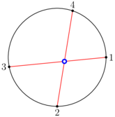

<h1 style='text-align: center;'> C. Maximize the Intersections</h1>

<h5 style='text-align: center;'>time limit per test: 1 second</h5>
<h5 style='text-align: center;'>memory limit per test: 256 megabytes</h5>

On a circle lie $2n$ distinct points, with the following property: however you choose $3$ chords that connect $3$ disjoint pairs of points, no point strictly inside the circle belongs to all $3$ chords. The points are numbered $1, \, 2, \, \dots, \, 2n$ in clockwise order.

Initially, $k$ chords connect $k$ pairs of points, in such a way that all the $2k$ endpoints of these chords are distinct.

You want to draw $n - k$ additional chords that connect the remaining $2(n - k)$ points (each point must be an endpoint of exactly one chord).

In the end, let $x$ be the total number of intersections among all $n$ chords. Compute the maximum value that $x$ can attain if you choose the $n - k$ chords optimally.

## Note

 that the exact position of the $2n$ points is not relevant, as long as the property stated in the first paragraph holds.

### Input

The first line contains a single integer $t$ ($1 \le t \le 100$) — the number of test cases. Then $t$ test cases follow.

The first line of each test case contains two integers $n$ and $k$ ($1 \le n \le 100$, $0 \le k \le n$) — half the number of points and the number of chords initially drawn.

Then $k$ lines follow. The $i$-th of them contains two integers $x_i$ and $y_i$ ($1 \le x_i, \, y_i \le 2n$, $x_i \ne y_i$) — the endpoints of the $i$-th chord. It is guaranteed that the $2k$ numbers $x_1, \, y_1, \, x_2, \, y_2, \, \dots, \, x_k, \, y_k$ are all distinct.

### Output

For each test case, output the maximum number of intersections that can be obtained by drawing $n - k$ additional chords.

## Example

### Input


```text
4
4 2
8 2
1 5
1 1
2 1
2 0
10 6
14 6
2 20
9 10
13 18
15 12
11 7
```
### Output


```text
4
0
1
14
```
## Note

In the first test case, there are three ways to draw the $2$ additional chords, shown below (black chords are the ones initially drawn, while red chords are the new ones):

  We see that the third way gives the maximum number of intersections, namely $4$.

In the second test case, there are no more chords to draw. Of course, with only one chord present there are no intersections.

In the third test case, we can make at most one intersection by drawing chords $1-3$ and $2-4$, as shown below:

  

#### Tags 

#1800 #NOT OK #combinatorics #constructive_algorithms #geometry #greedy #sortings 

## Blogs
- [All Contest Problems](../Codeforces_Global_Round_15.md)
- [Announcement (en)](../blogs/Announcement_(en).md)
- [Tutorial (en)](../blogs/Tutorial_(en).md)
