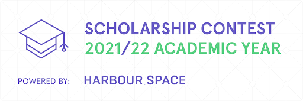
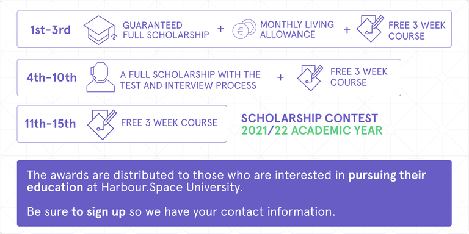

# Announcement

Hey, Codeforces!

We have great news for you. 

Harbour.Space University is excited to announce **a new contest for all interested programmers** who want to start their studies in Barcelona, Spain or Bangkok, Thailand, and join our ICPC team.

The contest will be hosted on the Codeforces platform [Thursday, July 22, 2021 at 20:35UTC+6](https://codeforces.com/https://www.timeanddate.com/worldclock/fixedtime.html?day=22&month=7&year=2021&hour=17&min=35&sec=0&p1=166). We have prepared 9 problems of the joined (Div1 + Div2) level. The round will be **rated and open for everyone.**

UPD: Scoring distribution: 250-500-750-1250-1750-2500-3000-3750-5250

UPD2: The [editorial](Tutorial_(en).md) is out!

  [Sign up for the contest →](https://codeforces.com/contests/1553) For the next academic year (2021/22), we are recruiting a fascinating community of competitive programmers from the top prize-winners of international Olympiads to [join one of our competitive programming teams at the university](https://harbour.space/computer-science/articles/competitive-programming-scholarships?utm_source=codeforces&utm_medium=referral&utm_campaign=programming_team&utm_content=HSSCcontest). 

In the next few years, our goal is to win SWERC and compete at a high level in the ICPC globally. Therefore we want to invest a serious amount of our energy, resources, and talent into these activities. 

That’s why we are inviting you on an exciting journey in the company of like-minded people, outstanding coaches, and our ongoing partnership with Codeforces.

We have already organized over 100 educational rounds, so we think the time has come to test our joint efforts and reward the most diligent. 

**Here’s what you win if you place in the contest:**

, 

The monthly living allowance throughout the entire duration of studies depends on the overall performance of the candidate. As a guidance, it is in the range of 500-1500 EUR (it might be applied to the contestants who win 4th-10th places).

*No application fee is required for any of the awards listed above.

We would like to say a word of appreciation to:

 * Round Coordinator: [BledDest](https://codeforces.com/profile/BledDest "International Grandmaster BledDest")
* Authors: [244mhq](https://codeforces.com/profile/244mhq "Legendary Grandmaster 244mhq"), [bthero](https://codeforces.com/profile/bthero "International Master bthero"), [Adel_SaadEddin](https://codeforces.com/profile/Adel_SaadEddin "Candidate Master Adel_SaadEddin"), [Zaher](https://codeforces.com/profile/Zaher "Master Zaher"), [Errichto](https://codeforces.com/profile/Errichto "Legendary Grandmaster Errichto"), [mnaeraxr](https://codeforces.com/profile/mnaeraxr "Grandmaster mnaeraxr").
* Testers: [nooinenoojno](https://codeforces.com/profile/nooinenoojno "Expert nooinenoojno"), [998kover](https://codeforces.com/profile/998kover "International Grandmaster 998kover"), [Utkarsh.25dec](https://codeforces.com/profile/Utkarsh.25dec "Master Utkarsh.25dec"), [Um_nik](https://codeforces.com/profile/Um_nik "Legendary Grandmaster Um_nik"), [adedalic](https://codeforces.com/profile/adedalic "International Master adedalic"), [Wind_Eagle](https://codeforces.com/profile/Wind_Eagle "Master Wind_Eagle"), [abunyawa](https://codeforces.com/profile/abunyawa "Candidate Master abunyawa"), [aniervs](https://codeforces.com/profile/aniervs "Expert aniervs"), [hitonanode](https://codeforces.com/profile/hitonanode "Legendary Grandmaster hitonanode"), [Aidos](https://codeforces.com/profile/Aidos "International Grandmaster Aidos"), [thenymphsofdelphi](https://codeforces.com/profile/thenymphsofdelphi "Grandmaster thenymphsofdelphi"), [ptd](https://codeforces.com/profile/ptd "International Master ptd"), [ZetaZomB](https://codeforces.com/profile/ZetaZomB "Specialist ZetaZomB"), [rumazius](https://codeforces.com/profile/rumazius "Expert rumazius"), [madxmad](https://codeforces.com/profile/madxmad "Specialist madxmad"), [I.AM.THE.WILL](https://codeforces.com/profile/I.AM.THE.WILL "Newbie I.AM.THE.WILL"), [Vladik](https://codeforces.com/profile/Vladik "Master Vladik").
* MikeMirzayanov for Polygon, Codeforces, partnership with Harbour.Space and making this round happen :)

UPD3: Congratulations to the award winners! 

Note1: All the winners get an application fee waiver.   
 Note2: All of you eligible for Competitive Programming Scholarships (cf rating > 2000) may apply directly through our website and go through the general admissions process. 

Guaranteed full scholarship + monthly living allowance + free 3-week course:   
 - 1 (49). [Ali.Kh](https://codeforces.com/profile/Ali.Kh "International Grandmaster Ali.Kh")   
 - 2 (58). [Yousef_Salama](https://codeforces.com/profile/Yousef_Salama "International Grandmaster Yousef_Salama")   
 - 3 (175). [early-morning-dreams](https://codeforces.com/profile/early-morning-dreams "Pupil early-morning-dreams") 

A full scholarship with interview process + free 3-week course:   
 - 4 (184). [sunyx](https://codeforces.com/profile/sunyx "Master sunyx")   
 - 5 (200). [amanbol](https://codeforces.com/profile/amanbol "Master amanbol")   
 - 6 (203). [IMRED](https://codeforces.com/profile/IMRED "International Master IMRED")   
 - 7 (219). [Meijer](https://codeforces.com/profile/Meijer "Grandmaster Meijer")   
 - 8 (226). [loan](https://codeforces.com/profile/loan "Master loan")   
 - 9 (265). [kpw29](https://codeforces.com/profile/kpw29 "International Master kpw29")   
 - 10 (267). [Huah2](https://codeforces.com/profile/Huah2 "Master Huah2") 

Free 3-week course:   
 - 11 (292). [dhruvsomani](https://codeforces.com/profile/dhruvsomani "Master dhruvsomani")   
 - 12 (299). [adamant](https://codeforces.com/profile/adamant "International Master adamant")   
 - 13 (326). [Kaitokid](https://codeforces.com/profile/Kaitokid "Master Kaitokid")   
 - 14 (355). [RetiredPlayer](https://codeforces.com/profile/RetiredPlayer "Master RetiredPlayer")   
 - 15 (264). [c8kbf](https://codeforces.com/profile/c8kbf "Master c8kbf")   

Good luck, and may the code be with you!

Harbour.Space University

