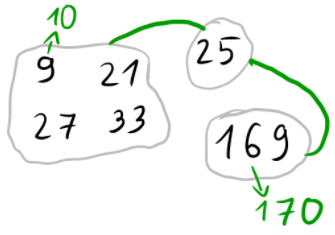

# Tutorial_(en)

Hope you all enjoyed the problemset! Editorials to problems H and I are not ready yet, we will add them as soon as possible. We apologize for weak pretests and easy problems for top participants.

By the way, solution authors did not necessarily prepare the problems. The solutions were chosen at random. 

**UPD.** Editorials for H and I are ready! Wish you all productive upsolving and high ratings!

[1553A - Digits Sum](../problems/A._Digits_Sum.md)

Idea: [bthero](https://codeforces.com/profile/bthero "International Master bthero") Preparation: [244mhq](https://codeforces.com/profile/244mhq "Legendary Grandmaster 244mhq")

 **Tutorial**
### [1553A - Digits Sum](../problems/A._Digits_Sum.md "Harbour.Space Scholarship Contest 2021-2022 (open for everyone, rated, Div. 1 + Div. 2)")

Let's think: what properties do all interesting numbers have? Well, if a number $x$ does not end with $9$, we can say for sure that $f(x+1) = f(x) + 1$, because the last digit will get increased. What if the number ends with $9$? Then the last digit will become $0$, so, no matter what happens to other digits, we can say that $f(x+1)$ will surely be less than $f(x)$. 

So the problem asks us to count all numbers $1 \le x \le n$ with the last digit equal to $9$. It is not hard to see that the answer is equal to $\lfloor \frac{n + 1}{10} \rfloor$. 

This concludes the solution, as we are now able to answer all testcases in $O(1)$, resulting in total $O(t)$ runtime. 

 **Solution (kefaa2)**
```cpp
#include <bits/stdc++.h>

using namespace std;
typedef long long ll;
int main() {
    //freopen("input.txt", "r", stdin);
    ios_base::sync_with_stdio(false);
    int tst;
    cin >> tst;
    while (tst--) {
        int n;
        cin >> n;
        cout << (n + 1) / 10 << 'n';
    }
}

```
[1553B - Reverse String](../problems/B._Reverse_String.md) 

Idea: [Errichto](https://codeforces.com/profile/Errichto "Legendary Grandmaster Errichto") Preparation: Will not be revealed for now because we care for his/their safety.

 **Tutorial**
### [1553B - Reverse String](../problems/B._Reverse_String.md "Harbour.Space Scholarship Contest 2021-2022 (open for everyone, rated, Div. 1 + Div. 2)")

Let's iterate over starting positions, the number of times we go to the right and the number of times we go to the left. After that we can check that resulting string is equal to the needed one. This solution works in O(n4), since there are O(n3) possible combinations of starting position, number of moves to the right and left and each check can take up to O(n) time. To optimize this solution we can notice that if we know number of moves to the right then we can recover number of moves to the left(because we know the length of needed string). So, we have O(n2) possible combinations, that's why this solution works in O(n3), which is enough to pass tests.

Can you solve this problem in O(n2) time? Maybe even faster?

 **Solution (BledDest)**
```cpp
q = int(input())
for i in range(q):
	s = input()
	t = input()
	n = len(s)
	m = len(t)
	ans = False
	for i in range(n):
		for j in range(0, n - i):
			k = m - 1 - j
			if i + j < k:
				continue                                 
			l1 = i
			r = i + j
			l2 = r - k                                
			if s[l1:r+1] + s[l2:r][::-1] == t:
				ans = True	
	print('YES' if ans else 'NO')
```
[1553C - Penalty](../problems/C._Penalty.md)

Idea: [Errichto](https://codeforces.com/profile/Errichto "Legendary Grandmaster Errichto") Preparation: [BledDest](https://codeforces.com/profile/BledDest "International Grandmaster BledDest")

 **Tutorial**
### [1553C - Penalty](../problems/C._Penalty.md "Harbour.Space Scholarship Contest 2021-2022 (open for everyone, rated, Div. 1 + Div. 2)")

After you have fixed the values of ? you can easily find the number of kicks needed to decide the winners in constant time. If you iterate over all possible values of ? you can get solution which works in O(210⋅check) for one testcase, which is enough to pass.

The other possible solution is to notice that it's optimal to change ? of one team to 1 and to 0 for other. So you only have two candidates to check.

 **Solution (BledDest)**
```cpp
#include <bits/stdc++.h>

using namespace std;

int main() {
	int t;
	cin >> t;
	while (t--) {
		string s;
		cin >> s;
		int ans = 9;
		
		{
			int cnt0 = 0, cnt1 = 0;
			for (int i = 0; i < 10; ++i) {
				if (i % 2 == 0) cnt0 += s[i] != '0';
				else cnt1 += s[i] == '1'; 
				if (cnt0 > cnt1 + (10 - i) / 2) ans = min(ans, i);
				if (cnt1 > cnt0 + (9 - i) / 2) ans = min(ans, i);
			}
		}
		
		{
			int cnt0 = 0, cnt1 = 0;
			for (int i = 0; i < 10; ++i) {
				if (i % 2 == 0) cnt0 += s[i] == '1';
				else cnt1 += s[i] != '0'; 
				if (cnt0 > cnt1 + (10 - i) / 2) ans = min(ans, i);
				if (cnt1 > cnt0 + (9 - i) / 2) ans = min(ans, i);
			}
		}
		
		cout << ans + 1 << 'n';
	}
}
```
[1553D - Backspace](../problems/D._Backspace.md)

Idea: [Adel_SaadEddin](https://codeforces.com/profile/Adel_SaadEddin "Candidate Master Adel_SaadEddin"), [Zaher](https://codeforces.com/profile/Zaher "Master Zaher") Preparation: Will not be revealed for now because we care for his/their safety.

 **Tutorial**
### [1553D - Backspace](../problems/D._Backspace.md "Harbour.Space Scholarship Contest 2021-2022 (open for everyone, rated, Div. 1 + Div. 2)")

The main idea of the problem is that backspace results in losing $2$ characters, the one we intended to type (which we replace with a backspace) and the character that the backspace will remove.

In general, the idea is to compare every letter $s_i$ with $t_j$ ​starting from right to left, if they match we will move to compare $s_{i-1}$ with $t_{j-1}$ in the next step, else if they don't match we will delete $s_{i}$ and $s_{i-1}$, then compare $s_{i-2}$ with $t_j$ in the next step and so on.

If we successfully matched all characters in $t$ we will print $YES$, $NO$ otherwise.

 **Solution (Um_nik)**
```cpp
#include <iostream>
#include <cstdio>
#include <cstdlib>
#include <algorithm>
#include <cmath>
#include <vector>
#include <set>
#include <map>
#include <unordered_set>
#include <unordered_map>
#include <queue>
#include <ctime>
#include <cassert>
#include <complex>
#include <string>
#include <cstring>
#include <chrono>
#include <random>
#include <bitset>
using namespace std;

#ifdef LOCAL
	#define eprintf(...) fprintf(stderr, __VA_ARGS__);fflush(stderr);
#else
	#define eprintf(...) 42
#endif

using ll = long long;
using ld = long double;
using uint = unsigned int;
using ull = unsigned long long;
template<typename T>
using pair2 = pair<T, T>;
using pii = pair<int, int>;
using pli = pair<ll, int>;
using pll = pair<ll, ll>;
mt19937_64 rng(chrono::steady_clock::now().time_since_epoch().count());
ll myRand(ll B) {
	return (ull)rng() % B;
}

#define pb push_back
#define mp make_pair
#define all(x) (x).begin(),(x).end()
#define fi first
#define se second

clock_t startTime;
double getCurrentTime() {
	return (double)(clock() - startTime) / CLOCKS_PER_SEC;
}

const int N = 200200;
int n, m;
char s[N], t[N];

bool solve() {
	scanf("%s %s", s, t);
	n = strlen(s);
	m = strlen(t);
	if (n < m) return false;
	int p = (n - m) & 1;
	int q = 0;
	int k = 0;
	for (int i = p; i < n; i++) {
		if (k == 1) {
			k = 0;
			continue;
		}
		if (q < m && s[i] == t[q]) {
			q++;
		} else {
			k++;
		}
	}
	return q == m;
}

int main()
{
	startTime = clock();
//	freopen("input.txt", "r", stdin);
//	freopen("output.txt", "w", stdout);

	int T;
	scanf("%d", &T);
	while(T--) {
		if (solve())
			printf("YESn");
		else
			printf("NOn");
	}

	return 0;
}

```
[1553E - Permutation Shift](../problems/E._Permutation_Shift.md)

Idea: [bthero](https://codeforces.com/profile/bthero "International Master bthero"), [244mhq](https://codeforces.com/profile/244mhq "Legendary Grandmaster 244mhq") Preparation: [BledDest](https://codeforces.com/profile/BledDest "International Grandmaster BledDest")

 **Tutorial**
### [1553E - Permutation Shift](../problems/E._Permutation_Shift.md "Harbour.Space Scholarship Contest 2021-2022 (open for everyone, rated, Div. 1 + Div. 2)")

Let's decrease all numbers by $1$ and start the numeration from $0$, because cyclic shifts are very easy to describe this way. Let's observe for $n = 4$:

* $k = 0$. $p = [0, 1, 2, 3]$. So, $p_i = i$.
* $k = 1$. $p = [3, 0, 1, 2]$. So, $p_i = (i-1) \bmod n$.
* ...

Continuing this process, we verify that indeed, $p_i = (i-k) \bmod n$. Very simple! 

Now suppose we have some value $0 \le k \le n - 1$ and we want to check if it is possible to obtain $p$ from $k$-th cyclic shift by doing at most $m$ swaps. For this, we can calculate the minimum number of swaps and check it is not more than $m$. 

So, how to calculate the minimum number of swaps needed to transform a permutation $a$ to another permutation $b$? This is actually a well-known problem. The idea is, we build a graph with undirected edges $(a_i, b_i)$. The minimum number of swaps will be equal to $n - c$, where $c$ is equal to the number of connected components in the resulting graph.

Nice, now we can check if some $k$ is good in $O(n)$ time. But we can't check all of them, right? Here comes the crucial observation:

Suppose you get a permutation $a$ after a cyclic shift. Then you make at most $m$ swaps and obtain $b$. This means at most $2 \cdot m$ numbers will be out of order! That is, there will be at least $n - 2 \cdot m$ indices $i$ such that $a_i = b_i$. 

So can we calculate the number $cnt_k$ — the count of integers in position for each cyclic shift $k$? Yes, we can! For an arbitrary $i$, there is exactly one $k$ such that $p_i = (i-k) \bmod n$. 

But wait, it means there are in total only $n$ good positions because $\sum cnt_i = n$! And we check only those $k$ for which it is true that $cnt_k \ge n - 2 \cdot m$. Remember that weird constraint $m \le \frac{n}{3}$? Well, turns out there are at most $\frac{n}{n - \frac{2n}{3}} = 3$ different $k$ to consider!

So we know we check at most $3$ different values and we know how to check in $O(n)$ time. That concludes the solution. The time and space complexities are $O(n)$.

 **Solution (BledDest)**
```cpp
#include <bits/stdc++.h>     

using namespace std; 

int cycle_count(vector<int> q, int n)
{
 	for(int i = 0; i < n; i++)
 		q[i]--;
 	vector<int> used(n);
 	int ans = 0;
 	for(int i = 0; i < n; i++)
 	{
 		if(used[i] == 1) continue;
 		int j = i;
 		while(used[j] == 0)
 		{
 		 	used[j] = 1;
 		 	j = q[j];
 		}
 		ans++;
 	}
 	return ans;
}

bool check(int n, int m, int k, vector<int> p)
{
 	vector<int> q;
 	for(int i = k; i < n; i++)
 		q.push_back(p[i]);
 	for(int i = 0; i < k; i++)
 		q.push_back(p[i]);
 	return n - cycle_count(q, n) <= m;
}

void solve()
{
 	int n, m;
 	scanf("%d %d", &n, &m);
 	vector<int> p(n);
 	for(int i = 0; i < n; i++)
 		scanf("%d", &p[i]);
 	vector<int> cnt(n);
 	for(int i = 0; i < n; i++)
 	{
 	 	int offset = i + 1 - p[i];
 	 	if(offset < 0)
 	 		offset += n;
 	 	cnt[offset]++;
 	}
 	vector<int> ans;
 	for(int i = 0; i < n; i++)
 		if(cnt[i] + 2 * m >= n && check(n, m, i, p))
 			ans.push_back(i);
 	printf("%d", ans.size());
 	for(auto x : ans) printf(" %d", x);
 	puts("");
 			
}

int main()
{
	int t;
	scanf("%d", &t);
	for(int i = 0; i < t; i++)
	{
		solve(); 	
	}
}
```
[1553F - Pairwise Modulo](../problems/F._Pairwise_Modulo.md)

Idea: [244mhq](https://codeforces.com/profile/244mhq "Legendary Grandmaster 244mhq"), [Errichto](https://codeforces.com/profile/Errichto "Legendary Grandmaster Errichto") Preparation: [bthero](https://codeforces.com/profile/bthero "International Master bthero")

 **Tutorial**
### [1553F - Pairwise Modulo](../problems/F._Pairwise_Modulo.md "Harbour.Space Scholarship Contest 2021-2022 (open for everyone, rated, Div. 1 + Div. 2)")

First of all, we have to get rid of the mod operation. The following formula helps very much: $x \bmod y = x - y \cdot \lfloor \frac{x}{y} \rfloor$.

Since the sum is hard to deal with, we will divide it into two separate sums $s_k$ and $t_k$ defined as:

$$s_k = \sum_{1 \le i, j \le k, i > j} (a_i \bmod a_j),$$ $$t_k = \sum_{1 \le i, j \le k, i < j} (a_i \bmod a_j).$$

How to calculate $s_k$? Well, we know that $s_k = s_{k-1} + \sum_{i=1}^{k-1} (a_k \bmod a_i) = s_{k-1} + \sum_{i=1}^{k-1} (a_k - a_i \cdot \lfloor \frac{a_k}{a_i} \rfloor)$. Take $a_k$ out of the sum and you get $s_k = s_{k-1} + a_k \cdot (k-1) - \sum_{i=1}^{k-1} (a_i \cdot \lfloor \frac{a_k}{a_i} \rfloor)$. 

So, it is still not clear how to calculate it fast. Let's turn things around. Fix some arbitrary $a_i$ and try to calculate its contribution to all $s_k$ where $k > i$. 

1. For all $a_k$ in range $[a_i, 2 \cdot a_i)$ the contribution is $-a_i$.
2. For all $a_k$ in range $[2 \cdot a_i, 3 \cdot a_i)$ the contribution is $-2 \cdot a_i$.
3. ...
4. For all $a_k$ in range $[d \cdot a_i, (d+1) \cdot a_i)$ the contribution is $-d \cdot a_i$.

This means we can just brute force all reasonable $d$ and perform updates of the kind: add $x$ to all numbers in range $[l, r]$ which is clearly possible using segment tree or Fenwick tree which allows range updates and point queries. 

The only question is: how fast is this? Denote $M$ as $3 \cdot 10^5$. Remember the constraint that all $a_i$ are distinct? It means in the worst-case scenario we will have $\frac{M}{1} + \ldots + \frac{M}{n} = M \cdot (\frac{1}{1} + \ldots + \frac{1}{n})$ updates. The summation inside the brackets is known as a [Harmonic number](https://codeforces.com/https://en.wikipedia.org/wiki/Harmonic_number) which is bounded by $O(\log n)$. So we have $O(M \log n)$ updates. Each update takes $O(\log M)$ time, thus the overall time to calculate $s_k$ is $O(M \log M \log n)$.

Not bad. Will we be able to calculate $t_k$ with the same efficiency though? Well, the only difference between $s_k$ and $t_k$ is the order of indices, so the solution should be almost the same, right? Exactly. But this time, instead of having range updates and point queries, we will have to deal with point updates and range queries. 

Let's get into details. $t_k = t_{k-1} + \sum_{i=1}^{k-1} (a_i \bmod a_k) = t_{k-1} + \sum_{i=1}^{k-1} (a_i - a_k \cdot \lfloor \frac{a_i}{a_k} \rfloor)$. Separate $a_i$ and you get $t_k = t_{k-1} + \sum_{i=1}^{k-1}a_i - \sum_{i=1}^{k-1} (a_k \cdot \lfloor \frac{a_i}{a_k} \rfloor)$.

Almost the same thing. This time, we will go over all multiples of $a_k$:

1. All $a_i$ in range $[a_k, 2 \cdot a_k)$ contribute $-a_k$.
2. All $a_i$ in range $[2 \cdot a_k, 3 \cdot a_k)$ contribute $-2 \cdot a_k$.
3. ...
4. All $a_i$ in range $[d \cdot a_k, (d+1) \cdot a_k)$ contribute $-d \cdot a_k$.

It should be crystal clear by now that we are dealing with point updates and range queries here. The time complexity is the same. 

So, in total we get $O(M \log M \log n)$ time complexity and $O(n + M)$ space complexity. Be careful with segment trees, though. Using the classical recursive segment tree with pushes will probably result in a big constant and time out. Just remember that we are not dealing with advanced stuff there, so there is no need for pushes.

 

 **Solution (bthero)**
```cpp
// chrono::system_clock::now().time_since_epoch().count()
#include <bits/stdc++.h>

using namespace std;

typedef long long ll;

template<int N> struct Fenw {
    ll t[N + 1];

    Fenw() {
        fill(t + 1, t + N + 1, 0ll);
    }

    void update(int p, ll x) {
        for (; p <= N; p |= (p + 1)) {
            t[p] += x;
        }
    }

    ll get(int p) {
        ll ret = 0;

        for (; p > 0; --p) {
            ret += t[p];
            p &= (p + 1);
        }

        return ret;
    }

    ll get(int l, int r) {
        return get(r) - get(l - 1);
    }
};

const int M = (int)3e5;

void solve() {
    int n;
    cin >> n;
    Fenw<M> A, B;
    ll pref = 0, ans = 0;

    for (int i = 1; i <= n; ++i) {
        int x;
        cin >> x;
        ans += x * (i - 1ll);
        ans += A.get(x);
        ans += pref;
        pref += x;
        
        for (int j = x; j <= M; j += x) {
            int l = j, r = min(M, j + x - 1);
            ans -= B.get(l, r) * j;
            A.update(l, -x);
        }

        B.update(x, 1);
        cout << ans << " n"[i == n];
    }
}

int main() {
    ios_base::sync_with_stdio(0);
    cin.tie(0);
    cout.tie(0);

    int tt = 1;

    for (int i = 1; i <= tt; ++i) {
        solve();
    }

    return 0;
}
```
 **Segment tree solution (bthero)**
```cpp
// chrono::system_clock::now().time_since_epoch().count()
#include <bits/stdc++.h>

#define pb push_back
#define eb emplace_back
#define mp make_pair
#define fi first
#define se second
#define all(x) (x).begin(), (x).end()
#define sz(x) (int)(x).size()
#define rep(i, a, b) for (int i = (a); i < (b); ++i)
#define debug(x) cerr << #x << " = " << x << endl

using namespace std;

typedef long long ll;
typedef pair<int, int> pii;
typedef vector<int> vi;

const int M = (int)3e5;

namespace A {
    ll t[M * 4];

    void update(int l, int r, ll x, int v = 1, int tl = 1, int tr = M) {
        if (l > r || tl > r || tr < l) {
            return;
        }

        if (l <= tl && tr <= r) {
            t[v] += x;
            return;
        }

        int mid = (tl + tr) >> 1;
        int c1 = (v << 1), c2 = (c1 | 1);

        update(l, r, x, c1, tl, mid);
        update(l, r, x, c2, mid + 1, tr);
    }

    ll get(int p, int v = 1, int tl = 1, int tr = M) {
        if (tl == tr) {
            return t[v];
        }

        int mid = (tl + tr) >> 1;
        int c1 = (v << 1), c2 = (c1 | 1);

        if (p <= mid) {
            return t[v] + get(p, c1, tl, mid);
        }
        else {
            return t[v] + get(p, c2, mid + 1, tr);
        }
    }
}

namespace B {
    ll t[M * 4];

    void update(int p, ll x, int v = 1, int tl = 1, int tr = M) {
        if (tl == tr) {
            t[v] += x;
            return;
        }

        int mid = (tl + tr) >> 1;
        int c1 = (v << 1), c2 = (c1 | 1);

        if (p <= mid) {
            update(p, x, c1, tl, mid);
        }
        else {
            update(p, x, c2, mid + 1, tr);
        }

        t[v] = t[c1] + t[c2];
    }

    ll get(int l, int r, int v = 1, int tl = 1, int tr = M) {
        if (l > r || tl > r || tr < l) {
            return 0ll;
        }

        if (l <= tl && tr <= r) {
            return t[v];
        }

        int mid = (tl + tr) >> 1;
        int c1 = (v << 1), c2 = (c1 | 1);

        return get(l, r, c1, tl, mid) + get(l, r, c2, mid + 1, tr);
    }
}

int n;

void solve() {
    cin >> n;
    ll pref = 0, ans = 0;

    rep (i, 1, n + 1) {
        int x;
        cin >> x;
        ans += x * (i - 1ll);
        ans += A::get(x);
        ans += pref;
        pref += x;
        
        for (int j = x; j <= M; j += x) {
            int l = j, r = min(M, j + x - 1);
            ans -= x * B::get(l, r) * (j / x);
            A::update(l, r, -x * (j / x));
        }

        B::update(x, 1);
        cout << ans << " n"[i == n];
    }
}

int main() {
    ios_base::sync_with_stdio(0);
    cin.tie(0);
    cout.tie(0);

    int tt = 1;

    for (int i = 1; i <= tt; ++i) {
        solve();
    }

    return 0;
}
```
[1553G - Common Divisor Graph](../problems/G._Common_Divisor_Graph.md)

Idea: [Adel_SaadEddin](https://codeforces.com/profile/Adel_SaadEddin "Candidate Master Adel_SaadEddin"), [Zaher](https://codeforces.com/profile/Zaher "Master Zaher"), [Errichto](https://codeforces.com/profile/Errichto "Legendary Grandmaster Errichto") Preparation: [Errichto](https://codeforces.com/profile/Errichto "Legendary Grandmaster Errichto")

 **Tutorial**
### [1553G - Common Divisor Graph](../problems/G._Common_Divisor_Graph.md "Harbour.Space Scholarship Contest 2021-2022 (open for everyone, rated, Div. 1 + Div. 2)")

tl;dr - Find initial CCs. Then for every $a_i$, find prime divisors of $a_i+1$ and draw new edges of cost 1 between each pair of those primes, and between $a_i$ and those primes.

Part 1, notation and observations

Two numbers are not coprime iff they have a common prime divisor. Let $P(x)$ denote distinct prime divisors of $x$. For example $P(100) = \{2, 5\}$. You can run prime sieve to find $P(x)$ for all $x \in [2, 10^6 + 1]$.

Useful interpretation: Creating $a_i \cdot (a_i + 1)$ is like creating $(a_i + 1)$ and drawing an extra edge between $a_i$ and $(a_i + 1)$.

Observation: answer doesn't exceed two because you can move between even values. If the starting node isn't even, use one operation to create $a_s + 1$. If the target node isn't even, use one operation to create $a_t + 1$. Now you can move between them.

So we just need to check if answer is 0 or 1.

Part 2, checking if answer is 0

Let's find CCs (connected components) of the initial graph. Creates a node for each prime, even if it's not in the input. For each $a_i$, connect it to all values from $P(a_i)$. Use DFS or DSU to find CCs.

Given a query, check if two nodes belong to the same CC. If so, the answer is 0.

Part 3, checking if answer is 1.

Let's say that $a_s$ and $a_t$ belong to two different CC, denoted cc1 and cc2. The answer is 1 in three cases: we spend one operation on a node from cc1, or a node from cc2, or a node from a completely different CC. The last case is needed e.g. for input $n = 3$, $a = (3, 7, 20)$. You need to replicate $20$ into $21$ in order to make $3$ and $7$ reachable from one another.

For every $a_i$, let's consider replicating it into $a_i + 1$. Let's draw new edges of cost 1 between CC of $a_i$ and all CCs of values $P(a_i + 1)$.

  In the drawing, gray areas are initial CCs. Green edges have cost 1. For example, 9 can create 10, so we connect the whole CC with (9, 21, 27, 33) with the whole CC of prime 5, which contains the input value (25). You can't get from 169 to 9 with cost though. That would be possible if 25 replicated into 26 would be connected to both (9, 21, 27, 33) and to (169). To consider such cases, we need to draw green edges between all pairs of $P(a_i + 1)$ too.

For example, if $a_i = 9$, then $P(a_i + 1) = \{2, 5\}$ so we draw green edges 2-5, 2-3, 3-5.

Given a query, check if there is a green edge between the two CCs. If so, the answer is 1.

—

(should be in spoiler tags) A note about the worst case and preparing tests. One type of max tests is created by choosing $n$ values $x \leq 10^6$ with most distinct prime divisors of $x + 1$. With few exceptions, that means four or five primes, e.g. $2 \cdot 3 \cdot 5 \cdot 7 \cdot 11 = 2310$, and on average $5 \cdot 4 / 2 = 10$ edges of cost 1. It could happen though that choosing such values yields a small number of CCs and thus the solution is actually faster. What if there are some other tests that will make the intended solution significantly slower? In particular, only one CC would mean no edges at all. To check that, we run the intended solution and modified the code of "edges of cost 1" part to pretend that all numbers $a_i$ are coprime. That requires around 1'700'000 inserts to a set and takes less than 1 second. It's much faster if you use vector and then sort it. This "pretend" part couldn't be used in the testset but it was needed to see that the intended solution can for sure solve any test within TL.

 **Solution (Errichto)**
```cpp
// gcd, AC, O((N+Q) * log^2), by Errichto
#include <bits/stdc++.h>
using namespace std;
#define sim template < class c
#define ris return * this
#define dor > debug & operator <<
#define eni(x) sim > typename 
  enable_if<sizeof dud<c>(0) x 1, debug&>::type operator<<(c i) {
sim > struct rge { c b, e; };
sim > rge<c> range(c i, c j) { return rge<c>{i, j}; }
sim > auto dud(c* x) -> decltype(cerr << *x, 0);
sim > char dud(...);
struct debug {
#ifdef LOCAL
~debug() { cerr << endl; }
eni(!=) cerr << boolalpha << i; ris; }
eni(==) ris << range(begin(i), end(i)); }
sim, class b dor(pair < b, c > d) {
  ris << "(" << d.first << ", " << d.second << ")";
}
sim dor(rge<c> d) {
  *this << "[";
  for (auto it = d.b; it != d.e; ++it)
	*this << ", " + 2 * (it == d.b) << *it;
  ris << "]";
}
#else
sim dor(const c&) { ris; }
#endif
};
#define imie(...) " [" << #__VA_ARGS__ ": " << (__VA_ARGS__) << "] "
// debug & operator << (debug & dd, P p) { dd << "(" << p.x << ", " << p.y << ")"; return dd; }

struct DSU {
	vector<int> parent;
	DSU(int m) {
		parent.resize(m + 1);
		for(int i = 0; i <= m; ++i) {
			parent[i] = i;
		}
	}
	int find(int a) {
		if(a == parent[a]) {
			return a;
		}
		return parent[a] = find(parent[a]);
	}
	void uni(int a, int b) {
		parent[find(a)] = find(b);
	}
};

int main() {
	// 1) read input
	int n, q;
	scanf("%d%d", &n, &q);
	vector<int> a(n);
	for(int i = 0; i < n; ++i) {
		scanf("%d", &a[i]);
	}
	int m = *max_element(a.begin(), a.end());
	// 2) prime sieve
	vector<vector<int>> prime_divisors(m + 2);
	for(int p = 2; p <= m + 1; ++p) {
		if(prime_divisors[p].empty()) {
			for(int j = p; j <= m + 1; j += p) {
				prime_divisors[j].push_back(p);
			}
		}
	}
	// 3) DSU, find initial connected components
	DSU dsu(m + 2);
	for(int x : a) {
		for(int p : prime_divisors[x]) {
			dsu.uni(x, p);
		}
	}
	// 4) DSU, find edges of cost 1
	set<pair<int,int>> edges;
	for(int x : a) {
		vector<int> nodes = prime_divisors[x+1];
		nodes.push_back(x);
		for(int& node : nodes) {
			node = dsu.find(node);
		}
		for(int i = 0; i < (int) nodes.size(); ++i) {
			for(int j = i + 1; j < (int) nodes.size(); ++j) {
				int one = nodes[i];
				int two = nodes[j];
				if(one != two) {
					if(one > two) {
						swap(one, two);
					}
					edges.insert({one, two});
				}
			}
		}
	}
	debug() << imie(edges);
	cerr << imie(edges.size()) << endl;
	// 5) answer queries
	while(q--) {
		int s, t;
		scanf("%d%d", &s, &t);
		--s;
		--t;
		s = dsu.find(a[s]);
		t = dsu.find(a[t]);
		if(s == t) {
			puts("0");
		}
		else if(edges.count({min(s, t), max(s, t)})) {
			puts("1");
		}
		else {
			puts("2");
		}
	}
}
```
[1553H - XOR and Distance](../problems/H._XOR_and_Distance.md)

Idea: [244mhq](https://codeforces.com/profile/244mhq "Legendary Grandmaster 244mhq") Preparation: [BledDest](https://codeforces.com/profile/BledDest "International Grandmaster BledDest"), [mnaeraxr](https://codeforces.com/profile/mnaeraxr "Grandmaster mnaeraxr"), [244mhq](https://codeforces.com/profile/244mhq "Legendary Grandmaster 244mhq")

 **Tutorial**
### [1553H - XOR and Distance](../problems/H._XOR_and_Distance.md "Harbour.Space Scholarship Contest 2021-2022 (open for everyone, rated, Div. 1 + Div. 2)")

There are two main approaches to this problem, both of them utilize the same data structure — a trie. But not the usual trie.

We will build a trie with each node storing the following four values. Let the interval represented by a node be $[L, R)$, then the values are:

* $minval$ — minimum existing value in the segment relative to $L$, so, for example, if $L = 4$ and the minimum number in the segment is $5$, then $minval = 1$;
* $maxval$ — maximum existing value in the segment. Relative to $L$ as well;
* $ans$ — the minimum distance between two existing values in the subtree;
* $len$ — the size of the segment represented by the node.

We build this structure for $x = 0$, so we just add all the values of the original array into the trie. What happens to this structure when we flip some bit $x$? Let's say that the bit $k-1$ is flipped. It means that we have to swap the left child and the right child of the root of the trie. If we flip the bit $k-2$, we need to swap the neighboring nodes in this trie on depth $2$, and so on. When we flip the $k-i$-th bit, it means that we have to rebuild the first $i + 1$ layers of the trie, which have $2^{i+1} - 1$ nodes.

So we need to iterate through all possible values of $x$ while rebuilding the data structure in some way that our rebuilds are not too costly. One of the ways to do it is to use [Gray code](https://codeforces.com/https://en.wikipedia.org/wiki/Gray_code). If we iterate on $x$ using a variation of Gray code where we start from most significant bits instead of the least significant bits, the bit $k-1$ will be swapped $2^{k-1}$ times (and the total rebuild time for these swaps will be $2^{k-1} \cdot 3 < 2^{k+1}$), the bit $k-2$ will be swapped $2^{k-2}$ times (and the total rebuild time for these swaps will be $2^{k-2} \cdot 7 < 2^{k+1}$), and so on. So, the total rebuild time for the whole process will be $O(2^k \cdot k)$.

Brief description of the second approach: for each node, we can store multiple versions of that node. A version of a node is another node which represents the same subtree having all of the numbers XOR'ed by some number $x$. We can see that if we try to XOR all numbers of a node representing a segment of size $4$ by, for example, $8$, nothing changes, and if we try to XOR all numbers by, for example, $11$, the result for this subtree will be the same as if we XOR it by $3$. So, for a subtree of size $m$, we store $m$ versions of it, so the whole structure contains $2^k \cdot k$ versions of nodes.

 **Solution (BledDest)**
```cpp
#include<bits/stdc++.h>

using namespace std;

const int INF = int(1e9);
const int K = 20;

struct node
{
 	int max_val, min_val, ans, len;
 	node* left;
 	node* right;

 	void recalc()
 	{
 		len = left->len + right->len;
 		max_val = max(left->max_val, right->max_val + left->len);
 		min_val = min(left->min_val, right->min_val + left->len);
 	 	ans = min(min(left->ans, right->ans), min(INF, right->min_val - left->max_val + left->len));
 	}

 	node(int x)
 	{
 	 	ans = INF;
 	 	len = 1;
 	 	if(x == 1)
 	 	 	max_val = min_val = 0;
 	 	else
 	 	{
 	 	 	max_val = -INF;
 	 	 	min_val = INF;
 	 	}
 	}

 	node(node* l, node* r)
 	{
 	 	left = l;
 	 	right = r;
 	 	recalc();
 	}

 	node() {};
};

int cnt[1 << K];
node tree[2 << K];

int n, k, m;

void build(int v, int l, int r)
{
 	if(l == r - 1)
 		tree[v] = node(cnt[l]);
 	else
 	{
 		int m = (l + r) / 2;
 		build(v * 2 + 1, l, m);
 		build(v * 2 + 2, m, r);
 		tree[v] = node(&tree[v * 2 + 1], &tree[v * 2 + 2]); 	
 	}
 	//cerr << v << " " << l << " " << r << " " << tree[v].min_val << " " << tree[v].max_val << " " << tree[v].len << " " << tree[v].ans << endl;
}

void swap_segments(node* v, int d)
{
	if(d == 0)
	{
	 	swap(v->left, v->right);
	 	v->recalc();
 	}
 	else
 	{
 	 	swap_segments(v->left, d - 1);
 	 	swap_segments(v->right, d - 1);	
 	 	v->recalc();
 	}
 	//cerr << v->min_val << " " << v->max_val << " " << v->len << " " << v->ans << endl;
}

int res[1 << K];

int cur = 0;

void rec(int x)
{
    if(x == 0)
     	res[cur] = tree[0].ans;
    else
    	rec(x - 1);
    swap_segments(&tree[0], x);
    cur ^= (1 << (k - x - 1));
    if(x == 0)
    	res[cur] = tree[0].ans;
    else
    	rec(x - 1);
}	

int main()
{            
	scanf("%d %d", &n, &k);
	for(int i = 0; i < n; i++)
	{
		int x;
	 	scanf("%d", &x);
	 	cnt[x]++;
	}
	m = 1 << k;
	build(0, 0, m);
	rec(k - 1);
	for(int i = 0; i < m; i++)
		printf("%d ", res[i]);
	puts("");
}
```
 **Alternative solution (BledDest)**
```cpp
#include<bits/stdc++.h>

using namespace std;

const int INF = int(1e9);
const int K = 20;

struct node
{
 	int max_val, min_val, ans, len;
 	
 	node(const node& left, const node& right)
 	{
 		len = left.len + right.len;
 		max_val = max(left.max_val, right.max_val + left.len);
 		min_val = min(left.min_val, right.min_val + left.len);
 	 	ans = min(min(left.ans, right.ans), min(INF, right.min_val - left.max_val + left.len));
 	}

 	node(int x)
 	{
 	 	ans = INF;
 	 	len = 1;
 	 	if(x == 1)
 	 	 	max_val = min_val = 0;
 	 	else
 	 	{
 	 	 	max_val = -INF;
 	 	 	min_val = INF;
 	 	}
 	}

 	node() {};
};

int cnt[1 << K];
vector<node> tree[2 << K];	

void build(int v, int l, int r)
{
	tree[v].resize(r - l);
 	if(l == r - 1)
 	{
 		tree[v][0] = node(cnt[l]);	
 	}
 	else
 	{
 	 	int m = (l + r) / 2;
 	 	build(v * 2 + 1, l, m);
 	 	build(v * 2 + 2, m, r);
 	 	for(int i = 0; i < m - l; i++)
 	 	{
 	 		tree[v][i] = node(tree[v * 2 + 1][i], tree[v * 2 + 2][i]);
 	 		tree[v][i + (m - l)] = node(tree[v * 2 + 2][i], tree[v * 2 + 1][i]); 	
 	 	}
 	}
}

int main()
{            
	int n, k;
	scanf("%d %d", &n, &k);
	for(int i = 0; i < n; i++)
	{
		int x;
	 	scanf("%d", &x);
	 	cnt[x]++;
	}
	int m = 1 << k;
	build(0, 0, m);
	for(int i = 0; i < m; i++)
		printf("%d ", tree[0][i].ans);
	puts("");
}
```
[1553I - Stairs](../problems/I._Stairs.md)

Idea: [bthero](https://codeforces.com/profile/bthero "International Master bthero"), [244mhq](https://codeforces.com/profile/244mhq "Legendary Grandmaster 244mhq"), [BledDest](https://codeforces.com/profile/BledDest "International Grandmaster BledDest") Preparation: [BledDest](https://codeforces.com/profile/BledDest "International Grandmaster BledDest"), [244mhq](https://codeforces.com/profile/244mhq "Legendary Grandmaster 244mhq")

 **Tutorial**
### [1553I - Stairs](../problems/I._Stairs.md "Harbour.Space Scholarship Contest 2021-2022 (open for everyone, rated, Div. 1 + Div. 2)")

First of all, we need to transform the stair array into some other structure. Let's show that for each number, there is only one longest stair covering it, and these longest stairs are disjoint.

Suppose that some number $x$ belongs to two different ascending stairs. We can easily expand these stairs to the left and to the right and find the longest ascending stair covering the number. So, it means that the longest ascending stair covering a number is unique. The same for descending stairs.

Now suppose that some number $x$ belongs to an ascending stair of length $\ge 2$ and a descending stair of length $\ge 2$. It is impossible because it would mean that we have consecutive values $[x-1, x, x-1]$ or $[x+1, x, x+1]$ in the permutation, but since it is a permutation, all values should be distinct. So, the longest stair covering each number is unique.

Let's split the stair array into this sequence of longest stairs. The first element of the stair array belongs to some stair. If $a_1 = k$, then the first $k$ elements form a stair. Let's check that all these $k$ elements are equal to $k$ and split them into a stair of length $k$, then continue the same algorithm from $a_{k+1}$.

Okay, now we have an array of the lengths of the longest stairs. Each stair represents some segment of numbers, and all stairs can be enumerated by the index of their value segment. So, it looks like the number of permutations that yeild this array of longest stairs is $s! 2^{s'}$, where $s$ is the number of stairs and $s'$ is the number of stairs having length $\ge 2$. The reasoning behind this formula is that each stair gets assigned an index corresponding to the index of its value segment in the sorted order, and for stairs of length $\ge 2$, we can choose whether they are ascending or descending. Is that formula right?

Unfortunately, no. The fact that we have the array of longest stairs means that we need to ensure that no pair of adjacent stairs merge. And there's no easy way to change this formula, unfortunately.

Let's use inclusion-exclusion to eliminate all "bad" permutations. We have $s-1$ constraints that shouldn't be violated:

* stairs $1$ and $2$ shouldn't merge;
* stairs $2$ and $3$ shouldn't merge;
* ...;
* stairs $s-1$ and $s$ shouldn't merge.

For every $i$ from $0$ to $s-1$, we can calculate the number of ways to choose $i$ constraints to be violated and a permutation that violates these constrains (and maybe some others), like in the usual inclusion-exclusion formula applications. These values can be calculated with the following dynamic programming: $dp_{n,k,t}$ is the number of ways to choose this set of $k$ violated constraints and a permutation for $n$ first stairs, and $t$ represents the type of the last stair (ascending/descending or having size $1$).

What are the transitions in this dynamic programming? When placing a new stair, we may choose either to explicitly violate the constraint on merging it with the previous one (so, we transition to a state $dp_{n+1,k+1,t'}$ and maybe multiply/divide the value by $2$ if we are merging two size-$1$ stairs or merging two stairs with different types). Or we can choose to just make an entirely new stair, choosing one of $n-k+1$ values for it (since we already have $n-k$ stairs), choosing its type if its length is $\ge 2$, and transitioning to $dp_{n+1,k,t'}$.

The main drawback of this solution is that it's $O(n^2)$. Let's find a way to optimize it.

Let's calculate this dynamic programming in a divide-and-conquer fashion. Let's say that for some segment $[l, r]$ of stairs, we will calculate a three-dimensional array $dp_{tl,tr,i}$ — the number of ways to violate $i$ constraints in this segment so that the leftmost stair in this segment has type $tl$, and the rightmost stair in this segment has type $tr$.

Suppose we want to merge these two segments. We either merge the leftmost stair of the right segment with the rightmost stair of the left segment, or don't. Let's analyze the case when we don't merge them. Let's analyze the value of $dp_{tl, tr, i}$ in the resulting array. Suppose we violate $k$ constraints in the left segment, this leaves us to violate $i-k$ constraints in the right segment. So, the value of $dp_{tl,tr,i}$ in the resulting merged structure will be the sum of $dp_{tl,?,k}$ from the left segment multiplied by $dp_{?,tr,i-k}$ from the right segment (where $?$ can represent any type). And if we treat the values from the left and the right segment as polynomials (where value of $dp_{tl,?,k}$ or $dp_{?,tr,k}$ is the coefficient for $x^k$), merging them is exactly polynomial multiplication! So we can use FFT so speed up the merging.

If we want to merge two segments while explicitly violating the constraint that the rightmost stair in the left segment and the leftmost stair in the right segment shouldn't be merged into one, it can be done with polynomial multiplication as well, but you also have to multiply the result by some coefficient that arises from merging those two stairs (if both of them had size $1$, then we multiply the result by $2$ since we can choose whether the resulting stair is ascending or descending; and if both of them had size $\ge 1$, we divide the result by $2$ since we cannot merge an ascending stair with a descending one).

So, this optimization allows us to merge two segments of length $n$ in time $O(n \log n)$, and as the usual FFT + D&C combination, this results in a complexity of $O(n \log^2 n)$, though with a fairly large constant factor.

 **Solution (BledDest)**
```cpp
#include<bits/stdc++.h>

using namespace std;

#define forn(i, n) for(int i = 0; i < int(n); i++)
#define sz(a) ((int)((a).size()))
#define fore(i, l, r) for(int i = int(l); i < int(r); i++)

template<const int &MOD>
struct _m_int {
	int val;
 
	_m_int(int64_t v = 0) {
		if (v < 0) v = v % MOD + MOD;
		if (v >= MOD) v %= MOD;
		val = int(v);
	}
 
	_m_int(uint64_t v) {
		if (v >= MOD) v %= MOD;
		val = int(v);
	}
 
	_m_int(int v) : _m_int(int64_t(v)) {}
	_m_int(unsigned v) : _m_int(uint64_t(v)) {}
 
	static int inv_mod(int a, int m = MOD) {
		int g = m, r = a, x = 0, y = 1;
 
		while (r != 0) {
			int q = g / r;
			g %= r; swap(g, r);
			x -= q * y; swap(x, y);
		}
 
		return x < 0 ? x + m : x;
	}
 
	explicit operator int() const { return val; }
	explicit operator unsigned() const { return val; }
	explicit operator int64_t() const { return val; }
	explicit operator uint64_t() const { return val; }
	explicit operator double() const { return val; }
	explicit operator long double() const { return val; }
 
	_m_int& operator+=(const _m_int &other) {
		val -= MOD - other.val;
		if (val < 0) val += MOD;
		return *this;
	}
 
	_m_int& operator-=(const _m_int &other) {
		val -= other.val;
		if (val < 0) val += MOD;
		return *this;
	}
 
	static unsigned fast_mod(uint64_t x, unsigned m = MOD) {
#if !defined(_WIN32) || defined(_WIN64)
		return unsigned(x % m);
#endif
		// Optimized mod for Codeforces 32-bit machines.
		// x must be less than 2^32 * m for this to work, so that x / m fits in an unsigned 32-bit int.
		unsigned x_high = unsigned(x >> 32), x_low = unsigned(x);
		unsigned quot, rem;
		asm("divl %4n"
			: "=a" (quot), "=d" (rem)
			: "d" (x_high), "a" (x_low), "r" (m));
		return rem;
	}
 
	_m_int& operator*=(const _m_int &other) {
		val = fast_mod(uint64_t(val) * other.val);
		return *this;
	}
 
	_m_int& operator/=(const _m_int &other) {
		return *this *= other.inv();
	}
 
	friend _m_int operator+(const _m_int &a, const _m_int &b) { return _m_int(a) += b; }
	friend _m_int operator-(const _m_int &a, const _m_int &b) { return _m_int(a) -= b; }
	friend _m_int operator*(const _m_int &a, const _m_int &b) { return _m_int(a) *= b; }
	friend _m_int operator/(const _m_int &a, const _m_int &b) { return _m_int(a) /= b; }
 
	_m_int& operator++() {
		val = val == MOD - 1 ? 0 : val + 1;
		return *this;
	}
 
	_m_int& operator--() {
		val = val == 0 ? MOD - 1 : val - 1;
		return *this;
	}
 
	_m_int operator++(int) { _m_int before = *this; ++*this; return before; }
	_m_int operator--(int) { _m_int before = *this; --*this; return before; }
 
	_m_int operator-() const {
		return val == 0 ? 0 : MOD - val;
	}
 
	friend bool operator==(const _m_int &a, const _m_int &b) { return a.val == b.val; }
	friend bool operator!=(const _m_int &a, const _m_int &b) { return a.val != b.val; }
	friend bool operator<(const _m_int &a, const _m_int &b) { return a.val < b.val; }
	friend bool operator>(const _m_int &a, const _m_int &b) { return a.val > b.val; }
	friend bool operator<=(const _m_int &a, const _m_int &b) { return a.val <= b.val; }
	friend bool operator>=(const _m_int &a, const _m_int &b) { return a.val >= b.val; }
 
	_m_int inv() const {
		return inv_mod(val);
	}
 
	_m_int pow(int64_t p) const {
		if (p < 0)
			return inv().pow(-p);
 
		_m_int a = *this, result = 1;
 
		while (p > 0) {
			if (p & 1)
				result *= a;
			a *= a;
			p >>= 1;
		}
 
		return result;
	}
 
	friend ostream& operator<<(ostream &os, const _m_int &m) {
		return os << m.val;
	}
};
 
extern const int MOD = 998244353;
using Mint = _m_int<MOD>;

const int LOGN = 19;
const int N = (1 << LOGN);
const int T = 2;          
Mint g = 3;

vector<Mint> w[LOGN];
vector<int> rv[LOGN];

void precalc() {
	Mint wb = Mint(g).pow((MOD - 1) / (1 << LOGN));
	forn(st, LOGN - 1) {
		w[st].assign(1 << st, 1);
		Mint bw = wb.pow(1 << (LOGN - st - 1));
		Mint cw = 1;
		forn(k, 1 << st) {
			w[st][k] = cw;
			cw *= bw;
		}
	}
	forn(st, LOGN) {
		rv[st].assign(1 << st, 0);
		if (st == 0) {
			rv[st][0] = 0;
			continue;
		}
		int h = (1 << (st - 1));
		forn(k, 1 << st)
			rv[st][k] = (rv[st - 1][k & (h - 1)] << 1) | (k >= h);
	}
}

void ntt(vector<Mint> &a, bool inv) {
	int n = sz(a);
	int ln = __builtin_ctz(n);
	forn(i, n) {
		int ni = rv[ln][i];
		if (i < ni) swap(a[i], a[ni]);
	}
	forn(st, ln) {
		int len = 1 << st;
		for (int k = 0; k < n; k += (len << 1)) {
			fore(pos, k, k + len){
				Mint l = a[pos];
				Mint r = a[pos + len] * w[st][pos - k];
				a[pos] = l + r;
				a[pos + len] = l - r;
			}
		}
	}
	if (inv) {
		Mint rn = Mint(n).inv();
		forn(i, n) a[i] *= rn;
		reverse(a.begin() + 1, a.end());
	}
}

vector<Mint> mul(vector<Mint> a, vector<Mint> b) {
	int cnt = 1 << (32 - __builtin_clz(sz(a) + sz(b) - 1));
	a.resize(cnt);
	b.resize(cnt);
	ntt(a, false);
	ntt(b, false);
	vector<Mint> c(cnt);
	forn(i, cnt) c[i] = a[i] * b[i];
	ntt(c, true);
	while(c.size() > 1 && c.back() == 0)
		c.pop_back();
	return c;
}

struct dp
{
 	vector<Mint> val[T][T];
 	bool is_unit;

 	dp() {};
 	dp(int len)
 	{
 		is_unit = len == 1;
 		for(int j = 0; j < T; j++)
 			for(int k = 0; k < T; k++)
 				val[j][k] = {0};
 		if(len == 1)
 			val[0][0][0] = 1;
 		else
 			val[1][1][0] = 2;
 	}

 	dp(const dp& a, const dp& b)
 	{
 		is_unit = false;
 		for(int l1 = 0; l1 < T; l1++)
 			for(int r1 = 0; r1 < T; r1++)
 				for(int l2 = 0; l2 < T; l2++)
 					for(int r2 = 0; r2 < T; r2++)
 					{
 					 	vector<Mint> cur = mul(a.val[l1][r1], b.val[l2][r2]);
 					 	if(val[l1][r2].size() < cur.size())
 					 		val[l1][r2].resize(cur.size());
 					 	for(int i = 0; i < cur.size(); i++)
 							val[l1][r2][i] += cur[i];
 					 	Mint merge_coeff = 2;
 					 	if(r1 == 1)
 					 		merge_coeff /= 2;
 					 	if(l2 == 1)
 					 		merge_coeff /= 2;
 					 	cur.insert(cur.begin(), 0);
 					 	for(int i = 0; i < cur.size(); i++)
 					 		cur[i] *= merge_coeff;
 					 	int L1 = l1;
 					 	int R2 = r2;
 					 	if(a.is_unit)
 					 		L1 = 1;
 					 	if(b.is_unit)
 					 		R2 = 1;
 					 	if(val[L1][R2].size() < cur.size())
 					 		val[L1][R2].resize(cur.size());
 					 	for(int i = 0; i < cur.size(); i++)
 					 	{
 					 		val[L1][R2][i] += cur[i];
 						}
 				 	}
 	}
};

ostream& operator<<(ostream& out, const dp& a)
{
 	for(int i = 0; i < T; i++)
 		for(int j = 0; j < T; j++)
 		{
 		 	out << "[" << i << "][" << j << "]";
 		 	for(auto x : a.val[i][j])
 		 		out << " " << x;
 		 	out << endl;
 		}
 	return out;
}

int a[N];
int len[N];
Mint fact[N];
int n;
int s;

dp build(int l, int r)
{
 	if(l == r - 1)
 	{
 		dp res(len[l]);   
 		//cerr << l << " " << r << endl;
 	 	//cerr << res;
 	 	return res;
 	}                     
 	else
 	{
 		int m = (l + r) / 2;
 		dp res(build(l, m), build(m, r));
 		//cerr << l << " " << r << endl;
 		//cerr << res;
 		return res;                         
 	}
}

int main()
{
	precalc();
	scanf("%d", &n);
	for(int i = 0; i < n; i++)
	 	scanf("%d", &a[i]);
	int cur = 0;
	while(cur != n)
	{
	 	if(cur + a[cur] > n)
	 	{
         	cout << 0 << endl;
         	return 0;
        }
        for(int l = cur; l < cur + a[cur]; l++)
        	if(a[l] != a[cur])
        	{
        	 	cout << 0 << endl;
        	 	return 0;
        	}
        len[s++] = a[cur];
        cur += a[cur];
	}
	
	fact[0] = 1;
	for(int i = 1; i <= s; i++)
		fact[i] = i * fact[i - 1];

	dp res = build(0, s);

	Mint ans = 0;
	for(int i = 0; i < s; i++)            
		for(int j = 0; j < T; j++)
			for(int k = 0; k < T; k++)
				if(res.val[j][k].size() > i)
					ans += fact[s - i] * res.val[j][k][i] * (i % 2 == 0 ? 1 : MOD - 1);
	cout << ans << endl;
}
```
