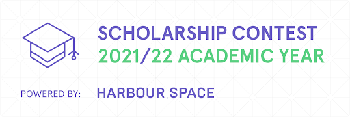

# Announcement

Hello Codeforces!

On [Friday, July 30, 2021 at 20:35UTC+6](https://codeforces.com/https://www.timeanddate.com/worldclock/fixedtime.html?day=30&month=7&year=2021&hour=17&min=35&sec=0&p1=166) [Educational Codeforces Round 112 (Rated for Div. 2)](https://codeforces.com/contest/1555 "Educational Codeforces Round 112 (Rated for Div. 2)") will start.

Series of Educational Rounds continue being held as [Harbour.Space University](https://codeforces.com/https://harbour.space/) initiative! You can read the details about the cooperation between [Harbour.Space University](https://codeforces.com/https://harbour.space/) and Codeforces in the [blog post](//codeforces.com/blog/entry/51208).

This round will be **rated for the participants with rating lower than 2100**. It will be held on extended ICPC rules. The penalty for each incorrect submission until the submission with a full solution is 10 minutes. After the end of the contest you will have 12 hours to hack any solution you want. You will have access to copy any solution and test it locally.

You will be given **6 or 7 problems** and **2 hours** to solve them.

The problems were invented and prepared by Adilbek [adedalic](https://codeforces.com/profile/adedalic "International Master adedalic") Dalabaev, Vladimir [vovuh](https://codeforces.com/profile/vovuh "Master vovuh") Petrov, Ivan [BledDest](https://codeforces.com/profile/BledDest "International Grandmaster BledDest") Androsov, Maksim [Neon](https://codeforces.com/profile/Neon "Candidate Master Neon") Mescheryakov and me. Also huge thanks to Mike [MikeMirzayanov](https://codeforces.com/profile/MikeMirzayanov "Headquarters, MikeMirzayanov") Mirzayanov for great systems Polygon and Codeforces.

Good luck to all the participants!

Our friends at Harbour.Space also have a message for you:

*Hello once again, Codeforces!*

*It’s been a week since we completed our Harbour.Space Scholarship Contest. It’s was an intense journey, but we are excited to share the results of the contest and take this time to give a word of appreciation to every participant.* 

*One more big shout out to the authors and round coordinator who made this contest happen in a short period of time:*

 * *Round Coordinator:* [BledDest](https://codeforces.com/profile/BledDest "International Grandmaster BledDest")
* *Authors:* [244mhq](https://codeforces.com/profile/244mhq "Legendary Grandmaster 244mhq"), [bthero](https://codeforces.com/profile/bthero "Master bthero"), [Adel_SaadEddin](https://codeforces.com/profile/Adel_SaadEddin "Candidate Master Adel_SaadEddin"), [Zaher](https://codeforces.com/profile/Zaher "Master Zaher"), [Errichto](https://codeforces.com/profile/Errichto "Legendary Grandmaster Errichto"), [mnaeraxr](https://codeforces.com/profile/mnaeraxr "Grandmaster mnaeraxr").

*Thank you again for all your hard work.* 

*Congratulations to all the winners and runner-ups who got the opportunity to go through the admissions process and who are eligible for a full scholarship.*

*1st-3rd Places: [Ali.Kh](https://codeforces.com/profile/Ali.Kh "International Grandmaster Ali.Kh"), [Yousef_Salama](https://codeforces.com/profile/Yousef_Salama "International Grandmaster Yousef_Salama"), [early-morning-dreams](https://codeforces.com/profile/early-morning-dreams "Pupil early-morning-dreams")*

*4th-10th Places: [sunyx](https://codeforces.com/profile/sunyx "Master sunyx"), [amanbol](https://codeforces.com/profile/amanbol "Master amanbol"), [IMRED](https://codeforces.com/profile/IMRED "International Master IMRED"), [Meijer](https://codeforces.com/profile/Meijer "Grandmaster Meijer"), [loan](https://codeforces.com/profile/loan "Master loan"), [kpw29](https://codeforces.com/profile/kpw29 "International Master kpw29"), [Huah2](https://codeforces.com/profile/Huah2 "Master Huah2")*

*11th-15th Places: [dhruvsomani](https://codeforces.com/profile/dhruvsomani "Master dhruvsomani"), [adamant](https://codeforces.com/profile/adamant "International Master adamant"), [Kaitokid](https://codeforces.com/profile/Kaitokid "Master Kaitokid"), [RetiredPlayer](https://codeforces.com/profile/RetiredPlayer "Master RetiredPlayer"), [c8kbf](https://codeforces.com/profile/c8kbf "Master c8kbf")*

*We are pleased to announce that we have reviewed all the winners and will make a final decision about additional scholarships soon. Stay tuned and keep an eye on your inbox!*

*Remember, to claim the scholarship you need to respond to the email sent 3-4 days ago. And just to make sure email addresses weren’t misspelt, we want to take this opportunity and ask [Yousef_Salama](https://codeforces.com/profile/Yousef_Salama "International Grandmaster Yousef_Salama"), [Huah2](https://codeforces.com/profile/Huah2 "Master Huah2"), [adamant](https://codeforces.com/profile/adamant "International Master adamant"), [c8kbf](https://codeforces.com/profile/c8kbf "Master c8kbf"), [Naseem17](https://codeforces.com/profile/Naseem17 "International Master Naseem17") to contact us via email ([almaz.aubakirov@harbour.space](https://codeforces.com/mailto:almaz.aubakirov@harbour.space)) or directly on Codeforces platform ([Harbour.Space](https://codeforces.com/profile/Harbour.Space "Unrated, Harbour.Space"))* 

Congratulations to the winners: 

| Rank | Competitor | Problems Solved | Penalty |
| --- | --- | --- | --- |
| 1 | [SSRS_](https://codeforces.com/profile/SSRS_ "Legendary Grandmaster SSRS_") | 6 | 92 |
| 2 | [tourist](https://codeforces.com/profile/tourist "Legendary Grandmaster tourist") | 6 | 120 |
| 3 | [WZYYN](https://codeforces.com/profile/WZYYN "Legendary Grandmaster WZYYN") | 6 | 127 |
| 4 | [Sugar_fan](https://codeforces.com/profile/Sugar_fan "International Grandmaster Sugar_fan") | 6 | 131 |
| 5 | [Tlatoani](https://codeforces.com/profile/Tlatoani "International Grandmaster Tlatoani") | 6 | 140 |

57 successful hacks and 612 unsuccessful hacks were made in total!

And finally people who were the first to solve each problem: 

| Problem | Competitor | Penalty |
| --- | --- | --- |
| A | [Geothermal](https://codeforces.com/profile/Geothermal "International Grandmaster Geothermal") | 0:01 |
| B | [tourist](https://codeforces.com/profile/tourist "Legendary Grandmaster tourist") | 0:03 |
| C | [kaiboy](https://codeforces.com/profile/kaiboy "Pupil kaiboy") | 0:04 |
| D | [dario2994](https://codeforces.com/profile/dario2994 "International Grandmaster dario2994") | 0:07 |
| E | [tourist](https://codeforces.com/profile/tourist "Legendary Grandmaster tourist") | 0:11 |
| F | [rainboy](https://codeforces.com/profile/rainboy "Candidate Master rainboy") | 0:30 |

**UPD:** [Editorial is out](Tutorial.md)

