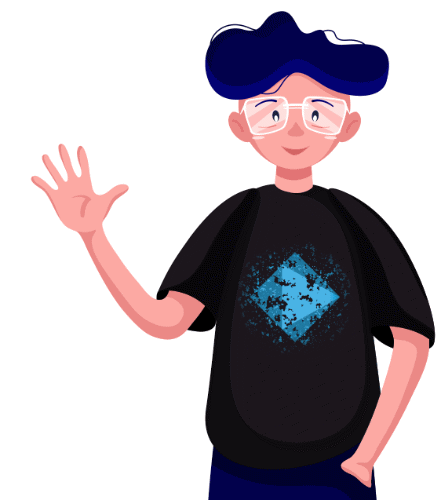
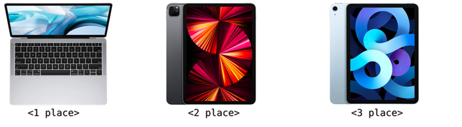

# Announcement_(en)

 Hi Codeforces!

We are **[DELTIX](https://codeforces.com/https://deltix.io/)**. Founded in 2005, DELTIX is one of the market leaders in software development for financial research and products for systematic and algorithmic trading. In 2020 DELTIX joined the EPAM family. Our mission is to turn promising ideas into breakthrough products fast. 

We are experts in:

 * aggregation, storage, and processing large volumes of time-series data
* data modeling
* testing and deployment of quantitative models

In our team we value such skills as: 

 * knowledge of algorithms
* high-performance coding
* low latency data streams processing

We are excited to announce that one of our products [TimeBase Community Edition](https://codeforces.com/https://github.com/finos/TimeBase-CE) joined a [FinTech Open-Source Foundation (FINOS)](https://codeforces.com/https://www.finos.org/) on the 14th of July. 

[TimeBase](https://codeforces.com/https://timebase.info/) is a multi-faceted, open-source data-streaming powerhouse, combining a time-series database, message broker, data modeling, and a well-optimized serialization framework. Originally, TimeBase was designed to address use cases in the financial domain. Nevertheless, we take on new challenges in other areas such as IoT, cloud computing, clustering, high-performance computing, parallel data processing, and Big Data to name a few. 

[Learn more about DELTIX](https://codeforces.com/https://deltix.io/) 

Throughout the year, once per quarter, we will be inviting you to join DELTIX rounds at Codeforces. Today, we are excited to welcome you to the second installment of our rounds (joined Div. 1 and Div. 2) — [Deltix Round, Summer 2021 (open for everyone, rated, Div. 1 + Div. 2)](https://codeforces.com/contest/1556), that will start on [Sunday, August 29, 2021 at 20:35UTC+6](https://codeforces.com/https://www.timeanddate.com/worldclock/fixedtime.html?day=29&month=8&year=2021&hour=17&min=35&sec=0&p1=166). 

It is an open and rated round for both divisions.

We have prepared the following trophies for you: 

 * **1st place** = MacBook Air
* **2nd place** = iPad Pro
* **3rd place** = iPad Air
* **1-100** = branded t-shirts

Another **100 t-shirts** will be distributed randomly between participants outside the top-100 but within the top-1000 and who participated in rated Codeforces rounds before. 

All problems, except the last one, have been prepared by members of our team: [Vladik](https://codeforces.com/profile/Vladik "Master Vladik"), [netman](https://codeforces.com/profile/netman "Candidate Master netman") and [AleXman111](https://codeforces.com/profile/AleXman111 "Candidate Master AleXman111").

We would like to say a word of appreciation to:

 * [KAN](https://codeforces.com/profile/KAN "Legendary Grandmaster KAN") and [budalnik](https://codeforces.com/profile/budalnik "International Grandmaster budalnik") for the round management.
* [300iq](https://codeforces.com/profile/300iq "Legendary Grandmaster 300iq") for creating a great problem that has naturally fitted in our set of problems for this round.
* to all testers: [antontrygubO_o](https://codeforces.com/profile/antontrygubO_o "Legendary Grandmaster antontrygubO_o"), [244mhq](https://codeforces.com/profile/244mhq "Legendary Grandmaster 244mhq"), [andrew](https://codeforces.com/profile/andrew "Grandmaster andrew"), [Mediocrity](https://codeforces.com/profile/Mediocrity "Master Mediocrity"), [Vaseline_Warrior](https://codeforces.com/profile/Vaseline_Warrior "Master Vaseline_Warrior"), [g1phy](https://codeforces.com/profile/g1phy "Master g1phy"), [nweeks](https://codeforces.com/profile/nweeks "International Master nweeks"), [ptd](https://codeforces.com/profile/ptd "International Master ptd"), [phattd](https://codeforces.com/profile/phattd "Master phattd"), [dmitriyklebanov](https://codeforces.com/profile/dmitriyklebanov "Candidate Master dmitriyklebanov"), [Alladdin](https://codeforces.com/profile/Alladdin "Candidate Master Alladdin"), [wxhtzdy](https://codeforces.com/profile/wxhtzdy "Candidate Master wxhtzdy"), [Shinchan01](https://codeforces.com/profile/Shinchan01 "Expert Shinchan01"), [Fasys](https://codeforces.com/profile/Fasys "Specialist Fasys") and [sovspace](https://codeforces.com/profile/sovspace "Newbie sovspace").
* [MikeMirzayanov](https://codeforces.com/profile/MikeMirzayanov "Headquarters, MikeMirzayanov") for Codeforces and Polygon systems.

**We will offer participants 8 problems and 150 minutes to solve them.** We wish everybody good luck and high ratings!

Fill out a short contact form if you are interested in employment opportunities or would like to speak with recruiters or members of our team.

  [Contact Form →](https://codeforces.com/userForm/ea55bd6c074ac61) **UPD:** After processing all testers' feedback, we decided to extend the competition by 15 minutes. The total duration is 150 minutes.

**UPD2:** The scoring distribution is **500 — 1000 — **1500** — **1500** — 2000 — 2500 — 3000 — 3500**. Note the equal complexity of **C** and **D**.

Thank you all for participating! ([editorial](Tutorial_(en).md))

Congratulations to the winners:  
1. [Rewinding](https://codeforces.com/profile/Rewinding "Legendary Grandmaster Rewinding")  
2. [jiangly](https://codeforces.com/profile/jiangly "Legendary Grandmaster jiangly")  
3. [Benq](https://codeforces.com/profile/Benq "Legendary Grandmaster Benq")  
4. [Egor](https://codeforces.com/profile/Egor "Legendary Grandmaster Egor")  
5. [TLE](https://codeforces.com/profile/TLE "Legendary Grandmaster TLE")  
6. [ainta](https://codeforces.com/profile/ainta "International Grandmaster ainta")  
7. [Radewoosh](https://codeforces.com/profile/Radewoosh "Legendary Grandmaster Radewoosh")  
8. [Golovanov399](https://codeforces.com/profile/Golovanov399 "International Grandmaster Golovanov399")  
9. [ecnerwala](https://codeforces.com/profile/ecnerwala "Legendary Grandmaster ecnerwala")  
10. [maroonrk](https://codeforces.com/profile/maroonrk "Legendary Grandmaster maroonrk") 

