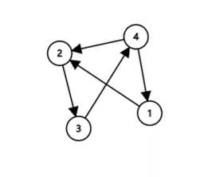

<h1 style='text-align: center;'> C. Mocha and Hiking</h1>

<h5 style='text-align: center;'>time limit per test: 1 second</h5>
<h5 style='text-align: center;'>memory limit per test: 256 megabytes</h5>

The city where Mocha lives in is called Zhijiang. There are $n+1$ villages and $2n-1$ directed roads in this city. 

There are two kinds of roads:

* $n-1$ roads are from village $i$ to village $i+1$, for all $1\leq i \leq n-1$.
* $n$ roads can be described by a sequence $a_1,\ldots,a_n$. If $a_i=0$, the $i$-th of these roads goes from village $i$ to village $n+1$, otherwise it goes from village $n+1$ to village $i$, for all $1\leq i\leq n$.

Mocha plans to go hiking with Taki this weekend. To avoid the trip being boring, they plan to go through every village exactly once. They can start and finish at any villages. Can you help them to draw up a plan? 

### Input

Each test contains multiple test cases. 

The first line contains a single integer $t$ ($1 \le t \le 20$) — the number of test cases. Each test case consists of two lines.

The first line of each test case contains a single integer $n$ ($1 \le n \le 10^4$) — indicates that the number of villages is $n+1$.

The second line of each test case contains $n$ integers $a_1, a_2, \ldots, a_n$ ($0 \le a_i \le 1$). If $a_i=0$, it means that there is a road from village $i$ to village $n+1$. If $a_i=1$, it means that there is a road from village $n+1$ to village $i$.

It is guaranteed that the sum of $n$ over all test cases does not exceed $10^4$.

### Output

For each test case, print a line with $n+1$ integers, where the $i$-th number is the $i$-th village they will go through. If the answer doesn't exist, print $-1$.

If there are multiple correct answers, you can print any one of them.

## Example

### Input


```text
2
3
0 1 0
3
1 1 0
```
### Output


```text
1 4 2 3 
4 1 2 3 
```
## Note

In the first test case, the city looks like the following graph:


So all possible answers are $(1 \to 4 \to 2 \to 3)$, $(1 \to 2 \to 3 \to 4)$.

In the second test case, the city looks like the following graph:



So all possible answers are $(4 \to 1 \to 2 \to 3)$, $(1 \to 2 \to 3 \to 4)$, $(3 \to 4 \to 1 \to 2)$, $(2 \to 3 \to 4 \to 1)$.


#### Tags 

#1200 #NOT OK #constructive_algorithms #graphs 

## Blogs
- [All Contest Problems](../Codeforces_Round_738_(Div._2).md)
- [Announcement (en)](../blogs/Announcement_(en).md)
- [Tutorial (en) (en)](../blogs/Tutorial_(en)_(en).md)
