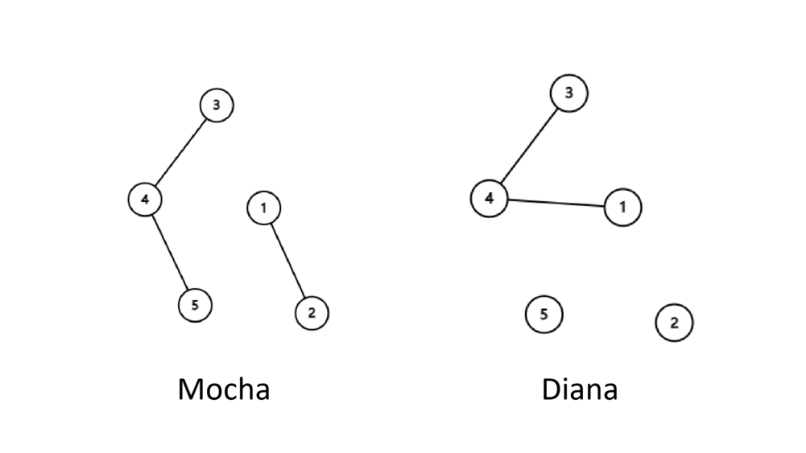
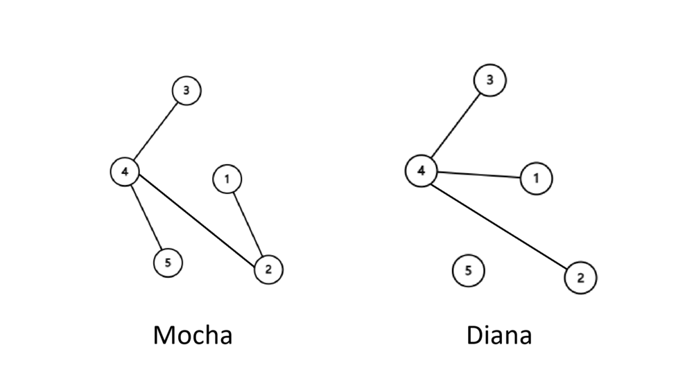

<h1 style='text-align: center;'> D1. Mocha and Diana (Easy Version)</h1>

<h5 style='text-align: center;'>time limit per test: 1 second</h5>
<h5 style='text-align: center;'>memory limit per test: 256 megabytes</h5>

This is the easy version of the problem. The only difference between the two versions is the constraint on $n$. You can make hacks only if all versions of the problem are solved.

A forest is an undirected graph without cycles (not necessarily connected).

Mocha and Diana are friends in Zhijiang, both of them have a forest with nodes numbered from $1$ to $n$, and they would like to add edges to their forests such that: 

* After adding edges, both of their graphs are still forests.
* They add the same edges. That is, if an edge $(u, v)$ is added to Mocha's forest, then an edge $(u, v)$ is added to Diana's forest, and vice versa.

Mocha and Diana want to know the maximum number of edges they can add, and which edges to add.

##### Input

The first line contains three integers $n$, $m_1$ and $m_2$ ($1 \le n \le 1000$, $0 \le m_1, m_2 < n$) — the number of nodes and the number of initial edges in Mocha's forest and Diana's forest.

Each of the next $m_1$ lines contains two integers $u$ and $v$ ($1 \le u, v \le n$, $u \neq v$) — the edges in Mocha's forest.

Each of the next $m_2$ lines contains two integers $u$ and $v$ ($1 \le u, v \le n$, $u \neq v$) — the edges in Diana's forest.

##### Output

The first line contains only one integer $h$, the maximum number of edges Mocha and Diana can add (in each forest).

Each of the next $h$ lines contains two integers $u$ and $v$ ($1 \le u, v \le n$, $u \neq v$) — the edge you add each time.

If there are multiple correct answers, you can print any one of them.

## Examples

##### Input


```text
3 2 2
1 2
2 3
1 2
1 3
```
##### Output


```text
0
```
##### Input


```text
5 3 2
5 4
2 1
4 3
4 3
1 4
```
##### Output


```text
1
2 4
```
##### Input


```text
8 1 2
1 7
2 6
1 5
```
##### Output


```text
5
5 2
2 3
3 4
4 7
6 8
```
## Note

In the first example, we cannot add any edge.

In the second example, the initial forests are as follows.



We can add an edge $(2, 4)$.




#### Tags 

#1400 #NOT OK #brute_force #constructive_algorithms #dsu #graphs #greedy #trees 

## Blogs
- [All Contest Problems](../Codeforces_Round_738_(Div._2).md)
- [Announcement (en)](../blogs/Announcement_(en).md)
- [Tutorial (en) (en)](../blogs/Tutorial_(en)_(en).md)
