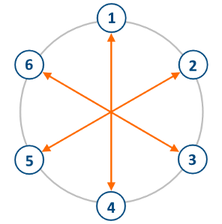

<h1 style='text-align: center;'> B. Who's Opposite?</h1>

<h5 style='text-align: center;'>time limit per test: 1 second</h5>
<h5 style='text-align: center;'>memory limit per test: 256 megabytes</h5>

Some number of people (this number is even) have stood in a circle. The people stand in the circle evenly. They are numbered clockwise starting from a person with the number $1$. Each person is looking through the circle's center at the opposite person.

  A sample of a circle of $6$ persons. The orange arrows indicate who is looking at whom. You don't know the exact number of people standing in the circle (but this number is even, no doubt). It is known that the person with the number $a$ is looking at the person with the number $b$ (and vice versa, of course). What is the number associated with a person being looked at by the person with the number $c$? If, for the specified $a$, $b$, and $c$, no such circle exists, output -1.

### Input

The first line contains one integer $t$ ($1 \le t \le 10^4$) — the number of test cases. Then $t$ test cases follow.

Each test case consists of one line containing three distinct integers $a$, $b$, $c$ ($1 \le a,b,c \le 10^8$).

### Output

For each test case output in a separate line a single integer $d$ — the number of the person being looked at by the person with the number $c$ in a circle such that the person with the number $a$ is looking at the person with the number $b$. If there are multiple solutions, print any of them. 
### Output

 $-1$ if there's no circle meeting the given conditions.

## Example

### Input


```text
7
6 2 4
2 3 1
2 4 10
5 3 4
1 3 2
2 5 4
4 3 2
```
### Output


```text
8
-1
-1
-1
4
1
-1
```
## Note

In the first test case, there's a desired circle of $8$ people. The person with the number $6$ will look at the person with the number $2$ and the person with the number $8$ will look at the person with the number $4$.

In the second test case, there's no circle meeting the conditions. If the person with the number $2$ is looking at the person with the number $3$, the circle consists of $2$ people because these persons are neighbors. But, in this case, they must have the numbers $1$ and $2$, but it doesn't meet the problem's conditions.

In the third test case, the only circle with the persons with the numbers $2$ and $4$ looking at each other consists of $4$ people. Therefore, the person with the number $10$ doesn't occur in the circle.


#### Tags 

#800 #NOT OK #math 

## Blogs
- [All Contest Problems](../Codeforces_Round_739_(Div._3).md)
- [Announcement](../blogs/Announcement.md)
- [Tutorial (en)](../blogs/Tutorial_(en).md)
