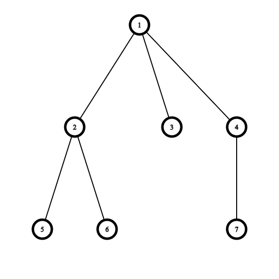
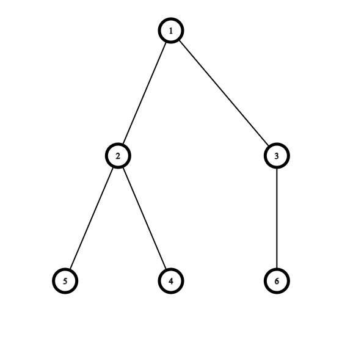
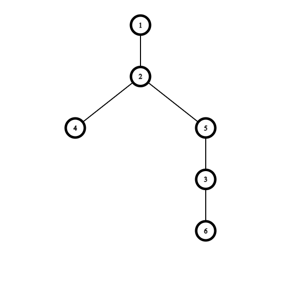

<h1 style='text-align: center;'> E. Buds Re-hanging</h1>

<h5 style='text-align: center;'>time limit per test: 1 second</h5>
<h5 style='text-align: center;'>memory limit per test: 256 megabytes</h5>

A tree is a connected graph without cycles. A rooted tree has a special vertex called the root. The parent of a vertex $v$ (different from root) is the previous to $v$ vertex on the shortest path from the root to the vertex $v$. Children of the vertex $v$ are all vertices for which $v$ is the parent.

A vertex is a leaf if it has no children. We call a vertex a bud, if the following three conditions are satisfied: 

* it is not a root,
* it has at least one child, and
* all its children are leaves.

You are given a rooted tree with $n$ vertices. The vertex $1$ is the root. In one operation you can choose any bud with all its children (they are leaves) and re-hang them to any other vertex of the tree. By doing that you delete the edge connecting the bud and its parent and add an edge between the bud and the chosen vertex of the tree. The chosen vertex cannot be the bud itself or any of its children. All children of the bud stay connected to the bud.

What is the minimum number of leaves it is possible to get if you can make any number of the above-mentioned operations (possibly zero)?

### Input

The input consists of multiple test cases. The first line contains a single integer $t$ ($1 \le t \le 10^4$) — the number of test cases. Description of the test cases follows.

The first line of each test case contains a single integer $n$ ($2 \le n \le 2 \cdot 10^5$) — the number of the vertices in the given tree.

Each of the next $n-1$ lines contains two integers $u$ and $v$ ($1 \le u, v \le n$, $u \neq v$) meaning that there is an edge between vertices $u$ and $v$ in the tree.

It is guaranteed that the given graph is a tree.

It is guaranteed that the sum of $n$ over all test cases doesn't exceed $2 \cdot 10^5$.

### Output

For each test case print a single integer — the minimal number of leaves that is possible to get after some operations.

## Example

### Input


```text
5
7
1 2
1 3
1 4
2 5
2 6
4 7
6
1 2
1 3
2 4
2 5
3 6
2
1 2
7
7 3
1 5
1 3
4 6
4 7
2 1
6
2 1
2 3
4 5
3 4
3 6
```
### Output


```text
2
2
1
2
1
```
## Note

In the first test case the tree looks as follows:

  Firstly you can choose a bud vertex $4$ and re-hang it to vertex $3$. After that you can choose a bud vertex $2$ and re-hang it to vertex $7$. As a result, you will have the following tree with $2$ leaves:

  It can be proved that it is the minimal number of leaves possible to get.

In the second test case the tree looks as follows:

  You can choose a bud vertex $3$ and re-hang it to vertex $5$. As a result, you will have the following tree with $2$ leaves:

  It can be proved that it is the minimal number of leaves possible to get.


#### Tags 

#2000 #NOT OK #constructive_algorithms #dfs_and_similar #dp #greedy #trees 

## Blogs
- [All Contest Problems](../Codeforces_Global_Round_16.md)
- [Announcement (en)](../blogs/Announcement_(en).md)
- [Tutorial (en)](../blogs/Tutorial_(en).md)
