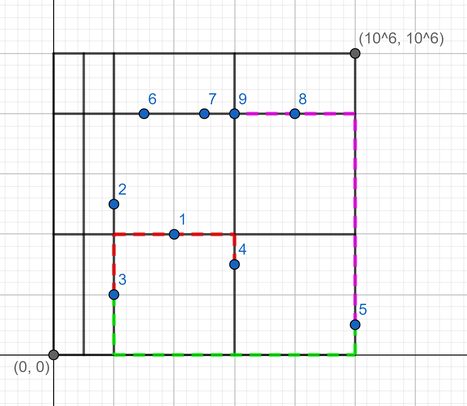

<h1 style='text-align: center;'> D. Inconvenient Pairs</h1>

<h5 style='text-align: center;'>time limit per test: 2 seconds</h5>
<h5 style='text-align: center;'>memory limit per test: 256 megabytes</h5>

There is a city that can be represented as a square grid with corner points in $(0, 0)$ and $(10^6, 10^6)$.

The city has $n$ vertical and $m$ horizontal streets that goes across the whole city, i. e. the $i$-th vertical streets goes from $(x_i, 0)$ to $(x_i, 10^6)$ and the $j$-th horizontal street goes from $(0, y_j)$ to $(10^6, y_j)$. 

All streets are bidirectional. Borders of the city are streets as well.

There are $k$ persons staying on the streets: the $p$-th person at point $(x_p, y_p)$ (so either $x_p$ equal to some $x_i$ or $y_p$ equal to some $y_j$, or both).

Let's say that a pair of persons form an inconvenient pair if the shortest path from one person to another going only by streets is strictly greater than the Manhattan distance between them.

Calculate the number of inconvenient pairs of persons (pairs $(x, y)$ and $(y, x)$ are the same pair).

Let's recall that Manhattan distance between points $(x_1, y_1)$ and $(x_2, y_2)$ is $|x_1 - x_2| + |y_1 - y_2|$.

### Input

The first line contains a single integer $t$ ($1 \le t \le 1000$) — the number of test cases.

The first line of each test case contains three integers $n$, $m$ and $k$ ($2 \le n, m \le 2 \cdot 10^5$; $2 \le k \le 3 \cdot 10^5$) — the number of vertical and horizontal streets and the number of persons.

The second line of each test case contains $n$ integers $x_1, x_2, \dots, x_n$ ($0 = x_1 < x_2 < \dots < x_{n - 1} < x_n = 10^6$) — the $x$-coordinates of vertical streets.

The third line contains $m$ integers $y_1, y_2, \dots, y_m$ ($0 = y_1 < y_2 < \dots < y_{m - 1} < y_m = 10^6$) — the $y$-coordinates of horizontal streets.

Next $k$ lines contains description of people. The $p$-th line contains two integers $x_p$ and $y_p$ ($0 \le x_p, y_p \le 10^6$; $x_p \in \{x_1, \dots, x_n\}$ or $y_p \in \{y_1, \dots, y_m\}$) — the coordinates of the $p$-th person. All points are distinct.

It guaranteed that sum of $n$ doesn't exceed $2 \cdot 10^5$, sum of $m$ doesn't exceed $2 \cdot 10^5$ and sum of $k$ doesn't exceed $3 \cdot 10^5$.

### Output

For each test case, print the number of inconvenient pairs.

## Example

### Input


```text
2
2 2 4
0 1000000
0 1000000
1 0
1000000 1
999999 1000000
0 999999
5 4 9
0 1 2 6 1000000
0 4 8 1000000
4 4
2 5
2 2
6 3
1000000 1
3 8
5 8
8 8
6 8
```
### Output


```text
2
5
```
## Note

The second test case is pictured below: 

  For example, points $3$ and $4$ form an inconvenient pair, since the shortest path between them (shown red and equal to $7$) is greater than its Manhattan distance (equal to $5$).

Points $3$ and $5$ also form an inconvenient pair: the shortest path equal to $1000001$ (shown green) is greater than the Manhattan distance equal to $999999$.

But points $5$ and $9$ don't form an inconvenient pair, since the shortest path (shown purple) is equal to its Manhattan distance.


#### Tags 

#1900 #NOT OK #binary_search #data_structures #implementation #sortings #two_pointers 

## Blogs
- [All Contest Problems](../Educational_Codeforces_Round_113_(Rated_for_Div._2).md)
- [Announcement](../blogs/Announcement.md)
- [Tutorial](../blogs/Tutorial.md)
