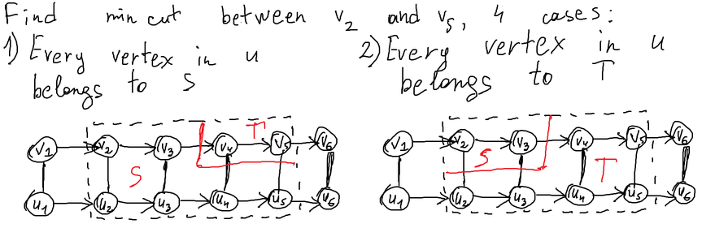
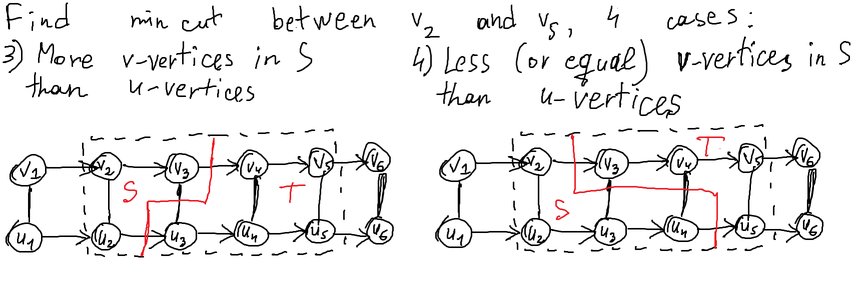
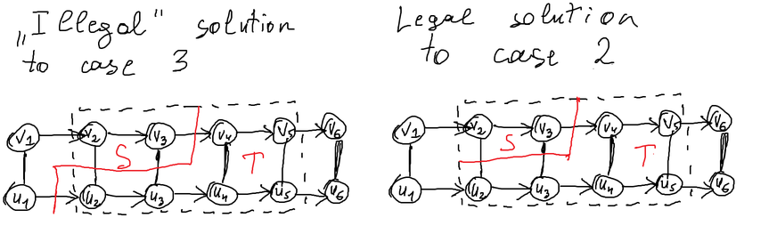

# Tutorial_(en)

First of all, I would like to thank all testers of the round: [pashka](https://codeforces.com/profile/pashka "International Grandmaster pashka"), [FlakeLCR](https://codeforces.com/profile/FlakeLCR "Master FlakeLCR"), [peti1234](https://codeforces.com/profile/peti1234 "International Grandmaster peti1234"), [Akulyat](https://codeforces.com/profile/Akulyat "Grandmaster Akulyat"), [bugdone](https://codeforces.com/profile/bugdone "Specialist bugdone"), [pacha2880](https://codeforces.com/profile/pacha2880 "Candidate Master pacha2880"). Also huge thanks to co-authors of the contest: [Neon](https://codeforces.com/profile/Neon "Candidate Master Neon"), [adedalic](https://codeforces.com/profile/adedalic "International Master adedalic") and [awoo](https://codeforces.com/profile/awoo "International Grandmaster awoo").

I hope you enjoyed participating in the round!

Okay, now for the editorial itself:

[1571A - Sequence of Comparisons](../problems/A._Sequence_of_Comparisons.md "Kotlin Heroes: Episode 8")

Idea: [BledDest](https://codeforces.com/profile/BledDest "International Grandmaster BledDest"), preparation: [Neon](https://codeforces.com/profile/Neon "Candidate Master Neon")

 **Tutorial**
### [1571A - Sequence of Comparisons](../problems/A._Sequence_of_Comparisons.md "Kotlin Heroes: Episode 8")

If ss consists only of characters =, then a1=ana1=an.

If ss consists only of characters < and =, then a1<ana1<an.

If ss consists only of characters > and =, then a1>ana1>an.

Otherwise, it is impossible to uniquely determine the relationship between a1a1 and anan. For example, this can be checked on the strings <> and ><.

 **Solution (Neon)**
```cpp
fun main() = repeat(readLine()!!.toInt()) {
  val s = readLine()!!
  val l = s.count({ it == '<' })
  val g = s.count({ it == '>' })
  if (l > 0 && g > 0) println("?")
  else if (l > 0) println("<");
  else if (g > 0) println(">");
  else println("=");
}
```
[1571B - Epic Novel](../problems/B._Epic_Novel.md "Kotlin Heroes: Episode 8")

Idea: [BledDest](https://codeforces.com/profile/BledDest "International Grandmaster BledDest"), preparation: [adedalic](https://codeforces.com/profile/adedalic "International Master adedalic")

 **Tutorial**
### [1571B - Epic Novel](../problems/B._Epic_Novel.md "Kotlin Heroes: Episode 8")

Note that since each day Alex either reads the same volume or the next one, then for xx days he can't read more than xx volumes, or (in other words) for any day ii and jj (i<ji<j) vj−vi≤j−ivj−vi≤j−i.

Now, let's iterate over all possible variants for vbvb. It's obvious that va≤vb≤vcva≤vb≤vc. So we need to check: 

1. it is possible that Alex was reading volume vava at day aa and volume vbvb at day bb;
2. it is possible that Alex was reading volume vbvb at day bb and volume vcvc at day cc.

To check the first case, it's enough to check that vb−va≤b−avb−va≤b−a. Analogically, to check the second case, we check that vc−vb≤c−bvc−vb≤c−b.

As a result, all we need to do is find any vbvb from vava to vcvc where vb−va≤b−avb−va≤b−a and vc−vb≤c−bvc−vb≤c−b.

 **Solution (adedalic)**
```cpp
fun main() {
    repeat(readLine()!!.toInt()) {
        val n = readLine()!!.toInt()
        val (d1, v1) = readLine()!!.split(' ').map { it.toInt() }
        val (d3, v3) = readLine()!!.split(' ').map { it.toInt() }
        val d2 = readLine()!!.toInt()

        fun isPossible(d1: Int, v1: Int, d2: Int, v2: Int) = (v2 - v1) <= (d2 - d1)

        for (v2 in v1..v3) {
            if (isPossible(d1, v1, d2, v1) && isPossible(d2, v2, d3, v3)) {
                println(v2)
                break
            }
        }
    }
}
```
[1571C - Rhyme](../problems/C._Rhyme.md "Kotlin Heroes: Episode 8")

Idea: [BledDest](https://codeforces.com/profile/BledDest "International Grandmaster BledDest"), preparation: [adedalic](https://codeforces.com/profile/adedalic "International Master adedalic")

 **Tutorial**
### [1571C - Rhyme](../problems/C._Rhyme.md "Kotlin Heroes: Episode 8")

Let limitilimiti be the maximum value kk such that the ii-th pair rhymes regardless of must it or must not. It's easy to calculate limitilimiti as the length of the longest equal suffix of sisi and titi.

Now, if we know that the ii-th pair must rhyme, then any possible kk should not exceed limitilimiti. But if the ii-th pair must not rhyme, then any possible kk should be strictly greater than limitilimiti.

In other words, all possible kk-s form a segment between minimum possible kk and maximum possible kk. So, we can calculate minimum possible kk (named ll) as max(limiti)+1max(limiti)+1 among all ii with ri=0ri=0 and maximum possible kk (named rr) as min(limiti)min(limiti) among all ii with ri=1ri=1.

As a result there will be max(0,r−l+1)max(0,r−l+1) possible kk from ll to rr.

 **Solution (adedalic)**
```cpp
fun main() {
    repeat(readLine()!!.toInt()) {
        val n = readLine()!!.toInt()
        var l = 0
        var r = 4e5.toInt()
        for (i in 1..n) {
            val pairs = readLine()!!.split(' ')
            val limit = pairs[0].commonSuffixWith(pairs[1]).length
            if (pairs[2] == "0")
                l = maxOf(l, limit + 1)
            else
                r = minOf(r, limit)
        }
        println(maxOf(0, r - l + 1))
        if (r - l + 1 > 0)
           println((l..r).joinToString(" "))
    }
}
```
[1571D - Sweepstake](../problems/D._Sweepstake.md "Kotlin Heroes: Episode 8")

Idea: [BledDest](https://codeforces.com/profile/BledDest "International Grandmaster BledDest"), preparation: [adedalic](https://codeforces.com/profile/adedalic "International Master adedalic")

 **Tutorial**
### [1571D - Sweepstake](../problems/D._Sweepstake.md "Kotlin Heroes: Episode 8")

Let's iterate over all possible pairs (winner, looser), calculate our place and take a maximum among all of them.

Suppose, cntPairsw,lcntPairsw,l be the number of spectators who chose pair winner ww and looser ll, cntFirstwcntFirstw be the number of spectators who chose ww as winner, and cntLastlcntLastl be the number of spectators who chose ll as looser.

Then, for a fixed pair (winner ww and looser ll) it's possible to calculate both c2c2 and c1c1 in the following way: c2=cntPairsw,lc2=cntPairsw,l and c1=cntFirstw+cntLastl−2cntPairsw,lc1=cntFirstw+cntLastl−2cntPairsw,l (because, both cntFirstwcntFirstw and cntLastlcntLastl contain spectators who guessed 22 results). After that, baced on the number of our right answers, we can calculate our rank: is it 11, c2+1c2+1 or c2+c1+1c2+c1+1.

But there is one simplification: it can be proved that we can always iterate only over pairs (w,l)(w,l) where we guessed 00 right answers. In this case our rank will always be c2+c1+1c2+c1+1 == cntFirstw+cntLastl−cntPairsw,l+1cntFirstw+cntLastl−cntPairsw,l+1 (union of all spectators who answered right at least once).

 **Solution (adedalic)**
```cpp
fun main() {
    val (n, m) = readLine()!!.split(' ').map { it.toInt() }
    val cntPairs = Array(n) { IntArray(n) { 0 } }
    val cntFirst = IntArray(n) { 0 }
    val cntLast = IntArray(n) { 0 }

    val firstPair = readLine()!!.split(' ').map { it.toInt() - 1 }
    for (i in 2..m) {
        val (f, l) = readLine()!!.split(' ').map { it.toInt() - 1 }
        cntPairs[f][l]++
        cntFirst[f]++
        cntLast[l]++
    }

    fun I(a: Boolean) = if (a) 1 else 0

    var worstPlace = 0
    for (w in 0 until n) {
        for (l in 0 until n) {
            if (w == l)
                continue
            val yourScore = I(w == firstPair[0]) + I(l == firstPair[1])
            var place = 1
            if (yourScore < 2)
                place += cntPairs[w][l]
            if (yourScore < 1)
                place += cntFirst[w] + cntLast[l] - 2 * cntPairs[w][l]
            worstPlace = maxOf(worstPlace, place)
        }
    }
    println(worstPlace)
}
```
[1571E - Fix the String](../problems/E._Fix_the_String.md "Kotlin Heroes: Episode 8")

Idea: [BledDest](https://codeforces.com/profile/BledDest "International Grandmaster BledDest"), preparation: [Neon](https://codeforces.com/profile/Neon "Candidate Master Neon")

 **Tutorial**
### [1571E - Fix the String](../problems/E._Fix_the_String.md "Kotlin Heroes: Episode 8")

Firstly, let's notice that there are only two correct bracket sequences of length 44: (()) and ()().

Let's look at the neighboring ones (i.e., there are no other ones between them) in the string aa. Let their positions be ii and jj (j<ij<i). Let's consider what restrictions they put on each other:

* if i−j=1i−j=1, then there is no answer, because it is impossible to choose a pair of correct bracket sequences that the last 33 characters of one coincide with the first 33 characters of the other;
* if i−j=2i−j=2, then the only option when the last 22 characters of one coincide with the 22 characters of the other is two sequences of the form ()().
* if i−j=3i−j=3, then there is no answer, because it is impossible to choose a pair of correct bracket sequences that the last character of one coincides with the first character of the other;
* otherwise, they do not put any restrictions on each other.

Thus, for all ii that ai=1ai=1, we know what the correct bracket sequence should be the substring s[i;i+3]s[i;i+3]. If both sequences are suitable, then you have to choose the one that changes the minimum number of positions.

 **Solution (pashka)**
```cpp
@file:Suppress("CanBeVal")
 
import java.io.BufferedReader
import java.io.InputStreamReader
import java.io.OutputStreamWriter
import java.io.PrintWriter
import java.util.*
 
private fun solve() {
    var n = readInt()
    var s = readLn()
    var a = readLn()
    var j = -1
    for (i in a.indices) {
        if (a[i] == '1') {
            if (j >= 0 && ((i - j) == 1 || (i - j) == 3)) {
                println(-1)
                return
            }
            j = i
        }
    }
    var i = 0
    var res = 0
    while (i < a.length) {
        if (a[i] == '1') {
            j = i
            while (j < a.length && a[j] == '1') {
                j += 2
            }
 
            if (j == i + 2) {
                res += minOf(diff(s.substring(i, i + 4), "(())"),
                        diff(s.substring(i, i + 4), "()()"))
            } else {
                for (k in i .. j step 2) {
                    res += diff(s.substring(k, k + 2), "()")
                }
            }
            i = j + 1
        } else {
            i++
        }
    }
    println(res)
}
 
private fun diff(a: String, b: String): Int {
    var res = 0
    for (i in a.indices) {
        if (a[i] != b[i]) res++
    }
    return res
}
 
// TEMPLATE
fun main(args: Array<String>) {
    reader = BufferedReader(InputStreamReader(System.`in`))
    out = PrintWriter(OutputStreamWriter(System.out))
    repeat(readInt()) {
        solve()
    }
    out.close()
}
 
private lateinit var out: PrintWriter
private lateinit var reader: BufferedReader
private var tokenizer: StringTokenizer? = null
private fun read(): String {
    while (tokenizer == null || !tokenizer!!.hasMoreTokens()) {
        tokenizer = StringTokenizer(readLn())
    }
    return tokenizer!!.nextToken()
}
 
private fun readInt() = read().toInt()
private fun readLong() = read().toLong()
private fun readLn() = reader.readLine()!!
private fun readInts() = readLn().split(" ").map { it.toInt() }
private fun readInts(sz: Int) = Array(sz) { readInt() }
private fun readLongs() = readLn().split(" ").map { it.toLong() }
private fun readLongs(sz: Int) = Array(sz) { readLong() }
private fun print(b: Boolean) = out.print(b)
private fun print(i: Int) = out.print(i)
private fun print(d: Double) = out.print(d)
private fun print(l: Long) = out.print(l)
private fun print(s: String) = out.print(s)
private fun print(message: Any?) = out.print(message)
private fun print(a: Array<Int>) = a.forEach { print("$it ") }
private fun <T> print(a: Array<out T>) = a.forEach { print("$it ") }
private fun <T> print(a: Collection<T>) = a.forEach { print("$it ") }
private fun println(b: Boolean) = out.println(b)
private fun println(i: Int) = out.println(i)
private fun println(d: Double) = out.println(d)
private fun println(l: Long) = out.println(l)
private fun println(s: String) = out.println(s)
private fun println() = out.println()
private fun println(message: Any?) = out.println(message)
private fun <T> println(a: Array<out T>) {
    a.forEach { print("$it ") }
    println()
}
 
private fun println(a: IntArray) {
    a.forEach { print("$it ") }
    println()
}
 
private fun println(a: LongArray) {
    a.forEach { print("$it ") }
    println()
}
 
private fun <T> println(a: Collection<T>) {
    a.forEach { print("$it ") }
    println()
}
 
private fun intarr(sz: Int, v: Int = 0) = IntArray(sz) { v }
private fun longarr(sz: Int, v: Long = 0) = LongArray(sz) { v }
private fun intarr2d(n: Int, m: Int, v: Int = 0) = Array(n) { intarr(m, v) }
private fun <T> init(vararg elements: T) = elements
private fun VI(n: Int = 0, init: Int = 0) = MutableList(n) { init }
private fun VVI(n: Int = 0, m: Int = 0, init: Int = 0) = MutableList(n) { VI(m, init) }
private fun <T1 : Comparable<T1>, T2 : Comparable<T2>> pairCmp(): Comparator<Pair<T1, T2>> {
    return Comparator { a, b ->
        val res = a.first.compareTo(b.first)
        if (res == 0) a.second.compareTo(b.second) else res
    }
}
```
[1571F - Kotlinforces](../problems/F._Kotlinforces.md "Kotlin Heroes: Episode 8")

Idea: [BledDest](https://codeforces.com/profile/BledDest "International Grandmaster BledDest"), preparation: [BledDest](https://codeforces.com/profile/BledDest "International Grandmaster BledDest")

 **Tutorial**
### [1571F - Kotlinforces](../problems/F._Kotlinforces.md "Kotlin Heroes: Episode 8")

Notice that it doesn't make sense to not put the competitions with t=1t=1 not next to each other or start them from day 11.

So the problem is to place competitions with t=2t=2 over the remaining m−cnt1m−cnt1 days.

Any competition with t=2t=2 takes up either consecutive odd days or consecutive even days. We can count the number of remaining odd and even days.

The issue is to decide for each competition which of these two it should take up. So we want the total length of the competitions in the odd days to not exceed cntoddcntodd and the total length of the competitions in the even days to not exceed cntevencnteven.

If the total length of the competitions exceeds cntodd+cntevencntodd+cnteven, then there is no way for sure. Otherwise, you can fill up the odd days as much as possible and leave the remaining competitions for the even days.

That can be done with a dpi,jdpi,j — is it possible to fill jj odd days with some subset of the first ii competitions. You should get AC with O(nm)O(nm) memory, but it's possible to make it O(m)O(m).

Overall complexity: O(nm)O(nm).

 **Solution (pashka)**
```cpp
@file:Suppress("CanBeVal")
 
import java.io.BufferedReader
import java.io.InputStreamReader
import java.io.OutputStreamWriter
import java.io.PrintWriter
import java.util.*
 
private fun solve() {
    var (n, m) = readInts()
    var k = intarr(n)
    var t = intarr(n)
    for (i in k.indices) {
        var (kk, tt) = readInts()
        k[i] = kk
        t[i] = tt
    }
    var s1 = 0
    var s2 = 0
    var d = intarr(m + 1, -1)
    d[0] = 0
    for (i in k.indices) {
        if (t[i] == 2) {
            s1 += k[i]
            for (j in m downTo 0) {
                if (d[j] != -1 && j + k[i] <= m && d[j + k[i]] == -1) {
                    d[j + k[i]] = i
                }
            }
        } else {
            s2 += k[i]
        }
    }
    for (i in 0..m) {
        if (d[i] == -1) continue
        if (maxOf(i * 2 - 1, (s1 - i) * 2) + s2 > m) continue
        var c = BooleanArray(n)
        var x = i
        while (x > 0) {
            c[d[x]] = true
            x -= k[d[x]]
        }
        var res = intarr(n)
        var kk = 1
        for (i in 0 until n) {
            if (t[i] == 2 && c[i]) {
                res[i] = kk
                kk += k[i] * 2
            }
        }
        kk = 2
        for (i in 0 until n) {
            if (t[i] == 2 && !c[i]) {
                res[i] = kk
                kk += k[i] * 2
            }
        }
        kk = m + 1
        for (i in 0 until n) {
            if (t[i] == 1) {
                kk -= k[i]
                res[i] = kk
            }
        }
        println(res)
        return
    }
    println(-1)
}
 
// TEMPLATE
fun main(args: Array<String>) {
    reader = BufferedReader(InputStreamReader(System.`in`))
    out = PrintWriter(OutputStreamWriter(System.out))
//    repeat(readInt()) {
    solve()
//    }
    out.close()
}
 
private lateinit var out: PrintWriter
private lateinit var reader: BufferedReader
private var tokenizer: StringTokenizer? = null
private fun read(): String {
    while (tokenizer == null || !tokenizer!!.hasMoreTokens()) {
        tokenizer = StringTokenizer(readLn())
    }
    return tokenizer!!.nextToken()
}
 
private fun readInt() = read().toInt()
private fun readLong() = read().toLong()
private fun readLn() = reader.readLine()!!
private fun readInts() = readLn().split(" ").map { it.toInt() }
private fun readInts(sz: Int) = Array(sz) { readInt() }
private fun readLongs() = readLn().split(" ").map { it.toLong() }
private fun readLongs(sz: Int) = Array(sz) { readLong() }
private fun print(b: Boolean) = out.print(b)
private fun print(i: Int) = out.print(i)
private fun print(d: Double) = out.print(d)
private fun print(l: Long) = out.print(l)
private fun print(s: String) = out.print(s)
private fun print(message: Any?) = out.print(message)
private fun print(a: Array<Int>) = a.forEach { print("$it ") }
private fun <T> print(a: Array<out T>) = a.forEach { print("$it ") }
private fun <T> print(a: Collection<T>) = a.forEach { print("$it ") }
private fun println(b: Boolean) = out.println(b)
private fun println(i: Int) = out.println(i)
private fun println(d: Double) = out.println(d)
private fun println(l: Long) = out.println(l)
private fun println(s: String) = out.println(s)
private fun println() = out.println()
private fun println(message: Any?) = out.println(message)
private fun <T> println(a: Array<out T>) {
    a.forEach { print("$it ") }
    println()
}
 
private fun println(a: IntArray) {
    a.forEach { print("$it ") }
    println()
}
 
private fun println(a: LongArray) {
    a.forEach { print("$it ") }
    println()
}
 
private fun <T> println(a: Collection<T>) {
    a.forEach { print("$it ") }
    println()
}
 
private fun intarr(sz: Int, v: Int = 0) = IntArray(sz) { v }
private fun longarr(sz: Int, v: Long = 0) = LongArray(sz) { v }
private fun intarr2d(n: Int, m: Int, v: Int = 0) = Array(n) { intarr(m, v) }
private fun <T> init(vararg elements: T) = elements
private fun VI(n: Int = 0, init: Int = 0) = MutableList(n) { init }
private fun VVI(n: Int = 0, m: Int = 0, init: Int = 0) = MutableList(n) { VI(m, init) }
private fun <T1 : Comparable<T1>, T2 : Comparable<T2>> pairCmp(): Comparator<Pair<T1, T2>> {
    return Comparator { a, b ->
        val res = a.first.compareTo(b.first)
        if (res == 0) a.second.compareTo(b.second) else res
    }
}
```
[1571G - A Battle Against a Dragon](../problems/G._A_Battle_Against_a_Dragon.md "Kotlin Heroes: Episode 8")

Idea: [BledDest](https://codeforces.com/profile/BledDest "International Grandmaster BledDest"), preparation: [awoo](https://codeforces.com/profile/awoo "International Grandmaster awoo")

 **Tutorial**
### [1571G - A Battle Against a Dragon](../problems/G._A_Battle_Against_a_Dragon.md "Kotlin Heroes: Episode 8")

Obviously, the problem requires some sort of dynamic programming. 

Consider the simplest one. dpi,jdpi,j is the maximum total damage dealt by the first ii warriors if there are jj barricades after the move of the ii-th warrior. The transitions are exactly the same as they are written in the statement.

That solution works in O(nm)O(nm) which is too slow. Let's analyze the behavior of the transitions on the dp table. The transition that destroys a barricade moves the value in some cell (i,j)(i,j) to (i+1,j−1)(i+1,j−1). The transition, that does nothing, moves it to (i+1,j)(i+1,j). The important thing to notice is that only the attack transition changes the value before updating the other state.

Thus, the idea is to write the dp in such a way that useless states produced by the first two transitions aren't stored explicitly and only collected by the attack transitions.

Let's restate the dp. dpi,kdpi,k is the total damage dealt by the first ii warriors if the ii-th warrior used his kk-th attack. Notice that the fact that the attack was possible helps to identify the current number of barricades. To update such a dp we should iterate over both the previous warrior to attack and the attack he used.

Let the previous warrior be j(j<i)j(j<i), his attack was when there were xx barricades and the attack of the ii-th warrior was when there were yy barricades. If x<yx<y, then there was no way for the ii-th warrior to use his attack. At the same time, if x−y≥i−jx−y≥i−j, then the warriors between the jj-th and the ii-th one have no way to destroy enough barricades. Otherwise, there is a way to assign either of the two moves to them in such a way that exactly yy barricades are left. Thus, y≤x≤(i−j)+yy≤x≤(i−j)+y should hold for the transition to be possible. 

Picture a set of possible states, which can update dpi,kdpi,k, on the table. It looks like a triangle starting from (i−1,y)(i−1,y) and going vertically to the top and diagonally to the top-right.

That screams data structures, and we are finally approaching them.

I propose the following way to calculate the dp. Sort the attacks of all warriors altogether, first, in the decreasing order of the number of barricades and, second, in the increasing order of the warrior index.

Store a BIT such that its ii-th position contains the maximum value of dp over the ii-th diagonal (going from top-right to bottom-left). Now you can forget that the query area is a triangle and query on the entire prefix of the diagonals. The values in the required area are calculated already, and the values outside of it that get captured by the query are not calculated yet (due to being to the left of the triangle).

The answer is the maximum value stored in the entire BIT at the end.

Overall complexity: O((∑i=1nki)⋅log(n+m))O((∑i=1nki)⋅log⁡(n+m)).

 **Solution (awoo)**
```cpp
class Attack(val a: Int, val b: Int, val i: Int)

fun main() {
	val (n, m) = readLine()!!.split(" ").map { it.toInt() }
	val ev = ArrayList<Attack>()

	for (i in 0 until n) {
		val k = readLine()!!.toInt()
		val a = readLine()!!.split(" ").map { it.toInt() }
		val b = readLine()!!.split(" ").map { it.toInt() }
		for (j in 0 until k) {
			ev.add(Attack(a[j], b[j], i))
		}
	}
	ev.sortWith(compareBy({ -it.b }, { it.i }))
	
	val INF = 1e18.toLong()
	val mx = m + n + 1
	val f = LongArray(mx) { -INF }
	
	fun update(pos: Int, x: Long) {
		var i = pos
		while (i < mx) {
			f[i] = maxOf(f[i], x)
			i = i or (i + 1)
		}
	}
	
	fun query(pos: Int) : Long {
		var res = -INF
		var i = pos
		while (i >= 0) {
			res = maxOf(res, f[i])
			i = (i and (i + 1)) - 1
		}
		return res
	}
	
	update(m - 1, 0L)
	for (it in ev) {
		val dp = query(it.i + it.b - 1) + it.a
		update(it.i + it.b, dp)
	}
	println(query(mx - 1))
}
```
[1571H - Laser Beams](../problems/H._Laser_Beams.md "Kotlin Heroes: Episode 8")

Idea: [BledDest](https://codeforces.com/profile/BledDest "International Grandmaster BledDest"), preparation: [BledDest](https://codeforces.com/profile/BledDest "International Grandmaster BledDest")

 **Tutorial**
### [1571H - Laser Beams](../problems/H._Laser_Beams.md "Kotlin Heroes: Episode 8")

We will treat the level as a planar graph, where the segments of the rays and the level border denote the edges, and their intersection points denote the vertices. The main idea of the solution is to use Euler's Formula for planar graphs: for a connected planar graph, f=e−v+2f=e−v+2, where ee is the number of edges, vv is the number of vertices, and ff is the number of regions into which the graph divides the plane. The number of parts of the level is exactly f−1f−1 (since Euler's Formula treats the exterior as an additional region), and we will use the linearity of expectation to evaluate the expected value of the answer: E(ans)=E(e)−E(v)+1E(ans)=E(e)−E(v)+1.

Calculating E(v)E(v) is easy. Firstly, let's generate all the intersection points between the rays and/or the borders in O(n2)O(n2). Then, for each intersection point, calculate the probability of it being a part of the planar graph — which is the probability that at least one of the possible lines that pass through this point actually exists. For each of the four possible lines that can pass through the point, we can calculate the probability that it exists — and this allows us to easily calculate E(v)E(v).

There are many different ways to find E(e)E(e), but, in my opinion, the easiest one is to calculate the expected sum of degrees of all vertices (and the sum of degrees is exactly 2e2e). For each vertex, if it is not the last vertex on some line, and this line exists, there is an edge to the next vertex on this line. Similarly, if it is not the first vertex on some line, and this line exists, there is an edge to the previous vertex on this line. So calculating the expected degree of a vertex is actually summing up the probabilities of existence of each line passing through it such that this vertex is not the first on that line, and adding the same values for the lines such that this vertex is not the last on that line (possibly counting the same line twice).

All that's left is to use the Euler's Formula to calculate E(f)E(f).

 **Solution (pashka)**
```cpp
@file:Suppress("CanBeVal")
 
import java.io.BufferedReader
import java.io.InputStreamReader
import java.io.OutputStreamWriter
import java.io.PrintWriter
import java.util.*
 
private fun solveTest() {
    var n = readInt()
    var l = readInts()
    var r = readInts()
    var rr = r.toMutableList()
    rr.sort()
    var x = Integer.MAX_VALUE
    for (i in 0 until n) {
        x = minOf(x, rr[i] - i)
    }
    var a = (0 until n).toMutableList()
    a.sortBy { i -> l[i] }
    var j = 0
    var pq = PriorityQueue<Int>(compareBy { i -> r[i] })
    var res = intarr(n)
    for (t in x until x + n) {
        while (j < n && l[a[j]] <= t) {
            pq.add(a[j])
            j++
        }
        if (pq.isEmpty()) {
            println(-1)
            return
        }
        var q = pq.remove()
        if (r[q] < t) {
            println(-1)
            return
        }
        res[t - x] = q + 1
    }
    println(x)
    println(res)
}
 
private fun solve() {
    var t = readInt()
    while (t-- > 0) {
        solveTest()
    }
}
 
// TEMPLATE
fun main(args: Array<String>) {
    reader = BufferedReader(InputStreamReader(System.`in`))
    out = PrintWriter(OutputStreamWriter(System.out))
    solve()
    out.close()
}
 
private lateinit var out: PrintWriter
private lateinit var reader: BufferedReader
private var tokenizer: StringTokenizer? = null
private fun read(): String {
    while (tokenizer == null || !tokenizer!!.hasMoreTokens()) {
        tokenizer = StringTokenizer(readLn())
    }
    return tokenizer!!.nextToken()
}
 
private fun readInt() = read().toInt()
private fun readLong() = read().toLong()
private fun readLn() = reader.readLine()!!
private fun readInts() = readLn().split(" ").map { it.toInt() }
private fun readInts(sz: Int) = Array(sz) { readInt() }
private fun readLongs() = readLn().split(" ").map { it.toLong() }
private fun readLongs(sz: Int) = Array(sz) { readLong() }
private fun print(b: Boolean) = out.print(b)
private fun print(i: Int) = out.print(i)
private fun print(d: Double) = out.print(d)
private fun print(l: Long) = out.print(l)
private fun print(s: String) = out.print(s)
private fun print(message: Any?) = out.print(message)
private fun print(a: Array<Int>) = a.forEach { print("$it ") }
private fun <T> print(a: Array<out T>) = a.forEach { print("$it ") }
private fun <T> print(a: Collection<T>) = a.forEach { print("$it ") }
private fun println(b: Boolean) = out.println(b)
private fun println(i: Int) = out.println(i)
private fun println(d: Double) = out.println(d)
private fun println(l: Long) = out.println(l)
private fun println(s: String) = out.println(s)
private fun println() = out.println()
private fun println(message: Any?) = out.println(message)
private fun <T> println(a: Array<out T>) {
    a.forEach { print("$it ") }
    println()
}
 
private fun println(a: IntArray) {
    a.forEach { print("$it ") }
    println()
}
 
private fun <T> println(a: Collection<T>) {
    a.forEach { print("$it ") }
    println()
}
 
private fun intarr(sz: Int, v: Int = 0) = IntArray(sz) { v }
private fun longarr(sz: Int, v: Long = 0) = LongArray(sz) { v }
private fun intarr2d(n: Int, m: Int, v: Int = 0) = Array(n) { intarr(m, v) }
private fun <T> init(vararg elements: T) = elements
private fun VI(n: Int = 0, init: Int = 0) = MutableList(n) { init }
private fun VVI(n: Int = 0, m: Int = 0, init: Int = 0) = MutableList(n) { VI(m, init) }
private fun <T1 : Comparable<T1>, T2 : Comparable<T2>> pairCmp(): Comparator<Pair<T1, T2>> {
    return Comparator { a, b ->
        val res = a.first.compareTo(b.first)
        if (res == 0) a.second.compareTo(b.second) else res
    }
}
```
[1571I - Physical Examination](../problems/I._Physical_Examination.md "Kotlin Heroes: Episode 8")

Idea: [BledDest](https://codeforces.com/profile/BledDest "International Grandmaster BledDest"), preparation: [awoo](https://codeforces.com/profile/awoo "International Grandmaster awoo")

 **Tutorial**Tutorial is loading... **Solution (awoo)**
```cpp
import java.util.*

fun main() = repeat(readLine()!!.toInt()) {
	val n = readLine()!!.toInt()
	val L = readLine()!!.split(" ").map { it.toInt() }
	val R = readLine()!!.split(" ").map { it.toInt() }
	
	val ord = Array(n, { i -> i })
	ord.sortWith({x : Int, y: Int -> L[x] - L[y]})
	
	val ans = IntArray(n)
	
	fun check(m: Int, fl: Boolean): Int {
		val cur = PriorityQueue<Int>(compareBy { R[it] })
		var j = 0
		var res = 0
		for (t in m until m + n) {
			while (j < n && L[ord[j]] <= t) {
				cur.add(ord[j])
				++j;
			}
			if (cur.isEmpty()) {
				res = 1
				break
			}
			if (R[cur.peek()] < t) {
				res = -1
				break
			}
			if (fl) ans[t - m] = cur.peek() + 1
			cur.poll()
		}
		return res;
	}
	
	var l = 1
	var r = 1e9.toInt()
	var res = -1
	while (l <= r) {
		val m = (l + r) / 2
		val tmp = check(m, false)
		if (tmp == 0) {
			res = m
			break
		}
		if (tmp == -1) {
			r = m - 1
		}
		else {
			l = m + 1
		}
	}
	
	println(res)
	if (res != -1) {
		check(res, true)
		println(ans.joinToString(" "))
	}
}
```
[1571J - Two Railroads](../problems/J._Two_Railroads.md "Kotlin Heroes: Episode 8")

Idea: [BledDest](https://codeforces.com/profile/BledDest "International Grandmaster BledDest"), preparation: [BledDest](https://codeforces.com/profile/BledDest "International Grandmaster BledDest")

 **Tutorial**
### [1571J - Two Railroads](../problems/J._Two_Railroads.md "Kotlin Heroes: Episode 8")

Firstly, the problem asks us to find maximum flow in some special network. Instead of the maximum flow, we will try to find the minimum cut for each query.

Recall that an ss-tt-cut in a flow network is a partition of its vertices into two sets, SS and TT, such that s∈Ss∈S, t∈Tt∈T, and the total capacity of all arcs leading from a vertex in SS to a vertex in TT is the value of the cut. The maximum flow from ss to tt is equal to the minimum ss-tt-cut.

Let's analyze the properties of the cut in this network. For simplicity, I will denote the ii-th Main station as the vertex vivi, and the ii-th Auxiliary station as the vertex uiui.

First of all, if we have a cut where vi∈Svi∈S and vi−1∈Tvi−1∈T, this cut is not a minimum one. If ui−1∈Sui−1∈S, then we can add vi−1vi−1 into SS and remove it from TT, so the value of the cut will decrease at least by ai−1ai−1. If ui∉Sui∉S, we can remove vivi from SS and decrease the value of the cut at least by cici. If both uiui and vivi belong to SS, and both ui−1ui−1 and vi−1vi−1 belong to TT, we can just remove both uiui and vivi from SS, and the value of the cut won't increase. So, it means that we can search for a cut where some prefix of vertices on the Main road belongs to SS. Similarly, some prefix of vertices on the Auxiliary road will belong to SS.

Now there are four cases how the cut can go. They are described in the following pictures:

     Let's analyze these cases one by one. For simplicity, denote pi=∑j=1icjpi=∑j=1icj.* Case 1: if the last vv-vertex in SS is vxvx, then the value of the cut is ax+cl+cl+1+⋯+cx−1+cxax+cl+cl+1+⋯+cx−1+cx, which can be rewritten as ax+px−pl−1ax+px−pl−1. The minimum value can be calculated with a RMQ query of the value ax+pxax+px on the segment [l,r−1][l,r−1], since pl−1pl−1 is constant.
* Case 2: if the last vv-vertex in SS is vxvx, then the value of the cut is ax+cx+1+cx+2+⋯+crax+cx+1+cx+2+⋯+cr, which can be rewritten as ax+pr−pxax+pr−px. The minimum value can be calculated with a RMQ query of the value ax−pxax−px on the segment [l,r−1][l,r−1], since prpr is constant.
* Case 3: if the last vv-vertex in SS is vxvx, and the last uu-vertex in SS is uyuy, the value of the cut is ax+by+cy+1+cy+2+⋯+cx=ax+px−by−pyax+by+cy+1+cy+2+⋯+cx=ax+px−by−py. We need to look deeper into this case, there's no clear way to solve this right now.
* Case 4: similar to Case 3, if we can solve that case, we'll solve Case 4.

Let's analyze the Case 3 more thoroughly. We have to minimize the value of ax+px−by−pyax+px−by−py under the constraints l≤y≤x≤rl≤y≤x≤r. Instead of this, let's lift one of the constraints; let's say that yy can be less than ll. Then we can easily calculate the minimum value of ax+px−by−pyax+px−by−py: for every xx, precalculate the minimum by+pyby+py to the left of it and "match" them; then just use RMQ on the precalculated values.

But doesn't the fact that we have lifted one of the constraints make our solution wrong? In fact, it doesn't. Suppose the answer to the Case 3 is "illegal" because the value of yy we found is less than ll. Let's take a look at the picture of this case and the Case 2:

  In fact, if Case 3 yields us an illegal solution, it will be overwritten by the solution of Case 2 since an illegal cut for the Case 3 can be transformed into a legal cut for Case 2 (and the value of the cut will only decrease). Similarly, illegal solutions of Case 4 (where we'll lift the constraint y≤ry≤r) can be fixed by Case 1.

So, we can answer each query with just four RMQ queries, and our solution runs in, for example, O(n+qlogn)O(n+qlog⁡n) if we use a segment tree to process RMQ queries.

 **Solution (pashka)**
```cpp
@file:Suppress("CanBeVal")
 
import java.io.BufferedReader
import java.io.InputStreamReader
import java.io.OutputStreamWriter
import java.io.PrintWriter
import java.util.*
 
private class SegmentTree(private val size: Int) {
 
    class Item(val a: Long) {
        fun add(item: Item): Item {
            return if (a < item.a) this else item
        }
    }
 
    val NEUTRAL = Item(Long.MAX_VALUE)
 
    private val a: Array<Item>
 
    operator fun set(i: Int, v: Item) {
        set(0, 0, size, i, v)
    }
 
    private operator fun set(n: Int, l: Int, r: Int, i: Int, v: Item) {
        if (r == l + 1) {
            a[n] = a[n].add(v)
        } else {
            val m = (l + r) / 2
            if (i < m) {
                set(n * 2 + 1, l, m, i, v)
            } else {
                set(n * 2 + 2, m, r, i, v)
            }
            a[n] = a[n * 2 + 1].add(a[n * 2 + 2])
        }
    }
 
    fun sum(l: Int, r: Int): Item {
        return sum(0, 0, size, l, r)
    }
 
    private fun sum(n: Int, ll: Int, rr: Int, l: Int, r: Int): Item {
        return if (ll >= l && rr <= r) {
            a[n]
        } else if (ll >= r || l >= rr) {
            NEUTRAL
        } else {
            val m = (ll + rr) / 2
            sum(n * 2 + 1, ll, m, l, r).add(sum(n * 2 + 2, m, rr, l, r))
        }
    }
 
    init {
        a = Array<Item>(4 * size) { NEUTRAL }
    }
}
 
private fun solveTest() {
    var n = readInt()
    var a = readLongs(n - 1)
    var b = readLongs(n - 1)
    var c = readLongs(n)
 
    var d = longarr(n - 1)
    for (i in d.indices) {
        d[i] = when (i) {
            0 -> minOf(b[i], c[i])
            n - 2 -> minOf(b[i], c[i + 1])
            else -> b[i]
        }
    }
    for (i in 1..n - 2) {
        d[i] = minOf(d[i], c[i] + d[i - 1])
    }
    for (i in n - 3 downTo 0) {
        d[i] = minOf(d[i], c[i + 1] + d[i + 1])
    }
    var st = SegmentTree(n - 1)
    for (i in 0..n - 2) {
        st[i] = SegmentTree.Item(d[i] + a[i])
    }
    var ul = longarr(n - 1)
    var s = 0L
    for (i in 0..n - 2) {
        s += c[i]
        ul[i] = s
    }
    var ur = longarr(n - 1)
    s = 0L
    for (i in n - 2 downTo 0) {
        s += c[i + 1]
        ur[i] = s
    }
    var stl = SegmentTree(n - 1)
    for (i in 0..n - 2) {
        stl[i] = SegmentTree.Item(a[i] + ul[i])
    }
    var str = SegmentTree(n - 1)
    for (i in 0..n - 2) {
        str[i] = SegmentTree.Item(a[i] + ur[i])
    }
 
    var q = readInt()
    while (q-- > 0) {
        var (l, r) = readInts(2)
        l--; r--
        var res = st.sum(l, r).a
        if (l > 0) {
            var s1 = stl.sum(l, r).a - ul[l - 1]
//            var s2 = str.sum(0, l).a - ur[l - 1]
            res = minOf(res, s1)
        }
        if (r < n - 1) {
            var s1 = str.sum(l, r).a - ur[r]
//            var s2 = stl.sum(r, n - 1).a - ul[r]
            res = minOf(res, s1)
        }
        println(res)
    }
 
 
}
 
private fun solve() {
//    repeat(readInt()) {
        solveTest()
//    }
}
 
// TEMPLATE
fun main(args: Array<String>) {
    reader = BufferedReader(InputStreamReader(System.`in`))
    out = PrintWriter(OutputStreamWriter(System.out))
    solve()
    out.close()
}
 
private lateinit var out: PrintWriter
private lateinit var reader: BufferedReader
private var tokenizer: StringTokenizer? = null
private fun read(): String {
    while (tokenizer == null || !tokenizer!!.hasMoreTokens()) {
        tokenizer = StringTokenizer(readLn())
    }
    return tokenizer!!.nextToken()
}
 
private fun readInt() = read().toInt()
private fun readLong() = read().toLong()
private fun readLn() = reader.readLine()!!
private fun readInts() = readLn().split(" ").map { it.toInt() }
private fun readInts(sz: Int) = Array(sz) { readInt() }
private fun readLongs() = readLn().split(" ").map { it.toLong() }
private fun readLongs(sz: Int) = Array(sz) { readLong() }
private fun print(b: Boolean) = out.print(b)
private fun print(i: Int) = out.print(i)
private fun print(d: Double) = out.print(d)
private fun print(l: Long) = out.print(l)
private fun print(s: String) = out.print(s)
private fun print(message: Any?) = out.print(message)
private fun print(a: Array<Int>) = a.forEach { print("$it ") }
private fun <T> print(a: Array<out T>) = a.forEach { print("$it ") }
private fun <T> print(a: Collection<T>) = a.forEach { print("$it ") }
private fun println(b: Boolean) = out.println(b)
private fun println(i: Int) = out.println(i)
private fun println(d: Double) = out.println(d)
private fun println(l: Long) = out.println(l)
private fun println(s: String) = out.println(s)
private fun println() = out.println()
private fun println(message: Any?) = out.println(message)
private fun <T> println(a: Array<out T>) {
    a.forEach { print("$it ") }
    println()
}
 
private fun println(a: IntArray) {
    a.forEach { print("$it ") }
    println()
}
 
private fun <T> println(a: Collection<T>) {
    a.forEach { print("$it ") }
    println()
}
 
private fun intarr(sz: Int, v: Int = 0) = IntArray(sz) { v }
private fun longarr(sz: Int, v: Long = 0) = LongArray(sz) { v }
private fun intarr2d(n: Int, m: Int, v: Int = 0) = Array(n) { intarr(m, v) }
private fun <T> init(vararg elements: T) = elements
private fun VI(n: Int = 0, init: Int = 0) = MutableList(n) { init }
private fun VVI(n: Int = 0, m: Int = 0, init: Int = 0) = MutableList(n) { VI(m, init) }
private fun <T1 : Comparable<T1>, T2 : Comparable<T2>> pairCmp(): Comparator<Pair<T1, T2>> {
    return Comparator { a, b ->
        val res = a.first.compareTo(b.first)
        if (res == 0) a.second.compareTo(b.second) else res
    }
}
```
