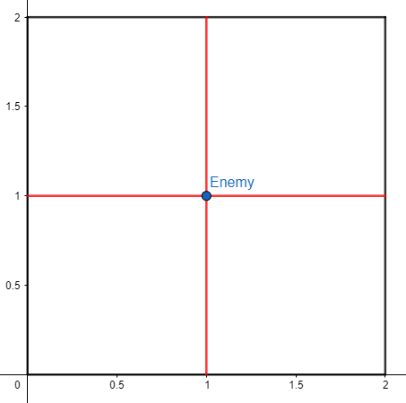
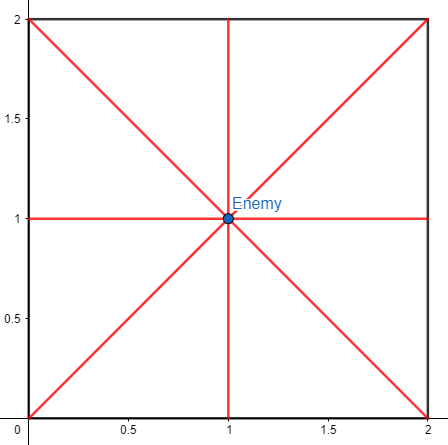

<h1 style='text-align: center;'> H. Laser Beams</h1>

<h5 style='text-align: center;'>time limit per test: 2 seconds</h5>
<h5 style='text-align: center;'>memory limit per test: 512 megabytes</h5>

Ira is developing a computer game. This game features randomized generation and difficulty of levels. To achieve randomized difficulty, some enemies in each level are randomly replaced with stronger ones.

To describe how do the levels in the game look, let's introduce a coordinate system in such a way that $Ox$ axis goes from left to right, and $Oy$ axis goes from bottom to top. A level is a rectangle with opposite corners in points $(0, 0)$ and $(a, b)$. Each enemy's position is a point in this rectangle.

As for now, Ira has implemented one type of enemy in the game, in two different versions — basic and upgraded. Both versions of enemies Ira has implemented fire laser rays in several directions:

* basic enemies fire four laser rays in four directions: to the right (in the same direction as the vector $(1, 0)$), to the left (in the same direction as the vector $(-1, 0)$), up (in the same direction as the vector $(0, 1)$), and down (in the same direction as the vector $(0, -1)$);
* upgraded enemies fire eight laser rays in eight directions: four directions listed for basic enemies, and four directions corresponding to vectors $(1, 1)$, $(1, -1)$, $(-1, 1)$, $(-1, -1)$.

Laser rays pass through enemies and are blocked only by the borders of the level (sides of the rectangle that denotes the level). Enemies are unaffected by lasers.

The level Ira is working on has $n$ enemies. The $i$-th enemy is in the point $(x_i, y_i)$, and it has a probability of $p_i$ to be upgraded (it's either upgraded with probability $p_i$, or basic with probability $1-p_i$). All these events are independent.

Ira wants to estimate the expected difficulty. She considers that a good way to evaluate the difficulty of the level is to count the number of parts in which the level is divided by the laser rays. So, she wants to calculate the expected number of these parts.

Help her to do the evaluation of the level!

#### Input

The first line contains three integers $n$, $a$ and $b$ ($1 \le n \le 100$; $2 \le a, b \le 100$) — the number of enemies in the level and the dimensions of the level.

Then $n$ lines follow, the $i$-th of them contains three integers $x_i$, $y_i$ and $p'_i$ ($1 \le x_i \le a - 1$; $1 \le y_i \le b - 1$; $1 \le p'_i \le 999999$), meaning that the $i$-th enemy is located at $(x_i, y_i)$ and has a probability of $\frac{p'_i}{10^6}$ to be upgraded.

No two enemies are located in the same point.

#### Output

Print one integer — the expected number of parts in which the lasers divide the level, taken modulo $998244353$ (i. e. let the expected number of parts be $\frac{x}{y}$ as an irreducible fraction; you have to print $x \cdot y^{-1} \bmod 998244353$, where $y^{-1}$ is a number such that $y \cdot y^{-1} \bmod 998244353 = 1$).

## Examples

#### Input


```text
1 2 2
1 1 500000
```
#### Output


```text
6
```
#### Input


```text
2 3 2
1 1 500000
2 1 500000
```
#### Output


```text
499122187
```
## Note

Explanation to the first example:

With probability $\frac{1}{2}$, the only enemy is not upgraded and the level looks like this ($4$ parts):

  With probability $\frac{1}{2}$, the only enemy is upgraded and the level looks like this ($8$ parts):

  So, the expected number of parts is $4 \cdot \frac{1}{2} + 8 \cdot \frac{1}{2} = 6$.


#### Tags 

#2900 #NOT OK #*special #geometry #probabilities 

## Blogs
- [All Contest Problems](../Kotlin_Heroes:_Episode_8.md)
- [Announcement](../blogs/Announcement.md)
- [Tutorial (en)](../blogs/Tutorial_(en).md)
