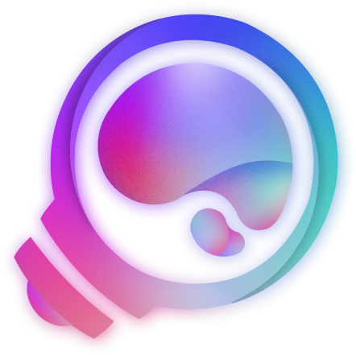

# Announcement_(en)

Hi **Codeforces** ଘ(੭*ˊᵕˋ)੭* ੈ♡‧₊˚!

We're delighted to invite you to [COMPFEST 13 — Finals Online Mirror (Unrated, ICPC Rules, Teams Preferred)](https://codeforces.com/contests/1575) on [Saturday, October 2, 2021 at 19:35UTC+6](https://codeforces.com/https://www.timeanddate.com/worldclock/fixedtime.html?day=2&month=10&year=2021&hour=16&min=35&sec=0&p1=166).

All problems were written and prepared by [hocky](https://codeforces.com/profile/hocky "Candidate Master hocky"), [steven.novaryo](https://codeforces.com/profile/steven.novaryo "Candidate Master steven.novaryo"), [rama_pang](https://codeforces.com/profile/rama_pang "International Grandmaster rama_pang"), [JulianFernando](https://codeforces.com/profile/JulianFernando "Candidate Master JulianFernando"), [yz_](https://codeforces.com/profile/yz_ "Master yz_"), [Panji](https://codeforces.com/profile/Panji "Specialist Panji"), [richiesenlia](https://codeforces.com/profile/richiesenlia "Specialist richiesenlia"), [Sakamoto](https://codeforces.com/profile/Sakamoto "Expert Sakamoto"), and [markus_geger](https://codeforces.com/profile/markus_geger "Expert markus_geger").

I would also like to thank:

 * [KAN](https://codeforces.com/profile/KAN "Legendary Grandmaster KAN") for helping to host the mirror round;
* ([AVM.Martin](https://codeforces.com/profile/AVM.Martin "Candidate Master AVM.Martin"), [Ace_02](https://codeforces.com/profile/Ace_02 "Master Ace_02")), [Berted](https://codeforces.com/profile/Berted "Master Berted"), [ardan](https://codeforces.com/profile/ardan "Master ardan"), [wijayareynaldo](https://codeforces.com/profile/wijayareynaldo "Candidate Master wijayareynaldo"), and [bukanYohandi](https://codeforces.com/profile/bukanYohandi "Candidate Master bukanYohandi") for testing the round locally and improved the problems in early phases;
* UWr Kobor 53 ([w0nsh](https://codeforces.com/profile/w0nsh "Grandmaster w0nsh"), [kobor](https://codeforces.com/profile/kobor "Master kobor"), [Fly_37](https://codeforces.com/profile/Fly_37 "Master Fly_37")), Almost Retired ([KAN](https://codeforces.com/profile/KAN "Legendary Grandmaster KAN"), [Um_nik](https://codeforces.com/profile/Um_nik "Legendary Grandmaster Um_nik"), [Ekler](https://codeforces.com/profile/Ekler "International Master Ekler")), and [errorgorn](https://codeforces.com/profile/errorgorn "Grandmaster errorgorn") for testing the round and their really useful feedbacks;
* Universitas Indonesia, all the local committees, administrators, and managers of the whole COMPFEST event;
* [prabowo](https://codeforces.com/profile/prabowo "Grandmaster prabowo") for observing the contest;
* [fushar](https://codeforces.com/profile/fushar "Expert fushar") for the Judgels platform used in the official contest; and finally
* [MikeMirzayanov](https://codeforces.com/profile/MikeMirzayanov "Headquarters, MikeMirzayanov") for the great Codeforces and our lovely Polygon!
* Extra thanks for [rama_pang](https://codeforces.com/profile/rama_pang "International Grandmaster rama_pang") and [steven.novaryo](https://codeforces.com/profile/steven.novaryo "Candidate Master steven.novaryo") for working hard night 🌚 and day 🌞 making sure the problems are well-prepared (the contest wouldn't exist without their hands).

The duration will be **5 hours**, consisting of **13 problems**. You can register individually, but teams are preferred. You may expect relatively easier problems than ICPC Regional Contests. You may code parallely with several computers with your teammates and use prewritten codes and templates.

COMPFEST itself is an annual event hosted by Universitas Indonesia. It is the largest student-run IT event in Indonesia and competitive programming contest is one of the competitions hosted.

We've put great effort into preparing this contest and we hope that you will enjoy it. See you! **ありがとう**~! 🐾

UPD: Editorial is out!!! [Editowial UωU](COMPFEST_13_—_Editorial_(en).md)

Congratulations to our top 5!

 1. leziren ([jqdai0815](https://codeforces.com/profile/jqdai0815 "Legendary Grandmaster jqdai0815"), [TLE](https://codeforces.com/profile/TLE "Legendary Grandmaster TLE"), [Rewinding](https://codeforces.com/profile/Rewinding "Legendary Grandmaster Rewinding"))
2. [heno239](https://codeforces.com/profile/heno239 "Legendary Grandmaster heno239")
3. bubble ([riantkb](https://codeforces.com/profile/riantkb "Grandmaster riantkb"), [nuip](https://codeforces.com/profile/nuip "International Grandmaster nuip"), [mtsd](https://codeforces.com/profile/mtsd "Grandmaster mtsd"))
4. [gisp_zjz](https://codeforces.com/profile/gisp_zjz "Legendary Grandmaster gisp_zjz")
5. We Won it 0 time ([aarr](https://codeforces.com/profile/aarr "Grandmaster aarr"), [afterall](https://codeforces.com/profile/afterall "Grandmaster afterall"), [Amoo_Safar](https://codeforces.com/profile/Amoo_Safar "International Grandmaster Amoo_Safar"))
