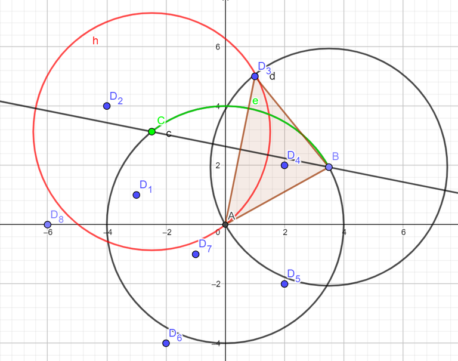

# COMPFEST_13_—_Editorial_(en)

[1575A. Another Sorting Problem](../problems/A._Another_Sorting_Problem.md)
-------------------------------------------------------------------------------

Author: [hocky](https://codeforces.com/profile/hocky "Candidate Master hocky")  
Developer: [richiesenlia](https://codeforces.com/profile/richiesenlia "Specialist richiesenlia")  
Editorialist: [hocky](https://codeforces.com/profile/hocky "Candidate Master hocky")

 **Idea**Observe that the even-indexed character of the string can be transformed from `A`-`Z` to `Z`-`A`. E.g. for the first example:

 * AA → AZ
* AB → AY
* BB → BY
* BA → BZ
* AZ → AA

Now, you can use any known algorithms to sort the string as usual. You can sort it in linear time with trie, or `std::sort` in O(nmlogn) time.

Time Complexity : O(nm) or O(nmlogn)

[1575B. Building an Amusement Park](../problems/B._Building_an_Amusement_Park.md)
----------------------------------------------------------------------------------

Author: [Panji](https://codeforces.com/profile/Panji "Specialist Panji")  
Developer: [hocky](https://codeforces.com/profile/hocky "Candidate Master hocky"), [rama_pang](https://codeforces.com/profile/rama_pang "International Grandmaster rama_pang")  
Editorialist: [hocky](https://codeforces.com/profile/hocky "Candidate Master hocky"), [rama_pang](https://codeforces.com/profile/rama_pang "International Grandmaster rama_pang")

 **Idea**We can binary search the answer r in this case. Here, bird's habitats are referred as points. First of all, define a function c(x) as the maximum number of points that can be covered with a circle of radius x through the origin.

Define the park as a circle with radius x and θ, in a polar coordinate representation. Observe that each points have a **radial/angle segment** of which the point pi will be inside the circle if and only if θ belongs to the radial segment of [Lpi,Rpi], where −π<Lpi,Rpi≤π.

E.g for x=4, Observe the Lp3 for the p3=(1,5).



The green radial segment e represents the [Lp3,Rp3]. Now, to find the two end points Bi and Ci of the arc for each point pi. Because the triangle that is made by those 3 points are an isosceles triangle, simply find the angle where the distance of pi and Bi equals to x, that is Δ=cos−1||pi||2r. Now the segment can be found by calculating the angle of tan−1pi±Δ. Do a radial sweep to find the maximum number of points.

Time complexity is O(nlogn⋅log(MAX_R⋅ϵ−1)).

We can optimize the binary search part further, since we only need log(ϵ−1) most significant digits. We can binary search the position of the first non-zero digit in O(loglog(MAX_R)), then use a normal binary search with O(log(ϵ−1)) steps. In practice, this improves the time by around a factor of 2.

Time complexity: O(nlogn⋅log(MAX_R⋅ϵ−1)) or O(nlogn⋅log(log(MAX_R)⋅ϵ−1)).

[1575C. Cyclic Sum](../problems/C._Cyclic_Sum.md)
------------------------------------------------------------------

Author: [steven.novaryo](https://codeforces.com/profile/steven.novaryo "Candidate Master steven.novaryo")  
Developer: [steven.novaryo](https://codeforces.com/profile/steven.novaryo "Candidate Master steven.novaryo")  
Editorialist: [steven.novaryo](https://codeforces.com/profile/steven.novaryo "Candidate Master steven.novaryo")

 **Idea**Let a valid segment [l,r] be a segment in b where the sum of elements in the segment is divisible by k.

We can try to solve a simpler problem: find the number of valid segments such that the right endpoint ends at 1. That is, the valid segments [l,1] (1≤l≤n⋅m).

Let prefix(p)=∑pi=1b[i] and cnt be an array where the cnt[i] denote the number of p (1≤p≤n⋅m) such that i≡prefix(p)modk. 

Notice that the number of valid segment [l,1] is cnt[prefix(n⋅m)+b[1]]. Furthermore, the number of valid segments [l,1+x⋅n] (0≤x≤m−1) is the same as the number of valid segment [l,1]. 

Thus, we only need to calculate the number of valid segments for [l,r] with 1≤l≤n⋅m and 1≤r≤n, then multiply the final result by m.

First we need to find the array cnt. Let sum=prefix(n).

When sum≡0modk, we can find cnt in a straightforward manner.

Now assume sum≢0modk. For a fixed i, let's try to find the contribution of prefix(i+x⋅n) for all 0≤x≤m−1 to cnt at once. Observe that if one make a directed graph with (i, (i+sum)modk) for 0≤i<k as the edges, one will get a cycle of length k (since k is prime) as the result. To find the contribution of prefix(i+x⋅n), we can do a range add operation on this cycle. This can be done with offline prefix sums (prefix difference) in O(k) total.

Now that we have the array cnt, we can find the number of valid segments that ends at 1 easily. To find valid segment that ends at index 2, we can modify cnt by adding prefix(n⋅m)+b[1] to the counter and removing b[1]. We do this for all 1≤r≤n.

This solution is also applicable for arbitary k, albeit multiple cycles will be generated and must be handled separatedly.

 Time complexity: O(n+k)

 [1575D. Divisible by Twenty-Five](../problems/D._Divisible_by_Twenty-Five.md)
---------------------------------------------------------------------------------

Author: [hocky](https://codeforces.com/profile/hocky "Candidate Master hocky")  
Developer: [hocky](https://codeforces.com/profile/hocky "Candidate Master hocky")  
Editorialist: [hocky](https://codeforces.com/profile/hocky "Candidate Master hocky")

 **Idea**There are no dirty tricks to solve this problem. Brute force all possible number between i∈[10|s|−1,10|s|−1], with step i:=i+25. You might want to handle when |s|=1, because 0 is a valid s, if possible. For easier implementation, you can use the `std::to_string(s)` in C++.

It is also possible to solve it in O(|s|) by case analysis.

Time complexity: O(125⋅|s|⋅10|s|) or O(|s|).

 **Short Solution**
```cpp
#include <bits/stdc++.h>
using namespace std;

#define sz(x) (int)(x).size()
typedef long long LL;
LL expo(LL a, LL b){
  // a %= MOD; // USE THIS WHEN N IS REALLY BIG!
  LL ret = 1;
  while(b > 0){
    if(b&1) ret = (ret*a);
    a = (a*a); b >>= 1;
  }
  return ret;
}

int main(){
  ios_base::sync_with_stdio(0);
  cin.tie(0);
  string s; cin >> s;
  int low = expo(10, sz(s) - 1);
  int high = expo(10, sz(s)) - 1;
  if(low == 1) low--;
  while(low%25) low++;
  int ans = 0;
  for(;low <= high;low += 25){
    string current = to_string(low);
    char xval = '-';
    bool can = 1;
    for(int i = 0;i < sz(s);i++){
      if(s[i] == '_') continue;
      if(s[i] == 'X'){
        if(xval != '-' && xval != current[i]){
          can = 0;
          break;
        }
        xval = current[i];
      }else if(s[i] != current[i]){
        can = 0;
        break;
      }
    }
    ans += can;
  }
  cout << ans << endl;
}
```
[1575E. Eye-Pleasing City Park Tour](../problems/E._Eye-Pleasing_City_Park_Tour.md)
------------------------------------------------------------------------------------

Author: [steven.novaryo](https://codeforces.com/profile/steven.novaryo "Candidate Master steven.novaryo")  
Developer: [rama_pang](https://codeforces.com/profile/rama_pang "International Grandmaster rama_pang"), [hocky](https://codeforces.com/profile/hocky "Candidate Master hocky"), [steven.novaryo](https://codeforces.com/profile/steven.novaryo "Candidate Master steven.novaryo")  
Editorialist: [rama_pang](https://codeforces.com/profile/rama_pang "International Grandmaster rama_pang"), [steven.novaryo](https://codeforces.com/profile/steven.novaryo "Candidate Master steven.novaryo") 

 **Idea**We can use centroid decomposition to solve this problem.

Suppose we find the centroid cen of the tree, and root the tree at cen. We consider each subtree of the children of cen as different groups of vertices. We want to find the sum of f(u,v) for all valid tours, such that u and v are from different groups.

We can solve this with basic inclusion-exclusion. We count the sum of f(u,v) where the path u→cen→v uses less than k tickets, without caring which group u,v belongs to. Then, we can subtract it by only considering u→cen→v where u,v belongs from the same group.

Define cost(u) as the number of tickets you need to go from u to cen. For a fixed set of vertices S, you can count f(u,v) where cost(u)+cost(v)+z≤k with prefix sums. Note that z depends on whether the last edge of the path from u→cen and v→cen has different colors. We can do all of these in O(|S|).

We use the solution above while setting S as the set of all vertices in cen's subtree, or the set of vertices with the same group.

Because the depth of a centroid tree is O(logn), the overall complexity of the solution is O(nlogn).

[1575F. Finding Expected Value](../problems/F._Finding_Expected_Value.md)
------------------------------------------------------------------------------

Author: [rama_pang](https://codeforces.com/profile/rama_pang "International Grandmaster rama_pang")  
Developer: [rama_pang](https://codeforces.com/profile/rama_pang "International Grandmaster rama_pang")  
Editorialist: [rama_pang](https://codeforces.com/profile/rama_pang "International Grandmaster rama_pang")

 **Idea**We can use this [trick](https://codeforces.com/blog/entry/77284#comment-620956), which is also explained below.

Suppose ai≠−1 for now. We want to find a function F(a) such that E(Ft+1−Ft|Ft)=−1, where Ft is the value of F(a) at time t. If we can find such a function, then the expected stopping time is equal to F(a0)−F(aT), where a0 is the initial array before doing any operation, and aT is the final array where we don't do any more operation (that is, all elements of aT are equal).

Suppose occ(x) is the number of occurrences of x in the current array, for some 0≤x<k. It turns out we can find such F satisfying F=∑k−1x=0f(occ(x)) for some function f. We now try to find f. 

Suppose we currently have at, and we want to find the expected value of F(at+1). There are two cases to consider:

 * ∀x,occt+1(x)=occt(x) if ai doesn't change when doing the operation. This happens with probability 1k⋅occt(x)n for each x.
* Otherwise, there exist some x,y (x≠y) such that occt+1(x)=occt(x)−1 and occt+1(y)=occt(y)+1. This happens if initially ai=x, then by doing the operation we change it to y. This happens with probability 1k⋅occt(x)n for each x,y.

Thus,

 E(Ft+1−Ft|Ft)=−1⟹k−1∑i=0f(occt+1(i))−k−1∑i=0f(occt(x))=−1⟹k−1∑i=0f(occt+1(i))=k−1∑i=0f(occt(i))−1⟹1kk−1∑i=0f(occt(i))+k−1∑x=0k−1∑y=0[x≠y]occt(x)nk(k−1∑i=0f(occt(i))−f(occt(x))−f(occt(y))+f(occt(x)−1)+f(occt(y)+1))=k−1∑i=0f(occt(i))−1⟹k−1∑x=0k−1∑y=0[x≠y]occt(x)nk(−f(occt(x))−f(occt(y))+f(occt(x)−1)+f(occt(y)+1))=−1⟹k−1∑x=0(k−1)occt(x)nk(f(occt(x)−1)−f(occt(x)))+n−occt(x)nk(f(occt(x)+1)−f(occt(x)))=−1⟹k−1∑x=0(k−1)occt(x)nk(f(occt(x)−1)−f(occt(x)))+n−occt(x)nk(f(occt(x)+1)−f(occt(x)))+occt(x)n=0Suppose a=occt(x). If we can find f such that

 (k−1)ank(f(a−1)−f(a))+n−ank(f(a+1)−f(a))+an=0then f satisfies F.

 (k−1)ank(f(a−1)−f(a))+n−ank(f(a+1)−f(a))+an=0(k−1)a(f(a−1)−f(a))+(n−a)(f(a+1)−f(a))+ak=0(k−1)af(a−1)−(k−1)af(a)+(n−a)f(a+1)−(n−a)f(a)+ak=0f(a+1)=1a−n((k−1)af(a−1)+(2a−ak−n)f(a)+ak)So we can set f to any function that satisfies the recursive formula above, and then derive F.

To handle ai=−1, note that F depends only on the occurrence of each value x (0≤x<k), and each of them is independent. Therefore, we can count the contribution for each x towards all possible final arrays separately. This is easy to do in O(n).

Moreoever, there is only O(√n) values of occ(x) in the initial array (before changing ai=−1), and each x with the same occurrences contribute the same amount. Therefore, we can solve the problem in O(n√n).

[1575G. GCD Festival](../problems/G._GCD_Festival.md)
--------------------------------------------------------------------

Author: [yz_](https://codeforces.com/profile/yz_ "Master yz_")  
Developer: [hocky](https://codeforces.com/profile/hocky "Candidate Master hocky"), [yz_](https://codeforces.com/profile/yz_ "Master yz_")  
Editorialist: [rama_pang](https://codeforces.com/profile/rama_pang "International Grandmaster rama_pang")

 **Idea**Define:

 * d(n) as the set of all divisors of n;
* ϕ(x) as the [euler totient function](https://codeforces.com/https://en.wikipedia.org/wiki/Euler%27s_totient_function) of x; and
* d(a,b) as the set of all divisors of both a and b; or equivalently, d(gcd(a,b)).

Observe that ∑x∈d(n)ϕ(x)=n. This implies ∑x∈d(a,b)ϕ(x)=gcd(a,b)

 ∑ni=1∑nj=1gcd(i,j)⋅gcd(ai,aj)∑ni=1∑nj=1((∑x∈d(i,j)ϕ(x))⋅gcd(ai,aj)))∑nx=1ϕ(x)∑⌊nx⌋i=1∑⌊nx⌋j=1gcd(aix,ajx)∑nx=1ϕ(x)∑⌊nx⌋i=1∑⌊nx⌋j=1∑y∈d(aix,ajx)ϕ(y)∑nx=1ϕ(x)∑yϕ(y)(∑⌊nx⌋i=1[aixmody=0])2If we only iterate y where y is a divisor of one of aix, we can compute the above summation in O(nlognmaxni=1(|d(ai)|)).

 [1575H. Holiday Wall Ornaments](../problems/H._Holiday_Wall_Ornaments.md)
------------------------------------------------------------------------------

Author: [hocky](https://codeforces.com/profile/hocky "Candidate Master hocky")  
Developer: [Sakamoto](https://codeforces.com/profile/Sakamoto "Expert Sakamoto"), [hocky](https://codeforces.com/profile/hocky "Candidate Master hocky")  
Editorialist: [hocky](https://codeforces.com/profile/hocky "Candidate Master hocky"), [rama_pang](https://codeforces.com/profile/rama_pang "International Grandmaster rama_pang")

 **Idea**Do a dynamic programming with three states:

 * Position in s
* Position in t
* How many matches left.

define the dynamic programming of dp[a][b][rem] as the minimum cost of having the string p=s[1..a], rem matches left, and the longest prefix match between s and t is at b. The answer will be at dp[n][c][0] for any arbitrary c.

The transition can first be precomputed with brute force in O(n3) or with Aho-Corasick.

Time complexity: O(n3)  
Space complexity: O(n2)

[1575I. Illusions of the Desert](../problems/I._Illusions_of_the_Desert.md)
-------------------------------------------------------------------------------

Author: [JulianFernando](https://codeforces.com/profile/JulianFernando "Candidate Master JulianFernando")  
Developer: [JulianFernando](https://codeforces.com/profile/JulianFernando "Candidate Master JulianFernando"), [hocky](https://codeforces.com/profile/hocky "Candidate Master hocky")  
Editorialist: [hocky](https://codeforces.com/profile/hocky "Candidate Master hocky")

 **Idea**Note that max(|ax+ay|,|ax−ay|)=|ax|+|ay|.

Now the problem can be reduced to updating a vertex's value and querying the sum of values of vertices in a path.

This can be done in several ways. One can use euler tour tree flattening method, as described in [Euler Tour Magic by brdy blog](https://codeforces.com/blog/entry/63020), or use heavy-light decomposition.

Time complexity : O((q+n)log2n) or O((q+n)logn)

[1575J. Jeopardy of Dropped Balls](../problems/J._Jeopardy_of_Dropped_Balls.md)
---------------------------------------------------------------------------------

Author: [richiesenlia](https://codeforces.com/profile/richiesenlia "Specialist richiesenlia")  
Developer: [richiesenlia](https://codeforces.com/profile/richiesenlia "Specialist richiesenlia")  
Editorialist: [hocky](https://codeforces.com/profile/hocky "Candidate Master hocky")

 **Idea**Naively simulating the ball's path is enough, and runs in O(nm+nk). Note that if we visit a non-2 cell, then the path length of the current ball is increased by 1, and then the cell turns into 2. So the total length of all paths can be increased by at most O(nm) times. In addition, each ball needs at least O(n) moves to travel, so we get O(nm+nk).

We can improve this further. You can speed up each drops by storing consecutive 2-cell segments in the downwards direction for each column. Using a Disjoint-Set Union data structure, for each cell ax,y=2, join it with its bottom cell if ax+1,y=2.

Time complexity: O(k+rc⋅α(rc))

[1575K. Knitting Batik](../problems/K._Knitting_Batik.md)
----------------------------------------------------------------------

Author: [hocky](https://codeforces.com/profile/hocky "Candidate Master hocky")  
Developer: [hocky](https://codeforces.com/profile/hocky "Candidate Master hocky")  
Editorialist: [hocky](https://codeforces.com/profile/hocky "Candidate Master hocky")

 **Fun fact**October the 2nd is the National Batik Day of Indonesia

 **Idea**Observe that only some several non-intersecting part of nm−rc that is independent in the grid. Simple casework shows that the answer is knm if a=b, and knm−rc otherwise.

 Time complexity: O(lognm) 

[1575L. Longest Array Deconstruction](../problems/L._Longest_Array_Deconstruction.md)
------------------------------------------------------------------------------------

Author: [yz_](https://codeforces.com/profile/yz_ "Master yz_")  
Developer: [steven.novaryo](https://codeforces.com/profile/steven.novaryo "Candidate Master steven.novaryo")  
Editorialist: [steven.novaryo](https://codeforces.com/profile/steven.novaryo "Candidate Master steven.novaryo")

 **Idea**Define a′ as the array we get after removing some elements in a and valid element as a′i that satisfy a′i=i.

We can try to find combination of indices c1,c2,…cm such that aci=a′pi=pi for a certain set p1,p2,…pm. In other words, we want to find all indices c1,c2,…cm such that aci will be a valid element in the a′.

Observe that each element in c and every pair i and j (i<j) must satisfy:  
1. ci<cj  
2. aci<acj  
3. ci−aci≤cj−acj, the element you need to remove to adjust aci to it's location is smaller than acj. 

Therefore, we can convert each index into (ci,aci,ci−aci) and find the longest sequence of those tuples that satisfy the conditions. This is sufficient with divide and conquer in O(nlognlogn).

But the solution can be improved further. Notice that if (2)∧(3)⟹(1). Hence we can solve problem by finding the longest sequence of pairs (aci,ci−aci) with any standard LIS algorithm.

Time complexity: O(nlogn)

[1575M. Managing Telephone Poles](../problems/M._Managing_Telephone_Poles.md)
--------------------------------------------------------------------------------

Author: [yz_](https://codeforces.com/profile/yz_ "Master yz_")  
Developer: [steven.novaryo](https://codeforces.com/profile/steven.novaryo "Candidate Master steven.novaryo")  
Editorialist: [steven.novaryo](https://codeforces.com/profile/steven.novaryo "Candidate Master steven.novaryo")

 **Fun fact**Interestingly, if you generate the Voronoi Diagram and transcribe it to a grid, then the same connected area in the Voronoi Diagram is not necessarily in the same 8-connected component in the grid. This is why most Dijkstra solutions will get WA. 

 **Idea**We can use convex hull trick to solve this problem.

Suppose that we only need to calculate ∑mx=0S(x,y) for a certain y. For a fixed y axis and a pole located in point (xi,yi), define f(x)=(x−xi)2+(y−yi)2=−2xxi+x2−x2i+(y−yi)2, which is the euclidean distance of point (x,y) and pole (xi,yi). 

Notice that, for a fixed pole i and axis y, f(x) is a line equation, thus we can maintain it with convex hull trick.

Additionally, for a certain y, there are only m poles that we need to consider. More specifically, pole (xi,yi) is called considerable if there is no other pole (xj,yj) such that xi=xj and |yi−y|<|yj−y|. 

Hence we can find the ∑mx=0S(x,y) for a certain y in O(m) or O(mlogm). Calculating ∑mx=0S(x,y) for all y will result in O(nm) or O(nmlogm) time complexity.

