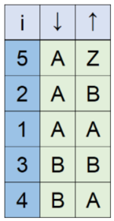

<h1 style='text-align: center;'> A. Another Sorting Problem</h1>

<h5 style='text-align: center;'>time limit per test: 2 seconds</h5>
<h5 style='text-align: center;'>memory limit per test: 512 megabytes</h5>

Andi and Budi were given an assignment to tidy up their bookshelf of $n$ books. Each book is represented by the book title — a string $s_i$ numbered from $1$ to $n$, each with length $m$. Andi really wants to sort the book lexicographically ascending, while Budi wants to sort it lexicographically descending.

Settling their fight, they decided to combine their idea and sort it asc-desc-endingly, where the odd-indexed characters will be compared ascendingly, and the even-indexed characters will be compared descendingly.

A string $a$ occurs before a string $b$ in asc-desc-ending order if and only if in the first position where $a$ and $b$ differ, the following holds:

* if it is an odd position, the string $a$ has a letter that appears earlier in the alphabet than the corresponding letter in $b$;
* if it is an even position, the string $a$ has a letter that appears later in the alphabet than the corresponding letter in $b$.
### Input

The first line contains two integers $n$ and $m$ ($1 \leq n \cdot m \leq 10^6$).

The $i$-th of the next $n$ lines contains a string $s_i$ consisting of $m$ uppercase Latin letters — the book title. The strings are pairwise distinct.

### Output

### Output

 $n$ integers — the indices of the strings after they are sorted asc-desc-endingly.

## Example

### Input


```text
5 2
AA
AB
BB
BA
AZ
```
### Output


```text
5 2 1 3 4
```
## Note

The following illustrates the first example.

  

#### Tags 

#1100 #NOT OK #data_structures #sortings #strings 

## Blogs
- [All Contest Problems](../COMPFEST_13_-_Finals_Online_Mirror_(Unrated,_ICPC_Rules,_Teams_Preferred).md)
- [Announcement (en)](../blogs/Announcement_(en).md)
- [COMPFEST 13 — Editorial (en)](../blogs/COMPFEST_13_—_Editorial_(en).md)
