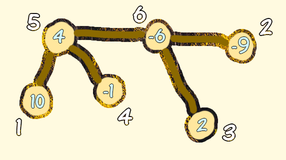

<h1 style='text-align: center;'> I. Illusions of the Desert</h1>

<h5 style='text-align: center;'>time limit per test: 3 seconds</h5>
<h5 style='text-align: center;'>memory limit per test: 512 megabytes</h5>

Chanek Jones is back, helping his long-lost relative Indiana Jones, to find a secret treasure in a maze buried below a desert full of illusions.

The map of the labyrinth forms a tree with $n$ rooms numbered from $1$ to $n$ and $n - 1$ tunnels connecting them such that it is possible to travel between each pair of rooms through several tunnels.

The $i$-th room ($1 \leq i \leq n$) has $a_i$ illusion rate. To go from the $x$-th room to the $y$-th room, there must exist a tunnel between $x$ and $y$, and it takes $\max(|a_x + a_y|, |a_x - a_y|)$ energy. $|z|$ denotes the absolute value of $z$.

To prevent grave robbers, the maze can change the illusion rate of any room in it. Chanek and Indiana would ask $q$ queries.

There are two types of queries to be done:

* $1\ u\ c$ — The illusion rate of the $x$-th room is changed to $c$ ($1 \leq u \leq n$, $0 \leq |c| \leq 10^9$).
* $2\ u\ v$ — Chanek and Indiana ask you the minimum sum of energy needed to take the secret treasure at room $v$ if they are initially at room $u$ ($1 \leq u, v \leq n$).

Help them, so you can get a portion of the treasure!

### Input

The first line contains two integers $n$ and $q$ ($2 \leq n \leq 10^5$, $1 \leq q \leq 10^5$) — the number of rooms in the maze and the number of queries.

The second line contains $n$ integers $a_1, a_2, \ldots, a_n$ ($0 \leq |a_i| \leq 10^9$) — inital illusion rate of each room.

The $i$-th of the next $n-1$ lines contains two integers $s_i$ and $t_i$ ($1 \leq s_i, t_i \leq n$), meaning there is a tunnel connecting $s_i$-th room and $t_i$-th room. The given edges form a tree.

The next $q$ lines contain the query as described. The given queries are valid.

### Output

For each type $2$ query, output a line containing an integer — the minimum sum of energy needed for Chanek and Indiana to take the secret treasure.

## Example

### Input


```text
6 4
10 -9 2 -1 4 -6
1 5
5 4
5 6
6 2
6 3
2 1 2
1 1 -3
2 1 2
2 3 3
```
### Output


```text
39
32
0
```
## Note

  In the first query, their movement from the $1$-st to the $2$-nd room is as follows.

* $1 \rightarrow 5$ — takes $\max(|10 + 4|, |10 - 4|) = 14$ energy.
* $5 \rightarrow 6$ — takes $\max(|4 + (-6)|, |4 - (-6)|) = 10$ energy.
* $6 \rightarrow 2$ — takes $\max(|-6 + (-9)|, |-6 - (-9)|) = 15$ energy.

 In total, it takes $39$ energy.In the second query, the illusion rate of the $1$-st room changes from $10$ to $-3$.

In the third query, their movement from the $1$-st to the $2$-nd room is as follows.

* $1 \rightarrow 5$ — takes $\max(|-3 + 4|, |-3 - 4|) = 7$ energy.
* $5 \rightarrow 6$ — takes $\max(|4 + (-6)|, |4 - (-6)|) = 10$ energy.
* $6 \rightarrow 2$ — takes $\max(|-6 + (-9)|, |-6 - (-9)|) = 15$ energy.

Now, it takes $32$ energy.


#### Tags 

#2300 #NOT OK #data_structures #trees 

## Blogs
- [All Contest Problems](../COMPFEST_13_-_Finals_Online_Mirror_(Unrated,_ICPC_Rules,_Teams_Preferred).md)
- [Announcement (en)](../blogs/Announcement_(en).md)
- [COMPFEST 13 — Editorial (en)](../blogs/COMPFEST_13_—_Editorial_(en).md)
