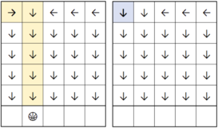
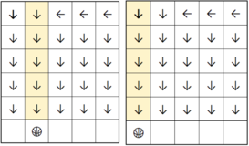

<h1 style='text-align: center;'> J. Jeopardy of Dropped Balls</h1>

<h5 style='text-align: center;'>time limit per test: 2 seconds</h5>
<h5 style='text-align: center;'>memory limit per test: 512 megabytes</h5>

Mr. Chanek has a new game called Dropping Balls. Initially, Mr. Chanek has a grid $a$ of size $n \times m$

Each cell $(x,y)$ contains an integer $a_{x,y}$ denoting the direction of how the ball will move.

* $a_{x,y}=1$ — the ball will move to the right (the next cell is $(x, y + 1)$);
* $a_{x,y}=2$ — the ball will move to the bottom (the next cell is $(x + 1, y)$);
* $a_{x,y}=3$ — the ball will move to the left (the next cell is $(x, y - 1)$).

Every time a ball leaves a cell $(x,y)$, the integer $a_{x,y}$ will change to $2$. Mr. Chanek will drop $k$ balls sequentially, each starting from the first row, and on the $c_1, c_2, \dots, c_k$-th ($1 \leq c_i \leq m$) columns.

Determine in which column each ball will end up in (position of the ball after leaving the grid).

#### Input

The first line contains three integers $n$, $m$, and $k$ ($1 \leq n, m \leq 1000$, $1 \leq k \leq 10^5$) — the size of the grid and the number of balls dropped by Mr. Chanek.

The $i$-th of the next $n$ lines contains $m$ integers $a_{i,1},a_{i,2},\ldots,a_{i,m}$ ($1 \leq a_{i,j} \leq 3$). It will satisfy $a_{i, 1} \ne 3$ and $a_{i, m} \ne 1$.

The next line contains $k$ integers $c_1, c_2, \ldots, c_k$ ($1 \leq c_i \leq m$) — the balls' column positions dropped by Mr. Chanek sequentially.

#### Output

#### Output

 $k$ integers — the $i$-th integer denoting the column where the $i$-th ball will end.

## Examples

#### Input


```text
5 5 3
1 2 3 3 3
2 2 2 2 2
2 2 2 2 2
2 2 2 2 2
2 2 2 2 2
1 2 1
```
#### Output


```text
2 2 1 
```
#### Input


```text
1 2 2
1 3
1 2
```
#### Output


```text
1 2 
```
## Note

In the first example, the first ball will drop as follows. 
## Note

 that the cell $(1, 1)$ will change direction to the bottom direction.

  The second and third balls will drop as follows. 

  All balls will be dropped from the first row and on the $c_1, c_2, \dots, c_k$-th columns respectively. A ball will stop dropping once it leaves the grid.


#### Tags 

#1500 #NOT OK #binary_search #brute_force #dsu #implementation 

## Blogs
- [All Contest Problems](../COMPFEST_13_-_Finals_Online_Mirror_(Unrated,_ICPC_Rules,_Teams_Preferred).md)
- [Announcement (en)](../blogs/Announcement_(en).md)
- [COMPFEST 13 — Editorial (en)](../blogs/COMPFEST_13_—_Editorial_(en).md)
