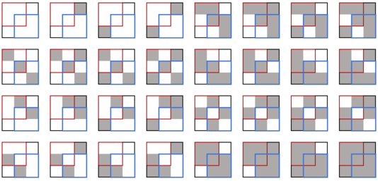

<h1 style='text-align: center;'> K. Knitting Batik</h1>

<h5 style='text-align: center;'>time limit per test: 2 seconds</h5>
<h5 style='text-align: center;'>memory limit per test: 512 megabytes</h5>

Mr. Chanek wants to knit a batik, a traditional cloth from Indonesia. The cloth forms a grid $a$ with size $n \times m$. There are $k$ colors, and each cell in the grid can be one of the $k$ colors.

Define a sub-rectangle as an ordered pair of two cells $((x_1, y_1), (x_2, y_2))$, denoting the top-left cell and bottom-right cell (inclusively) of a sub-rectangle in $a$. Two sub-rectangles $((x_1, y_1), (x_2, y_2))$ and $((x_3, y_3), (x_4, y_4))$ have the same pattern if and only if the following holds: 

* they have the same width ($x_2 - x_1 = x_4 - x_3$);
* they have the same height ($y_2 - y_1 = y_4 - y_3$);
* for every pair $(i, j)$ where $0 \leq i \leq x_2 - x_1$ and $0 \leq j \leq y_2 - y_1$, the color of cells $(x_1 + i, y_1 + j)$ and $(x_3 + i, y_3 + j)$ are equal.

Count the number of possible batik color combinations, such that the subrectangles $((a_x, a_y),(a_x + r - 1, a_y + c - 1))$ and $((b_x, b_y),(b_x + r - 1, b_y + c - 1))$ have the same pattern.

#### Output

 the answer modulo $10^9 + 7$.

#### Input

The first line contains five integers $n$, $m$, $k$, $r$, and $c$ ($1 \leq n, m \leq 10^9$, $1 \leq k \leq 10^9$, $1 \leq r \leq \min(10^6, n)$, $1 \leq c \leq \min(10^6, m)$) — the size of the batik, the number of colors, and size of the sub-rectangle.

The second line contains four integers $a_x$, $a_y$, $b_x$, and $b_y$ ($1 \leq a_x, b_x \leq n$, $1 \leq a_y, b_y \leq m$) — the top-left corners of the first and second sub-rectangle. Both of the sub-rectangles given are inside the grid ($1 \leq a_x + r - 1$, $b_x + r - 1 \leq n$, $1 \leq a_y + c - 1$, $b_y + c - 1 \leq m$).

#### Output

#### Output

 an integer denoting the number of possible batik color combinations modulo $10^9 + 7$.

## Examples

#### Input


```text
3 3 2 2 2
1 1 2 2
```
#### Output


```text
32
```
#### Input


```text
4 5 170845 2 2
1 4 3 1
```
#### Output


```text
756680455
```
## Note

The following are all $32$ possible color combinations in the first example.

  

#### Tags 

#2200 #NOT OK #implementation #math 

## Blogs
- [All Contest Problems](../COMPFEST_13_-_Finals_Online_Mirror_(Unrated,_ICPC_Rules,_Teams_Preferred).md)
- [Announcement (en)](../blogs/Announcement_(en).md)
- [COMPFEST 13 — Editorial (en)](../blogs/COMPFEST_13_—_Editorial_(en).md)
