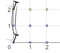

<h1 style='text-align: center;'> M. Managing Telephone Poles</h1>

<h5 style='text-align: center;'>time limit per test: 2 seconds</h5>
<h5 style='text-align: center;'>memory limit per test: 512 megabytes</h5>

Mr. Chanek's city can be represented as a plane. He wants to build a housing complex in the city.

There are some telephone poles on the plane, which is represented by a grid $a$ of size $(n + 1) \times (m + 1)$. There is a telephone pole at $(x, y)$ if $a_{x, y} = 1$.

For each point $(x, y)$, define $S(x, y)$ as the square of the Euclidean distance between the nearest pole and $(x, y)$. Formally, the square of the Euclidean distance between two points $(x_1, y_1)$ and $(x_2, y_2)$ is $(x_2 - x_1)^2 + (y_2 - y_1)^2$.

To optimize the building plan, the project supervisor asks you the sum of all $S(x, y)$ for each $0 \leq x \leq n$ and $0 \leq y \leq m$. Help him by finding the value of $\sum_{x=0}^{n} {\sum_{y=0}^{m} {S(x, y)}}$.

#### Input

The first line contains two integers $n$ and $m$ ($0 \leq n, m < 2000$) — the size of the grid.

Then $(n + 1)$ lines follow, each containing $(m + 1)$ integers $a_{i, j}$ ($0 \leq a_{i, j} \leq 1$) — the grid denoting the positions of telephone poles in the plane. There is at least one telephone pole in the given grid.

#### Output

#### Output

 an integer denoting the value of $\sum_{x=0}^{n} {\sum_{y=0}^{m} {S(x, y)}}$.

## Examples

#### Input


```text
2 2
101
000
000
```
#### Output


```text
18
```
#### Input


```text
5 4
10010
00000
01000
00001
00100
00010
```
#### Output


```text
36
```
## Note

  In the first example, the nearest telephone pole for the points $(0,0)$, $(1,0)$, $(2,0)$, $(0,1)$, $(1,1)$, and $(2,1)$ is at $(0, 0)$. While the nearest telephone pole for the points $(0, 2)$, $(1,2)$, and $(2,2)$ is at $(0, 2)$. Thus, $\sum_{x=0}^{n} {\sum_{y=0}^{m} {S(x, y)}} = (0 + 1 + 4) + (1 + 2 + 5) + (0 + 1 + 4) = 18$.


#### Tags 

#2400 #NOT OK #data_structures #geometry 

## Blogs
- [All Contest Problems](../COMPFEST_13_-_Finals_Online_Mirror_(Unrated,_ICPC_Rules,_Teams_Preferred).md)
- [Announcement (en)](../blogs/Announcement_(en).md)
- [COMPFEST 13 — Editorial (en)](../blogs/COMPFEST_13_—_Editorial_(en).md)
