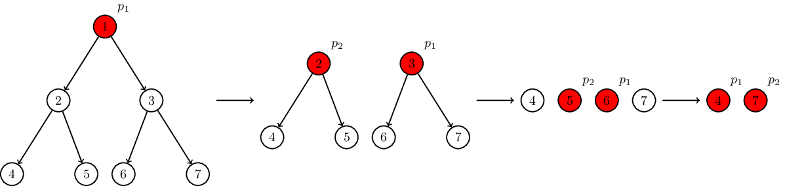

<h1 style='text-align: center;'> E. Easy Scheduling</h1>

<h5 style='text-align: center;'>time limit per test: 2 seconds</h5>
<h5 style='text-align: center;'>memory limit per test: 1024 megabytes</h5>

Eonathan Eostar decided to learn the magic of multiprocessor systems. He has a full binary tree of tasks with height $h$. In the beginning, there is only one ready task in the tree — the task in the root. At each moment of time, $p$ processes choose at most $p$ ready tasks and perform them. After that, tasks whose parents were performed become ready for the next moment of time. Once the task becomes ready, it stays ready until it is performed. 

You shall calculate the smallest number of time moments the system needs to perform all the tasks.

### Input

The first line of the input contains the number of tests $t$ ($1 \leq t \leq 5\cdot 10^5$). Each of the next $t$ lines contains the description of a test. A test is described by two integers $h$ ($1 \leq h \leq 50$) and $p$ ($1 \leq p \leq 10^4$) — the height of the full binary tree and the number of processes. It is guaranteed that all the tests are different.

### Output

For each test output one integer on a separate line — the smallest number of time moments the system needs to perform all the tasks.

## Example

### Input


```text
3
3 1
3 2
10 6
```
### Output


```text
7
4
173
```
## Note

Let us consider the second test from the sample input. There is a full binary tree of height $3$ and there are two processes. At the first moment of time, there is only one ready task, $1$, and $p_1$ performs it. At the second moment of time, there are two ready tasks, $2$ and $3$, and the processes perform them. At the third moment of time, there are four ready tasks, $4$, $5$, $6$, and $7$, and $p_1$ performs $6$ and $p_2$ performs $5$. At the fourth moment of time, there are two ready tasks, $4$ and $7$, and the processes perform them. Thus, the system spends $4$ moments of time to perform all the tasks.




#### Tags 

#1200 #NOT OK #implementation #math 

## Blogs
- [All Contest Problems](../ICPC_WF_Moscow_Invitational_Contest_-_Online_Mirror_(Unrated,_ICPC_Rules,_Teams_Preferred).md)
- [Announcement (en)](../blogs/Announcement_(en).md)
