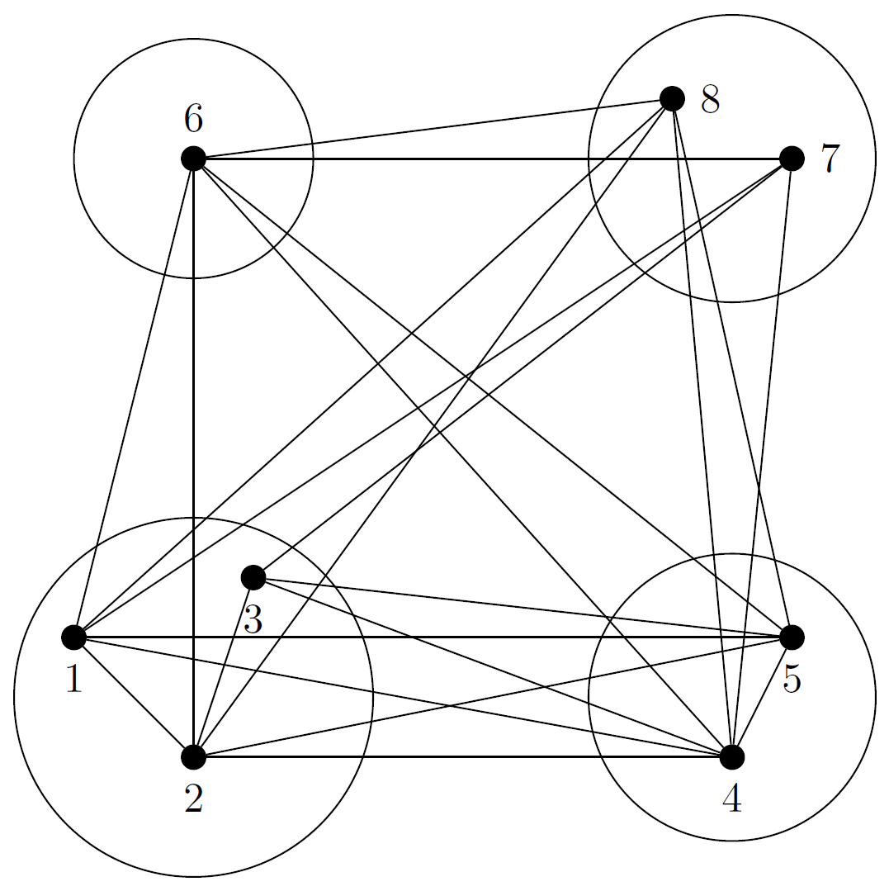

<h1 style='text-align: center;'> K. Kingdom of Islands</h1>

<h5 style='text-align: center;'>time limit per test: 2 seconds</h5>
<h5 style='text-align: center;'>memory limit per test: 1024 megabytes</h5>

The Kingdom of Islands consists of $p$ islands. As the king, you rule over the whole kingdom, while each island is ruled over by one or several jarls under your rule. In total, there are $n$ jarls under your jurisdiction.

Each island of the kingdom has its own strong traditions, so jarls that rule over the same island support each other and never have conflicts. The downsides of such strength are cultural conflicts between people inhabiting different islands. Thus, two jarls that rule over different islands are in conflict.

However, recent years brought a few changes to traditional relations between the jarls. To your knowledge, there are exactly $k$ pairs of jarls such that relationships between two jarls in the pair are different from the traditional. That is, if two jarls of the pair you know rule over the same island, these jarls are in conflict. If they rule over different islands, then they overcome cultural disagreement and there is no conflict between them anymore.

As a true responsible king, you are worried about whether the kingdom is close to a major conflict. In order to estimate the current situation, you would like to find the largest possible group of jarls such that every two jarls in the group are in conflict.

##### Input

The first line of the input consists of two integers $p$ and $n$ ($1 \le p \le n \le 10^5$; $1 \le p \le 10^4$).

The second line consists of $n$ integers $s_1, s_2, \ldots, s_n$ ($1 \le s_i \le p$). The integer $s_i$ denotes that the $i$-th jarl rules over the island number $s_i$. It is guaranteed that each island is ruled by at least one jarl.

The third line consists of a single integer $k$ ($0 \le k \le 20$).

Then $k$ lines follow. The $j$-th of these lines consists of two distinct integers $a_j$ and $b_j$ ($1 \le a_j < b_j \le n$), denoting that the relation between the $a_j$-th jarl and the $b_j$-th jarl differs from traditional. It is guaranteed that no pair of jarls appears twice in this list.

##### Output

In the first line print a single integer $q$ between $1$ and $n$ — the largest possible number of jarls in a pairwise conflicting group. In the second line print $q$ distinct integers between $1$ and $n$ — the numbers of jarls in the group. The numbers of jarls can be printed in any order.

## Examples

##### Input


```text
4 4
1 2 3 4
1
2 3
```
##### Output


```text
3
1 4 2 
```
##### Input

```text

2 4
1 1 2 2
1
3 4

```
##### Output


```text
3
2 4 3 
```
##### Input

```text

4 8
1 1 1 2 2 3 4 4
7
1 2
2 3
3 6
4 5
5 7
2 7
3 8

```
##### Output


```text

6
8 6 5 4 2 1 
```
## Note

The conflict graph for the last sample testcase is given below. Each circle represents an island. 

  

#### Tags 

#2800 #NOT OK #brute_force #graphs #implementation 

## Blogs
- [All Contest Problems](../ICPC_WF_Moscow_Invitational_Contest_-_Online_Mirror_(Unrated,_ICPC_Rules,_Teams_Preferred).md)
- [Announcement (en)](../blogs/Announcement_(en).md)
