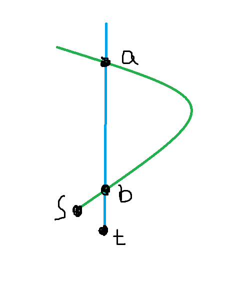
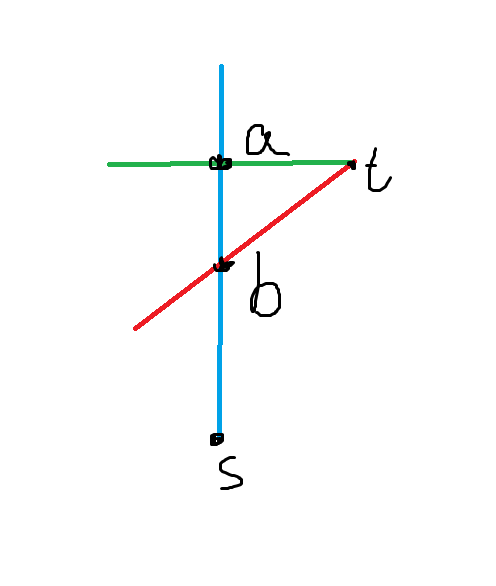

# Tutorial_(en)

I'm very sorry about all the inconvenience, and I would like to bear the blame. Much thanks to those who help me prepare this round. It's not their fault. And much thanks to your participation.

[1581A - CQXYM Count Permutations](../problems/A._CQXYM_Count_Permutations.md "Codeforces Round 745 (Div. 2)")
------------------------------------------------------------------------------------------------------------------

idea: [interlude](https://codeforces.com/profile/interlude "Master interlude")

preparation: [CQXYM](https://codeforces.com/profile/CQXYM "Grandmaster CQXYM")

tutorial: [CQXYM](https://codeforces.com/profile/CQXYM "Grandmaster CQXYM")

Assume a permutation pp, and ∑2ni=2[pi−1<pi]=k∑2ni=2[pi−1<pi]=k. Assume a permutaion q, satisfying ∀1⩽i⩽2n,qi=2n−pi. We can know that ∀2⩽i⩽2n,[pi−1<pi]+[qi−1<qi]=1. Thus,∑2ni=2[qi−1<qi]=2n−1−k, and either p should be counted or q should be counted. All in all, the half of all the permutaions would be counted in the answer. Thus, the answer is 12(2n)!. The time complexity is O(∑n). If you precalulate the factors, then the complexity will be O(t+n).

 

---

 **solution**
```cpp
#include<stdio.h>
int f[100001];
int main(){
	f[1]=1;
	for(register int i=2;i!=100001;i++){
		f[i]=((i<<1)-1ll)*f[i-1]%1000000007*(i<<1)%1000000007;
	}
	int n;
	scanf("%d",&n);
	for(register int i=n;i!=0;i--){
		scanf("%d",&n);
		printf("%dn",f[n]);
	}
	return 0;
}
```
[1581B - Diameter of Graph](../problems/B._Diameter_of_Graph.md "Codeforces Round 745 (Div. 2)")
-----------------------------------------------------------------------------------------------------------

idea: [CQXYM](https://codeforces.com/profile/CQXYM "Grandmaster CQXYM")

preparation: [CQXYM](https://codeforces.com/profile/CQXYM "Grandmaster CQXYM")

tutorial: [CQXYM](https://codeforces.com/profile/CQXYM "Grandmaster CQXYM")

If m<n−1, the graph can't be connected, so the answer should be `No`.

If m>n(n−1)2, the graph must contaion multiedges, so the answer should be `No`.

If m=n(n−1)2, the graph must be a complete graph. The diameter of the graph is 1. If k>2 the answer is `YES`, otherwise the answer is `NO`.

If n=1, the graph has only one node, and its diameter is 0. If k>1 the answer is `YES`, otherwise the answer is `NO`.

If m=n−1, the graph must be a tree, the diameter of the tree is at least 2 when it comes to each node has an edge with node 1. If m>n−1∧m<n(n−1)2, we can add edges on the current tree and the diameter wouldn't be more than 2. Since the graph is not complete graph, the diameter is more than 1, the diameter is just 2. If k>3 the answer is `YES`, otherwise the answer is `NO`.

The time complexity is O(t).

 

---

 **solution**
```cpp
#include<stdio.h>
inline void Solve(){
	int n,m,k;
	scanf("%d%d%d",&n,&m,&k);
	if((n-1ll)*n>>1<m||m<n-1){
		puts("NO");
		return;
	}
	if(n==1){
		if(k>1){
			puts("YES");
		}else{
			puts("NO");
		}
	}else if(m<(n-1ll)*n>>1){
		if(k>3){
			puts("YES");
		}else{
			puts("NO");
		}
	}else if(k>2){
		puts("YES");
	}else{
		puts("NO");
	}
}
int main(){
	int t;
	scanf("%d",&t);
	for(register int i=0;i!=t;i++){
		Solve();
	}
	return 0;
}
```
[1580A - Portal](https://codeforces.com/contest/1580/problem/A "Codeforces Round 745 (Div. 1)")
------------------------------------------------------------------------------------------------

idea: [CQXYM](https://codeforces.com/profile/CQXYM "Grandmaster CQXYM")

preparation: [CQXYM](https://codeforces.com/profile/CQXYM "Grandmaster CQXYM")

tutorial: [CQXYM](https://codeforces.com/profile/CQXYM "Grandmaster CQXYM")

We can enumerate the two corner of the submatrix, calculate the answer by precalculating the prefix sums. The time complexity is O(∑n2m2). When we enumerated the upper edge and the lower edge of the submatrix, we can calculate the answer by prefix sum. Assume the left edge of the submatrix is l, and the right edge is r. The part of anwer contributed by upper and lower edge are two segments, we can calculate the answer by prefix sums. The middle empty part is a submaxtrix, and we can use prefix sums too. Since we have enumerated the upper edge and lower edge, the left edge part is just about l, and the right part is just about r. Then we enumerate l, the answer of the best r can be calculated by precalculating the suffix miniums. The time complexity is O(∑n2m), space complexity is O(nm).

 

---

 **solution**
```cpp
#include<stdio.h>
char s[402];
int sum[401][401],f[401];
inline int GetSum(int lx,int ly,int rx,int ry){
	return sum[rx][ry]-sum[rx][ly-1]-sum[lx-1][ry]+sum[lx-1][ly-1];
}
inline void Solve(){
	int n,m,i,j,k,ans=999999,cur;
	scanf("%d%d",&n,&m);
	for(i=1;i<=n;i++){
		scanf("%s",s+1);
		for(j=1;j<=m;j++){
			sum[i][j]=sum[i-1][j]+sum[i][j-1]-sum[i-1][j-1]+(s[j]=='1');
		}
	}
	for(i=1;i!=n;i++){
		for(j=i+4;j<=n;j++){
			for(k=4;k<=m;k++){
				f[k]=GetSum(i+1,1,j-1,k-1)-GetSum(i,1,i,k-1)-GetSum(j,1,j,k-1)-GetSum(i+1,k,j-1,k)+(k<<1)+j-i-3;
			}
			for(k=m-1;k!=3;k--){
				if(f[k+1]<f[k]){
					f[k]=f[k+1];
				}
			}
			for(k=1;k!=m-2;k++){
				cur=f[k+3]-GetSum(i+1,1,j-1,k)+GetSum(i,1,i,k)+GetSum(j,1,j,k)-(k<<1)-GetSum(i+1,k,j-1,k)+j-i-1;
				if(cur<ans){
					ans=cur;
				}
			}
		}
	}
	printf("%dn",ans);
}
int main(){
	int t;
	scanf("%d",&t);
	while(t!=0){
		Solve();
		t--;
	}
	return 0;
}
```
[1580B - Mathematics Curriculum](https://codeforces.com/contest/1580/problem/B "Codeforces Round 745 (Div. 1)")
----------------------------------------------------------------------------------------------------------------

idea: [interlude](https://codeforces.com/profile/interlude "Master interlude")

preparation: [interlude](https://codeforces.com/profile/interlude "Master interlude")

tutorial: [CQXYM](https://codeforces.com/profile/CQXYM "Grandmaster CQXYM")

Define the dp state fl,s,d as the number of the permutaion length of l with exactly d such numbers that all the subsegments containing them have exactly s different maxima in total. We enumerate the position of the bigest number in the permutaion. We call the position is a. The numbers before a and after a are independent. Then we transform the statement (l,s,d) to (a−1,x,d+1) and (l−a,y,d+1). We also have to distribute the numbers to two parts, so the dp transformation is:

fl,s,d=∑la=1(l−1a−1)∑sx=0fa−1,x,d+1fl−a,s−x−[d=k],d+1

In addition, the answer of the problem is fn,m,k. Actually, the dp proccess is just like a cartesian tree. The time complexity is O(n2m2k), space complexity is O(nmk). However, it's enough to pass the tests.

 

---

 **solution**
```cpp
#include <bits/stdc++.h>

using namespace std;

const int MAX_N = 100 + 5;

int n, m, k, P;
int fac[MAX_N], c[MAX_N][MAX_N], f[MAX_N][MAX_N][MAX_N];

int add(int a, int b) {
    return a + b < P ? a + b : a + b - P;
}

void dp(int sz, int cnt, int dep) {
    if (f[dep][sz][cnt] != -1) return ;
    register int &F = f[dep][sz][cnt] = 0;
    if (!sz) {
        F = 1;
        return ;
    }
    if ((m - dep < 7 && (1 << (m - dep)) < cnt) || (cnt && sz < m - dep)) return ;
    if (dep == m) {
        F = (cnt == 1 ? fac[sz] : 0);
        return ;
    }
    for (int i = 0; i < sz; i ++) {
        register int fi = 0;
        register int *fl = f[dep + 1][i], *fr = f[dep + 1][sz - i - 1];
        for (int j = max(0, cnt + i + 1 - sz); j <= min(cnt, i); j ++)
            if (fl[j] && fr[cnt - j]) {
                dp(i, j, dep + 1);
                dp(sz - i - 1, cnt - j, dep + 1);
                fi = (fi + 1ll * fl[j] * fr[cnt - j]) % P;
            }
        F = (F + 1ll * fi * c[sz - 1][i]) % P;
    }
}

int main() {
    cin >> n >> m >> k >> P; m --;
    for (int i = c[0][0] = fac[0] = 1; i <= n; i ++) {
        c[i][0] = c[i][i] = 1;
        fac[i] = 1ll * fac[i - 1] * i % P;
        for (int j = 1; j < i; j ++) c[i][j] = add(c[i - 1][j - 1], c[i - 1][j]);
    }
    memset(f, -1, sizeof(f));
    dp(n, k, 0);
    cout << f[0][n][k] << endl;
    return 0;
}
```
[1580C - Train Maintenance](https://codeforces.com/contest/1580/problem/C "Codeforces Round 745 (Div. 1)")
-----------------------------------------------------------------------------------------------------------

idea: [interlude](https://codeforces.com/profile/interlude "Master interlude")

preparation: [interlude](https://codeforces.com/profile/interlude "Master interlude")

tutorial: [interlude](https://codeforces.com/profile/interlude "Master interlude") and [CQXYM](https://codeforces.com/profile/CQXYM "Grandmaster CQXYM")

Let's distinguish the trains according to xi+yi.

If xi+yi>√m, the total times of maintenance and running don't exceed m√m=√m. So we can find every date that the train of model i begin or end maintenance in O(√m), and we can maintain a differential sequence. We can add 1 to the beginning date and minus 1 to the end date, and the prefix sum of this sequence is the number of trains in maintenance.

If xi+yi≤√m, suppose the train of model i is repaired at si day. For a date t that the train of model i is in maintenance if and only if (t−si) mod (xi+yi)≥xi. Thus for each a≤√m, we can use an array of length a to record the date of all trains that satisfy xi+yi=a are in maintenance modulo a. And for one period of maintenance, the total days aren't exceed √m. So we can maintain (t−si) mod (xi+yi) in O(√m).

Thus the intended time complexity is O(m√m) and the intended memory complexity is O(n+m).

#### Tutorial by [CQXYM](https://codeforces.com/profile/CQXYM "Grandmaster CQXYM")

Finished reading the statement, you may have thought about this easy solution as followed. Maintain an array to count the trains in maintenance in each day. For add and remove operations, traverse the array and add the contribution to the array. The algorithm works in the time complexity of O(nm). Besides, we can use the difference array to modify a segment in O(1). However, we can optimize this solution. For the trains of x+y>√m, we can modify every period by brute force because the number of periods is less than √m. For the trains of x+y⩽√m, the number of the periods can be large. In this case, we set the blocks, each of them sizes O(√m). We can merge the modifies which are completely included in the same block, with the same length of period and the same start position in the block. It's fine to use an array to record this. Number of segments are not completely included in the block is about O(√m). The total complexity is O(m√m).

 

---

 **solution**
```cpp
#include <bits/stdc++.h>

char BUF_R[1 << 22], *csy1, *csy2;
#define GC (csy1 == csy2 && (csy2 = (csy1 = BUF_R) + fread(BUF_R, 1, 1 << 22, stdin), csy1 == csy2) ? EOF : *csy1 ++)

template <typename Ty>
inline void RI(Ty &t) {
    char c = GC;
    for (t = 0; c < 48 || c > 57; c = GC);
    for (; c > 47 && c < 58; c = GC) t = t * 10 + (c ^ 48);
}

const int MAX_N = 200000 + 5;
const int MAX_M = 256;
int n, m, thre, x[MAX_N], y[MAX_N], cnt[MAX_M][MAX_M], s[MAX_N], a[MAX_N], ans;

void block_modify(int Tm, int k, int v) {
    int bl = x[k] + y[k], *c = cnt[bl];
    int l = (Tm + x[k]) % bl, r = (Tm - 1) % bl;
    if (l <= r) for (int i = l; i <= r; i ++) c[i] += v;
    else {
        for (int i = 0; i <= r; i ++) c[i] += v;
        for (int i = l; i < bl; i ++) c[i] += v;
    }
}

int block_query(int Tm) {
    register int res = 0;
    for (int i = 2; i <= thre; i ++) res += cnt[i][Tm % i];
    return res;
}

int main() {
    RI(n); RI(m);
    thre = std::min((int)(0.5 * sqrt(m)) + 1, 255);
    for (int i = 1; i <= n; i ++) {RI(x[i]); RI(y[i]);}
    for (int i = 1; i <= m; i ++) {
        int opt, k;
        RI(opt); RI(k);
        if (opt == 1) {
            if (thre < x[k] + y[k]) {
                for (int j = i + x[k]; j <= m; j += x[k] + y[k]) {
                    a[j] ++;
                    if (j + y[k] <= m) a[j + y[k]] --;
                }
            }else block_modify(i, k, 1);
            s[k] = i;
        }else {
            if (thre < x[k] + y[k]) {
                for (int j = s[k] + x[k]; j <= m; j += x[k] + y[k]) {
                    a[j] --;
                    if (j + y[k] <= m) a[j + y[k]] ++;
                    if (j < i && j + y[k] >= i) ans --;
                }
            }else block_modify(s[k], k, -1);
        }
        ans += a[i];
        printf("%dn", ans + block_query(i));
    }
    return 0;
}

```
[1580D - Subsequence](https://codeforces.com/contest/1580/problem/D "Codeforces Round 745 (Div. 1)")
-----------------------------------------------------------------------------------------------------

idea: [interlude](https://codeforces.com/profile/interlude "Master interlude")

preparation: [interlude](https://codeforces.com/profile/interlude "Master interlude")

tutorial: [interlude](https://codeforces.com/profile/interlude "Master interlude") and [CQXYM](https://codeforces.com/profile/CQXYM "Grandmaster CQXYM")

First we can change the way we calculate the value of a subsequence. We can easily see the value of a subsequence ab1,ab2,…,abm is also ∑mi=1∑mj=i+1abi+abj−2×f(bi,bj), which is very similar to the distance of two node on a tree. Thus we can build the cartesian tree of the sequence, and set the weight of a edge between node i and j as |ai−aj|. Then we can see what we are going to calculate turns into follows : choosing m nodes, maximize the total distance between every two nodes. Thus we can solve this task using dynamic programming with the time complexity O(n2).

#### Tutorial by [CQXYM](https://codeforces.com/profile/CQXYM "Grandmaster CQXYM")

From the statement, we'd calculate the sums like ai+aj−Minjk=iak. When we put this on a cartesian tree, it turns out to be ai+aj−aLCA(i,j). Set the weigth of the edge x→y as ay−ax, ai+aj−aLCA(i,j) equals to the distance between node i,j on the tree. Define the dp state fi,j as the maxium answer in the subtree rooted at node i, and we choose j of the nodes in the subtree. Enumerate how many nodes we choose in the subtree of left-son of node i, number of nodes of right-son, and whether node i is chose. The contribution made by the edge is its weight times the number of nodes are chose. Since a pair of node will contribute time complexity only when we are calculating the dp state of their LCA, the total time complexity is O(n2).

 

---

 **solution**
```cpp
#include <cstdio>
#include <algorithm>

typedef long long ll;

const int MAX_N = 4000 + 5;

int N, M, a[MAX_N], ls[MAX_N], rs[MAX_N], lw[MAX_N], rw[MAX_N], sz[MAX_N];
ll f[MAX_N][MAX_N];

inline void umax(ll &a, ll b) {
    a = a < b ? b : a;
}

void dfs(int u) {
    sz[u] = 1;
    if (ls[u]) {
        dfs(ls[u]);
        for (int i = std::min(M, sz[u]); i >= 0; i --)
            for (int j = std::min(M, sz[ls[u]]); j >= 0; j --)
                umax(f[u][i + j], f[u][i] + f[ls[u]][j] + 1ll * j * (M - j) * lw[u]);
        sz[u] += sz[ls[u]];
    }
    if (rs[u]) {
        dfs(rs[u]);
        for (int i = std::min(M, sz[u]); i >= 0; i --)
            for (int j = std::min(M, sz[rs[u]]); j >= 0; j --)
                umax(f[u][i + j], f[u][i] + f[rs[u]][j] + 1ll * j * (M - j) * rw[u]);
        sz[u] += sz[rs[u]];
    }
}

int main() {
    scanf("%d%d", &N, &M);
    static int sta[MAX_N], tp;
    for (int i = 1; i <= N; i ++) {
        scanf("%d", a + i);
        int k = tp;
        for (; k && a[i] < a[sta[k]]; k --);
        if (k) {
            rs[sta[k]] = i;
            rw[sta[k]] = a[i] - a[sta[k]];
        }
        if (k < tp) {
            ls[i] = sta[k + 1];
            lw[i] = a[sta[k + 1]] - a[i];
        }
        sta[++ k] = i;
        tp = k;
    }
    dfs(sta[1]);
    printf("%lldn", f[sta[1]][M]);
    return 0;
}

```
[1580E - Railway Construction](https://codeforces.com/contest/1580/problem/E "Codeforces Round 745 (Div. 1)")
--------------------------------------------------------------------------------------------------------------

idea: [interlude](https://codeforces.com/profile/interlude "Master interlude")

preparation: [interlude](https://codeforces.com/profile/interlude "Master interlude")

tutorial: [interlude](https://codeforces.com/profile/interlude "Master interlude")

For convenience, we first define dis[u] as the length of the shortest path between node 1 and node u and "distance" of node u as dis[u], and call node u is "deeper" than node v if and only if dis[u]>dis[v]. Similarly, we call node u is "lower" than node v if and only if dis[u]<dis[v]. We will use u -> v to denote a a directed edge staring at node u and ending at node v, and use u --> v​ to denote an arbitrary path staring at node u and ending at node v. We call two paths "intersect" if and only if they pass through at least 1 same node.

First let's focus on several facts. 

 1. Since all edges' weights are positive, and we have to make sure that the distance of every node does not change, for any node u​, we can only add edges starting at a node whose distance is strictly less than dis[u]. Besides, we can always add edge 1 -> u, but we can never add edge u -> 1.
2. Since the distance of every node does not change and the train only pass through the shortest path, if an edge is not on the shortest path at first, however we add edges it won't be on any shortest path. Thus we can first calculate the shortest path and then remove all edges which are not on the shortest path. We can easily see that the new graph is a DAG (Directed Acyclic Graph). And in this graph the topological order is also the ascending order of nodes' distances. In the following part of this tutorial, we will use the new graph instead of the original graph.
3. After we add all edges, every node except node 1 must have at least 2 incoming edges.

Then let's prove a lemma: if every node except node 1 exactly has 2 incoming edges, the graph will meet the requirement.

We will use mathematical induction method to prove the lemma. For an arbitrary node u, we suppose that all nodes whose distance is less than u's has met the requirement, and we only need to prove that node u​ also meets the requirement. Suppose the start of the 2 incoming edges is separately s and t.

First, if s or t is node 1, we can simply choose 1 --> u and 1 --> t -> u as the two paths and obviously they don't intersect. Thus it meet the requirement.

Second, if s and t are not node 1. We choose an arbitrary path 1 --> s and call it path 0. According to our assumption, we can choose two different paths starting at node 1 and ending at node $t$​, and the two paths don't intersect. We call them path 1 and path 2 separately.

If path 0 and path 1 (or path 2) doesn't intersect, then we can choose path 0 and path 1 to meet the requirement. Thus we only need to consider the situation that path 0 intersect with both path 1 and path 2. 

In this case, we first find the lowest and deepest node where path 0 and path 1 or path 2 intersect, and call them a and b separately.

If the both are the intersect points of path 0 and path 1, like the case below, we can choose path (1 -> a -> (through path 1, i.e. blue path) b -> s) and path 2.



Otherwise, like the case below, we can choose path (1 -> a -> t) and path (1 -> b -> s).



Both cases are meet the requirement.

Thus we've proved the lemma. So we only need to make sure that every node except node 1 has at least 2 incoming edges. Then we can get the following solution if w is fixed:

For every node which has only 1 incoming edge, we record the start point of the incoming edge in an array. Then We scan all nodes in the ascending order of nodes' distances, and maintain the previous minima and second minima of w​ in an array val​, adding edges greedy. Note that we only need to maintain the index of w instead of its real value. This solution consumes O(n) to calculate for a fixed w, so the total complexity is O(nq).

To accelerate the solution, let's try maintaining array val while changing w. And we will apply all the changes in reverse order. That is, we only consider the case that w is decreasing.

According to the value of val, we can separate the sequence into many subsegments, and we can use std::set to maintain those subsegments. For one change in wk, it will affect a particular suffix of val​, so we can first find the suffix. Then we consecutively change the array val​​ until wk​ is greater than current subsegment's second minima. Next we will prove that the solution works in O((n+q)logn).

When we change a particular subsegment, we separate the operation into 3 types according to the relationship between wk and the subsegment's val.

 1. If wk​​ is exactly the minima of the subsegment. This kind of operation may be done many times, but we will find that it won't change val at all. So we can do them at a time using segment tree. Thus in one change we will only do it at most 1 time.
2. If wk is the second minima of the subsegment. Note the fact that every subsegment must has different second minima, so this kind of operation will be also done at most once in one change.
3. If wk is neither the minima nor the second minima of the subsegment. Note the fact that each time we do it, except the first time, will make the number of subsegments decrease by 1. Thus this kind of operation will be done no more than n+q times.

Using std::set and segment tree, all of these operations could be done in O(logn) at a time. Thus the total complexity is O((n+q)logn).

In conclusion, we can solve this task in O(mlogm+(n+q)logn).

 

---

 **solution**
```cpp
#include <cstdio>
#include <algorithm>
#include <queue>
#include <set>

using std::set;

typedef long long ll;

char BUF_R[1 << 22], *csy1, *csy2;
#define GC (csy1 == csy2 && (csy2 = (csy1 = BUF_R) + fread(BUF_R, 1, 1 << 22, stdin), csy1 == csy2) ? EOF : *csy1 ++)

template <class T>
inline void RI(T &t) {
	char c = GC;
	for (t = 0; c < 48 || c > 57; c = GC);
	for (; c > 47 && c < 58; c = GC) t = t * 10 + (c ^ 48);
}

const int MAX_N = 200000 + 5;
const int MAX_M = 600000 + 5;
const int INF32 = 0x7fffffff;
const ll INF64 = 0x3fffffffffffffffll;

int N, M, Q, ques[MAX_N][2];
struct Edge{
    int y, prev, len;
}e[MAX_M];
int elast[MAX_N], ecnt = 1;
std::priority_queue < std::pair <ll, int> > pq;
ll dis[MAX_N], w[MAX_N];
unsigned long long res[MAX_N], ans;
int cnt[MAX_N], fa[MAX_N], a[MAX_N], t;
int rt[MAX_N], pos[MAX_N], sum[MAX_N], endpos[MAX_N];
struct Node{
    int f, s;
    
    Node (int a = 0, int b = 0) : f(a), s(b) {}
    
    inline bool operator == (const Node &comp) const {return f == comp.f && s == comp.s;}
    
    inline void swap() {
        int t = f;
        f = s;
        s = t;
    }
}minv, val[MAX_N];
set <int> s;

namespace SGT{
    const int MAX_M = 10000000;
    
    int tot;
    struct SegmentNode{
        int sum, ls, rs;
    }node[MAX_M];
    
    void segment_modify(int &i, int l, int r, int x) {
        i = i ? i : ++ tot;
        node[i].sum ++;
        if (l == r) return ;
        int mid = (l + r) >> 1;
        mid < x ? segment_modify(node[i].rs, mid + 1, r, x) : segment_modify(node[i].ls, l, mid, x);
    }
    
    int segment_query(int i, int l, int r, int ql, int qr) {
        if (!i) return 0;
        if (l < ql || r > qr) {
            int mid = (l + r) >> 1, res = 0;
            if (mid >= ql) res = segment_query(node[i].ls, l, mid, ql, qr);
            if (mid < qr) res += segment_query(node[i].rs, mid + 1, r, ql, qr);
            return res;
        }else return node[i].sum;
    }
}

int count_illegal(int idx, int l, int r) {
    if (r < l || idx == 1) return 0;
    return SGT::segment_query(rt[idx], 1, N, l, r);
}

int count_legal(int idx, int l, int r) {
    if (r < l) return 0;
    return sum[r] - sum[l - 1] - count_illegal(idx, l, r);
}

void Build(int x, int y, int z) {
    ecnt ++;
    e[ecnt].y = y;
    e[ecnt].len = z;
    e[ecnt].prev = elast[x];
    elast[x] = ecnt;
}

int main() {
    RI(N); RI(M); RI(Q);
    for (int i = 1; i <= N; i ++) {
        RI(w[i]);
        pos[i] = N + 1;
        dis[i] = INF64;
    }
    for (int i = 1; i <= M; i ++) {
        int x, y, z;
        RI(x); RI(y); RI(z);
        Build(x, y, z);
        Build(y, x, z);
    }
    for (int i = 1; i <= Q; i ++) {
        RI(ques[i][0]); RI(ques[i][1]);
        w[ques[i][0]] += ques[i][1];
    }
    
    dis[1] = 0;
    pq.push(std::make_pair(0, 1));
    while (!pq.empty()) {
        int u = pq.top().second;
        ll d = -pq.top().first;
        pq.pop();
        if (dis[u] != d) continue;
        a[++ t] = u;
        for (int i = elast[u]; i; i = e[i].prev) {
            int v = e[i].y;
            if (d + e[i].len < dis[v]) {
                dis[v] = d + e[i].len;
                pq.push(std::make_pair(-dis[v], v));
            }
        }
    }
    for (int i = 2; i <= ecnt; i ++) {
        int u = e[i ^ 1].y, v = e[i].y;
        if (dis[u] + e[i].len == dis[v]) {
            cnt[v] ++; fa[v] = u;
        }
    }
    
    ans = 0;
    s.insert(1);
    pos[1] = 1;
    minv.f = 1;
    minv.s = N + 1;
    val[1] = minv;
    w[N + 1] = INF64;
    for (int i = 2, j = 2; i <= N; i ++) {
        int u = a[i];
		for (; dis[a[j]] < dis[u]; j ++) {
		    int v = a[j];
		    pos[v] = i;
    		if (w[v] < w[minv.f]) {
    		    s.insert(i);
    		    endpos[minv.f] = i;
    		    minv.s = minv.f;
    		    minv.f = v;
    		    val[i] = minv;
    		}else if (w[v] < w[minv.s]) {
    		    s.insert(i);
    		    minv.s = v;
    		    val[i] = minv;
    		}
    	}
    	sum[i] = sum[i - 1];
        if (cnt[u] < 2) {
            sum[i] ++;
            if (fa[u] > 1) SGT::segment_modify(rt[fa[u]], 1, N, i);
		    ans += w[(minv.f == 1 || minv.f != fa[u]) ? minv.f : minv.s];
		}
    }
    endpos[minv.f] = N + 1;
    s.insert(N + 1);
    res[Q] = ans;
    
    for (int i = Q; i > 0; i --) {
        int k = ques[i][0], x = ques[i][1];
        w[k] -= x;
        if (pos[k] > N) {
            res[i - 1] = ans;
            continue;
        }
        set <int>::iterator it = -- s.upper_bound(pos[k]), lst;
        minv = Node();
        int response = 0, p = pos[k];
        if (k == val[*it].f) response = 1;
        else if (k == val[*it].s) response = 2;
        while (response >= 0 && *it <= N) {
            lst = it ++;
            if (response == 0) {
                if (w[val[*lst].s] <= w[k]) break;
                if (w[k] < w[val[*lst].f]) {
                    if (!minv.f) endpos[val[*lst].f] = p;
                    int c = count_illegal(val[*lst].f, p, (*it) - 1), tot = sum[(*it) - 1] - sum[p - 1];
                    ans -= 1ull * c * w[val[*lst].s] + 1ll * (tot - c) * w[val[*lst].f];
                    if (p != *lst) val[p] = val[*lst];
                    val[p].s = val[p].f;
                    val[p].f = k;
                    c = count_illegal(k, p, (*it) - 1);
                    ans += 1ull * c * w[val[p].s] + 1ll * (tot - c) * w[k];
                    if (p != *lst) {
                        s.insert(p);
                        minv = val[p];
                    }else if (minv == val[p]) s.erase(lst);
                    else minv = val[p];
                    endpos[k] = p = *it;
                }else {
                    ans += 1ull * count_illegal(val[*lst].f, p, (*it) - 1) * (w[k] - w[val[*lst].s]);
                    if (p != *lst) val[p] = val[*lst];
                    val[p].s = k;
                    if (p != *lst) {
                        s.insert(p);
                        minv = val[p];
                    }else if (minv == val[p]) s.erase(lst);
                    else minv = val[p];
                    p = *it;
                }
            }else if (response == 1) {
                it = s.lower_bound(endpos[k]);
                ans -= 1ull * count_legal(k, p, (*it) - 1) * x;
                p = *it; lst = it; lst --;
                minv = val[*lst];
                response = val[p].s == k ? 2 : 0;
            }else {
                if (w[val[*lst].f] <= w[k]) {
                    ans -= 1ull * count_illegal(val[*lst].f, p, (*it) - 1) * x;
                    minv = val[*lst]; p = *it;
                }else {
                    endpos[val[*lst].f] = p;
                    int c = count_illegal(val[*lst].f, p, (*it) - 1), tot = sum[(*it) - 1] - sum[p - 1];
                    ans -= 1ull * c * (w[val[*lst].s] + x) + 1ull * (tot - c) * w[val[*lst].f];
                    if (p != *lst) val[p] = val[*lst];
                    val[p].swap();
                    c = count_illegal(val[p].f, p, (*it) - 1);
                    ans += 1ull * c * w[val[p].s] + 1ull * (tot - c) * w[val[p].f];
                    if (p != *lst) {
                        s.insert(p);
                        minv = val[p];
                    }else if (minv == val[p]) s.erase(lst);
                    else minv = val[p];
                    endpos[k] = p = *it;
                }
                response = 0;
            }
        }
        res[i - 1] = ans;
    }
    
    for (int i = 0; i <= Q; i ++) printf("%llun", res[i]);
    
    return 0;
}
```
[1580F - Problems for Codeforces](https://codeforces.com/contest/1580/problem/F "Codeforces Round 745 (Div. 1)")
-----------------------------------------------------------------------------------------------------------------

idea: [CQXYM](https://codeforces.com/profile/CQXYM "Grandmaster CQXYM")

preparation: [CQXYM](https://codeforces.com/profile/CQXYM "Grandmaster CQXYM")

tutorial: [CQXYM](https://codeforces.com/profile/CQXYM "Grandmaster CQXYM")

If two numbers a,b satisfying a+b<m, there can only be one number not less than ⌈m2⌉. Consider that cut the cycle to a sequence at the first position p satisfying max(ap,ap+1)<⌈m2⌉. When we minus all the numbers that are not less than ⌈m2⌉ by ⌈m2⌉, we can get a sub-problem. However, If n is an even number, we may not find such a position p, but we can still get a sub-problem easily. For this problem on a sequence, we can divide the sequence into many segments, and each of them can not be cut by us anymore. There may be only 1 segment, and the first, last element of the segment are not less than ⌈m2⌉. There may be many segments, the length of the first one and last one are even, and the rest of them are odd. To solve the problem, we define the GF A,B. A is the GF of the length of the segments are odd situation, and B is the even one. If m is odd, the segment with only a number [m2] exists, and the GF of number of the sequence should be:

B2(∑i=0(A+x)i)+A=B21−x−A+A

Otherwise, it is:

B2(∑i=0Ai)+A=B21−A+A.

To solve this problem, use NTT and polynomial inversion algorithm is just ok. Each time we transform a problem with limit m to m2, so the time complexity is O(nlognlogm).

 

---

 **solution**
```cpp
#include<stdio.h>
#include<memory.h>
#define mod 998244353

unsigned long long tmp[131073],invn;
int a_[131072];

inline int ksm(unsigned long long a,int b){int ans=1;while(b)(b&1)&&(ans=a*ans%mod),a=a*a%mod,b>>=1;return ans;}
void init(int n){
	for(int i=1;i<n;i++)a_[i]=i&1?a_[i^1]|n>>1:a_[i>>1]>>1;
	for(int i=tmp[0]=1,j=ksm(3,(mod-1)/n);i<=n;i++)tmp[i]=tmp[i-1]*j%mod;
	invn=ksm(n,mod-2);
}
void ntt(int a[],int n,bool typ){
	int p;
	for(int i=1;i<n;i++)if(a_[i]<i)p=a[i],a[i]=a[a_[i]],a[a_[i]]=p;
	if(typ)for(int i=1,d=n>>1;d;i<<=1,d>>=1)for(int j=0;j<n;j+=i<<1)for(int k=0;k<i;k++)
		p=tmp[n-d*k]*a[i+j+k]%mod,(a[i+j+k]=a[j+k]+mod-p)>=mod&&(a[i+j+k]-=mod),(a[j+k]+=p)>=mod&&(a[j+k]-=mod);
	else for(int i=1,d=n>>1;d;i<<=1,d>>=1)for(int j=0;j<n;j+=i<<1)for(int k=0;k<i;k++)
		p=tmp[d*k]*a[i+j+k]%mod,(a[i+j+k]=a[j+k]+mod-p)>=mod&&(a[i+j+k]-=mod),(a[j+k]+=p)>=mod&&(a[j+k]-=mod);
	if(typ)for(int i=0;i<n;i++)a[i]=invn*a[i]%mod;
}
void getinv(int n,int a[],int b[]){
	static int tmp[131072];
	memset(b,0,sizeof(int)*(n<<1));
	b[0]=ksm(a[0],mod-2);
	for(int i=1;i<n;i<<=1){
		init(i<<2);
		memset(tmp,0,sizeof(int)*(i<<2));
		memcpy(tmp,a,sizeof(int)*(i<<1));
		ntt(tmp,i<<2,0);
		ntt(b,i<<2,0);
		for(int j=0;j<i<<2;j++)b[j]=(1ull*(mod-tmp[j])*b[j]%mod+2)*b[j]%mod;
		ntt(b,i<<2,1);
		memset(b+(i<<1),0,sizeof(int)*(i<<1));
	}
}

int n,m,a[131072],b[131072],d0[131072],d1[131072],len,ans;

void work(int v){
	if(v==1){
		for(int i=0;i<len;i++)a[i]=1;
		ans=1;
		return;
	}
	work(v>>1);
	memset(d0,0,sizeof(int)*(len<<1));
	memset(d1,0,sizeof(int)*(len<<1));
	for(int i=0;i<len;i++)(i&1?d1:d0)[i]=a[i];
	if(v&1)++d1[1]==mod&&(d1[1]=0);
	memset(a,0,sizeof(int)*(len<<1));
	for(int i=0;i<len;i++)a[i]=d1[i]?mod-d1[i]:0;
	++a[0]==mod&&(a[0]=0);
	getinv(len,a,b);
	if(v==m||!(n&1)){
		int Ans=0;
		for(int i=1;i<=n;i+=2)
			Ans=(1ull*d1[i]*b[n-i]%mod*i+Ans)%mod;
		if(!(n&1))ans=(2ull*ans+Ans)%mod;
		else ans=Ans;
		if(v==m)return;
	}
	init(len<<1);
	ntt(d0,len<<1,0);
	for(int i=0;i<len<<1;i++)d0[i]=1ull*d0[i]*d0[i]%mod;
	ntt(d0,len<<1,1);
	memset(d0+len,0,sizeof(int)*len);
	ntt(d0,len<<1,0);
	ntt(b,len<<1,0);
	for(int i=0;i<len<<1;i++)a[i]=1ull*d0[i]*b[i]%mod;
	ntt(a,len<<1,1);
	for(int i=1;i<len;i+=2)(a[i]+=d1[i])>=mod&&(a[i]-=mod);
	if(v&1)a[1]?a[1]--:a[1]=mod-1;
}

int main(){
	scanf("%d%d",&n,&m);
	len=n<<1;
	while(len^len&-len)len^=len&-len;
	work(m);
	printf("%dn",ans);
}
```
**UPD:** Chinese editorial can be found [here](https://codeforces.com/https://www.luogu.com.cn/blog/269442/cf745).

