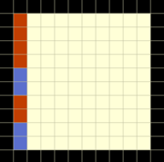

# Tutorial_(en)

We hope all of you enjoyed the round! This round has been a long time in the making -- the oldest problem in it is H, which was actually originally proposed for the rounds that eventually became [Codeforces Round 655 (Div. 2)](https://codeforces.com/contest/1372 "Codeforces Round 655 (Div. 2)") and [Codeforces Global Round 10](https://codeforces.com/contest/1392 "Codeforces Global Round 10").

The tutorial for E and implementations for all problems are now available.

 **A - Windblume Ode**Problem author: [MagentaCobra](https://codeforces.com/profile/MagentaCobra "Master MagentaCobra")

Preparation: [MagentaCobra](https://codeforces.com/profile/MagentaCobra "Master MagentaCobra")

[Implementation in Java](https://codeforces.com/contest/1586/submission/132266058) by [MagentaCobra](https://codeforces.com/profile/MagentaCobra "Master MagentaCobra") 

### [1586A - Windblume Ode](https://codeforces.com/contest/1586/problem/A "Codeforces Round 749 (Div. 1 + Div. 2, based on Technocup 2022 Elimination Round 1)")

Let s be equal to the sum of array a. If s is composite then a is the largest composite subset of itself. Otherwise, since n≥3, s must be a prime number greater than 2, meaning s must be odd. Now notice that because all elements of a are distinct, if we remove any one number from a, the remaining sum must be strictly greater than 2. This leads us to the following solution: if s is prime, removing any odd number from a will give a composite subset of size n−1. This is because that since s is assumed to be odd, an odd number must exist in a, and the difference of two odd numbers is always even. Since we claim that this difference is at least 4, the new sum will always be composite.

 **B - Omkar and Heavenly Tree**Problem author: [golions](https://codeforces.com/profile/golions "Candidate Master golions")

Preparation: [golions](https://codeforces.com/profile/golions "Candidate Master golions")

[Implementation in Java](https://codeforces.com/contest/1586/submission/132266285) by [golions](https://codeforces.com/profile/golions "Candidate Master golions") 

### [1586B - Omkar and Heavenly Tree](https://codeforces.com/contest/1586/problem/B "Codeforces Round 749 (Div. 1 + Div. 2, based on Technocup 2022 Elimination Round 1)")

Because the number of restrictions is less than $n$, there is guaranteed to be at least one value from $1$ to $n$ that is not a value of $b$ for any of the restrictions. Find a value that is not $b$ for all of the restrictions and construct a tree that is a "star" with that value in the middle. An easy way to do this is to make an edge from that value to every other number from $1$ to $n$.

 **C - Omkar and Determination**Problem author: [Tlatoani](https://codeforces.com/profile/Tlatoani "International Grandmaster Tlatoani")

Preparation: [Tlatoani](https://codeforces.com/profile/Tlatoani "International Grandmaster Tlatoani") and [rabaiBomkarBittalBang](https://codeforces.com/profile/rabaiBomkarBittalBang "Master rabaiBomkarBittalBang")

[Implementation in Kotlin](https://codeforces.com/contest/1586/submission/132264905) by [Tlatoani](https://codeforces.com/profile/Tlatoani "International Grandmaster Tlatoani")

[Implementation in Java](https://codeforces.com/contest/1586/submission/132264939) by [rabaiBomkarBittalBang](https://codeforces.com/profile/rabaiBomkarBittalBang "Master rabaiBomkarBittalBang") 

### [1586C - Omkar and Determination](https://codeforces.com/contest/1586/problem/C "Codeforces Round 749 (Div. 1 + Div. 2, based on Technocup 2022 Elimination Round 1)")

First notice that in a determinable grid, for any cell, it can't be that both the cell above it and the cell to its left are filled. If that were the case, then the cell wouldn't be exitable regardless of whether it was filled or not, and so we couldn't determine whether it was filled.

Now notice that in any grid with the above property, namely that from each cell you can move either up or to the left into an empty cell (or both), every empty cell must be exitable  — just keep moving either up or to the left, whichever is possible, until you exit the grid.

It follows that for any grid satisfying that property, given only which cells are exitable, starting from the outermost cells you will be able to determine that the nonexitable cells are filled, which implies that the next cells satisfy the property, which further implies that the nonexitable ones there are filled, and so on. This allows you to determine the entire grid (since the exitable cells are obviously empty).

Therefore, a grid being determinable is equivalent to all of its cells having an empty cell immediately above and/or to the left of it. You can check this for arbitrary subgrids by precomputing two dimensional prefix sums of the cells that violate this property, then checking whether the sum for a given subgrid is 0. This solution is O(nm+q).

The actual problem only asked for subgrids that contained every row, which allows for a somewhat simpler implementation.

 **D - Omkar and the Meaning of Life**Problem author: [Tlatoani](https://codeforces.com/profile/Tlatoani "International Grandmaster Tlatoani")

Preparation: [Tlatoani](https://codeforces.com/profile/Tlatoani "International Grandmaster Tlatoani")

[Implementation of Solution 1 in Kotlin](https://codeforces.com/contest/1586/submission/132265468) by [Tlatoani](https://codeforces.com/profile/Tlatoani "International Grandmaster Tlatoani")

[Implementation of Solution 2 slightly modified in Java](https://codeforces.com/contest/1586/submission/132265669) by [MagentaCobra](https://codeforces.com/profile/MagentaCobra "Master MagentaCobra") 

### [1586D - Omkar and the Meaning of Life](https://codeforces.com/contest/1586/problem/D "Codeforces Round 749 (Div. 1 + Div. 2, based on Technocup 2022 Elimination Round 1)")

Solution 1

We will determine for each $j$, the index $\text{next}_j$ such that $p_{\text{next}_j} = p_j + 1$. 

For each index $j$, perform a query with all $1$s except that $a_j = 2$. If the result $k$ exists, then we should set $\text{next}_k = j$.

Also, for each index $j$, perform a query with all $2$s except that $a_j = 1$. If the result $k$ exists, then we should set $\text{next}_j = k$.

For each $j$ such that $p_j \neq n$, either $\text{next}_j > j$, in which case the first set of queries will find $\text{next}_j$, or $\text{next}_j < j$, in which case the second set of queries will find $\text{next}_j$. Therefore we will fully determine the array $\text{next}$.

To compute $p$, note that the index $j$ such that $p_j = 1$ will not appear in the array $\text{next}$. Therefore, find this $j$, and set $p_j = 1$. Then set $j$ to $\text{next}_j$, and set $p_j = 2$, and so on.

The total number of queries used is $2n$, which is exactly the limit.

Solution 2

We will first determine $q_j = p_j - p_n$ for all $j$.

For each value of $x$ from $-(n - 1)$ to $n - 1$ (these are the only possible values of $p_j - p_n$), if $x$ is nonnegative, then make a query where all of $a + 1$ is $x$ except that $a_n = 1$; otherwise, make a query where all of $a$ is $1$ except that $a_n = 1 - x$. If the result $k$ exists, then $q_k = x$.

Note that there is at most one $k$ such that $q_k = x$ for each $x$, so we will fully determine $q$ this way (obviously we need to manually set $q_n = 0$).

$p_n$ is then equal to the number of $j$ such that $q_j \leq 0$. Using this, we can determine the rest of $p$ as $p_j = q_j + p_n$.

The total number of queries used is $2n - 1$, which is $1$ below the limit.

Bonus question: Optimize this solution to use $n$ queries.

 **E - Moment of Bloom**Problem author: [MagentaCobra](https://codeforces.com/profile/MagentaCobra "Master MagentaCobra")

Preparation: [MagentaCobra](https://codeforces.com/profile/MagentaCobra "Master MagentaCobra")

[Implementation in Java](https://codeforces.com/contest/1586/submission/132266552) by [MagentaCobra](https://codeforces.com/profile/MagentaCobra "Master MagentaCobra") 

### [1586E - Moment of Bloom](https://codeforces.com/contest/1586/problem/E "Codeforces Round 749 (Div. 1 + Div. 2, based on Technocup 2022 Elimination Round 1)")

Let $f_v$ be the number of times $v$ appears in the $q$ queries. If $f_v$ is odd for any $1 \leq v \leq n$, then there does not exist an assignment of paths that will force all even edge weights. To see why, notice that one query will correspond to exactly one edge adjacent to $v$. If an odd number of paths are adjacent to $v$, this implies that at least one edge adjacent to $v$ will have an odd degree.

It turns out that this is the only condition that we need to check. In other words, if $f_v$ is even for all $v$, then there will exist an assignment of paths that will force all edge weights to be even.

Let's assume all $f_v$ is even. We can find a solution by doing the following: take any spanning tree of the graph and assign each query to be the path from $a$ to $b$ in this tree.

An intuitive way of thinking about this is the following. Consider the case if the spanning tree is a line. Then each query becomes a range and we're checking if all points in this range are covered an even number of times. For all points to be covered an even number of times, every point should occur an even number of times in the queries. To generalize this to a tree, when the first path $a_1$ to $b_1$ is incremented, in order to make these values even again, we will need later paths to also overlap the segment from $a_1$ to $b_1$. One way this can be done is if we use two paths $a_1$ to $c$ and $c$ to $b_1$. Notice that even if a new segment that makes the $a_1$ to $b_1$ path even makes some other edges odd, the later queries will always fix these edges.

 **F - Defender of Childhood Dreams**Problem author: [MagentaCobra](https://codeforces.com/profile/MagentaCobra "Master MagentaCobra")

Preparation: [MagentaCobra](https://codeforces.com/profile/MagentaCobra "Master MagentaCobra")

[Implementation in Java](https://codeforces.com/contest/1586/submission/132266900) by [MagentaCobra](https://codeforces.com/profile/MagentaCobra "Master MagentaCobra") 

### [1586F - Defender of Childhood Dreams](https://codeforces.com/contest/1586/problem/F "Codeforces Round 749 (Div. 1 + Div. 2, based on Technocup 2022 Elimination Round 1)")

The minimum number of colors that you need is $\lceil \log_k n \rceil$.

To achieve this, you can divide the nodes into $k$ contiguous subsegments of equal size (or as close as possible). Any edge between nodes in different subsegments, you color with $1$ for example. Then you recursively solve those subsegments excluding the color that you used.

Any path of the same color is between same size subsegments inside a single bigger subsegment (or the whole array). Since there would be only $k$ such subsegments, the path could only have length at most $k - 1$.

The highest recursion depth is $\lceil \log_k n \rceil$, so this is the number of colors used as desired.

We will now prove that $\lceil \log_k n \rceil$ colors are necessary. We will do this by equivalently proving that if you have a valid coloring using $c$ colors, then $n$ is at most $k^c$. This, in turn, we will prove by induction on $c$.

The base case is $c = 0$. If you have no colors, then you can't color any edges, so $n$ must be at most $1 = k^0$.

For the inductive step, we assume that any valid coloring using at most $c - 1$ colors can have at most $k^{c - 1}$ nodes, and we desire to show that any valid coloring using at most $c$ colors can have at most $k^c$ nodes. To do this, we will choose an arbitrary color, then partition all our nodes into at most $k$ groups such that inside each group, there are no edges of that color. It follows that each group is colored using at most $c - 1$ colors and so can have at most $k^{c - 1}$ nodes, so overall we can have at most $k \cdot k^{c - 1} = k^c$ nodes.

The partition is defined as follows: we will partition the nodes into the sets $s_0, s_1, \ldots, s_{k - 1}$ where $s_j$ contains all nodes $a$ such that the length of the longest path ending in $a$ using only edges of our chosen color is exactly $j$. This length is at most $k - 1$ since our coloring can't have paths of length $k$ of a single color. Furthermore, there can't be edges of our chosen color inside a set $s_j$, because otherwise the endpoint of such an edge would be the end of the longest path to the start point of the edge plus the edge itself, which would be of length $j + 1$.

Therefore, any valid coloring using $c$ colors can have at most $c^k$ nodes, and so we must use at least $\lceil \log_k n \rceil$ colors in our construction, which we have already seen how to do.

 **G - Omkar and Time Travel**Problem author: [Tlatoani](https://codeforces.com/profile/Tlatoani "International Grandmaster Tlatoani")

Preparation: [Tlatoani](https://codeforces.com/profile/Tlatoani "International Grandmaster Tlatoani") and [MagentaCobra](https://codeforces.com/profile/MagentaCobra "Master MagentaCobra")

[Implementation in Kotlin](https://codeforces.com/contest/1586/submission/132265734) by [Tlatoani](https://codeforces.com/profile/Tlatoani "International Grandmaster Tlatoani")

[Implementation in C++](https://codeforces.com/contest/1586/submission/132265955) by [AmShZ](https://codeforces.com/profile/AmShZ "Grandmaster AmShZ") 

### [1586G - Omkar and Time Travel](https://codeforces.com/contest/1586/problem/G "Codeforces Round 749 (Div. 1 + Div. 2, based on Technocup 2022 Elimination Round 1)")

Each time travel that Okabe performs creates a new set of completed tasks. We will take this as given, but it can be proven using ideas from the rest of the proof.

It thus suffices to count the number of distinct sets of task that come before the first one that contains $s$ as a subset. We should first figure out what kinds of sets will ever appear as a set of completed tasks at all; we will call these sets valid.

We will represent tasks below as intervals $[a_k, b_k]$.

First note that clearly not all sets are valid. If you have the intervals $[1, 2]$ and $[3, 4]$, clearly the set $\{[3, 4]\}$ is not a valid set. You can actually see that the same is true for the intervals $[1, 3]$ and $[2, 4]$ ($\{[2, 4]\}$ is not a valid set) by working through Okabe's activities.

This generalizes in a very important way: if there are two intervals $[a, b]$ and $[c, d]$ with $a < c$ and $b < d$, then any valid set that contains $[c, d]$ must also contain $[a, b]$. This is because if $d$ is reached to complete the task $[c, d]$, then $b$ will already have been reached to complete the task $[a, b]$ (since $b < d$), and any time travel that undoes $[a, b]$ must also undo $[c, d]$ (since $a < c$).

The above property is actually equivalent to being a valid set; we have already seen that it is necessary, and from the next part of the tutorial we will have way to prove that it is sufficient, but you should have some intuition for why this is true.

In order to solve the problem, we want to think about how to determine, given two valid sets, which one Okabe will encounter first. First, for any two valid sets, consider their last interval (i. e. interval with greatest value of $b$). If these are different, then the one with largest interval having greater $b$ will come later.

This is because for any valid set, the largest value of $b$ in any interval in that set is equal to the largest value of $b$ that Okabe has ever encountered. You can see this by noticing that the only way to undo a task is to perform a task with greater value of $b$; any task with smaller $b$ is either contained inside the first task, in which case it won't undo it, or also has a smaller value of $a$, in which case by the above property of valid sets it must already be completed.

Since the maximum value of $b$ that Okabe has ever encountered will only get larger as his activities continue, it follows that the valid set with larger maximum value of $b$ must occur later.

We can further see that for any two valid sets where the interval with largest $b$ is equal, we can discard that interval and consider the next largest interval from both valid sets.

This gives us an ordering of the valid sets. We can prove that the aformentioned property is sufficient for being a valid set by showing that at any valid set, the next valid set encountered is the immediately next one in the ordering. The details are left to the reader.

In order to use this to finally solve the problem, it is useful to represent valid sets in a different way. Specifically, we can represent a valid set $v$ as the set $u$ of intervals that aren't implied to be in $v$ by any other element of $v$. By thinking about the above property, you can see that $u$ is actually a set of recursively containing intervals; i. e. it contains an interval, then another interval inside that one, then another interval inside that one, etc.

We will consider the above representation to be ordered, so that the last interval is the one that contains all the others, and the first interval is the one inside of all the others.

We can now solve the problem. For the given set $s$, first determine its above representation; this can be done easily using sorting, discarding any redundant interval. The valid sets, also in their above representation, that come before $s$ are thus the ones that, excluding their common suffix with $s$, have a last interval whose $b$ is smaller than the $b$ for the last interval in $s$ excluding the common suffix.

We can therefore solve this as follows. We will count the number of above sets for each possible common suffix. For each suffix, let the last interval in $s$ not included in the suffix be $x$, and let the first interval in the suffix be $y$. The amount of sets for this suffix is equal to the amount of recursively containing sets that have a largest interval that is contained in $y$ whose value of $b$ is less than the value of $b$ for $x$.

We can compute this follows. We will maintain a range sum query data structure such as binary index tree. The data structure will have at each $a$, the number of recursively containing subsets whose largest interval is the one with that $a$ (once that interval has been processed). We will process the intervals in increasing order of $b$.

For each interval $x$, to put it into the data structure, we can simply perform a range query of literally the interval $x$, and add $1$ to the result. That will be equal to the number of recursively containing sets with $x$ as the largest interval, so we simply insert that into the data structure at the value of $a$ of $x$.

Before putting $x$ into the data structure, if it is in the representation of $s$, then we can find the answer for the suffix of $s$ that contains all intervals to the right of $x$ as follows. Since the intervals currently in the data structure are precisely the ones with value of $b$ less than $x$, the answer for that suffix is simply the range query of $y$ where $y$ is the immediately next interval after $x$ in $s$. We therefore perform this range query then add it to our answer.

Note that all of this computation doesn't count $s$ itself, but it does count the empty set which doesn't need to be counted, so our answer is correct.

The runtime of this solution is $O(n\lg n)$.

 **H - Omkar and Tours**Problem author: [qlf9](https://codeforces.com/profile/qlf9 "Candidate Master qlf9")

Preparation: [qlf9](https://codeforces.com/profile/qlf9 "Candidate Master qlf9"), [Tlatoani](https://codeforces.com/profile/Tlatoani "International Grandmaster Tlatoani"), and [MagentaCobra](https://codeforces.com/profile/MagentaCobra "Master MagentaCobra")

[Implementation in Java](https://codeforces.com/contest/1586/submission/132266029) by [qlf9](https://codeforces.com/profile/qlf9 "Candidate Master qlf9")

[Implementation in Kotlin](https://codeforces.com/contest/1586/submission/132266061) by [Tlatoani](https://codeforces.com/profile/Tlatoani "International Grandmaster Tlatoani")

[Implementation in C++](https://codeforces.com/contest/1586/submission/132266116) by [Tlatoani](https://codeforces.com/profile/Tlatoani "International Grandmaster Tlatoani") 

### [1586H - Omkar and Tours](https://codeforces.com/contest/1586/problem/H "Codeforces Round 749 (Div. 1 + Div. 2, based on Technocup 2022 Elimination Round 1)")

First, note that we can process all the queries offline. We can sort the queries by the number of vehicles in the tour group and process them in decreasing order.

Now, consider solving a version of the problem with distinct enjoyment values. Then, there will always be exactly one reachable city with the maximum enjoyment value. To solve this, we can maintain a DSU that stores, for each connected component, the maximum enjoyment value and the index of the node with the maximum enjoyment value, which we denote as $enj[u], mxi[u]$ for a connected component $u$. When merging two connected components $u$, $v$, we simply take $enj[u] = \max(enj[u], enj[v]), mxi[u] = \text{arg}\max(mxi[u], mxi[v])$. Now, consider processing a query with starting node $a$ and number of vehicles $x$, we denote its "connected component" $u$ as the connected component of $a$ in the graph that contains only edges with capacity $\geq x$. Finding the maximum enjoyment value that can be reached from $a$ is simple; we can just output $enj[u]$. To compute the second value, because there is only one node with the maximum enjoyment value ($mxi[u]$), we can find the maximum edge on the path from $a$ to $mxi[u]$ using binary lifting. (Denote this as $\text{maxEdge}(a, mxi[u])$.)

We now consider the original problem, with non-distinct enjoyment values. However, here we make the key observation: for each query, the maximum toll edge always lies on either all the paths from node $a$ to any node with maximum enjoyment value, or on a path between two nodes with maximum enjoyment value. To show this, $\ell$ be the node with maximum enjoyment value whose path to $a$ contains the maximum toll edge, and let $m$ be an arbitrary node with maximum value. The path from $\ell$ to $a$ is completely contained in the union of the path from $m$ to $a$ and the path from $\ell$ to $m$. Therefore, the maximum toll edge lies on at least one of these path as desired.

Using this observation, we can modify our DSU to handle the general case. First, we now let $mxi[u]$ to be the index of any maximum enjoyment value node in $u$. We also add a new variable, $tol[u]$, which denotes the maximum toll cost among all paths between nodes of maximum enjoyment value in connected component $u$. Now, when merging components $u$ and $v$, if $enj[u]$ is not equal to $enj[v]$, then we can simply take all the above values from the component with a larger $enj$. However, if $enj[u] = enj[v]$, we will only need to update $tol[u]$. To do this, we need to consider edges that could possibly connect the two components along with ones within the components, so we let $tol[u] = max(tol[u], tol[v], \text{maxEdge}(mxi[u], mxi[v]))$. Again, maxEdge can be computed using binary lifting.

Now, to process the queries, we will make use of our observation. For a query with starting node $a$ and connected component $u$, the maximum enjoyment value is again $enj[u]$. However, the second value can now be more easily computed by $\max(\text{maxEdge}(a, mxi[u]), tol[u])$.

As the preprocessing necessary for binary lifting takes $O(n \log n)$ time, and all the queries can be answered in $O((n + q) \log n)$ time, the overall complexity is $O((n + q) \log n)$, which is fast enough.

 **I - Omkar and Mosaic**Problem author: [rabaiBomkarBittalBang](https://codeforces.com/profile/rabaiBomkarBittalBang "Master rabaiBomkarBittalBang")

Preparation: [rabaiBomkarBittalBang](https://codeforces.com/profile/rabaiBomkarBittalBang "Master rabaiBomkarBittalBang")

[Implementation in Java](https://codeforces.com/contest/1586/submission/132266268) by [rabaiBomkarBittalBang](https://codeforces.com/profile/rabaiBomkarBittalBang "Master rabaiBomkarBittalBang")

[Implementation in Kotlin](https://codeforces.com/contest/1586/submission/132266318) by [Tlatoani](https://codeforces.com/profile/Tlatoani "International Grandmaster Tlatoani")

[Implementation in C++](https://codeforces.com/contest/1586/submission/132266438) by [244mhq](https://codeforces.com/profile/244mhq "Legendary Grandmaster 244mhq") 

### [1586I - Omkar and Mosaic](https://codeforces.com/contest/1586/problem/I "Codeforces Round 749 (Div. 1 + Div. 2, based on Technocup 2022 Elimination Round 1)")

The first main observation to make is that the possible mastapeeces don't just have square "loops" of the same color. A counterexample to this is shown below: 

  Instead, observe that, in a mastapeece: a) The two cells adjacent to corner cells must be the same color as the corner. b) Any cell not on the border must be adjacent to two sinoper tiles and two glaucous tiles If we then start at two cells adjacent to some corner and keep applying b) to cells on the long diagonal with the corner, we find that the long diagonals starting at the adjacent cells must be identical and tiled alternately with glaucous and sinoper tiles, like so: 

   From here, we can show that no mastapeece exists for odd $n$. Note that the two sets of such diagonals, for odd $n$, intersect in $4$ cells like so:    But then this forces us two have two consecutive diagonals of the same color on the untiled set of diagonals, which is impossible given that we've shown they must alternate. From here, if we apply b) to the red diagonals, we find that the yellow diagonals must alternate in a similar fashion:    and if we keep applying this argument, we find that each diagonal where every cell is the same color in the image below must alternate between glaucous and sinoper in a similar way:    From here, consider the following yellow diagonal:    We know its cells must alternate, so due to parity we have that the ending cells of the diagonal must be the same color. Since we know each cell must be surrounded by two of the same color, this also fixes the following red cells:    which must also be the same color. This gives that the following yellow diagonals must be identical (as they must alternate):    repeating this kind of argument shows that a mastapeece must be symmetric about both of its main diagonals. Finally, note that since the yellow diagonal alternates, and each cell must be adjacent to $2$ of the same color, the red cells must be the same color:    Repeating this kind of argument gives that the cells in each pair of adjacent red cells and each pair of adjacent yellow cells must be the same color:    Finally, applying the symmetry, alternating diagonals, and the pairs of same colored cells gives that in the following grid, fixing a cell of one color fixes all of the cells of that color:    Finally, due to our conditions on alternating diagonals, each cell in the middle of the grid will be adjacent to two cells of the same color, and due to our conditions on the pairs of cells on the diagonal that must be the same color, each border cell will be adjacent to two cells of the same color. In other words, if we pair up the cells on the leftmost column and color each pair arbitrarily, there will be exactly one mastapeece that has the column colored this way. For example, if we color the leftmost column like so:    then if we go down and color in the cells fixed by each pair in the left most column, we find that the final mastapeece will look like so:       From here, it's pretty easy to figure out how to implement the problem.

Some examples of what mastapeeces look like are shown below: 

       